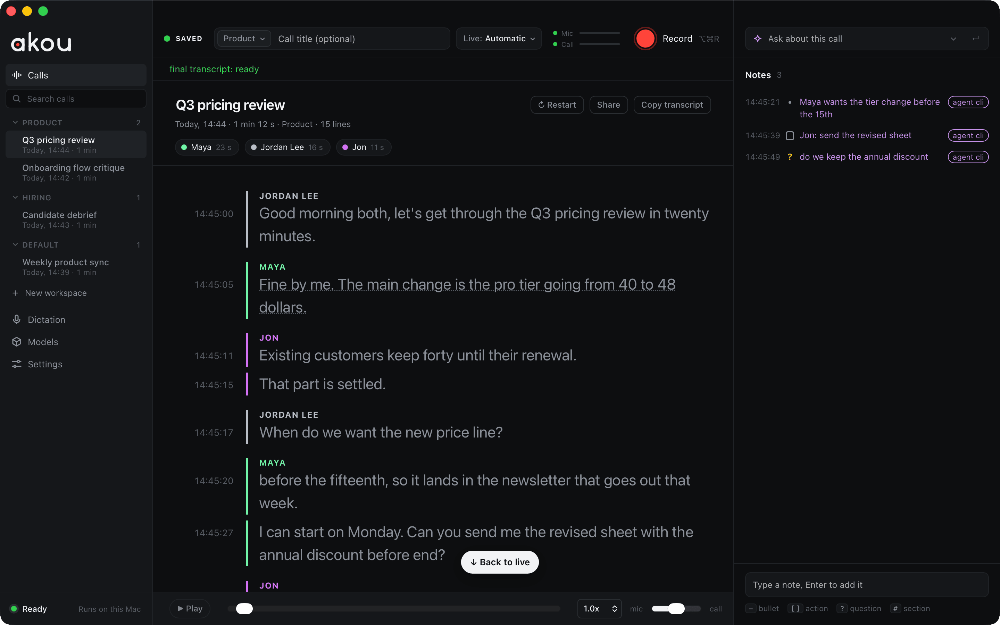

<p align="center">
  
</p>

<h1 align="center">akou</h1>

<p align="center">
  <a href="https://github.com/GeiserX/akou/releases"></a>
  <a href="https://github.com/GeiserX/akou/actions/workflows/ci.yml"></a>
  <a href="LICENSE"></a>
  <a href="https://hub.docker.com/r/drumsergio/akou"></a>
  <a href="https://github.com/GeiserX/akou/stargazers"></a>
</p>

akou is a desktop app for macOS that records your calls on your own computer, transcribes them on the machine, and answers questions about a call while it is still running. There is no bot in the meeting, no account and no cloud: your own terminal agent (Claude Code, Codex or anything that speaks MCP) can follow and question the call, and the notes land in files you own. The same core runs as a [self-hosted transcription server](https://geiserx.github.io/akou/server/) in Docker.



## Features

- Records the microphone and the call audio on separate channels, with no bot in the meeting and no virtual audio driver.
- Shows a live transcript as people speak, and runs an accurate pass with speaker labels on your Mac after the call.
- Keeps a timestamped notepad while the call runs; every note carries the time it was written.
- Answers a question about the call while it runs, with the Claude Code or Codex you already pay for, a local model, or your own API key. With none, Ask becomes a search of the call.
- Lets your agent start, follow, question and annotate a call from the terminal, over a local API or MCP.
- Types what you dictate into any app when you hold a key, and learns a word you fix only if you say yes.
- Fixes names and product terms across calls from one word list you own.
- Hands a finished call to your own vault or repository as Markdown, an event log and the audio, through an export folder, hooks, a signed webhook or the API.
- Runs as a transcription server in Docker with OpenAI-compatible, Wyoming and Bazarr endpoints.

## Quick start

```sh
# Download akou-0.5.2-macos-arm64.dmg from the latest release and drag akou into Applications.
# The build is not signed by Apple yet: clear the download mark once, or use Open Anyway in Privacy & Security.
xattr -dr com.apple.quarantine /Applications/akou.app
open -a akou
```

The first window asks what you will use akou for and downloads the speech models (about 3.0 GB). At your first Record, macOS asks for the microphone and system audio; the call then shows up in the sidebar with a live transcript. Needs a Mac with Apple silicon and macOS 14.4 or later. To let Claude Code or Codex follow your calls, install the command line from the akou menu and run `akou skill install`; see [Getting started](https://geiserx.github.io/akou/getting-started/) and [Agents and the command line](https://geiserx.github.io/akou/agents/).

## Status

The 0.x releases are prereleases: macOS on Apple silicon only, unsigned, and an update may ask for the microphone and system audio grants again. The Windows and Linux archives are the `akou` command line alone: they manage models and settings and drive a remote akou, but cannot record. Each release's [changelog entry](CHANGELOG.md) lists its known limitations.

## Documentation

Docs: https://geiserx.github.io/akou/

- [Getting started](https://geiserx.github.io/akou/getting-started/): install, the first open, the models, permissions, your first call
- [Configuration](https://geiserx.github.io/akou/configuration/): every setting and its default
- [Usage](https://geiserx.github.io/akou/usage/): the window, notes, Ask, speakers, workspaces
- [Dictation](https://geiserx.github.io/akou/dictation/): hold a key, speak, and the words land where the cursor is
- [Agents and the command line](https://geiserx.github.io/akou/agents/): the skill, the plugin, the CLI, the API and MCP
- [Providers](https://geiserx.github.io/akou/providers/): what answers questions, and what it sees
- [Hand-off to your knowledge system](https://geiserx.github.io/akou/knowledge-handoff/): export folder, hooks, webhook, pull
- [Server mode](https://geiserx.github.io/akou/server/): the Docker image, keys, GPUs and presets
- [How it works](https://geiserx.github.io/akou/how-it-works/)
- [Troubleshooting](https://geiserx.github.io/akou/troubleshooting/)
- [Development](https://geiserx.github.io/akou/development/): build, test, release

## License

[GPL-3.0-or-later](LICENSE). akou is written from scratch and replaces [hark](https://github.com/PhantomYdn/hark), whose capture design it carries over in full.
