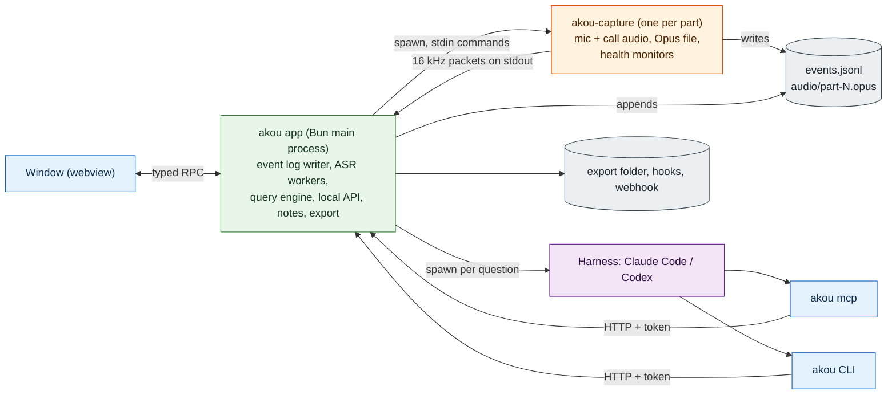
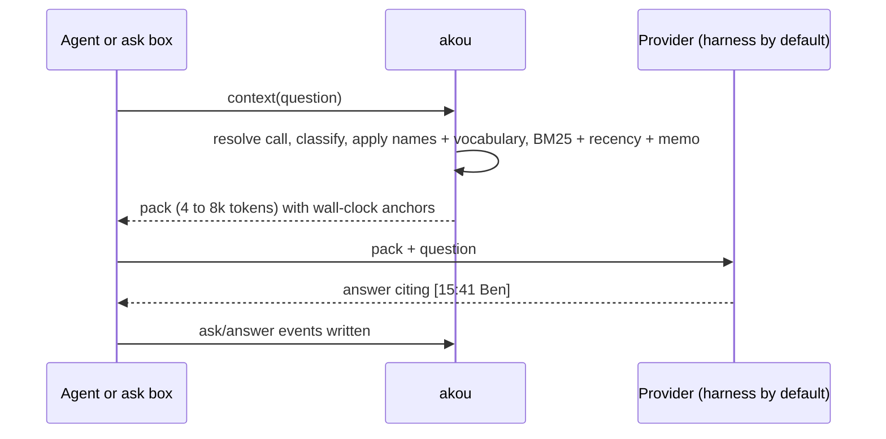

# akou design

akou (Greek: "listen!") is a desktop app that records your calls on your own computer, shows a live transcript, lets you take notes while the call runs, and answers questions about the call while it is still going. It works on macOS, Windows and Linux. Nothing leaves your machine unless you switch it on. It is GPL-3.0.

This document is the architecture. It starts with the simple version, then goes through each part. The predecessors are [hark](https://github.com/PhantomYdn/hark) (our fork: [GeiserX/hark](https://github.com/GeiserX/hark)), a macOS command-line recorder, and hark-viewer, a live transcript page that drove hark. akou replaces both and is written from scratch.

Terms used throughout:

- **Call**: one recording, from Start to Stop, stored in one folder.
- **Part**: one continuous stretch of audio inside a call. A restart begins a new part in the same call.
- **Mic channel**: what your microphone hears. **Call channel**: what the other people say (the audio your computer plays).
- **Event log**: the single file that holds everything about a call, written once, never rewritten.
- **Harness**: the coding-agent tool you already use, such as Claude Code or Codex. It is the default "brain" for questions and note enhancement.
- **Agent**: any program, usually a harness, that drives akou through its command line, its local API or MCP.

## 0. The simple version

akou is one desktop app plus one small helper program.

- **The app** is an [ElectroBun](https://github.com/blackboardsh/electrobun) application running the real Bun runtime. It owns the call: it writes the event log, runs speech recognition, builds the context for questions, serves the local API and the MCP server, drives the notes loop, and exports finished calls. It also draws the window. It can run with no window at all.
- **The capture helper** (`akou-capture`) is a small native program, one per recording part, started by the app. It opens the microphone and the call audio, keeps them on separate channels, writes the audio file, and streams 16 kHz audio to the app for transcription. If the operating system's audio layer ever hangs, the app kills the helper and starts a new one. The app, the transcript and the log are never blocked by it.
- **The CLI and MCP server** are thin clients of the app's local API. An agent can start, stop, follow and query a call without any window open.

The call is an append-only **event log**. Every transcript line, correction, speaker name, note, question, answer and health change is an event with a sequence number. Every view (the live page, the final transcript, the question engine, the export, the share link) reads that log. Nothing about a call lives only inside an agent's chat, so an agent that loses its memory loses nothing.



### Why this shape

We wrote up three architectures and judged them on shipping risk, robustness, and the quality of the live query loop. The one-process design won on shipping risk and on the query loop, because every runtime bet it makes was measured in spikes: a napi-rs addon loads under ElectroBun's Bun main process, sherpa-onnx-node loads and transcribes in a Bun Worker while the main thread stays responsive, two channels through the 20M-parameter English zipformer streaming model transcribe at 2.4 % of real time (Parakeet TDT v3 has one data point from the vocabulary spike, about 0.03 on short clips on 6 threads; gate G6 measures it on two live channels), and the bundling gap has a one-line fix. It lost on robustness for one reason: a hung operating-system audio call would freeze the whole app, and hark's history says this happens (a stale permission once blocked Core Audio teardown forever and lost a recording).

The design here keeps the winning shape and fixes that one weakness at the lowest possible cost. Capture runs in a child process from day one. The child speaks a tiny stdout protocol, has no HTTP, no lifecycle of its own, and is killed after a five-second stop budget. The same Rust crate compiles as that helper *and* as a napi addon loaded in-process. If the macOS permission gate in M0 shows that a child process cannot inherit the app's microphone and system-audio grants, the fallback is a build flag, not a redesign.

What we deliberately did not take:

- A separate always-on daemon (the Rust-core proposal). It adds a lifecycle (stale daemon after update, port and pid handshakes, version skew) and puts the fastest-changing code (prompts, providers, templates) in the slowest language to iterate. Its main advantage, headless use, is available here because the app runs without a window.
- Keeping hark as the macOS engine (the sidecar proposal). It would need a union of six unmerged branches, leaves the "silent tap blocks the microphone" trap open by design, and needs a second complete speech engine in Rust for Windows and Linux, conformance-locked to a Swift engine we intend to retire. hark's *capture design* is carried over in full (section 2); its code is the reference, not the dependency. hark stays usable as an alternative macOS helper behind the same protocol during M0 and M1 (section 2.4).

## 1. Processes

### 1.1 The three processes

| Process | Language and runtime | Lifetime | Owns | Never does |
|---|---|---|---|---|
| `akou` app | TypeScript on Bun, inside ElectroBun 2.0.1 with `build.mainProcess: "bun"` (Bun 1.4.0) | From login (optional) or first use until quit. Runs with or without a window. | Call state machine, the event log (single writer), speech recognition workers, speaker clustering, query engine, LLM providers, notes and enhancement, local HTTP API, share server, export, hooks, webhook, tray, hotkey, window | Open an audio device |
| `akou-capture` helper | Rust, one binary per OS | One per recording part, child of the app | Mic and call streams, alignment, Opus file, health monitors, keep-awake | Write the event log, talk HTTP, load a model |
| `akou` CLI and `akou mcp` | TypeScript on the bundled Bun (a shim), or a compiled binary in the Linux CLI tarball | Per command, or per agent session for MCP | Nothing durable | Capture, or read call folders directly |

Inside the app, work is split across threads so the user interface and the API never wait on a model:

| Thread | Does | Must never |
|---|---|---|
| Main (Bun Worker that ElectroBun runs app code in) | State machine, log writes, RPC to the window, HTTP API, query engine | Run a model or any call longer than a few milliseconds |
| `live-asr` Worker | VAD, live recognition, provisional lines, speaker embeddings | Write the log (it posts results to main) |
| `finalize` Worker | Accurate pass after a call: diarization and re-transcription | Write the log |

Speech models live in the app process through [sherpa-onnx-node](https://github.com/k2-fsa/sherpa-onnx) (Apache-2.0), which bundles one copy of ONNX Runtime. The helper links no machine-learning code.

### 1.2 Why ElectroBun with the Bun main process

ElectroBun v2 defaults to Cottontail, a JavaScript runtime on JavaScriptCore. We opt into the real Bun main process because we measured it. sherpa-onnx-node and a napi-rs addon load in the Bun Worker that app code runs in, and `Bun.serve` and `Bun.spawn` work there. A streaming decode soak once looked about 30 % faster with half the memory of Cottontail, but that run was observed once and not recorded, so it is not evidence yet; M0 re-runs `soak.ts` on both runtimes and keeps the output. Under Cottontail, sherpa-onnx-node could not resolve its `.node` file inside a Worker, which is exactly where our recognizer runs; a direct absolute-path load of the addon in a Cottontail Worker was not recorded, so whether Cottontail can load it at all is untested.

Costs we accept: the app is about 6 MB larger, and the ElectroBun docs say the two runtimes may diverge. We pin ElectroBun 2.0.1 and pin Hutch to the exact version that produced a working signed build in M0 (the spike built with `@blackboard/hutch` 0.27.0-canary.10 from source; no Hutch version was observed to break 2.0.1), and re-verify the pair on every upgrade.

### 1.3 Why capture is a child process

- **A hung OS call must not freeze the product.** Core Audio teardown can block forever when a permission grant has gone stale. The app gives the helper 5 s to stop, then kills it. Private aggregate devices and taps belong to the helper's process and vanish with it. The Opus file is playable up to its last flushed page (about one second).
- **Restarts overlap.** To restart a call the app starts the new helper, waits for its `capturing` message, then stops the old one. Both can hold a tap at the same time. No audio gap.
- **The helper is small.** Capture, alignment, Opus, health. No models, so no model reload on restart. The recognizer stays warm in the app across parts.
- **Fallback is cheap.** `native/akou-capture` is one crate with two entry points: `main.rs` (the helper) and `lib.rs` (a napi-rs addon with the same API). The app's `CaptureEngine` interface is the same for both.

### 1.4 Headless operation

The app runs without a window when started with the environment variable `AKOU_HEADLESS=1`. It does not use command-line arguments for this, because ElectroBun drops them on Linux and on the first macOS launch after install. `akou start` from the CLI launches the app this way if it is not running. On macOS the app is what spawns the helper, so permission prompts name akou and the grants belong to the app bundle.

On Linux, a CLI-only tarball (M4) packages the same app code with `bun build --compile` (Bun 1.4.2 or newer, see section 9) plus the helper and the sherpa libraries, so a server with no WebKitGTK can record and answer questions. Its user interface is any browser through the share link.

### 1.5 Fast start

The slow starts of the past (minutes, while people waited) came from the first agent request after a context compaction: the prompt cache was cold, so the harness reprocessed its whole context (instruction files, memory, the skill, re-injected skills) before it did anything. A skill that starts first still pays that cost on the first turn after a compaction. akou answers it three ways:

- **Paths with no model turn.** The tray item, the global hotkey (default `Ctrl+Alt+R`, `Option+Cmd+R` on macOS), the Record button and `! akou start` typed into a harness all start a call directly.
- **Start first in the skill.** The skill makes `akou start` its first tool call, with no status check first, so the one unavoidable model turn is the start itself.
- **A short turn.** `akou start --json` returns the `201` within 1 s, so that turn ends quickly.

Behind all three, `POST /v1/calls` creates the folder and the log, spawns the helper, and answers `201` as soon as the helper reports `capturing`, which happens before any model loads. Speech models load in parallel (or are already warm), and the recognizer replays audio from a bounded queue, so the first seconds are transcribed too. Opening the window is never on the start path.

Targets: `201` within 1 s (app running), within 3 s (app cold). The first committed transcript line is model-bound.

## 2. Capture per OS

Output on every OS: one Ogg Opus file per part, 48 kHz stereo, **mic folded to mono on the left, call folded to mono on the right**, 48 kbps, 20 ms packets, Ogg pages flushed every second. About 22 MB per hour. We chose Opus because a file being written is playable up to its last page, so a crash costs almost nothing. The two channels stay separate through recording, transcription, the query engine and export.

### 2.1 One pipeline, three front ends

Each source (mic, call) is its own stream. Every buffer carries a host timestamp from a clock that keeps running during sleep (`mach_continuous_time`, `QueryInterruptTime`, `CLOCK_BOOTTIME`). The helper converts every buffer to 32-bit float at the device's native rate at the edge, so the rest of the pipeline sees one format.

An **aligner** owns a 48 kHz stereo timeline driven by that clock. Every 20 ms it takes what each source delivered for that slot, resampled by one continuous resampler per stream ([rubato](https://github.com/HEnquist/rubato), MIT). A source that delivered nothing for the slot is written as zeros. No source ever waits for the other, so there is no queue that can grow. Clock skew between the two devices is measured from timestamps and corrected by nudging the resampler ratio by at most 0.1 %.

This is a deliberate change from hark, which mixed the mic into the tap's aggregate device with the mic as clock master. That coupling caused hark's remaining open capture traps: a tap silent from the start blocked the mic too, and a dead tap hid behind mic-driven zero buffers. The capture spike proved the placement approach on files: with call packets removed for 1.5 s, the call track came out the same length as the mic track with exactly the expected zeros and bit-identical audio on both sides of each gap. The 60-minute live drift test in M0 decides whether it holds on real devices. The target is under 200 ms per hour. Our own earlier measurement of hark's aggregate gave 46 ms per hour, but that result is not recorded in the hark repository, so M0 re-runs the drift test and commits the output.

### 2.2 Per operating system

| | macOS 14.4+ (Apple Silicon) | Windows 10 21H2+ and 11 (x64) | Linux (x64, arm64) with PipeWire |
|---|---|---|---|
| Call channel, default | Core Audio **process tap**: global, stereo, private, unmuted, excluding akou's own audio processes, read through a tap-only private aggregate device with `tap_auto_start` on. A port of hark's `ProcessTap` design to Rust through [objc2-core-audio](https://crates.io/crates/objc2-core-audio) (Zlib, Apache-2.0 or MIT), the bindings cpal is built on, so the helper carries one binding stack | WASAPI **process loopback** in exclude mode on akou's own process tree (build 20348+). Endpoint loopback on the default render device on older builds. Follows default-device changes through `IMMNotificationClient` | PipeWire capture stream on the default sink's monitor (`stream.capture.sink=true`, no fixed target, so it follows the default sink). Fallback: a PulseAudio monitor source through the pure-Rust `pulseaudio` crate |
| Call channel, one app only | Tap over that app's processes (stereo mixdown), bundle id matched case-insensitively including helper processes | Process loopback in include mode on that app's tree | Not in v1 |
| Mic | Default input or a chosen device, through [cpal](https://github.com/RustAudio/cpal) 0.18 (Apache-2.0). Follows a changed default; a vanished pinned device falls back to the default and emits `health` | cpal (WASAPI host), default communications device or chosen | PipeWire default source |
| Silence behaviour | The tap delivers nothing while nothing plays. The aligner writes zeros | Loopback delivers no packets, or packets flagged silent. Silent packets are zeroed, gaps are zeros | The monitor delivers continuous zeros |
| Output-running signal (for dead-call detection) | `kAudioDevicePropertyDeviceIsRunningSomewhere` on the default output | `IAudioMeterInformation` peak on the render endpoint | Sink node state `running` |
| Real-time priority | Core Audio IO thread | `AvSetMmThreadCharacteristics("Pro Audio")` | PipeWire data loop (rtkit) |
| Keep-awake while recording | `IOPMAssertionCreateWithName` (no idle sleep) | `SetThreadExecutionState` | logind inhibitor over D-Bus |
| Permissions | Microphone and System Audio Recording, both prompted because the app bundle declares `NSMicrophoneUsageDescription` and `NSAudioCaptureUsageDescription` | "Let desktop apps access your microphone" | None. ALSA-only systems get mic-only with a clear warning |
| Libraries (licence) | objc2-core-audio (Zlib/Apache-2.0/MIT), cpal (Apache-2.0), objc2 (MIT) | [wasapi](https://github.com/HEnquist/wasapi-rs) 0.24 (MIT), windows crate | [pipewire](https://crates.io/crates/pipewire) 0.10 (MIT), [pulseaudio](https://crates.io/crates/pulseaudio) 0.3 (MIT) |

Common to all: the [opus](https://crates.io/crates/opus) crate (MIT/Apache-2.0) over libopus (BSD-3), and the [ogg](https://crates.io/crates/ogg) crate (BSD-3-Clause) for the file. Devices always open at their own native rate; akou never forces a rate on a device (a device that only runs at 48 kHz once recorded garbage at 44.1 kHz). One cpal host and one PipeWire context stay alive for the helper's lifetime (re-initialising PipeWire in one process crashes).

akou does not use ScreenCaptureKit. It needs a screen-recording grant and a logged-in display, stops on screen lock, and its automatic selection once failed with no fallback.

### 2.3 Excluding akou's own audio

The capture spike found that excluding the app's own process id excludes nothing on macOS: an app built on WebKit plays audio from a separate helper process named "<App> Graphics and Media" (bundle `com.apple.WebKit.GPU`), and a process that is not producing audio has no Core Audio process object at all. So:

- **macOS**: the helper owns the exclusion. The app passes only its own bundle id (`--exclude-responsible`); the helper resolves every Core Audio process whose responsible process is that bundle (the GPU helper and any future helper) at start, excludes them, re-resolves on every rebuild, and reports the resolved names in `capturing` and in each rebuild's `health` line so `part.started` can record them.
- **Windows**: process loopback in exclude mode covers the whole process tree, which includes the WebView2 children. Verified in M3.
- **Linux**: PipeWire sink capture cannot exclude a process. The window does not play audio while a recording is live.

### 2.4 The helper protocol, `akou-capture/1`

Launch:

```
akou-capture run --out <call>/audio/part-002.opus \
  --mic default|<device-id>|none \
  --call system|none|app:<id>[,<id>] \
  --exclude-responsible <bundle-id|pid> # the helper resolves and re-resolves own-audio exclusion
```

**stdout** carries binary packets, both channels already resampled to 16 kHz mono float for the recognizer:

```
magic "AKP1" | u8 channel (0 mic, 1 call) | u8 flags (1 = zero-filled) | u16 reserved
u64 capture_ns (host clock) | f64 file_seconds (position in this part's Opus file)
u32 frames | f32 samples[frames]
```

**stderr** carries one JSON object per line: `hello {protocol, version, caps}`, `capturing {mic:{id,name,rate}, call:{mode, rate}, exclude:[names], capture_ns}` (devices opened and the Opus file created; no sample needed; `capture_ns` is the host clock of file position 0, the anchor `part.started` records), `first_audio {ch, capture_ns}` once per channel, `level {mic_dbfs, call_dbfs}` four times a second, `health {ch, state, silent_for, rebuilds, detail}`, `device {ch, event, name}`, `warn {code, msg}`, `stopped {file_seconds, reason}`. A `capture_ns` on stderr is a decimal string, because u64 nanoseconds exceed what a JSON number holds exactly. One line of each, exactly as the app parses them (a test reads this block):

```jsonl
{"type":"hello","protocol":"akou-capture/1","version":"0.1.0","caps":["tap"]}
{"type":"capturing","mic":{"id":"default","name":"MacBook Pro Microphone","rate":48000},"call":{"mode":"system","rate":48000},"exclude":["akou Graphics and Media"],"capture_ns":"123456789012345678"}
{"type":"first_audio","ch":"mic","capture_ns":"123456789032345678"}
{"type":"level","mic_dbfs":-20.5,"call_dbfs":-31}
{"type":"health","ch":"call","state":"dead","silent_for":12,"rebuilds":1,"detail":"output running, tap delivers zeros"}
{"type":"device","ch":"mic","event":"changed","name":"USB Microphone"}
{"type":"warn","code":"permission-suspect","msg":"open System Settings > Privacy & Security > Screen & System Audio Recording"}
{"type":"stopped","file_seconds":12.5,"reason":"stop"}
```

**stdin** takes one command per line: `probe_call`, `rebuild_call`, `rebuild_mic`, `stop`, `pause`, `resume`, `mute`, `unmute`. Closing stdin means stop. Mute and pause are app concerns: the app zeroes mic packets (mute) or tells the helper to drop (pause) and records the anchors. The helper drops audio while paused, so the file does not grow; `mute` also zeroes the mic in the file.

**File mode.** `--from-wav <stereo.wav>` replaces both devices with a WAV (left mic, right call) on any OS and runs the same aligner, Opus writer and protocol; `--speed` paces it and `--loop` repeats it. `AKOU_CAPTURE_FILE_ONLY=1` refuses device capture, so a test environment can never open a device or ask for a permission. A build with the `simulate` feature also takes `--simulate <fault>`, the fault list of the fake helper, which the trap tests run against the real helper.

Exit codes follow sysexits, as hark did: 0 ok, 64 usage, 66 device not found, 69 unavailable, 70 software, 74 I/O, 77 permission.

**Start budget.** No timeout starts before the helper is spawned. The app waits up to 3 s for `capturing` when the helper is warm and up to 10 s on the first tap creation after boot (a cold Core Audio open has taken over 12 s in the past; M0 measures the real figure and sets these two numbers). Past the budget the app kills the helper and answers `503 capture_failed {stage: "open"}`. A stop received before `capturing` cancels the part with `part.ended {reason: cancelled}` and never marks anything failed.

**hark as an alternative helper.** During M0 and M1, `hark --system --mix --tracks stereo --capture-backend coreaudio -a - --raw -r 16000 -b 16` produces interleaved 16-bit stereo (mic left, call right) on stdout, byte-identical to its file output, with pipe latency under a millisecond. The app accepts this second dialect (`stereo-s16le`), deriving time from the byte count because hark's channels share one clock. It is a fallback for the Rust tap, not the plan: it needs a build from a branch that includes hark's queue cap, and its "silent tap blocks the mic" trap stays open there.

### 2.5 Health monitors (in the helper)

Every verdict is a `health` line on stderr, which the app turns into a `health` event and a banner.

- **Dead call side.** Condition: the OS says output is running *and* the call stream has delivered exact zeros, or nothing, for 10 s. Action: open a throwaway probe (a second tap on macOS, a meter read on Windows and Linux) for up to 3 s. If the probe hears audio, rebuild the call stream. Backoff 10, 30, 60 s, then every minute, at most 5 rebuilds per part. Silence alone never triggers a rebuild (real calls have legitimate zero runs of minutes). This is hark's monitor, with the output-running signal added because a tap-only aggregate delivers nothing rather than zeros when it dies.
- **Stall.** A microphone that has delivered audio and then delivers nothing for 3 s *while the OS reports the device present and running* is rebuilt, retrying every 3 s. The call side has no stall rule: "nothing while output runs" is the dead-call rule's, end to end, because a dead tap delivers nothing and so does a quiet tapped app while other apps play. A 3 s rebuild there would pre-empt the probe, skip the backoff and never stop.
- **Late audio.** A slot goes out a fixed latency after its time (100 ms with devices). A source whose buffers arrive later than that, such as a Bluetooth or virtual input, raises the latency to fit, up to 400 ms. Audio that still misses its slot is dropped and the slot zero-filled, so the helper reports it as `warn {code: late-audio}` when it starts, at most once a minute after that, and in total at stop; otherwise it would pass for a silent device.
- **Device watch.** A changed default input or output rebuilds that source onto the new default.
- **Silent-from-start.** If neither stream has sent `first_audio` 2 s after `capturing`, the helper reports `no-buffers`; the app shows a banner and tries one rebuild.
- **Tapped apps exited.** With per-app capture, when every tapped process has exited the helper reports `health {ch: call, state: tapped-apps-exited}`; the app stops the call and shows a toast (M1 on macOS, M3 on Windows).
- **Permission suspect.** On macOS, a tap that opens but delivers only zeros for 20 s while output is running is reported as `permission-suspect` with the exact settings pane to open. A missing System Audio Recording grant yields silent zeros and no error, so the helper must infer it.

The app adds one rule on top: a `dead` state that lasts more than 60 s triggers an automatic restart (new part, make before break). If five automatic restarts happen within ten minutes, the call goes to `interrupted` with a red banner and a one-click resume.

Debug switches that inject faults (kill the tap after N seconds, hang teardown) compile only in test builds, and a test proves they are absent from release binaries.

## 3. Speech recognition, speaker labels and the final pass

All inference runs through sherpa-onnx-node in Bun Workers. One ONNX Runtime, on the CPU in v1.

| Job | Model | Weights licence | Notes |
|---|---|---|---|
| Voice activity | Silero VAD v5 | MIT | Chooses cut points only. Never decides what is recorded or what the final pass transcribes |
| Live and final recognition, 25 European languages | Parakeet TDT 0.6B v3, int8 | CC-BY-4.0 (attributed in NOTICE) | Transcribes 25 languages with no language switch. sherpa-onnx does not report which language it heard for this model, so `lang` stays empty on Parakeet segments |
| Live recognition on slow machines | Moonshine tiny/base | MIT | **English only.** Punctuated and cased; measured at 1 % of real time in the spike (one channel, English clip). A slow machine in a non-English workspace keeps Parakeet for live at a higher lag, or picks Whisper tiny/base (multilingual) |
| Other languages | Whisper large-v3-turbo through sherpa-onnx | MIT | Chosen per workspace. Reports the detected language, which fills `lang` |
| Speaker embeddings | 3D-Speaker ERes2Net (or NeMo TitaNet-small) | Apache-2.0 | Live clustering and final diarization |
| Speaker segmentation, final pass | pyannote segmentation-3.0 (ONNX) | MIT | Final pass only |

akou never bundles models. First run offers one explicit download, each file checked against a pinned SHA-256. `akou models import <dir>` covers air-gapped machines. After that, nothing touches the network unless the user configures sharing, a webhook or a remote provider.

**Custom vocabulary.** Rare names and product terms are the words every recognizer gets wrong, so akou carries one user-owned word list through three layers: the Parakeet recognizer is told a short per-call list to prefer while decoding (sherpa-onnx hotwords, boost 3, at most 24 entries, live and final), every view replaces known mishearings when it reads the log, and a post-call pass on the provider corrects the rest and proposes new entries. The Parakeet download includes the model's `tokenizer.json`, from which akou builds the `bpe.vocab` that biasing needs; Moonshine and Whisper get no hotwords, because sherpa-onnx exits the process when a non-transducer model receives them.

### 3.1 The live path, per channel

1. **Pull** 16 kHz packets from the helper. A bounded queue (10 minutes) buffers while a model loads or the machine is busy. Beyond that the Worker reads back from the Opus file. Audio is never dropped for the recognizer; it only lags.
2. **Segment** with Silero VAD: a segment closes after 0.7 s of silence (`segmentPause`, 0.2 to 5) or at 12 s of unbroken speech (`segmentWindow`, 2 to 30, must exceed the pause). Speech the VAD misses is still caught by the forced cut. There is no amplitude-based segmenter, so a noisy room cannot hide silence.
3. **Gain** the copy sent to the model toward -3 dBFS, at most +20 dB, never attenuate. The recording is untouched.
4. **Pad** every span to at least 0.5 s before decoding, with the zeros added **after** the speech, in one function shared by every path (live, final, single file). Short words vanished under a 0.3 s engine floor in hark; that floor has not been measured on sherpa-onnx with Parakeet yet. The padding evidence from the streaming zipformer is mixed and does not transfer: a fresh stream of that model dropped the first words *until* it had 2 to 8 s of leading audio, so on that model leading audio restores words rather than losing them. The 0.2 s "Yes." fixture in [TRAPS.md](TRAPS.md) runs against Parakeet, with leading and trailing padding as separate conditions, before this rule counts as measured.
5. **Decode** with the offline recognizer, `modified_beam_search`, and the call's current decode list passed to `createStream(list)` when the model is a transducer. A word added mid-call is in the list from the next segment. Emit a `seg` to main, which assigns `seq`, computes wall time and appends.
6. **Provisional line.** While a segment is open, re-decode it every second (bounded by the 12 s window). It is published with a 3 s expiry and is never written to the log.
7. **Echo.** Without headphones the mic hears the call. A mic segment whose text overlaps a call segment within ±1.5 s by at least 70 % of tokens is marked `echo: true` (kept in the log, hidden from views and packs). Real echo cancellation on the recognizer's copy of the mic (`webrtc-audio-processing`, BSD-3) is an M2 option.

Targets, measured in M0: committed line within 1.5 s of the end of an utterance; first provisional words within 1.5 s of speech; both channels together under 25 % of real time on Apple Silicon and under 50 % on a 4-core x64 laptop.

A lagging recognizer (more than 10 s or 30 s behind) emits `asr.lag` and an amber banner. Audio is never affected.

### 3.2 Live speaker labels

- The mic channel is always `you`, rendered with the user's configured name.
- On the call channel, each segment of at least 1 s gets an embedding (about 30 ms on the CPU). It joins the nearest call-scoped cluster if the cosine similarity is at least 0.60, otherwise a new cluster `c<N>`. Shorter segments inherit the previous call speaker if the gap is under 1 s, else `c?`.
- Centroids are written to the log every five minutes and at each part end (`speaker.centroid`). Clustering therefore continues across parts: `c2` in part 3 is the same voice as `c2` in part 1.
- When two clusters converge (centroid similarity over 0.8) the app writes `speaker.merge`. Segments are not rewritten; readers apply merges. `speaker.unmerge` reverses one, and the UI offers it on every merged chip, because a wrong merge that carries a name is worse than a duplicate.
- Names are `speaker.name` events from the window, the CLI, the ask box (a plain "Speaker 2 is Ben" is recognised by a regex and written with no model) or MCP.

### 3.3 The accurate final pass

Runs after every ending: at once after Stop, after 60 s without a restart when a call ended any other way, and at app start for any call that ended while akou was not running or that was quit before the pass finished. `akou finalize` re-runs it. A Resume after `final.done` adds a part: that part shows the live layer until the pass re-runs, which reuses the cached per-part decode and re-runs diarization over all parts.

1. **Per part, per channel:** decode the Opus channel by index (left, right; explicit, never "channel 0"), in 10-minute chunks, no temporary WAV. Check for energy before loading any model.
2. **Mic:** whole-timeline transcription with VAD cut points, speaker `you`.
3. **Call:** whole-timeline transcription. Then `OfflineSpeakerDiarization` (pyannote segmentation plus embeddings) over the call channel of **all parts concatenated**, so one person has one label for the whole call. Each span is transcribed with padding. A span the engine refuses is halved down to 20 s, and only the smallest failing piece is skipped and listed. Both channels decode with the call's decode list as it stands when the pass starts (call-scoped adds plus the workspace files), recorded as `vocab.used`.
4. **Names carry over.** Each final cluster maps to the live cluster with the largest time overlap, jointly across the call (Hungarian assignment), written as `speaker.map`. A live name applies to the final layer automatically. Below 60 % overlap the mapping is a `speaker.suggest` for the user to confirm.
5. **Whole-timeline rule.** VAD only proposes cut points. Nothing above silence is skipped. The spike showed Silero dropping a short "Thanks." after 0.8 s of silence at every setting tried, so a VAD-gated final pass would lose words.
6. **Output:** `seg` events with `layer: final`, a `final.part.done {part}` as each part's segments are written, then one per-call `final.done` with `parts[]`, skipped spans and stats (and the languages, when a model reported them). If the call channel had energy but produced no text, `final.done` carries a warning.

The final pass runs at below-normal priority, in its own Worker, and never competes with a live recording. Target: at most 10 % of call length on Apple Silicon, 25 % on a 4-core x64.

## 4. The event log

### 4.1 On disk

```
~/Recordings/akou/                       # root, configurable per workspace
  <workspace>/                           # e.g. work, personal
    2026-09-23_153612_weekly-sync/       # LOCAL start time + title slug, created with exclusive mkdir
      events.jsonl                       # the source of truth, one writer
      audio/part-001.opus                # stereo: left = mic, right = call
      audio/part-002.opus
      notes.enhanced.md                  # body of the latest enhanced notes
      logs/capture-part-001.log          # helper stderr
      .akou.lock                         # writer pid; a second writer refuses
```

Windows uses `%USERPROFILE%\Recordings\akou`. Config, the API token, templates and `runtime.json` live in `~/.config/akou/` (macOS and Linux) or `%APPDATA%\akou\` (Windows).

Folder names are unique by construction. akou never writes into an existing call folder except through `restart`, so there is no overwrite policy to get wrong. There is no `current` symlink; "which call is live" is answered by the API.

### 4.2 Rules

- **One writer.** Only the app's main thread appends, with one `write()` per line, `fsync` every second and at every lifecycle event. Workers, the window, agents and the final pass all send events through it.
- **Every event** has `seq` (gap-free integer per call), `t` (epoch ms at write) and `type`.
- **Nothing is rewritten.** A correction is a new event with the same `id` and a higher `rev`. Readers keep the highest `rev` per id. A live reader holding a cursor receives revisions as ordinary new events, so corrections never break it.
- **Torn last line** (power loss) is ignored by readers and truncated by the app at the next open.
- **Layers.** Live segments have ids `l000031`, final segments `f000031`. The `best` view shows the final layer for every part that has `final.part.done`, else live. The live layer is never removed, so an agent holding `#l000031` can always resolve it.
- Size: about 1 MB per hour.

### 4.3 Schema (version 1)

```json
{"seq":1,"t":1790170572000,"type":"call.created","id":"01J8Z6Q4M2VX0K7B3D4E5F6G7H","schema":1,"workspace":"work","title":"Weekly sync","tz":"America/Chicago","user":"Ana","akou":"0.1.0","template":"standup"}
{"seq":2,"t":1790170572410,"type":"part.started","part":1,"file":"audio/part-001.opus","wallStart":1790170572392,"monoStart":123456789,"mic":"MacBook Pro Microphone","call":{"mode":"system","exclude":["akou Graphics and Media"]},"capture":"akou-capture 0.1.0"}
{"seq":57,"t":1790170710100,"type":"seg","id":"l000031","rev":1,"layer":"live","part":1,"ch":"call","spk":"c2","a0":131.2,"a1":136.9,"w0":1790170703592,"w1":1790170709292,"text":"we should move the build to the new box","lang":"en","model":"parakeet-tdt-0.6b-v3-int8"}
{"seq":58,"t":1790170711000,"type":"speaker.name","spk":"c2","name":"Ben","by":"agent:claude-code"}
{"seq":64,"t":1790170741000,"type":"note","id":"n0004","rev":1,"text":"build -> new box?","w":1790170740800,"afterSeq":63,"by":"user"}
{"seq":90,"t":1790170900000,"type":"health","part":1,"ch":"call","state":"dead","silentFor":12,"rebuilds":1,"detail":"output running, probe heard audio, rebuilding"}
```

| Type | Fields beyond the envelope | Purpose |
|---|---|---|
| `call.created` | `id`, `schema`, `workspace`, `title`, `tz`, `user`, `akou`, `template?` | Always `seq` 1 |
| `call.ended` | `reason: stop \| interrupted \| abandoned` | `abandoned`: an `interrupted` call with no resume for 24 h, closed at the next app start |
| `call.failed` | `stage`, `error` | A start that never captured; this is the only event for that outcome. The folder and any audio are kept and listed as failed |
| `part.started` | `part`, `file`, `wallStart`, `monoStart`, `mic`, `call`, `capture` | The (wall, monotonic) anchor pair |
| `part.ended` | `part`, `reason: stop \| restart \| helper-exit \| killed \| crashed \| cancelled`, `fileSeconds` | |
| `pause` / `resume` | `part`, `a`, `wall`, `mono` | Time with no audio. Resume re-anchors |
| `mute` / `unmute` | `part`, `a` | The timeline continues; mic is zeros |
| `gap` | `part`, `a`, `wallFrom`, `wallTo`, `reason: sleep` | Detected from a monotonic jump |
| `seg` | `id`, `rev`, `layer`, `part`, `ch`, `spk`, `a0`, `a1`, `w0`, `w1`, `text`, `lang?`, `model`, `echo?`, `by?` | A revision may carry only changed fields. `text: null` retracts |
| `speaker.centroid` | `spk`, `vec` (base64 float32) | Live clustering state |
| `speaker.merge` / `speaker.unmerge` | `from`, `into` | Applied at read time |
| `speaker.name` | `spk`, `name`, `by` | Latest wins |
| `speaker.map` / `speaker.suggest` | `final`, `live`, `overlap` | Final-to-live identity |
| `note` / `note.del` | `id`, `rev`, `text`, `w`, `afterSeq`, `by: user \| agent:<client>` | Notepad lines |
| `remember` | `id`, `rev`, `text`, `by` | Agent memory, included in every pack. Same id with a higher `rev` corrects it; `text: null` retracts it |
| `memo` | `rev`, `body`, `coversSeq`, `by`, `model` | Rolling memo (covers `seq` 1 to `coversSeq`) |
| `chunk.summary` | `from`, `to`, `body`, `model` | Cached map-step summary of one enhancement chunk. Never read as the memo |
| `ask` / `answer` | `id`, `q`, `by` / `ask`, `text`, `cites[]`, `model`, `pack{mode,tokens}` | Q&A history |
| `enhanced` | `rev`, `template`, `file`, `coversSeq`, `by`, `model`, `cites[]` | Enhanced notes |
| `vocab.used` | `entries[]`, `files[]`, `sha256[]`, `model` | The decode list and vocabulary files in force; written at call start and on every change |
| `vocab.add` | `id`, `rev`, `term`, `heard[]`, `by`, `segs[]?`, `decode?` | Call-scoped vocabulary entry: a read-time pair for this call (all segments, or only `segs`) and a decode entry unless `decode: false`. `term: null` on a revision retracts it. Layered over the workspace files |
| `vocab.propose` | `id`, `rev`, `term`, `heard[]`, `by`, `evidence`, `status` | A proposal from the post-call pass or an agent; inert until `accepted` |
| `health` / `asr.lag` | `part`, `ch`, `state`, `silentFor`, `rebuilds`, `detail` / `part`, `seconds` | Written on state change only |
| `final.started` / `final.part.done` / `final.done` / `final.failed` | `pid` / `part` / `parts[]`, `languages[]?`, `skipped[]`, `warning?` / `step`, `error` | `final.part.done` is per part and drives the `best` view; `final.done` is per call |
| `share.started` / `share.stopped` | `bind`, `expires`, `include` | Audit trail |
| `export.done` / `hook.done` / `webhook.done` | `path`, `sha256` / `name`, `exit`, `ms` / `url`, `status`, `attempts` | Hand-off |

Provisional lines are never in the log.

### 4.4 Clocks

Two times per segment, both stored:

- `a0`, `a1`: seconds into that part's audio file. Used only to seek playback.
- `w0`, `w1`: UTC epoch milliseconds, computed at write time from the helper's `capture_ns` through the part's anchor pair and every `resume` and `gap` anchor after it. Paused time and sleep are therefore reflected correctly, and a system-clock change mid-call cannot bend earlier timestamps.

Rendering rules, enforced in code:

- Every surface a person or a model reads shows **local wall-clock time**, `15:41:07`, with the zone stated once. Offsets into the call are never rendered as bare `mm:ss`. The old agent once reported "00:20" as twenty past midnight; a model cannot make that mistake if it never sees an offset.
- Elapsed time appears only with a label ("12:30 into the call") as a secondary field.
- Sort order for simultaneous lines is `(w0, mic before call, seq)`, defined once in the reader.
- Export file names come from the local start time, with the zone in the frontmatter, so a late-night call is filed under the right day.

### 4.5 Restarts, failures, crashes

- **Restart** (user, agent, or automatic): `part.ended {reason: restart}` then `part.started {part: n+1}` in the same folder on the same clock. The app starts the new helper before stopping the old one. Restarting a call whose last audio is over an hour old asks for confirmation in the window and needs `--force` on the CLI.
- **Helper exit**: automatic restart, up to five in ten minutes, then `interrupted`.
- **App crash**: at the next start, a part with no `part.ended` gets `part.ended {reason: crashed}` with the duration read from the Opus file's last granule. The call shows "ended unexpectedly" with Restart offered. The final pass runs.
- **Failed start**: `call.created` is written before capture opens; a failure writes `call.failed` and keeps the folder. `akou calls --failed` lists them; nothing ever points at one as live.
- **Quit**: ElectroBun's main script swallows SIGINT and SIGTERM, so the app flushes and finalizes from its own before-quit path: stop the helper (5 s budget), `fsync` the log, then exit. `akou quit` uses that path over the API.

### 4.6 The fold

`fold(events) -> CallView` is a pure TypeScript function in `src/core/log/`: current segments of the chosen layer, speaker map, names, notes, memo, remembered lines, the per-call vocabulary (`vocab.add` layered over the workspace files) and the corrected text it yields per segment beside the raw text, open proposals, parts, health and live state. It is incremental, so each new event updates the view in constant time (a `vocab.add` re-renders only the segments its heard forms occur in), and it is the only reader of raw events. Every surface uses it. It has its own test suite from M1, including a reader that holds live ids across the switch to the final layer and one that checks a mid-call `vocab.add` changes the rendering of an earlier segment without touching its raw `text`.

## 5. The notes loop and the live query engine

### 5.1 Notepad

A plain-text pane beside the transcript. Each line becomes a `note` event when the user presses Enter or pauses for 2 s. `w` is the wall time of the first keystroke and `afterSeq` the last segment visible then, so the model can tie "build -> new box?" to the transcript around that moment. Edits are `rev+1`. Markdown-lite markers: `- `, `[] ` (action), `? ` (open question), `# ` (section). Clicking a note's time gutter scrolls the transcript there and plays audio from it.

Agents add notes too (`akou note`, MCP `akou_add_note`). Those carry `by: agent:<client>` and render in a different colour, so the human and the agent are two visible authors of the same notepad.

### 5.2 Templates and enhanced notes

Templates are Markdown files with frontmatter in `~/.config/akou/templates/`. Five ship: General, One-on-one, Standup, Customer call, Interview. Frontmatter holds `name`, `match` (title keywords for automatic choice) and the sections, and each section body is an instruction:

```markdown
---
name: standup
match: ["standup", "daily"]
---
## Updates per person
One bullet per speaker: done, next, blockers.
## Decisions
## Action items
Owner, task, due date if said. Format "- [ ] owner: task".
```

**Enhance** runs after `final.done`, and on demand during the call ("Enhance so far"). The input is built by the same context builder as questions: the template, every user note verbatim with the transcript from 90 s before to 30 s after it, the memo, agent `remember` lines, and the whole transcript if it fits 20k tokens. Past that, a map step summarises 15-minute chunks (cached as `chunk.summary` events so a re-run does not pay twice; the pack and `akou_memo_get` never read them) and one reduce step follows.

Output rules: the user's own lines are kept word for word and marked as theirs; every added bullet cites at least one segment id. A deterministic check drops any bullet whose cited ids do not exist or share no content word with the cited lines, and it applies to every provider including the harness. The result is stored as `enhanced {rev}`, so re-enhancing with another template keeps both. If the enhancement came from the live layer and the final layer lands later, akou re-enhances automatically unless the user edited the enhanced notes, in which case it offers a button.

### 5.3 The provider: the user's own harness by default

akou has no cloud and needs no API key. The default intelligence is the coding-agent subscription the user already pays for. It works in both directions, and both are fully supported:

1. **From the harness.** Inside Claude Code or Codex, the user or the agent starts and stops recordings, asks about the live call, names speakers and adds notes, through the MCP server and the skill (section 6).
2. **From the window.** The ask box and Enhance drive the locally installed harness as a provider. akou brokers the small context; the harness does the thinking.

The `Provider` interface in `src/main/llm/provider.ts`:

```ts
interface Provider {
  readonly id: "harness" | "openai-compatible" | "anthropic" | "none";
  available(): Promise<{ ok: true; detail: string } | { ok: false; reason: string }>;
  complete(req: { system: string; prompt: string; maxTokens: number },
           onToken: (t: string) => void, signal: AbortSignal): Promise<{ text: string; model: string }>;
}
```

**HarnessProvider**, how it works:

- **Discovery.** At start, akou resolves `claude` and `codex` through the user's login shell (`$SHELL -lc 'command -v claude codex'` on Unix, `where` on Windows), because an app bundle gets a minimal environment. Results and versions are cached in `runtime.json` and shown in `akou status` and Settings. The user can pin a path.
- **Invocation.** Claude Code: `claude -p --output-format stream-json --verbose` with the prompt on stdin, run in an empty scratch directory so no project instructions load, with tools disallowed. Codex: `codex exec --json --sandbox read-only -` (the trailing `-` makes Codex read the prompt from stdin), same scratch directory. `--json` is flagged experimental in the Codex CLI reference, so the parser checks the Codex version first. Tokens are parsed from the streamed JSON and forwarded over RPC to the ask box as they arrive.
- **Session reuse.** For repeated questions on one call, Claude Code's `--resume` keeps the transcript prefix in the harness's own context so the stable pack prefix is not re-sent. Measured in M2; off if it costs more than it saves.
- **Latency and cost.** Expect 2 to 5 s to first token (harness start-up plus model), 6 to 15 s for a full answer; these are estimates. Each spawn also loads the harness's own global context (the user-level instruction file, memory and skills), even in a scratch directory; gate G7 measures that cost, and `--resume` (M2) exists to amortise it. Each question spends roughly the pack size (4 to 8k tokens) plus the answer from the user's subscription window. The rolling memo through the harness is **off by default**, because it would run unattended every few minutes; ask and enhance run only on an explicit request.
- **When it cannot run.** No harness found, a non-zero exit, a rate-limit or "usage limit" message, or no answer within 60 s: the ask box shows the retrieved excerpts (already visible after 300 ms) and a "Copy context for my agent" button, with the reason stated ("Claude Code reported its usage limit is reached until 18:00"). `akou status` shows `provider: unavailable (reason)`. Nothing is queued or retried silently.
- **Provenance.** Every `answer`, `memo` and `enhanced` event carries `model: claude-code/<version>` or `codex/<version>` and `by`. Agent-authored notes and names carry `by: agent:<client>`.
- **Terms of service.** A third-party app driving a user's own locally installed harness on their own machine, on their explicit request, is not obviously covered or forbidden by the consumer terms of either vendor. We state this in `docs/providers.md` as a risk to verify before release, not as settled. akou never automates login, never touches credentials, never runs the harness unattended by default, and always leaves the raw-API and local-model providers available under the same interface.

Other providers: `openai-compatible` (Ollama, LM Studio, llama.cpp server, vLLM, OpenAI) and `anthropic` (the user's own key, with prompt caching). Keys go in the OS keychain. `none` shows excerpts only. Each workspace can use a different provider, because work and personal calls have different data rules.

### 5.4 The live query engine

Any question, from the ask box or an agent, should become a small, correct context in under 50 ms, with no model call, no re-reading of the call, and no dependence on the asker's memory. One function serves every surface: `buildContext(call, question, budget)`.



**Step 0, resolve the call.** `live` is the default. If nothing is recording, `live` returns `no_live_call` with `{last: {id, title, endedAt}}`; the caller must name a call or say `last`. Every pack starts with a status line: `LIVE, recording now`, `ENDED at 15:52 (38 min ago)` or `INTERRUPTED since 15:44`.

**Step 1, the header (about 300 tokens), always present.** Title, workspace, start time and zone, now, elapsed, parts and pauses. The roster from `speaker.name` (`you = Ana, c2 = Ben, c3 = Speaker 3`). Health gaps that affect the answer ("call audio dead 15:41:10 to 15:42:30, nothing heard"). Agent `remember` lines under "Notes from your earlier turns". Rules: times are local wall clock, cite as `[HH:MM Name]`, never present an offset as a time of day, a `DRAFT` line may change, text has vocabulary corrections applied and shows `(heard: …)` where it did, say so if the answer is not in the excerpts and name the time range to fetch.

**Step 2, classify (regex, under 1 ms).**

| Class | Triggers | Budget weighting |
|---|---|---|
| `now` | "right now", "just said", "what is he saying", "catch me up", "did I miss" | Recency heavy, plus the provisional line |
| `recall` (default) | "did we decide", "what did X say about", "when did", numbers, names | Retrieval heavy |
| `summary` | "so far", "action items", "decisions", "topics" | Memo plus recency |
| `time` | "first 10 minutes", "around 15:40", "last 5 minutes", "since 15:40" | Hard time filter, then recall |
| `naming` | "Speaker 2 is Ben", "c2 = Ben" | Writes `speaker.name` directly, no model |
| `follow-up` | pronoun with no name ("and after that?") | Last 3 ask/answer pairs added |

A speaker named in the question boosts that speaker's turns by 1.5 and never hard-filters, because live labels can be wrong. A one-line analysis (`intent: recall · window: 15:36 to 15:58 · speakers: Ben · terms: build, box`) goes into the pack so the model knows how it was built.

**Step 3, assemble** (defaults for the 6k MCP budget; 8k in-app):

| Block | Content | Tokens |
|---|---|---|
| Header | as above | ≤ 400 |
| Question analysis | one line | ≤ 60 |
| Previous Q&A | last 3 ask/answer pairs, answers trimmed | ≤ 400 |
| Vocabulary hits | only entries whose term or heard forms appear in the question or the selected segments | ≤ 300 |
| Rolling memo | latest `memo`: topics, decisions, actions with owner, open questions, people, each with [HH:MM] | ≤ 1,000 |
| Recency window | verbatim `best` segments from `min(memo.coversSeq, now − 5 min)` to now, so memo and window never leave a gap | ≤ 2,000 |
| Retrieved | BM25 top-k speaker-turn chunks outside the window, re-sorted by time, ±1 neighbouring line | ≤ 1,800 |
| Provisional line | only for `now`, marked "(still being spoken, may change)", only if updated in the last 3 s | ≤ 100 |

Unused budget flows to retrieval, then recency. Echo lines are excluded.

**Whole-call mode.** If the whole rendered transcript fits 12k tokens (roughly the first 45 to 60 minutes), the in-app pack overrides the 8k budget with its own cap of 14k tokens in total. The pack is then the header plus the whole transcript. Speaker **ids** go in a stable prefix, and the roster, vocabulary hits, memo and "now" go in a dynamic tail, so naming a speaker does not invalidate a provider's prompt cache. MCP callers always get retrieval mode unless they ask for `budget ≥ 12000`: an agent's context is the scarce resource.

**BM25.** An in-memory index per call, about 200 lines of TypeScript, no dependency. Documents are speaker turns (consecutive segments of one speaker, 60 to 200 words, one segment of overlap). Tokens are Unicode words, lowercase, accent-folded, no stemming, with small stopword lists per configured language. Corrected and raw tokens are both indexed. Query expansion adds the vocabulary's heard forms and speaker names. k = 6, minimum score, de-duplicated by time proximity. Updated on every `seg`, revision, retraction and merge. A committed line is searchable within 200 ms.

Embeddings are off in v1. The only published measurement in this space (Parrot PR #57) found cosine search alone weak and hybrid BM25 plus embeddings strong, without measuring BM25 alone. The replay evaluation (`tests/eval/`) decides: if BM25 plus recency plus memo puts the answering segment in the pack for fewer than 85 % of questions, embeddings are added through the configured provider's `/embeddings` endpoint on a 30 s background job with reciprocal-rank fusion.

**Rolling memo.** Refreshed by the configured provider after at least 3 minutes and 1,500 tokens of new committed speech, incrementally (previous memo plus new segments), capped at 1,000 tokens, stored as a `memo` event. Items whose anchors do not exist are dropped. With the harness provider it is opt-in. In agent mode the pack reports `memoStale: true` with the uncovered span, and the skill has the agent write one with `akou_memo_put`, so the memo survives the agent's own compaction.

**Vocabulary, applied when reading.** The fold applies the user's vocabulary files (global, workspace, extra paths) and the call's `vocab.add` events to every segment it renders: a `heard` form matches as a whole word, case-insensitive and accent-folded; forms that are dictionary words or 3 characters or shorter are skipped unless the pair is call-scoped; terms without heard forms and speaker names are fuzzy-matched (Jaro-Winkler ≥ 0.92 on tokens of 4+ characters). The rendering is `Anika (heard: "annika")` in packs and exports, and the term with the raw text on hover in the window, so both the model and the user see the correction. The log keeps the raw text. Confirmed entries also feed the recognizer's decode list (section 3). akou never grows the files on its own: "Fix this word" writes a call-scoped `vocab.add`, the post-call pass and the skill write `vocab.propose`, and the user's yes is what appends to a file.

**Latency targets** (measured in M1): pack build p95 ≤ 50 ms on a 3-hour call; excerpts visible ≤ 300 ms after Enter; first answer token provider-bound (≤ 1.5 s hosted API with cached prefix, 2 to 5 s harness, ≤ 4 s local 8B model); tokens per question flat at 4 to 8k regardless of call length in retrieval mode (whole-call mode caps at 14k).

### 5.5 How an agent follows a call

1. `akou_context({question})` once per question: the pack plus `cursor` (highest `seq` covered), `state`, `memoStale`.
2. `akou_read({since: cursor})` for new committed lines only, plus the provisional line and the next cursor.
3. `akou_search({query})` for exact hits with times.
4. `akou_name_speaker` when the user names a voice; `akou_remember` for anything else the agent will need. After a compaction, one `akou_context` call brings back the roster, memo, earlier Q&A and its own notes from the log.

The agent never reads call folders from disk. There is no per-part transcript file to read by mistake.

## 6. Agent surfaces

### 6.1 CLI

A shim runs the bundled Bun on `cli.js` (installed from the menu "Install command-line tool": `~/.local/bin/akou`, `akou.cmd`, or a symlink). It reads `runtime.json` (port, pid, version) and the token file. If nothing answers, it launches the app headless and waits up to 3 s.

| Command | Does |
|---|---|
| `akou start [-w WORKSPACE] [-t TITLE…] [--template T] [--call system\|app:ID\|none] [--mic ID\|none] [--vocab TERM,…] [--json]` | Starts a call. Prints `{call, folder, url}` once audio is being written. `--vocab` writes call-scoped `vocab.add` events right after `call.created` (attendees, title terms). Exit 75 if a call is already recording |
| `akou stop` · `pause` · `resume` · `mute` · `unmute` | Controls the live call. Exit 3 if nothing is live |
| `akou restart [--force] [--call ID]` | New part in the same call, make before break |
| `akou status [--json]` | App, live call, health, recognizer lag, models in use, provider state, share state |
| `akou open [CALL]` | Shows the window on a call |
| `akou tail [--call ID] [--since SEQ] [--last 5m] [-f] [--format json\|md\|txt]` | Committed lines with wall times |
| `akou context "Q" [--call ID] [--budget N]` | Prints the pack |
| `akou ask "Q" [--call ID]` | Answers with the configured provider |
| `akou search "Q" [--call ID] [-k N]` | BM25 hits |
| `akou name <spk> <Name>` · `akou name --merge <a> <b>` · `akou name --unmerge <spk>` | Speakers |
| `akou note "text"` · `akou remember "text"` · `akou remember --del ID` | Notepad line, agent memory, retract a remembered line |
| `akou vocab list\|add\|remove\|approve\|reject\|suggest\|check\|import\|pass` | The custom vocabulary: entries in force, add a word (mid-call with `--call`), proposals, ranked candidates from a call or text, decode safety of a word, import of older list formats, the post-call pass. |
| `akou enhance [--template T] [--call ID]` · `akou finalize [CALL] [--force]` | Post-call |
| `akou calls [-w WS] [--limit N] [--failed]` | Lists calls by date, title, duration, participants. No content search |
| `akou show CALL [--layer best\|live\|final] [--format md\|json\|txt]` | One call's transcript or notes |
| `akou export [CALL] [--to DIR]` · `akou hooks run CALL [--stage S]` | Hand-off, re-run |
| `akou share on\|off\|status [--bind tailnet\|lan\|IP] [--notes] [--expires 3h]` | Read-only live link |
| `akou doctor [--grant]` | Permissions, models, devices, a 3 s capture test, API security self-test, harness discovery |
| `akou devices` · `akou apps` · `akou models list\|pull\|import` · `akou config show\|set\|unset` · `akou token path\|rotate` | Setup |
| `akou import hark-viewer DIR…` | Converts predecessor call folders (all parts) into event logs |
| `akou skill install [--harness claude\|codex] [--dir DIR]` | Installs `SKILL.md` into the harness's skills folder; refuses a skill whose version differs from the app's |
| `akou quit` · `akou mcp` | Stops the app cleanly; stdio MCP server |
| `akou self-update` | CLI tarball only (M4): replaces the binary after verifying its cosign signature |

Exit codes: 0 ok, 3 nothing live, 64 usage, 65 a vocabulary term fails validation, 69 unavailable (app, model, provider), 70 software, 75 already recording, 77 permission.

### 6.2 HTTP API

`http://127.0.0.1:<port>/v1`, default port 8476, written to `runtime.json`.

`{id}` on every route accepts a call ULID or `live`. `last` is accepted only on GET routes, on the questions `context` and `ask` (they read the call, they do not change it) and on the post-call actions `restart`, `finalize`, `export` and `enhance`; on `stop`, `pause`, `resume`, `mute` and `unmute` it is refused with 400, so a control can never land on a finished call.

| Method and path | Purpose |
|---|---|
| `GET /status` | As `akou status`. Always 200 |
| `POST /calls` `{workspace, title, template, call, mic}` | `201 {call, folder, firstAudioMs}` · `409 already_recording {call}` · `403 permission` · `503 capture_failed {stage, error}` |
| `GET /calls?workspace&limit&failed` | Metadata list |
| `GET /calls/{id\|live\|last}` | Header, parts, roster, health, final state. `live` gives 404 `no_live_call {last}` when nothing is recording |
| `POST /calls/{id}/{stop,pause,resume,mute,unmute,restart}` | Controls. `restart` takes `{force}` |
| `GET /calls/{id}/events?after=SEQ&wait=25` | Raw log, long-poll |
| `GET /calls/{id}/stream?after=SEQ` | SSE: events plus ephemeral `partial` and `level` |
| `GET /calls/{id}/transcript?layer=best&since&from&to&speaker&format=json\|md\|txt&limitTokens` | Rendered, names and vocabulary applied; JSON rows carry `text` (corrected) and `heard` (raw, only when different) |
| `POST /calls/{id}/context` `{question, budget}` | The pack, `cursor`, `state`, `memoStale`, `provisional` |
| `POST /calls/{id}/ask` `{question, stream}` | Needs a provider. Streams tokens when `stream` |
| `GET /calls/{id}/search?q=&k=` | Hits |
| `POST /calls/{id}/speakers` `{spk, name}` · `POST …/speakers/merge` · `POST …/speakers/unmerge` | Speakers |
| `POST /calls/{id}/notes` · `PATCH /calls/{id}/notes/{nid}` · `POST /calls/{id}/remember` · `DELETE /calls/{id}/remember/{rid}` | Notes, memory |
| `GET /calls/{id}/memo` · `PUT /calls/{id}/memo` `{text, coversSeq}` | Memo |
| `GET /calls/{id}/vocab` · `POST /calls/{id}/vocab` `{term, heard[], segs?, decode?}` · `DELETE /calls/{id}/vocab/{vid}` · `POST /calls/{id}/vocab/pass` | The list in force for the call, a call-scoped add (`vocab.add`), its retraction, the post-call pass |
| `GET /vocab` · `POST /vocab` · `DELETE /vocab/{term}` · `POST /vocab/{approve,reject,suggest,check,import}` | The vocabulary files |
| `POST /calls/{id}/enhance` `{template}` · `GET …/enhance/context?template=` · `PUT …/enhanced` `{markdown, coversSeq}` | Enhancement, with or without a provider |
| `GET /calls/{id}/audio/{part}` | Range requests |
| `POST /calls/{id}/export` · `POST /calls/{id}/finalize` | Hand-off, re-run |
| `POST /share` · `DELETE /share` · `GET /share` | Sharing |
| `GET /templates` · `GET /config` · `PATCH /config` | Settings |
| `POST /quit` | Clean shutdown |

`POST /calls` answers `201` only after `capturing`. A failed start never leaves a call that looks live.

### 6.3 Security of the local API

hark's remote-control agent accepted a cross-origin `POST /stop` from any web page. akou's guard, enforced in one middleware before routing, with a test for each rule:

1. Bind `127.0.0.1` only, IPv4, no reverse DNS on bind. The share server is a separate listener.
2. `Authorization: Bearer <token>` on every request, GETs included, because transcripts are sensitive. The token is 32 random bytes in `~/.config/akou/token`, mode 0600 (on Windows an ACL for the current user only), created atomically, rotated by `akou token rotate`.
3. `Host` must be exactly `127.0.0.1:<port>` or `localhost:<port>`, or 403. This blocks DNS rebinding.
4. Any request carrying `Origin`, `Sec-Fetch-Site` or `Sec-Fetch-Mode` is refused with 403. Our clients never send them; browsers always do cross-origin.
5. No CORS headers, ever. Mutations require `Content-Type: application/json`. Bodies are capped at 64 KB. Unknown fields are refused with 400.
6. Loopback clients (CLI, MCP, the app's own main process) disable any HTTP proxy for `127.0.0.1`. Bun's `fetch` honours `HTTP_PROXY`, and a proxy on loopback traffic broke both predecessors.
7. The window does not use HTTP at all. It talks to the main process over ElectroBun's typed RPC.

The CI security job starts the app headless with a fake helper, loads a page on another origin in a headless browser, fires `fetch('http://127.0.0.1:PORT/v1/calls/live/stop', {method: 'POST'})`, a form POST, a `no-cors` fetch and a request with a foreign `Host`, and asserts 403 for each with the fake call still recording. A positive control runs the same requests against a build with the guards compiled out and must see them succeed, which proves the test can fail.

### 6.4 MCP server

`akou mcp` is a stdio server and a thin HTTP client. Tools:

| Tool | Purpose |
|---|---|
| `akou_start {workspace?, title?, template?, call?, vocab?}` | Start; returns `{call, url}` once audio is being written. `vocab` is a list of call-scoped words (attendees, title terms) |
| `akou_stop`, `akou_pause`, `akou_resume`, `akou_mute`, `akou_unmute`, `akou_restart {force?}` | Controls |
| `akou_status` | Live or not, health, lag, models, provider, share |
| `akou_context {question, call = "live", budget = 6000}` | The pack. The main tool for answering |
| `akou_read {call = "live", since?, lastSeconds?}` | New committed lines plus the provisional line and a cursor |
| `akou_search {query, call = "live", k = 6}` | BM25 hits with wall-time citations |
| `akou_ask {question, call = "live"}` | Answer with akou's configured provider. Listed only when one is configured, and hidden when the provider is `harness` and the MCP client is that same harness. Its description says: prefer `akou_context`; `akou_ask` spawns another agent run on your subscription |
| `akou_name_speaker {speaker, name}` · `akou_merge_speakers {a, b}` · `akou_unmerge_speaker {speaker}` | Speakers |
| `akou_add_note {text}` · `akou_get_notes` · `akou_remember {text}` · `akou_forget {id}` | Notepad, memory, retract a remembered line |
| `akou_memo_get` · `akou_memo_put {text, coversSeq}` | The agent writes the memo when no provider does |
| `akou_vocab_add {term, heard?, scope = "call", workspace?, decode?, note?}` · `akou_vocab_propose {entries[], call?}` · `akou_vocab_approve {terms[], call?}` · `akou_vocab_reject {terms[], call?}` · `akou_vocab_list {workspace?, call?, unconfirmed?}` · `akou_vocab_suggest {text?, call?, k = 20}` · `akou_vocab_check {term}` | The custom vocabulary: a word the user just stated goes in mid-call with `scope: call`; anything the agent inferred is a proposal until the user says yes |
| `akou_enhance_context {template?}` · `akou_enhanced_put {markdown, coversSeq}` · `akou_enhance {template?}` | The agent writes the enhancement, or asks akou's provider to |
| `akou_list_calls {workspace?, limit = 20, failed?}` · `akou_get_call {call, layer = "best"}` · `akou_export {call}` | Past calls by name only |

Tool descriptions carry the rules: cite wall time, never quote a draft line as fact, answer only from the live call unless a call is named, say when a call has ended.

### 6.5 The skill

`skills/akou/SKILL.md` triggers on "record this call/meeting", starting a call, or questions about what is being said. Its rules, in order:

1. **Start first.** The first tool call is `akou start -w <workspace> -t "<title>"` (or `akou_start`). No status probe, no planning turn. Exit 75 means a call is already recording. Tell the user they can also press the hotkey or type `! akou start`.
2. Remind the user once about consent when outside people are on the call.
3. **To answer**, call `akou_context` with the user's question verbatim. Never read files under the recordings root. Answer from the pack, cite `[15:41 Ben]`, never present an offset as a time of day, never quote a `DRAFT` line as fact. If the pack says `ENDED`, say the call ended and when.
4. When the user names someone, call `akou_name_speaker` at once. When the user states how a word is spelled ("it's Vercel, not versal"), call `akou_vocab_add` with `scope: call` at once; if the user wants it kept, add it to the workspace. When you learn something you will need later, call `akou_remember`.
4a. Before a call, if the user shares the invite, pass attendee names and title terms as `vocab` to `akou_start`. Never add an inferred word as confirmed; use `akou_vocab_propose`. The `akou-vocab` skill does the wider learning from documents, exports and the web, always ending in a proposal the user approves.
5. If `memoStale` is set and no provider is configured, write the memo with `akou_memo_put`.
6. On `health: dead`, tell the user at once; akou is already rebuilding and restarts automatically after 60 s. On `asr.lag` over 30 s, hold heavy work in this session until the call ends.
7. History beyond this call lives in the user's own knowledge system. Do not ask akou about other calls unless the user names one.
8. Read the models and provider in use from `akou status`, never from this text.

## 7. The window

One webview (WKWebView, WebView2, WebKitGTK), plain TypeScript with CSS variables, no framework. Updates arrive as RPC pushes from the main process, not polling. A read-only share viewer is built from the same bundle.

Everything hark-viewer did is kept:

| hark-viewer | akou |
|---|---|
| Header: status dot, state label, title, meta, controls | Same, plus local clock, workspace, template, provider and share pills |
| States: recording, paused, offline, not capturing, failed, ready, saved, another call recording | Same set; "offline" becomes "ended unexpectedly" or "interrupted" |
| Banners: red dead, amber guess, grey quiet, green recovered, "check permission" | Same wording model on all OSes, from `health`, plus amber "transcript N s behind" and a permission banner with a button that opens the right settings pane |
| Record, Mute, Pause, Stop, Restart; "Stop the other call"; toasts | Same. Restart stays visible when a call ended, failed or crashed |
| Workspace picker, title field | Same, plus template picker |
| Append-only rows: time column, speaker label on change, last 3 bright, older dim, rise animation, pinned auto-scroll, "Back to live" after 80 px, font 14 to 44 px | Same. The time column is wall clock. Speaker chips are clickable to rename, merge, unmerge |
| Stable speaker hues: you = 214, others from `[36,145,285,5,178,58,325,100]` in order of first appearance | Same; a renamed speaker keeps its hue |
| Grey provisional row, dashed border | Same, with the 3 s expiry |
| Dark and light from `prefers-color-scheme`, 22 px base | Same |
| Follow the live or last call; `?call=` pin; switch without reload | Sidebar list of calls by date and title; one open at a time; no search |
| Final transcript note: running, failed, done, skipped spans, warning | Same, with a progress bar |
| Language verdict | A languages chip after the final pass, shown only when a model reported the language (Whisper). Parakeet does not report it, so there is no chip until a language-id step exists |
| Empty state | Same text |
| Relabel command | Replaced by whole-call diarization plus click-to-rename |
| Third-party comparison transcript lane | Dropped; nothing read it |

New: the notepad pane with time gutter; the ask box with presets ("Catch me up", "Was my name mentioned?", "Decisions so far", "Action items", "What did <speaker> say?"), evidence cards within 300 ms, a streamed answer, clickable citations that scroll and play; the Enhanced tab with template switcher and user-versus-AI styling; inline edit of a line (writes `seg rev+1 by:user`); playback from any line with mic/call balance; level meters for both channels; "Fix this word" (a call-scoped `vocab.add` for that line, then "Everywhere in this call" and "Add to the workspace vocabulary"); a "Words to review" badge after the post-call pass; the decode list in force under the models pill; a red **Shared live · N viewers** pill with Stop; hand-off status (export path, hook results, webhook); Settings (root folder, export folder, hooks, webhook, provider per workspace, harness path, models, the vocabulary panel with entries, sources, check verdicts and file paths, your name, hotkey, default template, share defaults); onboarding with a 3 s capture test per channel and the model download; a consent reminder with copyable notice text; and, on Stop while the meeting app still holds the microphone, an inline "Call audio was active 12 s ago. Stop anyway?" with a 10 s undo (M2).

## 8. Sharing and the knowledge hand-off

### 8.1 No built-in knowledge base

akou keeps no cross-meeting library, no search across meetings, no knowledge graph, no people or topic database, no idea lists, no weekly rollups, no voiceprints kept across calls. It keeps the call folders, a metadata list (date, title, workspace, duration, names as typed) so a user can name one past call, templates, settings, and the vocabulary files. The vocabulary is the one thing that carries across calls, and it is a setting, not a knowledge base: plain YAML the user can read line by line, grown only by the user's own adds and by proposals the user approved. The learning that feeds those proposals runs in the user's harness over the user's own sources, never in akou. Questions about a named past call use the same tools, scoped to that call. The user's existing system (Obsidian, Logseq, a Git archive, a RAG indexer, a wiki) is where knowledge accumulates. akou's job is to feed it clean material fast, in open formats.

### 8.2 Hand-off

After `final.done`, and again whenever the enhanced notes, names or vocabulary corrections change:

1. **Export folder** per workspace (`export.dir`, off until set; onboarding asks). `<export.dir>/<workspace>/2026-09-23 1536 Weekly sync.md`:

```markdown
---
akou_id: 01J8Z6Q4M2VX0K7B3D4E5F6G7H
title: Weekly sync
start: 2026-09-23T15:36:12-05:00
end: 2026-09-23T16:03:40-05:00
duration_min: 27
workspace: work
participants: [Ana (you), Ben, Speaker 3]
languages: [en]          # only when a model reported them
template: standup
transcript_layer: final
audio: [attachments/2026-09-23 1536 Weekly sync/part-001.opus]
source: akou 0.1.0
shared: false
akou_rev: 3
---
## Notes            (enhanced; your own lines kept verbatim)
## Your raw notes
## Transcript
**Ben** · 15:41:07
we should move the build to the new box
```

   A sibling `attachments/<name>/` holds `events.jsonl` and the audio (`copy | link | none`, default `link`). Writes are atomic. Re-export finds the file by `akou_id` in the frontmatter, so a renamed file is still found. If the user edited the body (sha256 recorded in `export.done` differs), akou writes `… (akou update).md` beside it instead of overwriting. This works unchanged with Obsidian, Logseq and any folder-watching indexer.

2. **Hooks** per workspace: `hooks: [{stage: call.ended | final.done | enhanced, command, timeoutSec: 600}]`. Each command receives one JSON document on stdin: `{version: 1, stage, call: {…frontmatter, dir}, paths: {events, audio[], exportMd}, transcript: [{id, w0, w1, clock, speaker, name, ch, text, heard?}], notes: [], remember: [], enhancedMd}` (`text` is corrected, `heard` is the raw text when it differs), plus `AKOU_CALL_ID`, `AKOU_CALL_DIR`, `AKOU_STAGE` in the environment. Exit code and duration become `hook.done`; failures toast. `akou hooks run CALL --stage S` re-runs. Two examples ship in `examples/hooks/`: commit the export into a Git repository; post the enhanced notes to a chat webhook.

3. **Webhook**, off by default: `POST` of the same JSON, `X-Akou-Event` (the same stage names as hooks, which are the event type names), `X-Akou-Signature: sha256=<HMAC-SHA256>` with a secret in the keychain, three retries with backoff, recorded as `webhook.done`.

4. **Pull**: `GET /v1/calls`, `GET /v1/calls/{id}/transcript`, MCP `akou_list_calls` and `akou_get_call`.

Adapters beyond these are the user's scripts, not akou code.

### 8.3 Sharing a live call

Off by default. Behind one interface:

```ts
interface ShareTransport {
  readonly kind: "local-link" | "hub";
  start(call: CallId, opts: ShareOptions): Promise<ShareHandle>;   // {id, url, expiresAt}
  stop(handle: ShareHandle): Promise<void>;
  status(): ShareStatus[];                                          // viewers, since, bytes
}
type ShareOptions = {
  include: { transcript: true; names: boolean; notes: boolean; enhanced: boolean; audio: false };
  expires: "call-end" | "call-end+2h" | { minutes: number };
  bind?: "tailnet" | "lan" | string;
};
```

Every transport reads the same `follow(afterSeq)` as the window, filtered and rendered (names and vocabulary applied, echo removed). Raw audio is never shareable in v1.

**v1, `local-link` (M4).** A second GET-only listener on one chosen interface: the tailnet address when present (encrypted by the tailnet), or a LAN address with a warning that plain HTTP on a LAN is visible to that network. Never `0.0.0.0` unless typed. URL `http://<addr>:8477/s/<128-bit token>/`, serving the read-only viewer fed by SSE. It expires at call end plus a grace period or on `akou share off`, never survives an app restart, and while on: a red pill in the header, a changed tray icon, `share.started`/`share.stopped` in the log and `shared: true` in the export.

**v2, `hub`** (only on real demand). A small self-hosted sync backend with an idempotent `appendEvents(callId, events[])` keyed on `seq`; viewers subscribe to it and load the same viewer bundle. No akou cloud.

## 9. Packaging, signing, updates, CI

- **Targets.** macOS arm64 (`.dmg`, Homebrew cask in a formula-only tap); Windows x64 (ElectroBun installer, winget later; ARM runs the x64 build under emulation); Linux x64 and arm64 (AppImage, `.deb`, and the CLI-only tarball). Minimum macOS 14.4: the process-tap API exists from 14.2, and 14.4 is the floor we test on (Apple's sample code uses it); gate G4 on a 14.2 or 14.3 machine decides whether the floor can drop. Ubuntu 24.04 or glibc 2.38+, Windows 10 21H2.
- **One version source**, `package.json`, stamped into the app, the helper, `Info.plist` and the CLI by one script. CI asserts they all match the tag.
- **macOS signing.** Hutch signs, notarizes and staples. Two things it cannot do, so the release workflow does them: (1) Hutch writes `Info.plist` from a fixed table and cannot emit `NSAudioCaptureUsageDescription`, so the workflow patches the plist after the build and re-signs; (2) nested executables (the helper, `bun`, the `.node` addon and sherpa's dylibs) are signed individually with the hardened runtime and the `com.apple.security.device.audio-input` entitlement **before** the outer bundle. Bundle id `io.github.geiserx.akou`, stable across updates so grants survive them. Hutch copies the `.node` file but not its two dylibs; they are listed in `build.copy`.
- **Windows signing.** SignPath Foundation (free for open source) or Azure Trusted Signing. Until one is in place, releases are unsigned with the SmartScreen step documented plainly.
- **Linux.** No code signing; SHA-256 checksums and GitHub build attestations.
- **Updates.** ElectroBun's updater from GitHub Releases. The updater asks the app first and never installs while a call is recording or a final pass is running. The Windows updater has an open truncation bug (#535), so "check for update" always also links the full installer. The CLI tarball updates with `akou self-update`, verifying a cosign signature.
- **Toolchain pins.** ElectroBun 2.0.1 with its bundled Bun 1.4.0 for the app runtime; Hutch pinned to the version M0 builds with; sherpa-onnx-node 1.13.x; Rust stable. Any `bun build --compile` output (the Linux CLI tarball, any macOS CLI binary) uses Bun 1.4.2 or newer, because 1.4.0 and 1.4.1 write an invalid Mach-O signature that macOS kills at exec ([oven-sh/bun#39764](https://github.com/oven-sh/bun/issues/39764)); the build script then runs `codesign -s - -f` and `codesign --verify --strict` on the binary, which fails the build if the signature is bad. Hutch's own HTTP client fails behind an `HTTPS_PROXY`; CI unsets it.
- **Homebrew tap push.** The tap is a separate repository, and the default `GITHUB_TOKEN` cannot push to another repository. The release job pushes the cask bump with a fine-scoped token (a GitHub App or a PAT limited to the tap repository) stored as the `TAP_PUSH_TOKEN` secret. The release checklist confirms the secret exists, and a dry-run bump in CI fails without it.

CI on GitHub-hosted runners (free on a public repo):

| Job | Runners | Runs |
|---|---|---|
| `check` | ubuntu-24.04 | biome, `tsc --noEmit`, `cargo fmt --check`, `cargo clippy -D warnings`, settings-registry docs diff |
| `unit` | macos-15, windows-2025, ubuntu-24.04, ubuntu-24.04-arm | `bun test` (log, fold, clocks, BM25, packs, vocabulary, export idempotence, schema) and `cargo test` (converter, aligner with synthetic clocks, Opus writer, teardown with a fake clock). Minimum test count asserted |
| `security` | ubuntu-24.04 | The cross-origin, rebinding and proxy tests of section 6.3 with the positive control |
| `capture-linux` | ubuntu-24.04 | PipeWire and WirePlumber headless, a null sink, `pw-play` of a tone into the sink and another into a virtual source; asserts left = mic tone, right = call tone, skew under 20 ms |
| `capture-macos`, `capture-windows` | macos-15, windows-2025 | Build and load the helper and the addon, enumerate devices. Real capture needs a grant, so these are **reported as skipped with a reason** and run on hardware in the release checklist |
| `ui` | ubuntu-24.04 | Playwright against the window bundle with a fake helper: every parity row, notepad, ask box, share pill |
| `models-nightly` | all three, model cache | Model-gated tests for real (skipped on PRs, never silently passed), the replay evaluation with its recall floor, WER and diarization error, latency percentiles, the vocabulary evaluation (synthetic set regenerated by script: a hit floor, an insertion ceiling on the control clips at boost 3, and a boost 5 positive control that must breach the ceiling), posted as a job summary |
| `release` (tag `v*`) | one native runner per OS | Build, sign, notarize, plist patch, package, checksums, attestations, release, cask bump. ElectroBun cannot cross-compile |

## 10. Repository layout

```
akou/
  LICENSE                     GPL-3.0
  AGENTS.md                   project conventions for agents working in the repository
  NOTICE                      hark (MIT), pasrom API security model (MIT), sherpa-onnx (Apache-2.0),
                              cpal (Apache-2.0), opus crate (MIT/Apache-2.0), libopus (BSD-3), ogg (BSD-3-Clause), model licences (Parakeet CC-BY-4.0, ...)
  package.json  bun.lock  electrobun.config.ts  biome.json
  src/
    main/
      index.ts                app wiring, window, tray, hotkey, login item, single instance, headless mode
      config/schema.ts        the one settings registry: keys, ranges, defaults; docs generated from it
      call/                   state machine: idle, starting, recording, paused, stopping, ended, failed, interrupted
      capture/                engine.ts (CaptureEngine interface), helper.ts (spawn + packet reader), addon.ts (fallback), hark.ts (dialect)
      asr/                    live-worker.ts, finalize-worker.ts, speakers.ts, pad.ts, echo.ts
      vocab/                  files.ts (YAML read/write, import), decode-list.ts (cap, priority, model-type check),
                              bpe-vocab.ts (from tokenizer.json, tokenization check), check.ts, suggest.ts, pass.ts (layer 3 prompt + apply)
      query/                  context.ts, classify.ts, bm25.ts, chunks.ts, memo.ts, render.ts
      notes/                  notepad.ts, enhance.ts, templates.ts, cite-check.ts
      llm/                    provider.ts, harness.ts, openai-compatible.ts, anthropic.ts
      api/                    server.ts, guard.ts, routes/*.ts
      mcp/                    server.ts
      share/                  transport.ts, local-link.ts
      handoff/                export.ts, hooks.ts, webhook.ts
      cli/                    cli.ts, commands/*.ts
      import/                 hark-viewer.ts
    core/
      log/                    events.ts (types), writer.ts, reader.ts, fold.ts, clock.ts
      vocab/                  correct.ts (read-time rules: whole-word, dictionary filter, fuzzy), used by fold.ts
    ui/                       index.html, app.ts, transcript.ts, notepad.ts, ask.ts, enhanced.ts, settings.ts, share-viewer.ts, theme.css
  native/akou-capture/        Rust: src/main.rs (helper), src/lib.rs (napi addon), protocol.rs, aligner.rs, opus_writer.rs,
                              health/{dead_call,stall,device_watch}.rs, macos/{tap,aggregate,mic,exclude}.rs,
                              windows/{loopback,app_loopback,mic,notify}.rs, linux/{pipewire,pulse}.rs
  skills/akou/SKILL.md
  skills/akou-vocab/SKILL.md  the learning skill: calendar, docs, repos, exports, web, always ending in a proposal
  templates/                  general, one-on-one, standup, customer-call, interview
  examples/hooks/             git-commit.sh, chat-webhook.sh
  tests/                      bun tests, security e2e, fixtures manifest (downloaded, never committed), eval/ (questions + gold ids)
  scripts/                    drift-test.ts, soak.ts, stamp-version.ts, patch-plist.sh, release-checklist.md
  docs/                       INDEX.md, architecture.md, log-format.md, api.md (generated), capture-protocol.md,
                              security.md, providers.md, privacy-and-consent.md, legal.md (export-control self-classification),
                              knowledge-handoff.md, vocabulary.md
  .github/workflows/          check, unit, security, capture-linux, capture-macos, capture-windows, ui, models-nightly, release
```

## 11. Milestones

Full exit criteria are in [ROADMAP.md](ROADMAP.md).

- **M0, gates (1 to 2 weeks).** ElectroBun with the Bun main process on three OSes; sherpa-onnx-node in a Worker inside the packaged app; the Rust tap plus separate mic through the aligner for 60 minutes live; helper spawned by the signed app gets app-attributed grants that survive an update; forced helper hang and kill; recognizer real-time factor; harness spawned from the packaged bundle streaming into a test box; cold start under 3 s.
- **M1, macOS v0.1.** Replaces hark and hark-viewer: capture, log, live and final transcription, live labels and names, window parity, notepad, ask box (excerpts plus the harness), providers `harness`, `openai-compatible`, `anthropic` and `none`, stop when every tapped app exits, CLI, API with the security suite, MCP, skill and `akou skill install`, export and hooks, import, `akou doctor`, signed DMG. Vocabulary layers 1 and 2: the files, decode biasing on Parakeet with the generated `bpe.vocab`, read-time correction, `vocab.*` events, "Fix this word", the `vocab` CLI, API and MCP tools, import of the older list formats.
- **M2, the notes loop.** Enhanced notes and templates, rolling memo, presets, re-enhance after final, harness session reuse, undo-stop, optional echo cancellation, webhook. Vocabulary layer 3: the post-call pass, proposals and the review list, the `akou-vocab` learning skill.
- **M3, Windows.** Process loopback, device notifications, installer, updater test, hardware checklist.
- **M4, Linux and sharing v1.** PipeWire and Pulse, AppImage, `.deb`, CLI tarball, a systemd user unit, a Wayland global hotkey through the portal where available, the share link.
- **Later, on demand.** The hub, embeddings (if the evaluation demands them), per-app capture on Linux, meeting detection with a "record?" prompt.

## 12. Risks and falsifiers

| # | Falsified by (measured) | Then |
|---|---|---|
| F1 | A helper spawned by the signed app on macOS does not get app-attributed grants, or they do not survive an update (M0) | Build the same crate as the napi addon and capture in-process. Robustness returns to the one-process level; F3 becomes the gate |
| F2 | Independent mic and tap clocks drift over 200 ms per hour, or the first words after silence are lost when the tap resumes (M0) | On macOS, the helper uses hark's aggregate with the mic as clock master. Windows and Linux keep independent streams |
| F3 | With in-process capture (F1 fallback), the soak shows more than one wedge or native crash per 50 recorded hours | Capture moves back out of process by any means that attribution allows, such as the app staying open with a hidden window |
| F4 | sherpa-onnx-node fails or crashes in a Bun Worker inside the packaged app on any target (M0) | Move recognition into the Rust crate through the official sherpa-onnx Rust crate, still in-process |
| F5 | The Bun main path breaks across two ElectroBun releases, or the napi addon fails to load on a target | Freeze the ElectroBun pair for that release. If it persists, swap the shell (the window is a plain web page) |
| F6 | Live real-time factor over 0.5 for two channels on a 4-core x64 laptop | Moonshine for live, Parakeet for the final pass |
| F7 | Replay evaluation: the answering segment is in the pack for fewer than 85 % of questions | Embeddings through the provider with rank fusion; retune budgets |
| F8 | Live speaker labels wrong on more than 30 % of turns in calls with 2 to 4 speakers | Show labels as "likely" until the final pass; consider Sortformer in a separate process on macOS |
| F9 | Harness spawned from the app bundle cannot be found, streams nothing, or a vendor's terms forbid it | Discovery through a user-set path; the raw-API and local providers remain the same interface; the terms question is documented and the harness path becomes opt-in |
| F10 | Warm start over 3 s p95 on the reference Mac | Keep a pre-built aggregate warm while idle |
| F11 | JS main-thread stall over 200 ms p99 while recording with the window open | Move BM25 rebuild and fold into a Worker |
| F12 | The audible click from the probe tap in Bluetooth headphones is real (human listening test in the M1 hardware release checklist) | Probe only on non-Bluetooth routes; otherwise rely on the "no lines for 90 s" amber banner |
| F13 | Decode biasing at boost 3 with a list under the cap inserts listed words into more than 1 in 15 negative clips of real calls in the nightly evaluation (the measured figure is 2 of 30) | Lower the default boost to 2 (measured: 0 insertions, 18 of 30 hits instead of 22) or drop the cap; layer 2 and layer 3 carry the rest |

Risks without a clean falsifier: ElectroBun is young (v2 stable since 2026-08-22, about 120 open issues, including a webview that freezes after sleep on macOS until relaunch; the recording is unaffected because capture is in the helper and the window can be closed and reopened). Windows signing cost. Consent law; the reminder ships in M1 and `docs/privacy-and-consent.md` explains the duties. Parakeet covers European languages only and does not report which one it heard; Whisper is selectable and does report it.

## Summary

- akou is one ElectroBun app on real Bun that owns the append-only event log, speech recognition in Workers, the query engine, the local API, MCP and the window, plus a small Rust capture helper per recording part that keeps the mic and the call on separate channels and can be killed if the OS audio layer hangs. The same crate builds as an in-process addon if macOS permission attribution forces it.
- Names, questions, answers, notes, corrections and health all live in the log, so an agent that loses its context loses nothing. Every time a person or model sees is wall-clock time.
- Questions get a pack of 4 to 8k tokens built in under 50 ms: roster, memo, the last minutes verbatim, BM25 hits over vocabulary-corrected text, at most one expiring draft line.
- Rare names and product terms are handled by one user-owned vocabulary in three layers: the recognizer is biased toward a short per-call list, every view corrects known mishearings without touching the raw log, and a post-call pass on the user's own provider corrects the rest and proposes new entries for the user to approve. The default provider is the user's own Claude Code or Codex, driven locally, with excerpts as the fallback when it is missing or exhausted.
- No knowledge base and no cloud: finished calls leave as Markdown with frontmatter, the event log and the audio, plus hooks, an optional signed webhook and API pull.
- Next: the M0 gates in ROADMAP.md, especially permission attribution for the helper and the 60-minute two-clock drift test.
