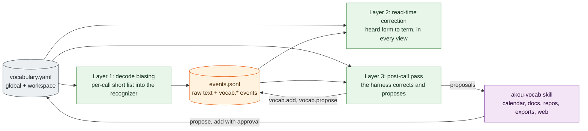

# Custom vocabulary

Speech recognizers spell common words well and rare ones badly. Product names (Vercel, iroh, Hetzner, Kubernetes), people's names (Anika) and project jargon come out wrong in the live transcript and often still wrong after the accurate pass. This document says how akou fixes that: one word list the user owns, used in three places, and a skill that grows the list with the user's approval.

In short:

- **One list.** Plain YAML files, global plus per workspace. Each entry is a term, the ways it has been misheard, where it came from, whether the user confirmed it, and when it was added.
- **Layer 1, while decoding.** The final-pass and live recognizer is told a short per-call list of words to prefer. Measured on Parakeet TDT v3: hits on rare terms roughly doubled at a cost of about 9 % more decode time.
- **Layer 2, while reading.** Every view of the log (window, packs, export, share) replaces known mishearings with the term. The log keeps what was heard, so any correction can be undone.
- **Layer 3, after the call.** The user's own harness reads the final transcript against the list, corrects what layers 1 and 2 missed, and proposes new entries. Nothing is added to the user's files without approval.
- **A skill, not a database.** The learning runs inside the user's Claude Code or Codex, reading the user's own calendar, documents, repositories, exported calls and the web. akou keeps no knowledge base. The vocabulary files are the only thing that crosses calls, and the user can read every line of them.

The predecessors called this a glossary. akou uses one word, vocabulary, everywhere: files, events, commands, tools.



## 1. The problem, measured

There are two test sets. Neither is in the repository, but the scripts that make the synthetic one are.

- **Synthetic.** 20 sentences carrying 10 rare terms (Vercel, iroh, Hetzner, Kubernetes, Convex, Tauri, ElectroBun, sherpa-onnx, Parakeet and one person's name), plus 8 control sentences with sound-alike words and no term, rendered by 7 macOS voices, two of them Spanish voices speaking English. 196 clips, 140 with a term. A hit is the term found whole in the output, case-insensitive.
- **Real calls.** 30 eight-second clips from the author's own calls, each containing one of 5 terms (3 product names, 2 people's names), plus 30 clips from the same calls with none of them. Only counts are published, never text.

Unbiased Parakeet TDT v3 int8, akou's live and final model, found the term in **48 of 140** synthetic clips and **6 of 30** real ones. On the real clips one person's name was never spelled right by any engine without help. That is the gap the three layers close.

## 2. The one list

### 2.1 Files

| Scope | Path | Used for |
|---|---|---|
| Global | `~/.config/akou/vocabulary.yaml` | Words that apply to every workspace: the user's own name, their company, tools they always use |
| Workspace | `~/.config/akou/vocabulary/<workspace>.yaml` | Words for that workspace's calls: people, products, project names |
| Extra | any paths listed in the workspace's `vocabulary.files` setting | A `vocabulary.yaml` kept inside a project repository, so the team can commit it |

Windows uses `%APPDATA%\akou\` in the same layout. akou merges all files for a workspace when a call starts, and a file watcher re-reads them when they change. A change mid-call takes effect on the next segment and on every read-time view at once. The workspace file wins over the global file on the same term; an extra file wins over both.

### 2.2 Format

YAML, one list of entries, parsed with Bun's built-in `Bun.YAML`. akou writes the file itself with a small serializer that quotes every string, so a term like `No` or `On` cannot turn into a boolean. Hand edits are expected and the file is meant to be diffed in git.

```yaml
# akou vocabulary, version 1
version: 1
entries:
  - term: "Vercel"
    heard: ["versal", "vessel", "ver sal"]
    source: "user"
    confirmed: true
    added_at: "2026-09-23"
  - term: "iroh"
    heard: ["ira", "irah", "zero"]
    source: "call:01J8Z6Q4M2VX0K7B3D4E5F6G7H"
    confirmed: true
    added_at: "2026-09-23"
    decode: 5           # this word keeps being missed; boost it harder (see 3.5)
  - term: "Tauri"
    heard: ["tori", "tory"]
    source: "docs:README.md"
    confirmed: true
    added_at: "2026-09-24"
    decode: false       # first token is too common; read-time only (see 3.5)
  - term: "Anika"
    heard: ["annika", "an ika"]
    source: "calendar"
    confirmed: false    # proposed by the skill, waiting for the user
    added_at: "2026-09-24"
    note: "attendee of the weekly sync"
```

Fields:

| Field | Required | Meaning |
|---|---|---|
| `term` | yes | The canonical spelling. Case matters and is what the views render |
| `heard` | no | Forms the recognizer produced for this term. Whole words or short phrases, lower case. Added by the user, by "Fix this word", and by the post-call pass |
| `source` | yes | Where the entry came from: `user`, `correction` (a "Fix this word" click), `call:<id>` (the post-call pass on that call), `calendar`, `docs:<path>`, `repo:<name>`, `export:<file>`, `web:<url>`, `agent:<client>`, `import:<file>` |
| `confirmed` | yes | `true` once the user approved it. Unconfirmed entries are listed for review and do nothing else |
| `added_at` | yes | Date the entry was written |
| `decode` | no | `true` (default: bias with the global boost), `false` (read-time only) or a number 1 to 5 (bias with this boost). Set by `akou vocab check` (section 3.5); the user can override |
| `note` | no | Free text, shown in the review list |

`akou vocab import FILE` accepts two older formats and writes them into this one: the `Canonical <= variant | variant  # comment` line format the predecessor pipelines used (a line marked `CAUTION` or `do not auto` imports with `decode: false` and no `heard` forms), and a plain list of one name per line.

### 2.3 What akou never does with the list

- It never edits a `confirmed: true` entry on its own. The post-call pass and the skill only add `confirmed: false` entries, or add `heard` forms to an existing entry as a proposal.
- It never reads the user's documents, calendar or repositories. The skill does that inside the harness, with the harness's own tools and permissions.
- It never sends the list anywhere. The list is passed to the recognizer in the app process and to the provider only inside the post-call pass prompt, which is the same trust boundary as a question.

## 3. Layer 1: decode-time biasing

The recognizer can be told which words to prefer while it decodes. sherpa-onnx calls this hotwords or contextual biasing. It is the strongest layer because it recovers spellings that no read-time table has seen yet, and the most dangerous one, because a badly chosen list makes the recognizer hear listed words that were never said.

### 3.1 What each engine supports

| Engine in akou | Biasing | Measured effect | Decision |
|---|---|---|---|
| Parakeet TDT v3 int8 (live segments and the final pass) | Yes. sherpa-onnx `modified_beam_search` with `hotwordsScore`, per recognizer (`hotwordsFile`) or per stream (`createStream("a/b/c")`). Needs `modelingUnit: "bpe"` and a `bpe.vocab` file | Synthetic: 48 to 94 of 140 at boost 3, 2 false insertions, WER 13.1 % to 10.8 %. Real: 6 to 22 of 30 at boost 3; 26 with one hard name boosted to 5. Decode time +9 % (beam search itself; the words add nothing measurable) | **Used.** This is layer 1 |
| Moonshine (live fallback on slow machines, English only) | None. Passing hotwords to a non-transducer sherpa-onnx recognizer logs "Only transducer models support contextual biasing" and **exits the process** | Not measured, read from the source | Never passed hotwords. The model-type check in 3.6 guards this |
| Whisper large-v3-turbo through sherpa-onnx (other languages) | None. sherpa-onnx's Whisper has no prompt option, and hotwords exit the process as above | Not measured | Read-time and post-call layers only |
| Whisper through whisper.cpp with an initial prompt | A one-line prompt naming the terms | Synthetic base.en: 45 to 112 of 140, 2 false insertions. Real base.en: 2 to 26 of 30; large-v3-turbo 14 to 27 of 30; 0 false insertions on the negatives. A 214-word prompt scored the same as no prompt | **Not used.** As strong as Parakeet biasing on short lists, but it would be a second speech engine. Kept as the option if Whisper workspaces need layer 1 |
| Streaming zipformer 20M (not in the design; measured for completeness) | Same hotwords API on the online recognizer, per recognizer only (`createStream()` takes no list) | Synthetic 4 to 19 of 140; real 0 to 1 of 30 at boost 3. The model does not hold these names acoustically, so there is nothing to bias toward | Not used for live. If a streaming model ever comes back, layer 1 stays off for it |

### 3.2 How it works in the source, and what follows

In sherpa-onnx's NeMo transducer decoder the global boost is added to the logits of every token that can continue a listed word from the current position, and that includes the first token of every listed word at every frame. Three consequences shape the design:

1. **The list must be short.** Every listed word is pushed at every frame, so a long list biases almost everything. Synthetic, boost 3: the 10 target terms plus 204 unsaid names took target hits from 94 to 61 of 140, raised WER from 10.8 % to 22.0 % and inserted 43 unsaid names. Real, boost 3: 398 names took hits from 22 to 16 of 30 and changed 23.5 % of the other words on the negative clips (6.9 % with 12 names). Sizes between 12 and 214 were not measured. **akou caps the decode list at 24 entries per call** and warns when it truncates. [M1](ROADMAP.md#m1-macos-v01-replaces-hark-and-hark-viewer-4-to-6-weeks) measures the middle of the curve and moves the cap.
2. **The boost curve is steep.** Real negatives (no listed word said): boost 2 inserted nothing, boost 3 put a listed word into 2 of 30 clips, boost 4 into 11 of 30 (31 insertions), boost 5 into 24 of 30 (81 insertions) and rewrote 58 % of the other words. Synthetic boost 5 produced runs like "Tauri Tauri Tauri". **The global boost is 3 and there is no user slider.** A per-entry boost up to 5 exists for a word the engine keeps missing (one real name went from 1 of 8 to 5 of 8 at boost 5 with no new insertions on the negatives), and only `akou vocab check` sets it.
3. **Words whose first token is short or common are hazards.** Synthetic boost 4: 19 false insertions, 13 of them one term whose first piece is `▁T`, one of the most frequent tokens. Such words are marked `decode: false` and handled at read time instead.

### 3.3 The per-call decode list

Built when the call starts and rebuilt whenever an input changes. In priority order, until the cap of 24:

1. Call-scoped entries: `vocab.add` events on this call (from `akou start --vocab`, the window, the CLI, MCP) and every `speaker.name` given so far.
2. Workspace and extra-file entries with `decode` not `false`, newest `added_at` first.
3. Global entries with `decode: true` set explicitly. Global entries default to read-time only, because the global list is where the vocabulary grows large.

Unconfirmed entries are never in the decode list. The list in force is written to the log as `vocab.used` so a transcript can be explained later.

A mid-call add applies from the next segment: the live path decodes segment by segment through the offline recognizer, and each segment's stream is created with the current list (`createStream(list)`), so no model reload is needed. Measured: per-stream lists gave the same output as a recognizer-level file on all 196 synthetic clips. The final pass uses the list as it stood at call end plus anything added afterwards.

### 3.4 The `bpe.vocab` file

sherpa-onnx turns a hotword into model tokens with its own small tokenizer, which needs a `bpe.vocab` file. Two traps were measured:

- The Parakeet v3 tarball ships no `bpe.vocab`, and the upstream recipe to make one writes scores that make sherpa-onnx's tokenizer split words differently from the model's real tokenizer. 7 of the 10 synthetic terms were split wrong, and the boost then followed a path the model never emits. Measured at boost 3: 86 of 140 with the recipe's file, 94 with a correct one.
- Passing pre-tokenized words without `modelingUnit` (what the sherpa-onnx-node documentation describes) silently does nothing: 7 of 10 words failed to encode with a line on stderr, and hits stayed at 48 of 140, the unbiased number.

So akou builds the file itself. `akou models pull` downloads the model's own `tokenizer.json` beside the weights (hash-pinned like the weights), and akou writes a `bpe.vocab` holding only the canonical pieces of the words in the current list, each scored the same, which reproduces the model's own tokenization for those words. The build checks every word: it tokenizes with the real tokenizer, then with the sherpa-onnx rules, and a word whose two tokenizations differ is dropped from the decode list with a warning and kept for read time. With 214 words that check failed for 11; with lists under the cap it has not failed yet. The durable fix is upstream (an encoder that runs real BPE, or a mode that accepts token ids), and akou will switch to it when it exists.

Because the `bpe.vocab` is fixed when a recognizer is built, a mid-call word whose pieces are not yet in the file needs the file regenerated and the recognizer rebuilt (about 1 s of model load, in the Worker, with the audio queue absorbing the gap). akou does this at most once per minute and batches adds.

### 3.5 `akou vocab check`

Runs on every add and on demand. For a term it reports: the model's tokenization, whether the sherpa-onnx tokenization matches, whether the first piece is in the model's 200 most frequent tokens, and whether any `heard` form is a dictionary word or 3 characters or shorter. From that it sets `decode`:

- tokenizations differ, or the first piece is common: `decode: false`, read-time only, with the reason printed;
- otherwise `decode: true`;
- `decode: <n>` above 3 is never set automatically. `akou vocab check TERM --boost 5` sets it after printing the false-insertion warning.

### 3.6 Safety rules, enforced in code

- Before any hotword reaches sherpa-onnx, akou checks the recognizer's model type. Only `nemo_transducer` (and the other transducer types) may receive a list. Anything else gets none, and a test proves a Moonshine recognizer built with a list never calls `createStream` with an argument.
- A hotword that fails to encode is an error in the app log and the word is dropped from the list, never a silent stderr line.
- The global boost is a constant, 3, not a setting. Per-entry values are capped at 5.
- The decode list is capped at 24 and never contains an unconfirmed entry.

## 4. Layer 2: read-time correction

Every reader of the log goes through `fold(events)`, and the fold applies the vocabulary. Nothing rewrites the raw `text` of a `seg`. The fold computes the corrected text when it builds a view.

Rules, in order, for each segment:

1. **Call-scoped pairs first.** `vocab.add` events on this call, newest first. A pair with `segs` applies only to those segment ids.
2. **Then the files**, extra over workspace over global, confirmed entries only.
3. A `heard` form matches as a whole word or whole phrase, case-insensitive, accents folded. A form that is a dictionary word in a configured language, or 3 characters or shorter, is skipped unless the pair is call-scoped (the user or the pass said so for this call).
4. Terms without `heard` forms, and every `speaker.name`, are matched fuzzily: Jaro-Winkler at least 0.92 against tokens of 4 or more characters that are not dictionary words.
5. The rendering keeps both: `Vercel (heard: "versal")` in packs and exports, the term with the heard form on hover in the window. The model and the user both see that a correction happened.

Measured on the synthetic set, pairs learned from 3 voices and applied to the other 4: unbiased Parakeet went from 25 to 34 of 80; on top of layer 1, from 51 to 56 of 80. With the dictionary filter on, 25 to 29 and 51 to 54. The filter costs a few hits and removes pairs like `vessel` to Vercel and `ira` to iroh, which would have rewritten a real word or a real name. On the real set, a table built from the author's own past corrections took unbiased Parakeet from 6 to 21 of 30 and, stacked on layer 1, to 28 of 30, with 0 rewrites on the 30 negative clips. That table was built from the same calls the clips came from, so 21 is an upper bound, and the stacked 28 is the number to remember.

What layer 2 cannot do: some names have no stable mishearing. Two of the ten synthetic terms were misheard 13 different ways in 14 misses. Exact pairs never catch those; layer 1 and layer 3 do.

### 4.1 The events

| Type | Fields | Purpose |
|---|---|---|
| `vocab.used` | `entries[]` (term and boost), `files[]`, `sha256[]`, `model` | The decode list and files in force, written at call start and whenever the list changes |
| `vocab.add` | `id`, `rev`, `term`, `heard[]`, `by`, `segs[]?`, `decode?` | A call-scoped entry: read-time pair for this call, and a decode entry if `decode` is not `false`. `segs` restricts the pair to those segment ids. `term: null` on a revision retracts it |
| `vocab.propose` | `id`, `rev`, `term`, `heard[]`, `by`, `evidence`, `status: open \| accepted \| rejected` | A proposed entry or pair from the post-call pass or an agent. Does nothing until accepted; accepting writes the file and a `vocab.add` |

`by` is `user`, `agent:<client>`, `pass:<model>` (the post-call pass) or `speaker` (derived from a `speaker.name`). "Fix this word" in the window writes a `vocab.add {segs: [that id]}` first, then offers "Everywhere in this call" (drops `segs`) and "Add to the workspace vocabulary" (appends to the file with `source: correction`). A whole-line edit is a `seg` revision as before; the first revision stays in the log.

A `vocab.add` written mid-call applies to every earlier segment's read-time view at once (the fold is incremental and re-renders affected segments) and to the decode list from the next segment on. Readers holding a cursor receive it as an ordinary event.

## 5. Layer 3: the post-call pass

Runs after `final.done` through the configured provider, under the same policy as [Enhance](DESIGN.md#52-templates-and-enhanced-notes): automatic with a local model or an API key, on request with the harness (a "Review words" button, `akou vocab pass`, or the skill). It is one prompt, not a chat:

- **Input.** The final transcript rendered with layer 2 applied and heard forms visible, the confirmed vocabulary (terms and `heard` forms, capped at 2k tokens, nearest terms by BM25 to the transcript first), the roster, and the rules below.
- **Output**, JSON: `corrections: [{seg, heard, term}]` for occurrences of a known term that layers 1 and 2 missed, and `proposals: [{term, heard[], evidence}]` for words that look like a name or a product and are not in the vocabulary. `evidence` is the segment id and the reason.
- **Applied.** Each correction whose `term` is a confirmed entry and whose `heard` span exists in that segment becomes `vocab.add {segs: [seg], by: pass:<model>}`. A correction to a term that is not confirmed, and every proposal, becomes `vocab.propose`. A correction whose span is not in the segment is dropped, the same deterministic check that guards enhanced-note citations.
- **Cost.** Roughly the transcript plus 2k tokens once per call. Nothing is retried silently.

The window shows "N words to review" after the pass; `akou vocab list --unconfirmed` shows the same. Accepting a proposal writes the file, marks the event `accepted`, and applies the pair. Rejecting marks it `rejected` so the pass does not propose it again on this call; the skill keeps a short reject list in the file's `rejected:` section so it does not re-propose across calls either.

## 6. The learning skill

`skills/akou-vocab/SKILL.md`, installed by `akou skill install` beside the main skill. It runs in the user's harness and uses the harness's own tools for files, calendar and the web. akou provides only `akou vocab suggest`, `akou vocab check` and the add, propose and approve commands.

### 6.1 Sources, and when

| When | Source | What it does |
|---|---|---|
| Before a call | The calendar invite the user points at, or the harness's own calendar tool | Attendee names and title terms become call-scoped adds: `akou start --vocab "Anika,Vercel"` or `akou_vocab_add {scope: "call"}` right after start. Attendees are proposed to the workspace file, not added |
| Any time, on request | The user's documents, notes and repositories the harness can read | `akou vocab suggest --from -` takes text on stdin and returns ranked candidates; the skill feeds it the files it read |
| Any time, on request | Past exported calls in the export folder | The same command over the export Markdown. Exports carry corrected text with `(heard: …)` marks, so past corrections are visible to it |
| After each call | The call's `vocab.propose` events (`akou vocab list --unconfirmed --call ID`) | Reviews the pass's proposals with the user |
| For each candidate | Web search | Confirms the canonical spelling and casing before proposing, and records the URL as `source: web:<url>` in the note. A candidate with no confirming source is proposed with `note: "unconfirmed spelling"` |
| Every correction | "Fix this word", the user's inline edits, accepted proposals | Becomes a `heard` form on the entry, so the same mishearing is caught at read time next time |

### 6.2 Ranking: frequency times rarity

`akou vocab suggest` tokenizes the given text, plus the call transcript when `--call` is given. It keeps capitalized tokens and tokens with digits or internal capitals, and drops dictionary words in the configured languages and tokens under 4 characters. It scores each candidate as `count in the given text × rarity`, where rarity is 1 for a word absent from the bundled frequency lists and falls toward 0 for words in the top 50k. Candidates already in the vocabulary are dropped. The output is JSON: `[{term, count, rarity, contexts[]}]` with three short contexts each, so the skill can show them to the user. The skill proposes the top entries, confirms spellings on the web, and never adds a `confirmed: true` entry unless the user stated the word in the conversation.

### 6.3 Approval

- **Auto-applied, no approval:** read-time correction from confirmed entries and call-scoped adds; decode biasing from confirmed entries; a correction from the pass to a confirmed term (visible as `(heard: …)`, reversible with one click).
- **Proposed, needs a yes:** any new term; any new `heard` form on a file entry; a pair whose heard form is a dictionary word or short; a per-entry boost above 3.
- **Approval surfaces:** the "words to review" list in the window, `akou vocab approve TERM…` / `akou vocab reject TERM…`, `akou_vocab_approve` over MCP when the user says yes in the chat.

## 7. Surfaces

### 7.1 CLI

| Command | Does |
|---|---|
| `akou vocab list [-w WS \| --global] [--call ID] [--unconfirmed] [--json]` | Entries in force, with scope and source. `--call` adds the call's `vocab.add` and open proposals |
| `akou vocab add TERM [--heard F,F…] [-w WS \| --global \| --call ID] [--source S] [--unconfirmed] [--no-decode] [--boost N] [--note T]` | Adds an entry, running `check` first. `--call` writes a `vocab.add` event only |
| `akou vocab remove TERM [-w WS \| --global \| --call ID]` | Removes from a file, or retracts a call-scoped add |
| `akou vocab approve TERM… [--call ID]` · `akou vocab reject TERM… [--call ID]` | Confirms or rejects proposals |
| `akou vocab suggest [--call ID] [--from FILE \| -] [-k N] [--json]` | Ranked candidates from a call, a file or stdin |
| `akou vocab check TERM [--boost N]` | Tokenization, decode safety, the `decode` value it would set |
| `akou vocab import FILE [-w WS \| --global]` | Converts the `Canonical <= variant` format or a plain name list |
| `akou vocab pass [--call ID]` | Runs layer 3 with the configured provider |
| `akou start … [--vocab TERM,TERM…]` | Call-scoped adds written right after `call.created` |

Exit codes as the rest of the CLI; 65 for a term that fails validation.

### 7.2 HTTP API

| Method and path | Purpose |
|---|---|
| `GET /vocab?workspace=&unconfirmed=` | Merged entries for a workspace, each with `scope` and `file` |
| `POST /vocab` `{term, heard[], scope: global \| workspace, workspace?, source, confirmed, decode?, note?}` | Add or update a file entry (runs check; the answer carries the check result) |
| `DELETE /vocab/{term}?scope=&workspace=` | Remove a file entry |
| `POST /vocab/approve` · `POST /vocab/reject` `{terms[], call?}` | Proposals |
| `POST /vocab/suggest` `{text?, call?, k}` | Ranked candidates |
| `POST /vocab/check` `{term, boost?}` | The check report |
| `POST /vocab/import` `{path, scope, workspace?}` | Import |
| `GET /calls/{id}/vocab` | The list in force for the call: files, call-scoped adds, proposals, the last `vocab.used` |
| `POST /calls/{id}/vocab` `{term, heard[], segs?, decode?}` | Writes `vocab.add` |
| `DELETE /calls/{id}/vocab/{vid}` | Retracts a call-scoped add |
| `POST /calls/{id}/vocab/pass` | Runs layer 3 |

Same guard as every other route (token, `Host`, no browser headers, 64 KB body cap).

### 7.3 MCP tools

| Tool | Purpose |
|---|---|
| `akou_vocab_add {term, heard?, scope = "call", workspace?, decode?, note?}` | Add mid-call (`scope: call`) or to a file. Its description says: add to a file as confirmed only when the user stated the word; otherwise use `akou_vocab_propose` |
| `akou_vocab_propose {entries: [{term, heard?, evidence, note?}], call?}` | Proposals for the user to review |
| `akou_vocab_approve {terms[], call?}` · `akou_vocab_reject {terms[], call?}` | Act on the user's yes or no |
| `akou_vocab_list {workspace?, call?, unconfirmed?}` | What is in force and what is waiting |
| `akou_vocab_suggest {text?, call?, k = 20}` | Ranked candidates |
| `akou_vocab_check {term}` | Decode safety for a word |

### 7.4 In the window

"Fix this word" on any line (section 4.1). A vocabulary panel in Settings per workspace: entries, sources, the check verdict per entry, the file paths. A "Words to review" badge after the pass. The decode list in force under the models pill, so a user can see which words the recognizer is being pushed toward right now.

## 8. What was measured

All numbers are hits of the said term, whole and case-insensitive. "Insertions" are listed terms appearing where nothing like them was said. Machine: an Apple M4 Pro laptop under load from other work; single runs vary by about ±10 %, so trust the interleaved comparison.

### 8.1 Synthetic set (196 TTS clips, 140 with a term, 7 voices)

| Engine and setting | Hits of 140 | Insertions | WER |
|---|---|---|---|
| Parakeet TDT v3 int8, greedy | 48 | 0 | 13.1 % |
| Parakeet, beam search, no list | 47 | 0 | |
| Parakeet, 10 words, boost 1.5 | 79 | 0 | 10.3 % |
| **Parakeet, 10 words, boost 3** | **94** | **2** | **10.8 %** |
| Parakeet, 10 words, boost 4 | 107 | 19 | 14.8 % |
| Parakeet, 10 words, boost 5 | 117 | 61 | 24.8 % |
| Parakeet, boost 3, `bpe.vocab` from the upstream recipe | 86 | | |
| Parakeet, boost 3, pre-tokenized words without `modelingUnit` | 48 | | |
| Parakeet, 214 words, boost 3 | 61 | 43 unsaid names | 22.0 % |
| Parakeet, 214 words, boost 1.5 | 68 | 7 | 13.7 % |
| whisper.cpp base.en, no prompt | 45 | | 19.1 % |
| whisper.cpp base.en, one-line prompt with the 10 terms | 112 | 2 | 12.9 % |
| whisper.cpp base.en, 214-word prompt | 46 | | |
| Streaming zipformer 20M, greedy | 4 | 0 | 46.5 % |
| Streaming zipformer 20M, 10 words, boost 3 | 19 | 0 | |

Decode time, Parakeet, interleaved on the same clips: greedy 145 ms per clip, beam search 158 (+9 %), beam with the list 158.5, per-stream list 157.8. Real-time factor about 0.04 on 2 threads.

Read-time table, pairs learned from 3 voices, applied to the other 4 (80 term clips): greedy 25 to 34; on top of boost 3, 51 to 56; with the dictionary filter, 25 to 29 and 51 to 54.

### 8.2 Real-call set (30 term clips, 30 negatives, 5 terms, several speakers and accents)

| Engine and setting | Hits of 30 | Negatives with an insertion |
|---|---|---|
| Parakeet, greedy or beam, no list | 6 | |
| Parakeet, 12 words, boost 2 | 18 | 0 of 30 |
| **Parakeet, 12 words, boost 3** | **22** | **2 of 30** |
| Parakeet, boost 3, one hard name at 5 | 26 | 2 of 30 |
| Parakeet, 12 words, boost 4 | | 11 of 30 (31 insertions) |
| Parakeet, 12 words, boost 5 | 25 | 24 of 30 (81 insertions) |
| Parakeet, 398 words, boost 3 | 16 | 23.5 % of other words changed |
| Parakeet, greedy plus the user's own pair table | 21 (in-sample) | 0 rewrites |
| Parakeet, boost 3 with the hard name at 5, plus the table | 28 | |
| whisper.cpp base.en, prompt | 2 to 26 | 0 of 30 |
| whisper.cpp large-v3-turbo q5_0, prompt | 14 to 27 | 0 of 30 |
| Streaming zipformer, boost 3 | 1 | 0 of 30 |

One clip was missed by every engine and setting, so the ceiling is 29. Parakeet decoded 240 s of audio in about 7 s on 6 threads with or without the list (real-time factor 0.03), one data point for [gate G6](ROADMAP.md#m0-gates-1-to-2-weeks).

The nightly evaluation keeps both sets: the synthetic one regenerated by script, the real one from the author's clips, not committed. It asserts a floor on hits, a ceiling on insertions on the negatives at the default boost, and runs a positive control at boost 5 that must exceed the insertion ceiling, which proves the check can fail.

## 9. Limits

- Test audio was one clean speaker per clip, TTS or short real excerpts. Long real calls with crosstalk are measured in M1's exit criteria, not here.
- List sizes between 12 and 214 were not measured. The cap of 24 is a placeholder until they are.
- Layer 1 exists only for Parakeet. Whisper workspaces get layers 2 and 3.
- The `bpe.vocab` workaround reproduces the model's tokenization for short lists; a real BPE encoder upstream is the durable fix, and akou tracks that issue.
- Layer 2 cannot catch names with no stable mishearing. That is layer 3's job, and layer 3 costs a provider run per call.
- The dictionary filter uses bundled frequency lists per configured language. A term that is also a common word in that language (a product called "Flux") is read-time only through call-scoped pairs, never through the file.
- Measurements were made with sherpa-onnx-node 1.13.8 and its bundled runtime. A model or runtime upgrade re-runs the evaluation before it ships.
