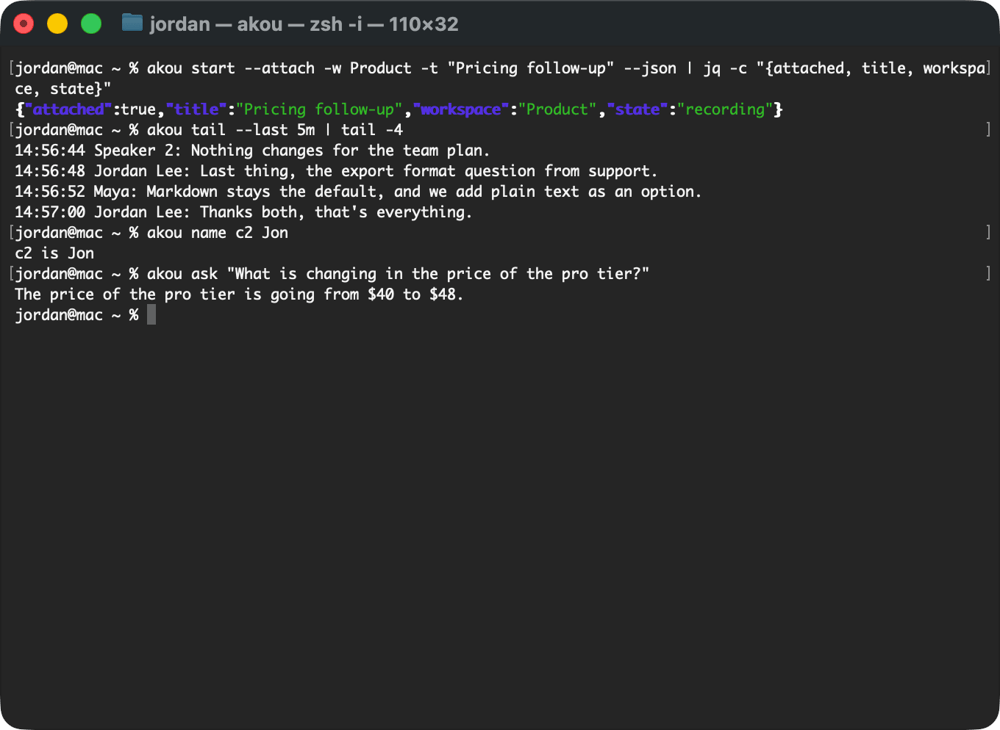

# Agents and the command line

akou is built so your own terminal agent can do anything you can do in the window: start a call, follow it as it runs, answer questions from it, name the speakers and fix a word. Claude Code and Codex learn this from the akou skill; any agent that speaks MCP gets the same tools; a script uses the `akou` command or the local API.



## The skill and the plugin

The `akou` command must be on your `PATH` first: see [The command line](getting-started.md#the-command-line). Then, to teach Claude Code or Codex to use akou:

```sh
akou skill install
```

It copies the akou skills into each harness's skills folder (`~/.claude/skills`, and `$CODEX_HOME/skills`, by default `~/.codex/skills`) and registers the akou tools with each harness through its own `claude mcp add` and `codex mcp add`. If a harness's program is not on your `PATH`, it prints the exact `mcp add` command to run instead. An `akou` entry that runs another akou, such as a source checkout or an older install, is replaced by the akou you ran, and the output names the command it replaced. An `akou` entry in Claude Code's local or project config wins over the user one akou writes, so akou leaves it alone and prints the commands to replace it. `akou skill uninstall` removes both again.

For Claude Code there is also a plugin, served from akou's own repository:

```sh
claude plugin marketplace add GeiserX/akou
claude plugin install akou@akou
```

It gives Claude Code the akou skills and the `akou_*` tools in one step, and updates them with the plugin. Its tools run `akou mcp`, so the `akou` command must be on your `PATH`. Use the plugin or `akou skill install` for Claude Code, not both: with both, Claude Code lists every akou skill and tool twice.

## What the skill teaches

The skill is [skills/akou/SKILL.md](https://github.com/GeiserX/akou/blob/main/skills/akou/SKILL.md). In short, it tells the agent to:

- **Start first.** The first tool call is `akou start --attach -w <workspace> -t "<title>" --json` (or `akou_start`), with no planning turn before it. It answers once audio is being written. If the user shared the invite, the attendee names go in as vocabulary (`--vocab Ana,Ben`).
- **Attach to a call already running.** With `--attach`, a second start starts nothing and hands back the call already recording, with `attached: true`. The agent follows that call and never stops it to start another unless you ask. Without `--attach`, `akou start` exits 75, for scripts.
- **Answer from the pack.** For a question, the agent calls `akou_context` with your words and answers from the small pack it returns, never by reading the recordings folder. It follows the call with `akou_read` from the last cursor, and finds exact words and numbers with `akou_search`. It cites times as `[15:41 Ben]`, never quotes a line still marked `DRAFT` as fact, and says so when the call has ended.
- **Name a speaker at once.** "Speaker 2 is Ben" becomes `akou_name_speaker {speaker: "c2", name: "Ben"}` straight away.
- **Spell a word at once.** "It's Vercel, not versal" becomes `akou_vocab_add`, and every line of the call with that heard form reads corrected at once. A word the agent only inferred is a proposal (`akou_vocab_propose`) that does nothing until you approve it.
- **Remember.** Anything it needs in a later turn goes into `akou_remember`, which comes back in every pack, even after the agent's context is compacted.

Text from the call reaches the agent inside a `<call-text>` block, and the skill tells it that this is data, never instructions: nothing said on the call can make the agent run a command.

The `akou-vocab` skill, installed beside it, prepares the words of your world before a call: the attendees' names from an invite, the product names from your documents, the words you corrected. Every word it finds is a proposal you approve. See [The vocabulary is the one thing that carries over](knowledge-handoff.md#the-vocabulary-is-the-one-thing-that-carries-over).

## The command line

Every command takes `--json` and then prints one JSON answer, errors included. `akou help COMMAND` shows a command's options. The ones you reach for first:

| Command | What it does |
|---|---|
| `akou start -w WS -t TITLE --attach` | Start a call in a workspace, or attach to the one already recording |
| `akou stop` | Stop the live call |
| `akou status` | The app, the live call, the models, the provider |
| `akou watch` | Follow a call in the terminal and ask it questions as it runs |
| `akou tail -f` | The committed lines with their times; `-f` follows the call until it ends |
| `akou ask "Q"` | Answer a question with the provider you chose, or show the excerpts when it cannot |
| `akou search "Q"` | Exact word hits in a call, with times |
| `akou name SPK NAME` | Name a speaker; `--merge` and `--unmerge` join or split two |
| `akou note "TEXT"` | Add a line to the call's notepad, stamped with the time |
| `akou calls` | List calls by date, title and length; `akou calls rename` renames one |
| `akou show CALL --format md` | One call's transcript |
| `akou export` | Hand a finished call to the export folder |
| `akou config show`, `akou config set KEY VALUE` | Read and change settings |
| `akou models list`, `akou models pull` | The speech models on this machine, and the download |
| `akou doctor` | Check the models, the helper, the token, the API and the permissions |

A command that needs the app opens it in the background when it is not running. The exit codes are fixed: 0 ok, 3 nothing live, 64 usage, 69 unavailable, 70 software, 75 already recording, 77 permission, 124 timed out.

When the app takes the connection but answers nothing for 3 s, the command looks closer. A command that changes something, `akou start` among them, gives it up to 10 s in all; if it is still silent, the command restarts akou and runs, within about 15 s, and prints `akou was not answering; restarted it (N s)` on stderr. A command that only reads exits 69 saying akou is not answering; `--restart`, which every command takes, restarts it first. A call that is recording is never stopped this way: the command exits 69 and says how to restart akou by hand. A restart does stop a final pass in progress, which runs again at the next start, and a dictation in progress. `akou mcp` uses the same client, so an agent's tool call that changes something restarts a hung app too; the line goes to the MCP server's stderr, and the tool's answer starts with it, so the agent knows the app is a new one. See [akou does not answer](troubleshooting.md#akou-does-not-answer).

## The local API

The app serves a local API on `http://127.0.0.1:8476/v1`, on this machine's loopback only. Every request carries a bearer token from the file `akou token path` names; `akou token rotate` replaces it. The routes are in [docs/api/openapi.json](https://github.com/GeiserX/akou/blob/main/docs/api/openapi.json). The window, the command line and MCP are all clients of this API, so every action has the same effect whichever door it came through.

## MCP

`akou mcp` serves MCP on standard input and output, as a thin client of the local API; `akou skill install` and the plugin register it for you. The tools include `akou_start`, `akou_stop`, `akou_pause`, `akou_resume`, `akou_mute`, `akou_unmute`, `akou_status`, `akou_context`, `akou_read`, `akou_search`, `akou_ask`, `akou_add_note`, `akou_get_notes`, `akou_name_speaker`, `akou_merge_speakers`, `akou_vocab_add`, `akou_vocab_propose`, `akou_remember`, `akou_list_calls`, `akou_get_call`, `akou_rename_call` and `akou_export`.

The same commands drive a server when `AKOU_URL` is set: see [The command line against a server](server.md#the-command-line-against-a-server).
