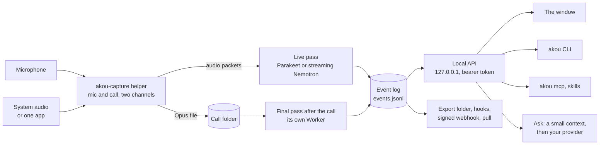

# How it works

akou is one app with a few small helpers around it. This page follows a call from the microphone to your notes, and says what runs where and what can reach it. The full design is [docs/DESIGN.md](https://github.com/GeiserX/akou/blob/main/docs/DESIGN.md) on GitHub.

## Capture

The `akou-capture` helper is a small Rust program the app starts for each recording. It records your microphone and the call audio on two separate channels: the call side is the whole computer's sound or one app's, taken with the system's own audio capture, so there is no virtual audio driver to install and no bot in the meeting. It writes the audio to an Opus file in the call's folder and streams it to the app.

The helper runs as its own process so that a stuck audio device can never freeze the app: akou gives it a few seconds to stop, then ends it. To restart a recording, akou starts a new helper before stopping the old one, so there is no gap in the audio.

## The live pass

While the call runs, a recognizer in a background thread of the app turns each channel into text. By default it is Parakeet TDT 0.6B v3, which re-reads each stretch of speech between pauses, so a word on screen can still change. Streaming Nemotron, an optional download on the Models page, shows words about half a second after they are spoken and never takes one back. Your channel is labelled with your name; the call channel is split into speakers as they talk.

A line still being spoken is marked `DRAFT` until it settles.

## The final pass

After the call, akou reads the whole recording again for the accurate transcript: Parakeet over every stretch of speech, and speaker labels from Nemotron 3 Diarization and TitaNet. It runs in its own Worker, one call at a time, and frees the models' memory when it ends, so a long call does not leave the app large. The final text replaces the live text in the window and in every export, and every line keeps its time of day.

All of this runs on the Mac. The speech models are one download of about 3.0 GB, each file checked against a SHA-256 pinned in akou's code.

## The event log

Every call is a folder under `~/Recordings/akou/<workspace>/` with the audio, the logs and one file, `events.jsonl`, that holds everything that happened: each line of the transcript, each speaker name, each note, each question and answer, each fix. The log is append-only: a correction is a new event, never an edit. The window, the command line and the exports all draw from this one log, so they always agree.

## The local API and its doors

The app serves an API on `http://127.0.0.1:8476/v1`, on this machine's loopback only, with a bearer token kept in a file only you can read. Everything the window can do exists on this API, and every other door is a client of it:

- the `akou` command line, for you and for scripts;
- `akou mcp`, the MCP server your agent talks to;
- the `akou` and `akou-vocab` skills, which teach Claude Code and Codex to use the two above.

So an agent sees the same call you see, and what it does (a note, a speaker name, a fixed word) shows up in the window at once. See [Agents and the command line](agents.md).

## Ask

A question never sends the whole transcript anywhere. akou first builds a small context on the Mac, with no model call: the lines that match the question, the last minutes of the call, your notes and the speakers. Only that goes to the provider you chose: your own Claude Code or Codex, a local model through Ollama, or an API with your key. With the provider set to `none`, Ask becomes "Search this call" and shows the matching lines. See [Providers](providers.md).

## The hand-off

akou keeps no library across calls. A finished call leaves through the export folder (Markdown with frontmatter, the event log and the audio), hooks that run your own commands, a signed webhook, or a pull over the API. Each of them is off until you set it up. See [Hand-off to your knowledge system](knowledge-handoff.md).

## Security

- The desktop app listens on 127.0.0.1 only. Every request needs the token, which lives in a file readable by your user alone; `akou token rotate` replaces it.
- Settings that name a program akou runs, or an address your audio or transcripts go to, can be written only in the config file or the window, never over the API, so the token cannot be turned into a way to run a command or send your calls elsewhere.
- Text quoted from a call reaches an agent marked as data, never as instructions.
- In server mode, each program gets its own key with scopes, and the server refuses to listen beyond loopback until a reverse proxy with TLS is in front of it. See [Server mode](server.md).
