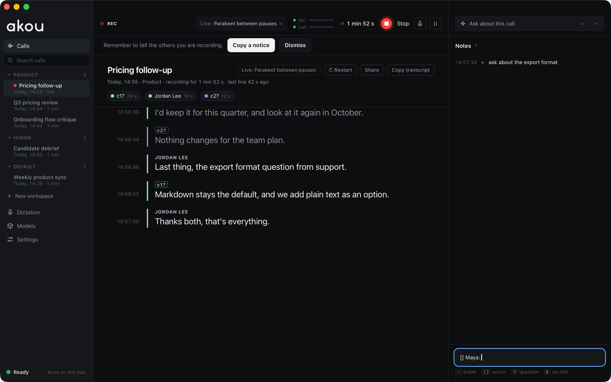
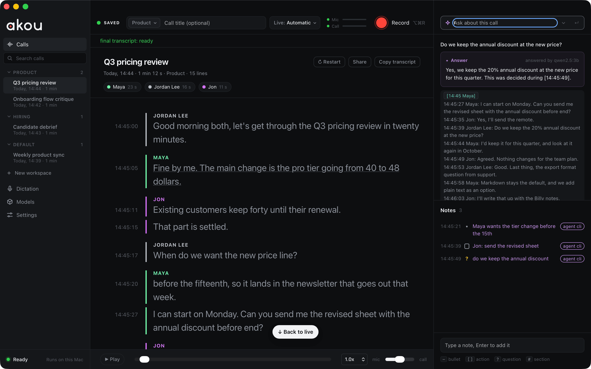
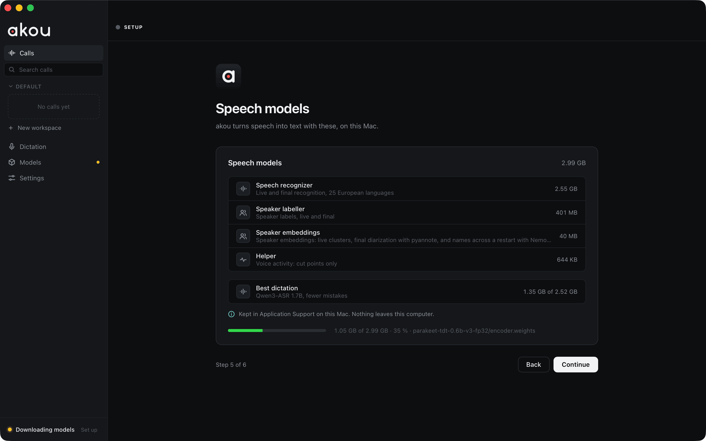
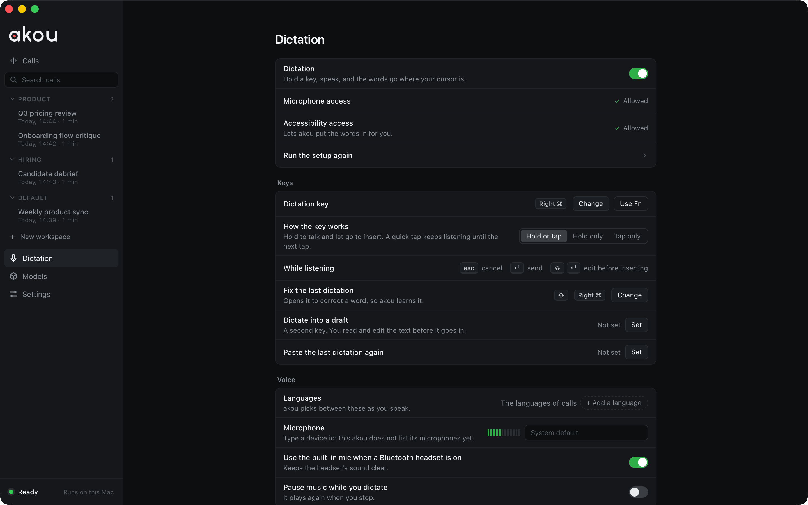
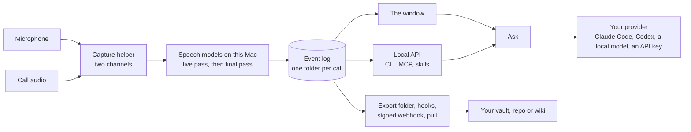

---
hide:
  - navigation
---

# akou { .ak-visually-hidden }

  

  
  
  
  

---

**akou** is a desktop app for macOS that records your calls on your own computer, transcribes them on the machine, and answers questions about a call while it is still running. There is no bot in the meeting, no account and no cloud. Your own terminal agent, Claude Code, Codex or anything that speaks MCP, can follow and question the call, and the notes land in files you own. Start with [Getting started](getting-started.md), then [Usage](usage.md).

-   :material-download: **[Getting started](getting-started.md)**

    ---

    Install the app, let macOS open it once, download the speech models and record your first call.

-   :material-record-rec: **[Usage](usage.md)**

    ---

    The window: Record, the live transcript, notes with times, Ask, speakers and workspaces.

-   :material-console: **[Agents and the command line](agents.md)**

    ---

    Teach Claude Code or Codex to start, follow and question a call, from the terminal or over MCP.

-   :material-tune: **[Configuration](configuration.md)**

    ---

    Every setting, its default and what it changes.

## The app

akou is one window: calls on the left, the transcript in the middle, notes and Ask on the right. A saved call shows who spoke and for how long, the transcript with a time on every line, and your notes beside it. See [Usage](usage.md).

<figure markdown>

<figcaption>During a call</figcaption>
</figure>
<figure markdown>

<figcaption>Ask about the call</figcaption>
</figure>
<figure markdown>

<figcaption>First run</figcaption>
</figure>
<figure markdown>

<figcaption>Your agent on the call</figcaption>
</figure>

Hold a key and speak, and akou types the words where your cursor is, in any app. See [Dictation](dictation.md).

## What it does

- Records the microphone and the call audio on separate channels, with no bot in the meeting and no virtual audio driver. Call audio is the whole computer or one app.
- Shows a live transcript as people speak. After the call, an accurate pass with speaker labels runs on the Mac, and every line keeps its time of day.
- Keeps a timestamped notepad while the call runs (`-` bullet, `[]` action, `?` question, `#` section).
- Answers a question about the call while it runs, from a small context built locally, with the Claude Code or Codex you already pay for, a local model, or your own API key. With no provider, Ask becomes "Search this call". See [Providers](providers.md).
- Lets your agent start, follow, question and annotate a call from the terminal, the local API or MCP. See [Agents and the command line](agents.md).
- Types what you dictate into any app, and learns a word you fix only when you say yes. See [Dictation](dictation.md).
- Keeps one word list you own, so names and product terms come out right across calls.
- Hands every finished call to your own vault, repository or wiki as Markdown with frontmatter, the event log and the audio, through an export folder, hooks, a signed webhook or the API. See [Hand-off to your knowledge system](knowledge-handoff.md).
- Runs the same core as a self-hosted transcription server in Docker, with OpenAI-compatible, Wyoming and Bazarr endpoints. See [Server mode](server.md) and [GPUs and presets](server-hardware.md).

## How it runs

- The app runs on Macs with Apple silicon and macOS 14.4 or later. The `akou` command line also runs on Linux and Windows, where it manages models and settings and drives a remote akou, but cannot record.
- The speech models are one download of about 3.0 GB into Application Support, each file checked against a pinned SHA-256.
- The final pass runs in its own worker and frees its memory when it ends; a long call does not leave the app large.
- The server image is `drumsergio/akou`, on linux/amd64 and linux/arm64, with `-vulkan` and `-cuda` variants. There is no `latest` tag.
- Every action the window has also exists on the local API, so an agent can do anything you can. See [How it works](how-it-works.md).

## What it does not do

- It does not keep a knowledge base across calls: no search across meetings, no people directory. That belongs to the system you hand calls to.
- It does not join a meeting as a bot, and it never sends anything to a meeting service.
- It has no cloud, no account and no sync between machines.
- The desktop app ships for macOS only today. Dictation is macOS only too.
- The 0.x builds are prereleases.

## Privacy

- The audio, the transcript, the notes and the models stay on your disk. Nothing leaves the Mac unless you turn on one of the options below.
- Ask, enhanced notes and the vocabulary pass send a small excerpt of the call to the provider you chose: your own Claude Code or Codex (your subscription), a local model (stays on your machine), or an API with your key. `none` sends nothing. See [When akou calls the provider](providers.md#when-akou-calls-the-provider).
- The export folder, hooks and the webhook run only where you point them, and the webhook is signed and off until both its URL and secret are set.
- The floating bar shown during a screen share carries no transcript text. The dictation island shows your words only when `dictation.pillPreview` is on.
- Server mode has no TLS of its own and refuses to listen on every address until you say a reverse proxy is in front of it.

## Getting help

- If something is broken, read [Troubleshooting](troubleshooting.md), then open an issue with the details it lists.
- To report a security problem, follow the [security policy](https://github.com/GeiserX/akou/blob/main/SECURITY.md) and do not open a public issue.
- The [changelog on GitHub](https://github.com/GeiserX/akou/blob/main/CHANGELOG.md) lists what changed between releases, and the known limitations of each one.
- The [FAQ](faq.md) answers the questions people ask first, Granola included.
- To build it, run the tests or send a fix, read [Development](development.md).

## License

akou is released under the [GPL-3.0-or-later](https://github.com/GeiserX/akou/blob/main/LICENSE) license. It is written from scratch and replaces [hark](https://github.com/PhantomYdn/hark), whose capture design it carries over.
