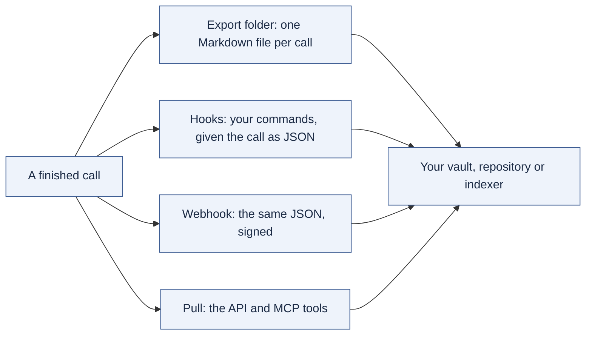

# Handing calls to your own knowledge system

akou records, transcribes and answers questions about a call. It does not keep a library of your calls, search across them, or build a picture of your people and topics. That belongs in the system you already use: an Obsidian or Logseq vault, a Git repository of notes, a wiki, a search index. akou's job is to hand each finished call over quickly, in open formats, and to keep the copy current when you fix it.

Across calls, akou keeps the call folders, a list of calls by date, title and workspace (so you can name one past call), your templates, your settings, and your vocabulary.

## Four ways out



Each runs when a call ends, again when the final transcript is done, and again after every enhancement. The export also follows later fixes: rename a speaker, correct a word or edit a note on an exported call, and the file is rewritten about a second and a half after the last change. The export runs first, then the hooks, then the webhook, one call at a time.

### 1. The export folder

Set `export.dir` (off until you do). Each call becomes one file under a folder per workspace:

```text
<export.dir>/work/2026-09-23 1536 Weekly sync.md
<export.dir>/work/attachments/2026-09-23 1536 Weekly sync/events.jsonl
<export.dir>/work/attachments/2026-09-23 1536 Weekly sync/part-001.opus
```

The file has frontmatter (`akou_id`, title, local start and end with the offset, duration, workspace, participants, template, which transcript layer it holds) and three sections:

- `## Notes`: the latest enhanced notes, each citation written as a time and a name, `[15:41:07 Ben]`.
- `## Your raw notes`: every notepad line with its time; an agent's lines are marked.
- `## Transcript`: the speaker and local time at each change of speaker and at least once a minute, with vocabulary corrections shown next to what was heard: `Kubernetes (heard: "kubernetis")`.

The audio is linked by default (`export.audio`: `link`, `copy` or `none`).

Your edits are safe. akou finds its file by the `akou_id` in the frontmatter, so renaming it is fine. If you edited the body, the next version is written beside it as `… (akou update).md` and yours is left alone. A file of the same name that belongs to another call is never touched.

### 2. Hooks

Commands in `config.json` (never settable over the API, because they are programs akou runs):

```json
"hooks": [
  {"stage": "final.done", "command": "/path/to/git-commit.sh"},
  {"stage": "enhanced", "command": ["/usr/local/bin/my-indexer", "--add"], "workspace": "work"}
]
```

Each gets one JSON document on standard input: the call's frontmatter and folder, the paths of the log, the audio and the export, the transcript as rows (`text` corrected, `heard` the raw text when it differs), the notes, what an agent remembered, and the enhanced notes. `AKOU_CALL_ID`, `AKOU_CALL_DIR` and `AKOU_STAGE` are set too. A hook runs in the call folder in its own process group, its output goes to `logs/hooks.log`, and it is stopped after `timeoutSec` (600 by default). `akou hooks run CALL` runs them again.

Two examples ship in [examples/hooks](../examples/hooks): committing the export into a Git repository, and posting the enhanced notes to a chat webhook.

### 3. The webhook

Set `webhook.url` and `webhook.secret` in `config.json`. akou `POST`s the same JSON as the hooks, signed: `X-Akou-Signature: sha256=<HMAC-SHA256 of the exact body>`, with `X-Akou-Event` naming the stage and `X-Akou-Delivery` one id kept across retries. It stays off until both are set, so no unsigned delivery is ever sent. A failed delivery is tried three more times, after 2, 10 and 30 seconds. The log records only the address's origin, because chat services keep their secret in the path.

### 4. Pull

`GET /v1/calls` lists calls, and `GET /v1/calls/{id}/transcript` returns one, corrected, as JSON, Markdown or text. Over MCP, `akou_list_calls` and `akou_get_call` do the same for an agent. It returns only a call you name. There is no search across calls.

## The vocabulary is the one thing that carries over

Names and product terms are what every recognizer gets wrong, so akou keeps one list you own: plain YAML files (`vocabulary.yaml` for everything, `vocabulary/<workspace>.yaml` per workspace), each term with the ways it was misheard. It is a setting, not a knowledge base. It grows only by what you add and by proposals you approve:

- **During a call**, "Fix this word" corrects a word in that call at once, and can add it to the workspace vocabulary when you say so.
- **After a call**, "Find misheard words" (`akou vocab pass`) asks your [provider](providers.md) to fix known terms and propose new ones. Every correction must point at words that are really in that line, or it is dropped.
- **From your own sources**, the `akou-vocab` skill runs in your Claude Code or Codex. Given an invite, it proposes the attendees' names and the title's product names; given documents, repositories or your exported calls, it ranks names by how often and how unusual they are, confirms each spelling on the web, and turns words you corrected into heard forms. `akou skill install` installs it next to the `akou` skill.

A fix you make yourself goes in at once. The pass and the skill end differently: their words wait in "Words to review" (in the window, `akou vocab list --call ID --unconfirmed`, or `akou_vocab_list`) until you approve or reject each one. Approving writes it into the workspace file, marked with where it came from (`source: call:<id>`). Rejecting keeps it from being proposed again. Nothing becomes part of your vocabulary without your yes.

The learning reads your sources inside your own harness, never inside akou: akou does not index your documents, calendar or the web.
