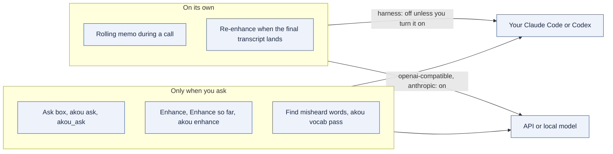

# Providers

A provider is what akou asks when it needs a model: to answer a question in the ask box, to write enhanced notes, to keep the rolling memo during a call, and to run the vocabulary pass after one. akou has no cloud and needs no key of its own. You pick one provider in Settings (`provider.kind`).

| Provider | What it runs | Where your transcript goes |
|---|---|---|
| `harness` (the default) | Your own Claude Code or Codex, installed on this computer | Wherever that program sends it: your subscription with Anthropic or OpenAI |
| `openai-compatible` | A server you name: Ollama, LM Studio, llama.cpp, vLLM, or OpenAI | The address in `provider.baseUrl`. A local model keeps it on your machine |
| `anthropic` | The Anthropic API with your own key | Anthropic, under your API account |
| `none` | Nothing | Nowhere. Questions get the matching excerpts instead of an answer |

When the provider cannot answer (the program is missing, a usage limit is reached, you are logged out, or no answer comes within `provider.timeoutSeconds`), akou says why and shows the excerpts it found. It never queues the request or retries it quietly.

## When akou calls the provider

Nothing runs on your subscription unless you asked, with two exceptions that you can turn off, and neither applies to the harness by default.

| Feature | Runs | With the harness |
|---|---|---|
| Ask | When you press Ask or an agent calls `akou_ask` | Yes, on your request |
| Enhance | When you press Enhance, or "Enhance so far" during a call | Yes, on your request |
| Vocabulary pass | When you press "Find misheard words" or run `akou vocab pass`, on a call that has ended | Yes, on your request |
| Rolling memo | After at least 3 minutes and 1,500 tokens of new speech, every time | Off unless `memo.provider` is `on` |
| Re-enhance after the final layer | Once, when the final transcript lands after notes were written from the live one | Never on its own: the window offers a button |

`memo.provider` is `auto` by default: on for `openai-compatible` and `anthropic`, off for `harness`, because it would spend your subscription every few minutes while you are not looking. Set it to `off` to stop it for every provider. An agent following the call can still write the memo with `akou_memo_put`.

Re-enhancing is also skipped, in favour of the button, when a person or an agent wrote the notes, because running it would replace their work.

## How the harness is run

akou finds `claude` and `codex` on your `PATH` or through your login shell, or runs the path you pin in `provider.harnessPath`. Each request is one run of the program, with akou's prompt on standard input:

- Claude Code: `claude -p --output-format stream-json --verbose --include-partial-messages --tools "" --strict-mcp-config --no-session-persistence --system-prompt …`
- Codex: `codex exec --json --sandbox read-only --skip-git-repo-check --ephemeral -`

Both run in a new empty folder, so no project instructions load. Claude Code gets no tools and none of your MCP servers; Codex runs in a read-only sandbox. The run keeps no session afterwards, so nothing akou asks shows up in your harness's history. The harness still loads your own user-level instructions, memory and skills, as it does for any run.

akou never logs in for you, never reads or copies the harness's credentials, and never changes its settings.

## Session reuse (off)

`provider.harnessResume` keeps one Claude Code session per call for follow-up questions: the first question starts it with `--session-id`, each follow-up continues it with `--resume` and sends only the transcript lines the session has not seen yet, plus the question. It applies only when the whole call fits in one prompt (about the first 45 to 60 minutes), and anything the session was already sent changing (a corrected line, the call ending) starts a new one. Codex always runs fresh. With it on, Claude Code keeps those sessions in its own history.

It ships off, and stays off unless a follow-up question costs at least 40 % fewer tokens with it than without. The measurement:

1. A synthetic call from a fixed seed, short enough for the whole-call prompt.
2. The same questions asked twice through Claude Code, once fresh each time and once in one session, with three new lines added between questions both times.
3. The tokens of each run, as Claude Code reports them in its `result` event: input, cache writes, cache reads and output, all counted. Cache reads count in full because a resumed session carries its whole earlier conversation. Whether that is cheaper on your subscription is the vendor's rule, and akou cannot see it ([the rule in code](../src/main/llm/reuse.ts)).
4. The first question is left out; the mean over the follow-ups decides.

[`bun scripts/measure-resume.ts --yes`](../scripts/measure-resume.ts) runs it and prints both lists and the verdict. It spends your subscription, which is why it needs `--yes`. **No measurement has been recorded yet**, so the setting stays off.

## Keys

`provider.apiKey` is for `anthropic` and `openai-compatible`. Until akou stores it in the system keychain, it lives in `config.json`, which only your user can read. It is never shown back over the API or in Settings, and never written to a log. `provider.baseUrl` and `provider.harnessPath` can only be set in the file, because they decide where your transcripts go and what program akou runs.

## Terms of service: an open risk

Driving your locally installed Claude Code or Codex from another program is the default here, and we have not confirmed that the vendors' consumer terms allow it. We treat this as a risk to check before a release, not as settled.

What we know:

- Both programs have a documented non-interactive mode for scripts (`claude -p`, `codex exec`), and that is what akou uses.
- akou runs them on your computer, under your own login, only when you ask (except what you turn on yourself), with a small prompt that akou builds.
- akou never automates a login, never touches credentials, never shares one subscription between people, and never runs the harness unattended unless you set `memo.provider` to `on`.

What we have not verified:

- Whether the consumer terms of Anthropic ([Consumer Terms](https://www.anthropic.com/legal/consumer-terms), [Usage Policy](https://www.anthropic.com/legal/aup)) and of OpenAI ([Terms of Use](https://openai.com/policies/terms-of-use/)) cover a separate application starting their command-line tool for its user, with that user's subscription.
- Whether that changes when the application is distributed to other people, as akou is.
- Whether either vendor limits how often, or how unattended, such runs may be.

Before each release we read the current terms and the tools' own documentation, and record here the date, what they say on these three points, and what we changed because of it. If the terms rule it out, the harness becomes opt-in and the default moves to `none`. The API and local providers work the same way either way, so switching needs no other change.

| Date checked | Anthropic | OpenAI | Change made |
|---|---|---|---|
| not yet checked | | | |
