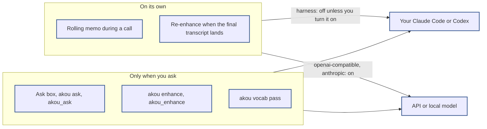

# Providers

A provider is what akou asks when it needs a model: to answer a question in the ask box, to write enhanced notes, to keep the rolling memo during a call, and to run the vocabulary pass after one. akou has no cloud and needs no key of its own. You pick one provider in Settings (`provider.kind`).

| Provider | What it runs | Where your transcript goes |
|---|---|---|
| `harness` (the default) | Your own Claude Code or Codex, installed on this computer | Wherever that program sends it: your subscription with Anthropic or OpenAI |
| `openai-compatible` | A server you name: Ollama, LM Studio, llama.cpp, vLLM, or OpenAI | The address in `provider.baseUrl`. A local model keeps it on your machine |
| `anthropic` | The Anthropic API with your own key | Anthropic, under your API account |
| `none` | Nothing | Nowhere. Questions get the matching excerpts instead of an answer, and the window's ask box becomes "Search this call" |

When the provider cannot answer (the program is missing, a usage limit is reached, you are logged out, or no answer comes within `provider.timeoutSeconds`), akou says why and shows the excerpts it found. It never queues the request or retries it quietly.

## When akou calls the provider

Nothing runs on your subscription unless you asked, with two exceptions that you can turn off, and neither applies to the harness by default.

```mermaid
flowchart LR
  subgraph asked["Only when you ask"]
    A["Ask box, akou ask, akou_ask"]
    E["akou enhance, akou_enhance"]
    V["akou vocab pass"]
  end
  subgraph own["On its own"]
    M["Rolling memo during a call"]
    R["Re-enhance when the final transcript lands"]
  end
  own -->|"harness: off unless you turn it on"| H["Your Claude Code or Codex"]
  own -->|"openai-compatible, anthropic: on"| P["API or local model"]
  asked --> H
  asked --> P
  classDef box stroke:#3b5b92,stroke-width:2px
  class A,E,V,M,R,H,P box
```

| Feature | Runs | With the harness |
|---|---|---|
| Ask | When you press Ask or an agent calls `akou_ask` | Yes, on your request |
| Enhance | When you run `akou enhance` or an agent calls `akou_enhance` (the window does not offer it) | Yes, on your request |
| Vocabulary pass | When you run `akou vocab pass` on a call that has ended (the window fixes words on their line instead) | Yes, on your request |
| Rolling memo | After at least 3 minutes and 1,500 tokens of new speech, every time | Off unless `memo.provider` is `on` |
| Re-enhance after the final layer | Once, when the final transcript lands after notes were written from the live one | Never on its own: run `akou enhance` again (the window does not offer it) |

`memo.provider` is `auto` by default: on for `openai-compatible` and `anthropic`, off for `harness`, because it would spend your subscription every few minutes while you are not looking. Set it to `off` to stop it for every provider. An agent following the call can still write the memo with `akou_memo_put`.

Re-enhancing is also skipped, in favour of the button, when a person or an agent wrote the notes, because running it would replace their work.

## How the harness is run

akou finds `claude` and `codex` on your `PATH` or through your login shell, or runs the path you pin in `provider.harnessPath`. Each request is one run of the program, with akou's prompt on standard input:

- Claude Code: `claude -p --output-format stream-json --verbose --include-partial-messages --tools "" --strict-mcp-config --no-session-persistence --system-prompt …`
- Codex: `codex exec --json --sandbox read-only --skip-git-repo-check --ephemeral -`

Both run in a new empty folder, so no project instructions load. Claude Code gets no tools and none of your MCP servers; Codex runs in a read-only sandbox. The run keeps no session afterwards, so nothing akou asks shows up in your harness's history. The harness still loads your own user-level instructions, memory and skills, as it does for any run.

akou never logs in for you, never reads or copies the harness's credentials, and never changes its settings.

## Session reuse (off)

`provider.harnessResume` keeps one Claude Code session per call for follow-up questions: the first question starts it with `--session-id`, each follow-up continues it with `--resume` and sends only the transcript lines the session has not seen yet, plus the question. It applies only when the whole call fits in one prompt (about the first 45 to 60 minutes), and anything the session was already sent changing (a corrected line, the call ending) starts a new one. Codex always runs fresh. With it on, Claude Code keeps those sessions in its own history.

It ships off, and stays off unless a follow-up question costs at least 40 % fewer tokens with it than without. The measurement:

1. A synthetic call from a fixed seed, short enough for the whole-call prompt.
2. The same questions asked twice through Claude Code, once fresh each time and once in one session, with three new lines added between questions both times.
3. The tokens of each run, as Claude Code reports them in its `result` event: input, cache writes, cache reads and output, all counted. Cache reads count in full because a resumed session carries its whole earlier conversation. Whether that is cheaper on your subscription is the vendor's rule, and akou cannot see it ([the rule in code](https://github.com/GeiserX/akou/blob/main/src/main/llm/reuse.ts)).
4. The first question is left out; the mean over the follow-ups decides.

[`bun scripts/measure-resume.ts --yes`](https://github.com/GeiserX/akou/blob/main/scripts/measure-resume.ts) runs it and prints both lists and the verdict. It spends your subscription, which is why it needs `--yes`. **No measurement has been recorded yet**, so the setting stays off.

## Keys

`provider.apiKey` is for `anthropic` and `openai-compatible`. It is never shown back over the API or in Settings, and never written to a log. Where it is kept depends on the system:

- **macOS**: in your login Keychain, as a generic password with service `akou` and account `provider.apiKey`, never in `config.json`. Saving the key (Settings, `PATCH /config`, or `printf '%s' "$KEY" | akou config set provider.apiKey -`) writes it there, and the assistant reads it from there. akou talks to the Keychain through Apple's `security` command and passes the key on its standard input, never on a command line where `ps` would show it. A key already in `config.json` from an older akou moves into the Keychain the next time akou starts and is removed from the file. If the Keychain refuses (a locked Keychain, for example), the key stays in the file, still works, and akou logs that it did; the next save of the key moves it. A key is printable ASCII with no spaces, since the Keychain gives any other text back changed. You can see or delete the item in Keychain Access under "akou".
- **Windows and Linux**: in `config.json`, which only your user can read. Credential Manager and the Secret Service (libsecret) come later.
- **Server mode** (`akou serve`): in `config.json` on every system; akou never writes it to a Keychain there. On a Mac where the akou app already moved the key into the Keychain, server mode still reads it from there while `config.json` has none, and logs that it belongs in the file.

`provider.harnessPath` can only be set in the file, because it names a program akou runs. `provider.baseUrl` can be set in the file or on the Settings page of the akou window, never over the API, because it decides where your key and transcripts go.

In Settings, the assistant is one of four choices: the Claude Code or Codex akou found on this computer, "Use an API key" (Anthropic, or an OpenAI-compatible server with its address and model), "Local model (Ollama)", which sets `provider.kind` to `openai-compatible` and `provider.baseUrl` to `http://127.0.0.1:11434/v1` and asks for the model's name, or "None". A change of choice or of service clears `provider.model`, since one service's model name means nothing to another. OpenAI-compatible starts at OpenAI's own address, `https://api.openai.com/v1`, which you can change.

## Terms of service: an open risk

Driving your locally installed Claude Code or Codex from another program is the default here, and we have not confirmed that the vendors' consumer terms allow it. We treat this as a risk to check before a release, not as settled.

What we know:

- Both programs have a documented non-interactive mode for scripts (`claude -p`, `codex exec`), and that is what akou uses.
- akou runs them on your computer, under your own login, only when you ask (except what you turn on yourself), with a small prompt that akou builds.
- akou never automates a login, never touches credentials, never shares one subscription between people, and never runs the harness unattended unless you set `memo.provider` to `on`.

What we have not verified:

- Whether the consumer terms of Anthropic ([Consumer Terms](https://www.anthropic.com/legal/consumer-terms), [Usage Policy](https://www.anthropic.com/legal/aup)) and of OpenAI ([Terms of Use](https://openai.com/policies/row-terms-of-use/)) cover a separate application starting their command-line tool for its user, with that user's subscription.
- Whether that changes when the application is distributed to other people, as akou is.
- Whether either vendor limits how often, or how unattended, such runs may be.

Before each release we read the current terms and the tools' own documentation, and record here the date, what they say on these three points, and what we changed because of it. If the terms rule it out, the harness becomes opt-in and the default moves to `none`. The API and local providers work the same way either way, so switching needs no other change.

| Date checked | Anthropic | OpenAI | Change made |
|---|---|---|---|
| 2026-10-03 | Allowed as akou runs it, on our reading; Anthropic has not confirmed it. Third-party apps may not offer Claude.ai login, handle its credentials, or "route requests through Free, Pro, or Max plan credentials on behalf of their users"; a user signing in to the unmodified Claude Code with their own subscription is allowed. Pro and Max limits assume "ordinary, individual usage" | Allowed as akou runs it, on our reading. The Terms of Use forbid extracting Output "automatically or programmatically" and sharing an account, while Codex's own documentation offers `codex exec --json` for scripts and says it reuses the saved login by default. No rule names an app that starts Codex for its user | None. The harness stays the default, and the rolling memo stays off for it. One question stays open (below) |

### The reading of 2026-10-03

**Anthropic.** Sources: [Claude Code legal and compliance](https://code.claude.com/docs/en/legal-and-compliance), the [Consumer Terms](https://www.anthropic.com/legal/consumer-terms) (effective 8 October 2025) and the [Usage Policy](https://www.anthropic.com/legal/aup) (effective 15 September 2025).

- A separate app starting Claude Code for its user. The Claude Code page says OAuth sign-in "is designed to support ordinary use of Claude Code and other native Anthropic applications", and that Anthropic "does not permit third-party developers to offer Claude.ai login into their own applications, or to route requests through Free, Pro, or Max plan credentials on behalf of their users", nor to "collect, store, or intermediate Claude.ai credentials or session tokens". It also says these rules do not "prevent an end user from signing in to the unmodified Claude Code binary with their own Claude subscription". akou offers no login and never reads the credentials. It starts the user's own `claude`, unmodified and signed in by the user, for a request the user made. We read that as the allowed case, but the "on behalf of their users" sentence is the one a stricter reading would hold against akou. The Consumer Terms forbid access "through automated or non-human means" except "where we otherwise explicitly permit it", and `claude -p` is Claude Code's own documented non-interactive mode.
- Distributing akou to other people. The same page says that "preinstalling or running Claude Code in your products or services (e.g. in hosted sandboxes or other agent infrastructure)" needs Anthropic's Commercial Terms, an unmodified binary, and each user signing in with their own credentials, with no paying for, reselling or intermediating anyone's usage. akou neither ships nor installs Claude Code; it starts the copy the user installed. If Anthropic counts that as running Claude Code in a product, akou meets the binary and sign-in conditions, but nobody behind akou has agreed to the Commercial Terms. This is the open question. Only Anthropic can settle it, through the contact the page names.
- How often, and unattended. The page says the "advertised usage limits for Pro and Max plans assume ordinary, individual usage of Claude Code and the Agent SDK". akou runs Claude Code only when the user asks; the rolling memo, which runs on its own, stays off for the harness unless the user turns it on.

**OpenAI.** Sources: the [Terms of Use](https://openai.com/policies/row-terms-of-use/) (effective 1 January 2026; the [Europe Terms of Use](https://openai.com/policies/eu-terms-of-use/), updated 16 January 2026, say the same on these points), the [Usage Policies](https://openai.com/policies/usage-policies/) (effective 29 October 2025), and Codex's pages on [non-interactive mode](https://learn.chatgpt.com/docs/non-interactive-mode) and [authentication](https://learn.chatgpt.com/docs/auth).

- A separate app starting Codex for its user. The Terms forbid "automatically or programmatically extract[ing] data or Output" and sharing "your account credentials". Codex's documentation describes `codex exec` for scripts, says "codex exec reuses saved CLI authentication by default", and describes `--json` as the way "to consume Codex output in scripts". It recommends an API key "for programmatic Codex CLI workflows, such as CI/CD jobs", as advice rather than a rule. We read the Terms' ban as aimed at scraping the service, not at the machine-readable mode Codex publishes.
- Distributing akou to other people. Nothing in the Terms or the Codex pages addresses an app that starts the user's own Codex.
- How often, and unattended. The Terms forbid circumventing "any rate limits or restrictions". akou never retries a run that hit a limit; it says why and shows the excerpts.

If either vendor says no, the harness becomes opt-in and the default moves to `none`, as written above.
