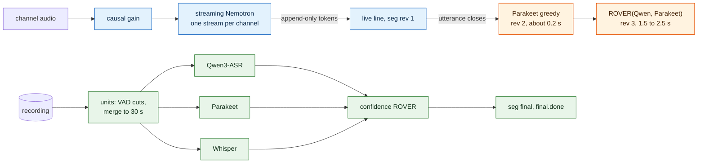

# Speech recognition: live, upgraded and final, from any number of engines

How akou turns speech into the best transcript it can, both while the call runs and after it ends. We benchmarked offline engines, streaming engines and ways to fuse them on eight public sets, audited that benchmark, and decided the design below: which engines run live, how a live line gets upgraded during the call, which engines the final pass runs and how their outputs are fused, what the settings are, what ships on each OS, and the plan to build it.

This replaces the conclusion of [asr-benchmark.md](asr-benchmark.md) that akou stays on Parakeet alone. Qwen3-ASR 1.7B now runs at full accuracy on every OS through llama.cpp, and it becomes the first engine of the final pass, with Parakeet as the second. [DESIGN.md section 3](../DESIGN.md#3-speech-recognition-speaker-labels-and-the-final-pass) still describes what ships today; step ASR-10 rewrites it to this design. Ids here are `ASR-`, so they never collide with other plans. Here a **P0** is needed before this design replaces the current recognition path.

Versions read for this: sherpa-onnx-node 1.13.8 (`package.json:27`), llama.cpp release b11166, transcribe-cpp 0.2.4 (npm), and akou `origin/main` at `9fe1c83`. Every word error rate (WER) below is number-normalized. **Measured** means the figure is in a benchmark result file. **Extrapolated** means we reasoned from a published asset or a different machine. Section 10 lists which is which.

## 0. The answer

- **The benchmark holds, with two corrections that change the defaults.** The fusion gains were measured against a Qwen that did not know the call's language, which flatters fusion by about 0.25 points pooled and 2.3 on code-switched speech. And the LLM rewriter beats confidence voting only on read speech. On the four conversational sets it is equal or worse, and it invents words.
- **Three runtimes, no Python.** sherpa-onnx (in the app) runs the live streaming engines and Parakeet. llama-server (a child process) runs Qwen3-ASR-1.7B. transcribe-cpp (npm) runs Whisper, Cohere and Canary. Three interfaces sit over them, `FinalEngine`, `LiveEngine` and `Fuser`, and `asr.final.engines` takes any number of engines.
- **Live:** streaming Nemotron, the English model or Nemotron 3.5 depending on the call's language. A word shows 0.46 s after it is spoken, nothing is ever taken back, and it costs 0.39 cores.
- **During the call:** each finished utterance is upgraded twice, by Parakeet at about 0.2 s and by a confidence vote of Qwen and Parakeet at 1.5 to 2.5 s.
- **Final pass:** Qwen + Parakeet + Whisper, fused by confidence ROVER. Pooled WER 7.97 to 7.98, against 8.63 for Qwen alone with the language set and 11.23 for akou today.
- **LLM fusion is off by default.** It is available as `pick` or `free` through the existing providers, and the pass keeps the vote when the provider is `none` or fails.
- **Change now:** Parakeet decodes greedy. Beam search empties whole meeting chunks, and hotwords at boost 3 insert false names.
- **Impossible only where Apple hardware is the substrate** (Core ML, the Neural Engine, Metal, MLX). Everything else on Windows and Linux is hard and mostly unmeasured. Nothing has run on Windows yet, and a Windows gate (ASR-12) comes before any Windows default.



## 1. How we measured

### 1.1 The sets and the engines

| Set | What it is | Size |
|---|---|---|
| fleurs_en, fleurs_es | FLEURS read speech, English and Spanish, the same clips as [asr-benchmark.md](asr-benchmark.md) | 150 clips each |
| csfleurs | CS-FLEURS read speech, Spanish with English switches | 320 utterances |
| edacc | EdAcc test: English conversation over video calls by speakers whose first language is Spanish | 7 speaker sides |
| ami | AMI test meetings ES2004b and IS1009b, whole meetings, mixed headset | 2 meetings |
| e21 | The four shortest Earnings-21 calls, with named-entity tags and Rev's bias lists | 4 calls |
| e22 | One Earnings-22 call | 59 min |
| bp | Basque Parliament 1 test, Spanish segments only: semi-spontaneous Spain Spanish | two 30 min windows |
| silence | AMI stretches of 3 s or more with no reference speech within 0.5 s | 25 clips |

"Pooled" means all eight speech sets together. Brackets are 95 % paired bootstrap ranges. "n.s." means the range crosses zero.

In fusion results, engines go by one letter: **Q** Qwen3-ASR-1.7B, **P** Parakeet TDT 0.6B v3 fp32 (greedy), **C** Cohere Transcribe, **W** Whisper large-v3, **K** Canary-1b-v2. Kroko, a streaming engine in section 3, is not K.

`q-lidc` is Qwen choosing the language itself, restricted to English and Spanish. `q-set` is Qwen given the set's language.

### 1.2 Audit: what is fair, what is not

We re-derived the headline numbers from the result files rather than from the summaries, and they match. These are the problems we found, in order of how much they change the conclusions:

1. **The fusion gains are measured against a handicapped Qwen.** In the fusion hypotheses Qwen enters as `q-lidc`, while Cohere, Whisper and Canary were given the set's language. On csfleurs that costs Qwen 2.3 points (10.34 against 8.06 forced). Pooled, Qwen with the set language is 8.63, not 8.88. So every fusion gain quoted against Qwen is about 0.25 too generous pooled, and about 2.3 too generous on csfleurs. Restated against `q-set` (arithmetic on the pooled WERs, not bootstrapped): confidence ROVER 5-way −0.65, LLM free −0.8 to −0.9, LLM pick 5-way −0.16. The ordering does not change. A user who sets the call language gets `q-set`, so we report gains against 8.63 where it matters.
2. **The LLM free-mode gain lives on read speech, not on calls.** Per set, against confidence ROVER over the same 5 engines: fleurs_en −1.23 [−1.81, −0.68], csfleurs −1.98 [−2.47, −1.50], bp −0.81 [−1.17, −0.47], fleurs_es −0.36 [−0.76, 0.00]. On conversation: e22 **+0.47 [+0.08, +0.87]** (worse), ami +0.16 n.s., e21 +0.05 n.s., edacc +0.06 n.s. It also wrote 36 to 66 words per conversational set that no engine had (e22: 44, 13 of them right). The prompt holds no reference and the harness ran with no tools, so this is not leakage through the prompt. But FLEURS sentences are FLoRes web text and the model is claude-opus-5-5, so recall cannot be ruled out on the read sets. The safe reading: on calls, an LLM rewriter does not beat confidence ROVER, and it adds invented words.
3. **ROVER parameters are tuned honestly; subset choices are not.** The ROVER weights (`alpha`, the null-word score, the default confidence) come from a leave-one-set-out grid, so per-set numbers are out of sample. "Best 3-way" and "best 5-way" were picked on the same data, and the report says so. We use only subsets that are good on most sets, never the argmax.
4. **The English normalizer drops fillers.** Whisper's `EnglishTextNormalizer` removes uh, um and hmm before scoring, for every engine and for the reference alike. So the finding that some engines drop backchannels (e22 deletions 434 to 555, against Qwen's 217) is about real words such as yeah, okay and right, not fillers. That is fair, but the Spanish sets punish dropped fillers and the English sets do not.
5. **Chunking is akou's own and identical for all engines**: Silero cuts, merged at pauses up to 30 s, gained with `prepareSpan` (`src/main/asr/pad.ts:52`). Qwen with its own 30 s chunking on the whole 59 min call scored 7.72, against 7.33 on akou's chunks, so the shared chunking does not handicap Qwen.
6. **The claim that the in-call upgrade closes the gap is against Qwen alone.** The upgrade scores compare ROVER(Q,P) over live utterances with the end-of-call Qwen (bp 3.24 against 3.87, ami 13.31 against 13.80). Against the end-of-call 5-way ROVER (bp 3.15, ami 12.93, e22 6.60, e21 4.50) the upgrade is still 0.1 to 1.3 behind. The final pass stays.
7. **The replica of akou's live path is faithful.** It feeds raw audio, gains each span with `prepareSpan`, and uses a 0.7 s pause, a 12 s window, a 1 s provisional re-decode, and beam search with hotwords at boost 3 on e21. Those are the constants in `src/main/asr/live-worker.ts:89-95`, `src/main/asr/sherpa.ts:227-229` and `src/main/vocab/decode-list.ts:30`. The streaming engines got a causal gain follower instead. The simulated clock was checked against real-time runs, within 0.04 to 0.06 s at p50.
8. **The beam-search bug is in the data.** On ami, Parakeet with beam search dropped 14 blocks of 50 words, 651 words in all. 14 of 200 units had a decoded tail more than 5 s short of the chunk while Qwen had 8 or more words there. Greedy: 0. The standalone repro script was not available for this review, so the repro is unverified; the effect is measured.
9. **Speed numbers are from one Apple M4 with 16 GB, mostly under load.** No Windows and no x64 CPU. Every real-time factor (RTF) and latency figure below is for that machine. It panicked once (a configd watchdog) during a 9 GB Qwen run with other jobs on it. The cause is not established.
10. **Kroko.** Its README says community models are CC-BY-SA and the engine Apache-2.0, but the model card's licence field reads `other` / `test`. Its training data is not documented. Its bp score (3.62 against 7.19) may come from overlap between its training data and the test set. It is not a default.
11. **Sample sizes.** Names rest on 67 occurrences in 4 calls, silence on 25 clips, and the per-utterance LLM test on 20 utterances per set. Their conclusions are directional only.
12. **The LLM is not deterministic.** Pick 5-way differs by up to 0.4 per set between two runs.

Nothing here overturns the benchmark. Items 1, 2 and 6 change the defaults.

## 2. Engine interface, registry and runtimes

### 2.1 The interfaces (`src/main/asr/engine.ts`, extended)

Today `Recognizer.decode(samples, hotwords?)` returns `{text, lang?}` (`src/main/asr/engine.ts:16-31`), which throws away everything fusion needs. We replace it with three interfaces. Every engine works on 16 kHz mono float, as now.

```ts
export interface WordHyp { w: string; conf?: number; t0?: number; t1?: number }
export interface Hypothesis { engine: string; text: string; words: WordHyp[]; lang?: string; ms: number }

export interface FinalEngine {
  readonly id: string;                       // registry id, written into seg.model
  readonly features: { confidence: boolean; timestamps: boolean; glossary: boolean; languageId: boolean };
  load(): Promise<void>; unload(): Promise<void>;
  decode(unit: { samples: Float32Array; lang: "auto" | string; glossary: readonly string[] }): Promise<Hypothesis>;
}

export interface LiveStream { push(samples: Float32Array): LiveToken[]; flush(): LiveToken[]; close(): void }
export interface LiveToken { text: string; t: number; conf: number }   // append-only: a token is never taken back
export interface LiveEngine {
  readonly id: string; readonly tierMs: number; readonly languages: readonly string[];
  open(lang: "auto" | string): LiveStream;   // one per channel, kept for the whole call
}

export interface Fuser {
  readonly id: "first" | "rover-freq" | "rover-conf" | "llm-pick" | "llm-free";
  fuse(hyps: readonly Hypothesis[], ctx: { lang: string; glossary: readonly string[]; provider?: Provider }): Promise<Hypothesis>;
}
```

N-way by construction: `asr.final.engines` is a list, the final pass runs every entry over the same units, and both the ROVER and the LLM prompt take any number of hypotheses. 5-way was measured with both.

### 2.2 The registry (`models.ts` becomes `catalog.ts`)

`MODELS` (`src/main/asr/models.ts:64-168`) keeps its discipline of a pinned URL, SHA-256 and size per file, and gains, per entry: `engine` (which interface it serves), `runtime`, `platforms` (`darwin-arm64`, `win32-x64`, `linux-x64`), `accelerators`, `languages`, and the measured pooled WER, so the Settings pane can show it. `modelsFor(diarizer)` (`src/main/asr/models.ts:181-187`) becomes `modelsFor(settings, platform)`.

### 2.3 Runtimes akou bundles or downloads: three, no Python

| Runtime | Ships how | Runs | Engines | Evidence |
|---|---|---|---|---|
| **sherpa-onnx-node 1.13.8** (already in `package.json`) | npm, in-process, in the two existing Workers | CPU, all three OSes | Live: Nemotron 3.5 streaming (all tiers), nemotron-en, Kroko. Final: Parakeet fp32, Silero VAD | Measured on macOS for all of them. The Windows and Linux packages are CPU builds (npm assets read, not run) |
| **llama-server** (llama.cpp, pinned release b11166) | One binary per OS and accelerator, downloaded like a model into `<models>/runtimes/`, run as a child process under a supervisor | Metal on macOS; CPU, CUDA or Vulkan on Windows and Linux | Qwen3-ASR-1.7B (Q8_0 GGUF + mmproj) | Measured: macOS Metal bf16 3.79 / 2.89 and Linux arm64 CPU Q8_0 3.76 / 2.81 (fleurs_en / fleurs_es), 150/150 clips each; token log-probs returned on both. Windows binaries exist, unmeasured |
| **transcribe-cpp 0.2.4** (MIT, npm, koffi FFI) | npm with per-platform packages: `darwin-arm64-metal`, `darwin-x64-cpu`, `linux-x64-cpu-vulkan`, `linux-arm64-cpu-vulkan`, `win32-x64-cpu-vulkan` (registry read) | Metal, Vulkan or CPU | Whisper large-v3, Cohere Transcribe, Canary-1b-v2, Voxtral-3B, and more | Measured from Bun on macOS (0.2.3): loaded next to sherpa in one process, correct text from both. Windows and Linux not run |

Why not one runtime:

- sherpa cannot run Qwen at full accuracy. The only 1.7B export loses 2 to 4 points ([k2-fsa/sherpa-onnx#3535](https://github.com/k2-fsa/sherpa-onnx/issues/3535), open).
- transcribe.cpp's Qwen port returns no probabilities and takes no prompt: its `decoder.cpp:318` takes the argmax on the device.
- llama.cpp runs no encoder-decoder ASR family.

CrispASR could replace the last two (hotwords, confidence and word times on Qwen), but it is not on npm, has no macOS x86_64 build, and was checked on one clip. It is the consolidation to measure later, not the base.

Each non-sherpa engine runs as a separate process (llama-server) or a separate Bun Worker (transcribe-cpp), so a decoder crash costs one engine, never the recording or the live transcript. Metal engines run one at a time: two Metal engines together produced a Metal out-of-memory error and a llama-server that answered 500 until it was restarted (an earlier research run).

## 3. Live

### 3.1 What replaces the 12 s windows

Today the live path segments with Silero, decodes each segment with offline Parakeet and `modified_beam_search`, and re-decodes the open segment every second ([DESIGN 3.1](../DESIGN.md#31-the-live-path-per-channel)) (`src/main/asr/live-worker.ts:89-95` and `417-428`, `src/main/asr/sherpa.ts:227-229`). Measured on ami it is the worst live option: 36.17 WER against 18.80 for streaming Nemotron. The beam-search bug dropped 33 of 257 reference blocks. It takes back 20.8 words per 100 final words, and uses 0.95 CPU cores per channel and 3.6 GB.

The new live path, per channel:

1. **A causal gain follower** in front of the engine: −3 dBFS target, instant attack, 5 s release, +20 dB cap. This is `prepareSpan`'s rule made continuous. Without gain, the quiet FLEURS English clips cost every streaming engine 2 to 5 points.
2. **One `sherpa.OnlineRecognizer` stream per channel for the whole call**, 100 ms pushes, greedy. A fresh stream per utterance was worse on e22 (+2.23 [+1.10, +3.53]) and ami (+6.08), so we keep one stream.
3. **[hark](https://github.com/PhantomYdn/hark)'s line rule.** a line closes at a 0.7 s gap between tokens or at 12 s. Tokens are appended in place and never retracted (0 retractions measured for every streaming engine).
4. **The call's language setting picks the model.**

| Language setting | Live engine (sherpa, int8) | Why |
|---|---|---|
| `en` | `nemotron-speech-streaming-en-0.6b`, 560 ms | Beats the multilingual model on every English conversation set: edacc −7.67 [−8.69, −6.67], e22 −3.30, ami −3.07, e21 −1.92 |
| `es` | `nemotron-3.5-asr-streaming-0.6b`, 1120 ms | bp 5.91 against 7.19 at 560 ms (1120 against 560 on bp: −1.29 [−2.32, −0.31]) |
| `auto` or any other | Nemotron 3.5, 560 ms (or 1120 ms) | The only measured engine that switches language mid-stream (csfleurs 10.04) |

Latency and cost, first 600 s of e22, alone on the M4:

| Path | Word shown after it is said (p50 / p95) | Line closed (p50 / p95) | RTF | Cores | Memory |
|---|---|---|---|---|---|
| Nemotron 560, one channel | 0.46 / 0.88 s | 2.72 / 8.46 s | 0.067 | 0.39 | 2.25 GB |
| Nemotron 560, two channels through `decodeStreams` | 0.48 / 0.90 s | | | 0.56 | |
| akou today | 0.78 / 3.20 s | 5.34 / 11.34 s | | 0.95 | |

So the new path shows words sooner, closes lines sooner, costs less, and never retracts.

Options behind the same setting, all measured:

- Kroko es: Spanish only; its licence and training data must be cleared first.
- sherpa fp32 at 560 ms: no accuracy gain once gain is corrected, and more CPU.

Later, macOS-only options that move the load off the CPU. Neither is needed for v1:

- NeMo-Speech.cpp on Metal: pooled 13.16, 0.005 cores, 1.3 GB, and the only runtime with working streaming biasing. It runs as a child process over its C ABI or its WebSocket server.
- FluidAudio Core ML at 2240 ms: pooled 12.88, the best of all, on the Neural Engine. It needs a Swift sidecar.

**Streaming hotwords** are in no released sherpa-onnx: GitHub and npm latest are both 1.13.8, and the change ([PR #3895](https://github.com/k2-fsa/sherpa-onnx/pull/3895)) merged on 2026-09-14. When 1.13.9 ships, beam search with the decode list at score 1.5 is the only setting that added names without over-firing (e21: 35 hits and 1 false insertion, against 29 and 0 greedy). Score 3 gives 37 hits, 4 false insertions and +1.7 WER.

### 3.2 Upgrading live text during the call

Each utterance the live segmenter closes (0.7 s of silence, at most 30 s) is re-decoded at once by Parakeet fp32 greedy and by Qwen3-ASR-1.7B, fused by confidence ROVER over those two, and written as a new revision of the live line's `seg`. The log already allows a revision that carries only `text` and `model` (`src/core/log/events.ts:110-131`). Live words are not a voter: adding them cost +1.16 [+0.35, +1.89] on e22.

| Set | Live Nemotron 560 | Upgraded line, ROVER(Q,P) | End-of-call Q | End-of-call 5-way ROVER |
|---|---|---|---|---|
| bp | 7.19 | **3.24** (−0.63 [−1.09, −0.18] against Q) | 3.87 | 3.15 |
| ami | 18.80 | **13.31** (−0.49 [−0.92, −0.04]) | 13.80 | 12.93 |
| e22 | 11.71 | 7.89 (+0.55 [−0.10, +1.43]) | 7.33 | 6.60 |
| e21 | 8.41 | 5.42 (+0.68 [+0.19, +1.30]) | 4.74 | 4.50 |

When the upgraded line lands, alone on the M4, first 80 utterances: Parakeet 0.18 s (p50) / 0.58 s (p95) after the utterance closes; Qwen 1.43 / 4.33 s with one channel and 2.56 / 7.82 s with two. So the line is rewritten twice: by Parakeet at about 0.2 s, which is cheap and removes the streaming model's errors, then by ROVER(Q,P) at about 1.5 to 2.5 s. The utterance closes 0.5 s after speech ends.

Memory while a call runs: live 2.25 GB, Parakeet 2.7 GB, and Qwen (MLX peaked at 7.8 GB in the benchmark; llama-server Q8_0 sat at 4.9 to 5.2 GB on Linux), about 10 to 13 GB in all. That needs a memory guard (`asr.memoryBudgetMb`, section 6), and it is why the upgrade is a setting.

An LLM per utterance was measured on 20 utterances per set: −1 to −6 errors against ROVER(Q,P) with Opus, +4 / −2 with Sonnet, 3 to 13 s of extra wall time, $0.009 per utterance. The sample is too small to show a gain, and the LLM is too slow for the live view. It is not in the design.

## 4. Final pass: default engines and what N engines buy

Units stay as today: the whole timeline, Silero cut points, merged at pauses up to 30 s (`maxSpanSeconds`, `src/main/asr/finalize-worker.ts:66-68`), each gained and padded by `prepareSpan`. Every engine in `asr.final.engines` decodes every unit, then the fuser runs.

Single engines, pooled over the 8 sets:

| Engine | Pooled WER | edacc | ami | e21 | e22 | bp | Notes |
|---|---|---|---|---|---|---|---|
| Qwen3-ASR-1.7B, language set (`q-set`) | **8.63** | 14.15 | 13.82 | 4.74 | 7.33 | 3.87 | Best single engine. Its language must be restricted to the workspace's languages: on `auto` it picked Chinese, Cantonese, Portuguese or Malay on 124 of 942 edacc utterances. It must never be forced on a "no speech" answer: forced, it wrote 31 words on the 25 silent clips; with `lidc`, 0 |
| Parakeet TDT v3 fp32, greedy | 9.50 | 15.45 | 14.04 | 5.89 | 7.98 | 3.97 | 0 dropped spans; 1.3 min per audio hour |
| Parakeet, beam + hotwords at 3 (**akou today**) | 11.23 | 17.23 | 21.28 | 6.16 | 8.95 | 3.62 | 14 dropped blocks on ami, 25 false name insertions on e21 |
| Whisper large-v3 Q8_0 | 11.19 | 19.87 | 17.62 | 6.10 | 11.01 | 4.47 | Best single engine on fleurs_es (2.73); 80 words on 24 of the 25 silent clips |
| Canary-1b-v2 Q8_0 | 11.52 | 19.68 | 17.16 | 6.60 | 11.16 | 3.83 | Cheapest (1.5 min per audio hour) |
| Cohere Transcribe Q8_0 | 11.71 | 19.22 | 19.14 | 5.99 | 9.68 | 5.95 | Lowest error correlation with Qwen |

Confidence ROVER by engine count, pooled. Parameters are tuned leave-one-set-out. Δ is the paired bootstrap against `q-lidc` at 8.88, so subtract about 0.25 for the fair baseline (section 1.2, item 1):

| Engines | Pooled WER | Δ [95 %] | edacc / ami / e21 / e22 / bp |
|---|---|---|---|
| 1: Q | 8.63 (`q-set`) | | 14.15 / 13.82 / 4.74 / 7.33 / 3.87 |
| 2: Q+P | 8.26 | −0.63 [−0.79, −0.48] | 13.75 / 13.11 / 4.51 / 6.97 / 3.28 |
| 3: Q+P+C | 8.02 | −0.86 [−1.06, −0.67] | 13.55 / 13.02 / 4.54 / 6.68 / 3.04 |
| 3: Q+P+W | 7.97 (fusion report table, not bootstrapped) | | 13.53 / 13.34 / 4.42 / 6.64 / 3.04 |
| 4: Q+P+C+W | 8.05 | −0.83 [−1.04, −0.64] | 13.69 / 13.38 / 4.62 / 6.70 / 3.11 |
| 5: Q+P+C+W+K | 7.98 | −0.90 [−1.12, −0.71] | 13.68 / 13.18 / 4.49 / 6.51 / 3.15 |
| 4 without Q: P+C+W+K | 8.64 | −0.24 [−0.51, +0.02] | Subsets without Q or without P are the weak ones |
| Oracle, 5-way (best path through the aligned network) | 5.24 | ceiling | Fusion has 2.7 points of headroom left |

The gain flattens after three engines. Frequency (majority) ROVER gets worse with five (9.09, +0.21), because three of the engines drop the same words. Confidence ROVER does not degrade. Hence:

- **The default is Q + P + W with confidence ROVER.** Cost on the M4, alone: Qwen 8.0 min per audio hour, Parakeet 1.3, Whisper 4.8, ROVER negligible. Qwen decodes once, and a second, forced decode runs only when its language answer is outside the workspace's languages (13 % of edacc units, 0 % elsewhere). That is about 14 min per hour, 25 % of real time, well above the [DESIGN 3.3](../DESIGN.md#33-the-accurate-final-pass) target of 10 % on Apple Silicon. We put accuracy before cost, so the target moves; ASR-10 rewrites it.
- **Fewer or more engines.** A user who picks one engine gets Qwen, or Parakeet if Qwen cannot load. Two engines means Q+P (−0.4 pooled, measured). A third, Whisper or Cohere, takes off another 0.3. Four and five measured 8.05 and 7.98, so they add no pooled gain, but they hold up better per set (e22 6.51 with five against 6.64 with three) and the oracle keeps falling. Canary or Cohere adds 1.5 to 2.2 min per audio hour each.
- **Parakeet decodes greedy from now on, with no hotwords,** until the sherpa empty-output bug is fixed upstream. Hotwords at boost 3 are a regression: +1.96 [+0.93, +3.12] on e21, 25 false names, 8 of them distractors that were never said. If beam search comes back, the boost is 1.5 (44 hits, 0 false insertions).
- **The glossary's real carrier is Qwen.** The decode list passed as context lifted name hits from 47 to 64 of 67, with 0 false insertions and −0.36 [−0.54, −0.18] WER. Whisper takes the list as an initial prompt (transcribe.cpp reports `supports('initial_prompt')` true); the effect is unmeasured.
- **Word times come from Parakeet's TDT token times.** Against Rev's forced alignment on e22, the median start error is 0.078 s and 89 % of words fall within 0.2 s. Qwen3-ForcedAligner is the later upgrade: 0.03 s median, 94 % within 0.2 s, RTF 0.014. That was measured on MLX only; the cross-OS route through CrispASR's GGUF or the ONNX export is extrapolated. Fusion does not need times from every engine: align the texts, then time the fused words from the anchor.

## 5. Fusion: what we ship, and what the LLM is for

| Fuser | Pooled WER (against `q-lidc` 8.88) | Invented words | Needs | Decision |
|---|---|---|---|---|
| `first` (engine 1 only) | 8.63 to 8.88 | 0 | Nothing | Fallback with one engine |
| `rover-freq` | 9.09 (+0.21) at 5 engines; 8.19 at 3 | 0 | Nothing | Never the default: degrades past 3 engines |
| **`rover-conf`** (alpha 0.4, null 0.5, default confidence 0.7 for engines that report none) | **7.98 (−0.90 [−1.12, −0.71])** | 0 (7 words on 3 of the 25 silent clips) | Nothing; about 1 min of CPU for all 8 sets | **Default for any N** |
| `llm-pick` (choose one engine's phrase per disagreement slot) | 8.34 (QP) to 8.47 (5-way). With 5 engines, worse than Q alone on edacc (+0.90 [+0.32, +1.48]) and ami (+0.79) | 0 by construction | A provider; $0.58 and 132 s serial per audio hour on Opus | Opt-in; only with 2 or 3 strong engines |
| `llm-free` (rewrite from N hypotheses with word confidences) | 7.71 to 7.85 (−1.04 to −1.17). Against `rover-conf`: better only on read or scripted sets, worse on e22 (+0.47 [+0.08, +0.87]), n.s. on edacc, ami and e21 | 8 to 66 per set; changed 0 to 29 agreed words | A provider; $1.18 and 252 s per audio hour | Opt-in, labelled "may invent words" |

Does the LLM adjudicator beat confidence voting by enough to justify it? **Not on calls.** Pooled it looks 0.15 to 0.3 better than confidence ROVER, but all of that comes from FLEURS, CS-FLEURS and the parliament set. On the four conversational sets it is equal or worse, and it invents words. With a local model (gemma-4-12B through llama-server, an earlier research run) the 5-way gain was −0.12 in English and −0.23 in Spanish, with 0 invented words, at 0.7x real time. So:

- `asr.fusion` is `rover-conf` by default, N-way, with no provider needed.
- `asr.fusion.llm` is `none`, `pick` or `free`, default `none`. When set, it runs through akou's existing `Provider` (`src/main/llm/provider.ts:19`: `harness` by default, `openai-compatible` for a local llama-server or Ollama, `anthropic`, `none`). With provider `none`, or when the provider is unavailable, times out (the 60 s rule of [DESIGN 5.3](../DESIGN.md#53-the-provider-the-users-own-harness-by-default)) or returns bad JSON, the pass keeps the ROVER output and writes `final.done` with `fusion: rover-conf (llm unavailable: <reason>)`. It is never silently retried.
- The variant to measure before any LLM default: free rewriting **only inside disagreement regions**, with the glossary. The prompt already splits agreed text from regions. It would keep agreed words fixed (pick's safety) and allow new spellings inside a region (free's gain). Unmeasured.

The glossary in fusion, measured on e21: LLM pick over the glossary-aware engines with the list in the prompt got 64 hits and 0 false insertions (4.40). The rule "a decode-list term any engine wrote wins" got 66 hits but **13** false insertions (4.76). We do not use that rule.

## 6. Settings and defaults

All keys go through the one registry (`src/main/config/schema.ts`), so `akou config set`, `PATCH /v1/config`, the window's Settings pane and `GET /config` get them for free.

A new `workspaces.<name>` object may override any `asr.*` and `provider.*` key. DESIGN 5.3 already promises a provider per workspace; the schema has no mechanism for it yet.

Per call: `akou start --language es --engines qwen3-asr-1.7b,parakeet-tdt-0.6b-v3-fp32 --fusion rover-conf`, and the same fields on `POST /calls` and `akou_start`. They are recorded in `call.created`, so `akou status`, the models pill and `final.done` say what ran.

| Key | Values | Default | Measured basis |
|---|---|---|---|
| `asr.language` | `auto`, an ISO code, or a list (the languages Qwen may choose from) | `auto`. A user who speaks English and Spanish sets `["en","es"]` | `lidc` −0.26 on edacc; forced `es` on code-switched clips 8.06 against 10.34 |
| `asr.live.engine` | `auto`, `nemotron-en-560`, `nemotron-3.5-560`, `nemotron-3.5-1120`, `kroko-es`, `off` | `auto` (by language, section 3.1) | Live table |
| `asr.live.upgrade` | `off`, `parakeet`, `parakeet+qwen` | `parakeet+qwen` on 16 GB or more, `parakeet` below | Upgrade table; memory |
| `asr.final.engines` | Ordered list of registry ids; the first is the tie-breaker and the `first` fallback | `["qwen3-asr-1.7b","parakeet-tdt-0.6b-v3-fp32","whisper-large-v3"]` | Section 4 |
| `asr.fusion` | `first`, `rover-freq`, `rover-conf` | `rover-conf` | Section 5 |
| `asr.fusion.llm` | `none`, `pick`, `free` | `none` | Section 5 |
| `asr.fusion.provider` | `workspace` (the workspace's `provider.kind`) or an explicit provider | `workspace` | Providers measured: harness (Opus), openai-compatible (gemma-4-12B) |
| `asr.parakeet.decoding` | `greedy`, `beam` | `greedy` | The beam bug. The hotword boost becomes the constant 1.5 when beam is on |
| `asr.accelerator` | `auto`, `cpu`, `metal`, `vulkan`, `cuda` | `auto` | Picks the llama-server and transcribe-cpp build to download |
| `asr.memoryBudgetMb` | Integer | 60 % of physical RAM | The test machine's panic. The pass drops engines from the end of the list until the loaded set fits, and says so in `final.done` |
| `asr.threads` (exists, `src/main/config/schema.ts:205-211`) | 1 to 32 | 2 today; **4** measured for the live engine (RTF 0.067 at 4, 0.091 at 2) | Latency table |

Out of the box:

- **A 16 GB Apple Silicon Mac:** live nemotron-en or Nemotron 3.5 by language, upgrade `parakeet+qwen`, final Q+P+W with confidence ROVER, no LLM, greedy Parakeet.
- **Windows x64 and Linux x64 with a Vulkan or CUDA GPU:** the same set. Extrapolated from the release assets; on Linux only Qwen on the CPU is measured.
- **CPU-only x64:** live as above (sherpa runs on the CPU; RTF extrapolated), final Q+P (Qwen on the CPU measured at RTF 0.08 to 0.10 on a 6-vCPU arm64 VM; x64 unmeasured), Whisper off unless the user adds it.

The models pill shows the live engine, the upgrade state, the final engines and the fuser. `final.done` gains `engines[]`, `fusion` and `dropped[]` (engine, reason). `GET /models` lists every registry entry with its `state` per platform. MCP `akou_status` carries the same block. `akou models pull` takes `--engine`.

## 7. Shipping and download sizes per OS

Nothing is bundled in the app except the two npm runtimes. Everything else is pulled by the existing pinned-SHA downloader (`src/main/asr/models.ts:316-396`).

| Item | Size | macOS arm64 | Windows x64 | Linux x64 | Source of the size |
|---|---|---|---|---|---|
| Parakeet TDT v3 fp32 (sherpa) | 2.55 GB | Yes | Yes | Yes | `models.ts` sizes |
| nemotron-speech-streaming-en 560 int8 | 464 MB | Yes | Yes | Yes | sherpa-onnx asr-models asset |
| Nemotron 3.5 streaming int8, per tier | About 475 MB (682 MB unpacked) | Yes | Yes | Yes | Published tarballs |
| Kroko es zipformer (opt-in) | 124 MB | Yes | Yes | Yes | sherpa-onnx asset |
| Silero VAD, Nemotron 3 Diarization, TitaNet (exist) | 0.64 + 0.40 + 0.04 GB | Yes | Yes | Yes | `models.ts` |
| Qwen3-ASR-1.7B Q8_0 + mmproj (llama.cpp) | About 2.5 GB | Metal | CPU, CUDA, Vulkan (untested) | CPU measured; CUDA, Vulkan untested | Earlier research run |
| llama-server binary (b11166) | Not measured; CUDA builds are the largest | macos-arm64 | win-cpu, win-cuda, win-vulkan | ubuntu-x64, cuda, vulkan | Release assets |
| Whisper large-v3 Q8_0 (transcribe.cpp) | 1.67 GB | Metal | Vulkan, CPU (untested) | Vulkan, CPU (untested) | Catalog |
| Cohere Transcribe Q8_0 (optional) | 2.41 GB | Same | Same | Same | Catalog |
| Canary-1b-v2 Q8_0 (optional) | 1.14 GB | Same | Same | Same | Catalog |
| Qwen3-ForcedAligner-0.6B (later) | 0.99 GB GGUF | CrispASR or ONNX | Same | Same | Earlier research run |
| gemma-4-12B-it Q4_0 (optional local fusion LLM) | 7.2 GB | Metal | Untested | Untested | Earlier research run |

The default download on macOS is about 8.7 GB: Parakeet 2.55, live models 0.94, Qwen 2.5, Whisper 1.67, VAD and diarization 1.04. Disk is not the constraint; resident memory is (section 3.2).

## 8. Impossible versus hard

**Impossible (a fundamental limit):**

- FluidAudio, Core ML or the Neural Engine on Windows or Linux. Core ML and the Neural Engine exist only on Apple platforms. The same Nemotron 3.5 model runs there through sherpa-onnx (measured) or NeMo-Speech.cpp.
- Metal on Windows or Linux. Metal is Apple's API. Vulkan and CUDA are the substitutes, and both runtimes ship them.
- MLX off Apple silicon. Not needed: llama.cpp reproduces MLX's Qwen accuracy (Δ English +0.15 [−0.27, +0.61], Spanish +0.03 [−0.21, +0.24]).

**Hard (engineering), with what it takes:**

- **GPU for sherpa-onnx on Windows and Linux.** The npm builds are CPU-only, so akou would build its own onnxruntime with CUDA or DirectML. Not needed for v1: live RTF is 0.067 on the CPU.
- **Streaming hotwords.** Needs sherpa-onnx after 1.13.8: build from master, or wait for the release.
- **Qwen as a true streaming engine on every OS.** Port the re-decode-with-rollback loop onto llama.cpp. The in-call upgrade gives Qwen-quality text 1.5 s after each utterance without it.
- **Voxtral Mini 4B Realtime live**, the best measured streaming accuracy (7.19 / 3.60 on FLEURS). It runs at RTF 1.0 on the M4, so it needs a faster GPU and one channel, and it has no timestamps and no biasing.
- **Anything on Windows.** No Windows run exists; every Windows claim comes from release assets. A Windows measurement (ASR-12) is the gate before any Windows default.
- **Qwen3-ForcedAligner on every OS.** Through CrispASR's GGUF (one clip checked) or an ONNX Runtime session (not run).
- **Voxtral-Small-24B**, the best English in the transcribe.cpp catalogue (3.55 / 2.86). It is 14.3 GB at Q4_K_M and needs a 32 GB machine.

## 9. Plan

Ordered by risk removed per PR. Model-gated tests skip loudly on PRs and belong in `models-nightly` ([TESTING.md](../TESTING.md) TS-19, [CI-CD.md](../CI-CD.md)), which does not exist yet; ASR-11 builds its speech half. This is the engine design that [TESTING.md section 4.5](../TESTING.md#45-speech-many-engines-fusion-streaming-language-diarization) waits for: TS-16 to TS-18 take their details from it.

| Id | Feature | P | Depends on | Acceptance |
|---|---|---|---|---|
| ASR-1 | **fix(asr): Parakeet decodes greedy; hotwords only with beam, at 1.5.** `src/main/asr/sherpa.ts:227-229`, the boost constant in `src/main/vocab/decode-list.ts:30`, and the DESIGN 3 text. Also files the sherpa-onnx issue with the chunk | P0 | | Settings validation. A model-gated regression decodes a public ami chunk that returns empty under beam and asserts non-empty text under greedy. Positive control: the same chunk under beam must still return empty, or the test cannot fail. The vocabulary evaluation planned in TS-19 takes its insertion ceiling at the new boost |
| ASR-2 | **feat(asr): engine registry and interfaces.** `engine.ts` gains `FinalEngine`, `LiveEngine`, `Fuser` and `Hypothesis`. `models.ts` becomes `catalog.ts` with platform and runtime fields. `SherpaRecognizer` becomes the first `FinalEngine`, returning tokens, `ys_log_probs` and timestamps as `words[]`. No behaviour change | P0 | | Registry invariants: every entry has platforms, a licence and a job. `modelsFor(settings, platform)`. Word confidence derived from sherpa's per-token log-probs, checked against a fixture from the benchmark's greedy Parakeet output |
| ASR-3 | **feat(asr): confidence ROVER fuser.** Port the benchmark's ROVER (`build`, `vote`, `regions`) to TypeScript with the tuned constants | P0 | ASR-2 | A fixture of 5 hypotheses from the e22 fusion inputs, with the expected fused words from the benchmark. N=1 is the identity. Agreed columns never change. Positive control: a mutated `alpha` must change the output |
| ASR-4 | **feat(live): streaming Nemotron in the live Worker.** Causal gain, one `OnlineRecognizer` per channel, `decodeStreams` for both, a line cutter, `seg` written at line close, the language-to-model map, and `asr.live.engine`. The old path is deleted, not kept | P0 | ASR-2 | A CI fake `LiveEngine` for the segmentation and no-retraction invariants. Model-gated: 20 FLEURS clips within +0.5 of the benchmark's 8.15 / 4.75; shown-latency p50 under 1 s at 1x, with a deliberately delayed feed as the failing control |
| ASR-5 | **feat(asr): llama-server runtime and the Qwen engine.** A downloader for the pinned binary per OS and accelerator. A supervisor: start with `--cache-ram 0`, health check, restart on a dropped connection, one Metal engine at a time. Requests with `logprobs`. Strip the `language X<asr_text>` prefix. `lidc`: accept the answer if its language is in `asr.language`, else the higher-scoring forced decode; keep "None" answers. The glossary goes in the system prompt | P1 | ASR-2 | A CI fake HTTP server for the protocol, restart and prefix stripping. Nightly on macOS and Linux runners: 30 FLEURS clips within +0.5 of 3.79 / 2.89, 0 words on the 25 silent clips, RSS flat over 150 requests (the out-of-memory trap, with the default `--cache-ram` as the failing control) |
| ASR-6 | **feat(final): N-engine final pass.** `finalize-worker.ts` runs the engine list over the units, fuses, writes `seg final` with `model: rover-conf(<ids>)` and `final.done` with the engines and the dropped ones. Memory budget; a failing engine is isolated | P0 | ASR-2, ASR-3 | Fakes with 1 to 5 engines, one that crashes mid-pass, one over budget; the `final.done` fields |
| ASR-7 | **feat(live): in-call upgrade.** An utterance closes, then Parakeet writes rev+1 and ROVER(Q,P) writes rev+2 on the same `seg` id; never after `call.ended`; `asr.live.upgrade` | P1 | ASR-3, ASR-4, ASR-5 | Revision order under a slow fake Qwen. A result arriving after `call.ended` is dropped. The pack marks lines by the model of their highest revision |
| ASR-8 | **feat(asr): transcribe-cpp engines (Whisper, Cohere, Canary).** One Bun Worker per engine, forced language, initial prompt for Whisper | P1 | ASR-2 | Loads next to sherpa in one process (measured on macOS). A Windows and a Linux CI leg that load the binding and decode the two-voices fixture (`tests/fixtures/two-voices.wav`). Nightly WER within +0.5 of the benchmark per engine |
| ASR-9 | **feat(fusion): LLM fusers through `Provider`.** `pick` and `free`, batches of units with confidences, a constrained parser, invented-word and agreed-change counters written to `final.done`, fallback to ROVER on any failure | P1 | ASR-6 | The parser on the benchmark's raw LLM outputs (pick, 5-way, ami and the other sets). The fallback path. Provider `none` |
| ASR-10 | **feat(settings): surface and docs.** Schema keys, workspace overrides, call flags on the CLI, API and MCP, the models pill, `GET /models` per platform, the generated settings doc, DESIGN 3 rewritten to this design, and [providers.md](../providers.md) on the fusion LLM | P1 | ASR-6, ASR-7 | Schema round-trip. A diff between the settings registry and the generated settings doc, run in `check` (not there today; this step adds it). Positive control: a key missing from the doc fails it |
| ASR-11 | **chore(bench): the benchmark harness into the repo.** `scripts/asr-bench/` with the public-set manifests, so `models-nightly` re-scores a 30-clip slice per set and posts WER, RTF and invented-word counts as the job summary | P1 | | A WER floor per set that a mutated normalizer must breach |
| ASR-12 | **Windows gate before Windows defaults.** Run ASR-5 and ASR-8 on a Windows x64 machine: Qwen through win-cpu and win-vulkan, the transcribe-cpp win32 package, sherpa streaming RTF on a 4-core x64 | P1 | | The measured numbers recorded in [`docs/gates/`](../gates/). Until then the Windows defaults in section 6 are marked extrapolated in the settings doc |

ASR-1 and ASR-2 can start at once. ASR-12 gates the Windows defaults.

### Follow-ups to measure

Each is cheap once the harness is in the repo (ASR-11):

- Region-restricted LLM free mode (section 5).
- Kroko's licence and training data.
- The aligner through CrispASR or ONNX on all three OSes.
- nemotron-en and Kroko on the sets they did not run.
- The glossary paths on clips from our own recordings, kept local.

## 10. Measured versus extrapolated

**Measured:** every WER, bootstrap range, latency, RTF and memory figure above, all on an Apple M4 with 16 GB; Qwen on Linux on an arm64 VM; LLM fusion with claude-opus-5-5 through `claude -p`, and with gemma-4-12B through llama-server.

**Extrapolated:** anything on Windows; x64 CPU speed; transcribe-cpp on Linux and Windows; Whisper's initial-prompt effect; the region-restricted LLM variant; the aligner off MLX; the download sizes of the runtime binaries; the memory budget rule; and the cost of the `lidc` second decode in production (13 %, from edacc's language-ID counts, not timed).

## Summary

- The benchmark holds, with two corrections that change the defaults: fusion gains were measured against a Qwen that did not know the call language (about 0.25 pooled, 2.3 on code-switching), and the LLM rewriter's advantage over confidence ROVER exists only on read speech.
- Three runtimes: sherpa-onnx in the app for live streaming and Parakeet, llama-server as a child process for Qwen3-ASR-1.7B, transcribe-cpp from npm for Whisper, Cohere and Canary. One registry with `FinalEngine`, `LiveEngine` and `Fuser`; any number of engines in `asr.final.engines`.
- Defaults: live nemotron-en or Nemotron 3.5 by language; each utterance upgraded by Parakeet at about 0.2 s and ROVER(Qwen, Parakeet) at 1.5 to 2.5 s; final pass Qwen + Parakeet + Whisper with confidence ROVER (pooled 7.97 to 7.98, against 8.63 for Qwen with the language set and 11.23 for akou today); LLM fusion off.
- Change now: Parakeet to greedy (ASR-1).
- Impossible only where Apple hardware is the substrate. Windows is unmeasured, and ASR-12 gates its defaults.
