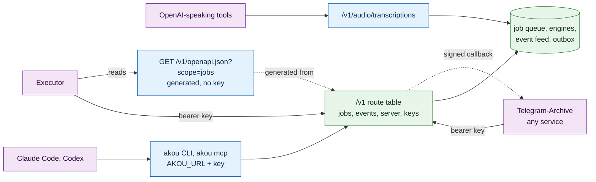
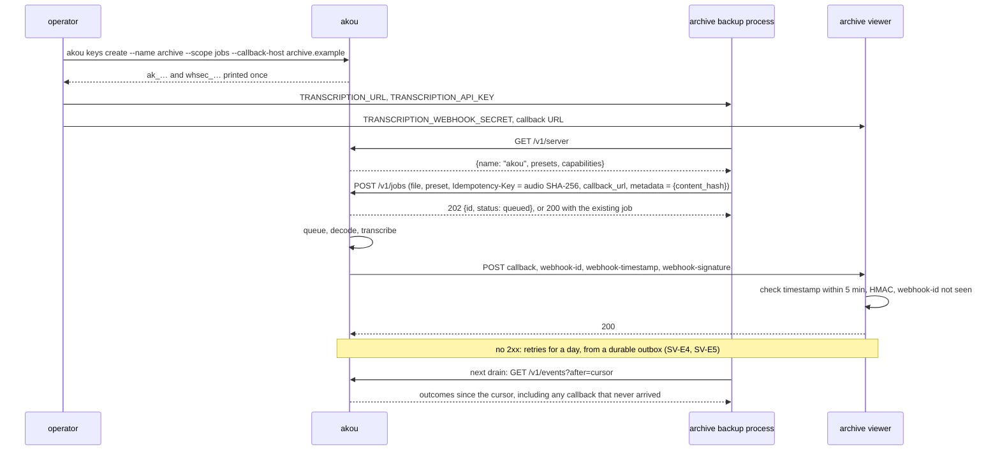

# The interface of a hosted akou

What a hosted akou exposes, and why. Four kinds of client should use one server with no glue code of their own:

- [Executor](https://github.com/UsefulSoftwareCo/executor), an MCP gateway that turns integrations into tools for agents. It adds akou from one URL and gets well-named tools.
- [Telegram-Archive](https://github.com/GeiserX/Telegram-Archive), and any other service, submits audio and gets the result back by a signed callback, across hosts.
- Agents (Claude Code, Codex) transcribe files and read results.
- Existing tools that already speak a common speech-to-text API use akou with no change.

The server itself (the image, the keys, the job routes, the webhooks, the presets, the web UI) is designed in [SERVER.md](../ux/SERVER.md), which lands with the server-mode design. The local API is in [DESIGN.md](../DESIGN.md) sections 6 and 8, and its programmable side in [PROGRAMMABILITY.md](../ux/PROGRAMMABILITY.md). This document repeats none of them. It decides which doors the server has, how each one derives from one contract, how each client reaches it, where OAuth and remote MCP belong, and what is left to build. Ids, priorities and the shape of a line follow [PROGRAMMABILITY.md section 2](../ux/PROGRAMMABILITY.md#2-priorities-ids-and-the-shape-of-a-line); the ids here are `SI-`, so they never collide with SERVER.md's `SV-`. Here a **P0** is needed before the first hosted deployment serves Executor, Telegram-Archive and an agent.

Versions read for this: Executor 1.6.8, source at commit [`a0b0d91`](https://github.com/UsefulSoftwareCo/executor/tree/a0b0d915); the MCP specification revision [2026-07-28](https://modelcontextprotocol.io/specification/2026-07-28/changelog); OpenAPI 3.1 and 3.2.1; the [Standard Webhooks spec](https://github.com/standard-webhooks/standard-webhooks/blob/main/spec/standard-webhooks.md); akou `origin/main` at `1935628`; SERVER.md at `a8e8d49`; Telegram-Archive's [transcription design](https://github.com/GeiserX/Telegram-Archive/blob/docs/transcription-design/docs/TRANSCRIPTION.md) at `3c9acd2`.

## 0. The answer

- **One contract.** The `/v1` route table in code, with its request and response schemas, is the only definition of the API. The OpenAPI 3.1 file is generated from it (PG-A2, SV-C4) and served at `GET /v1/openapi.json` with no key. Every door below is either that API or a thin client of it.
- **Executor gets the OpenAPI file, not MCP.** Executor turns an OpenAPI URL into tools named `jobs.create`, `jobs.get` and so on, derives the auth from the file, and asks for approval on every write by itself. The integration can be refreshed from the same URL when akou gains routes. One bearer key with the `jobs` scope is the whole credential.
- **Services get jobs and callbacks.** `POST /v1/jobs` answers at once with an id. The result arrives by a Standard Webhooks callback, a long-poll, or the per-key event feed. This is SERVER.md sections 5 and 6, unchanged.
- **Agents with a shell get the CLI and `akou mcp`, pointed at the server.** `AKOU_URL` and `AKOU_API_KEY` make both talk to a remote akou. They run where the files are, so they can upload a local file, which a sandboxed tool cannot.
- **Existing tools get the OpenAI endpoint.** `POST /v1/audio/transcriptions` (SV-C1) is the one dialect most speech-to-text clients already speak.
- **No OAuth and no remote MCP on day one.** No client we serve needs either. Both wait for one named need: a hosted chat connector (claude.ai, ChatGPT), which also requires akou to be reachable from the public internet.



## 1. What we do not build

| Not built | Why | What covers the need |
|---|---|---|
| An OAuth authorization server inside akou | Executor, Claude Code, Codex, Telegram-Archive and curl all send a static bearer header. Issuing tokens means consent screens, refresh, revocation and client registration, all to protect a server with a few known programs as clients | Scoped `ak_` keys (SV-K2, SV-K3). If a hosted connector is ever wanted, akou validates tokens from an identity provider the user already runs (parked SI-P1) |
| Remote MCP over Streamable HTTP | Executor consumes the OpenAPI file with better defaults than MCP gives it (section 5). Claude Code and Codex reach a remote akou through `akou mcp` over stdio, which can also read local files. The refusal in [PROGRAMMABILITY.md](../ux/PROGRAMMABILITY.md#1-what-we-do-not-build) still holds: no client that speaks only HTTP MCP needs akou | `akou mcp` with a remote target (SI-1, SI-7). Parked as SI-P1 with its trigger |
| `akou mcp` as an Executor integration | Executor asks before an MCP tool only when the server marks it `destructiveHint` (`packages/plugins/mcp/src/sdk/plugin.ts:540-548`). `akou_transcribe {path}` is not destructive, so an agent inside Executor could upload any file the Executor host user can read, with no prompt, and the file would sit on the akou server until retention deletes it. Executor's sandbox has no filesystem on purpose | The OpenAPI file (section 5) |
| Dynamic Client Registration (RFC 7591) | Deprecated in MCP 2026-07-28 ([PR #2858](https://modelcontextprotocol.io/specification/2026-07-28/changelog)) | Nothing needed |
| OAuth client credentials, mTLS (RFC 8705), signed-JWT client auth (RFC 7523) | Certificate or token machinery for a few programs on one network. A scoped key over TLS gives the same guarantee. Claude connectors do not support client credentials anyway | Scoped keys |
| A second API for agents, or a client SDK | Two contracts drift. PROGRAMMABILITY already refuses an SDK | The generated OpenAPI file; the CLI and `akou mcp` as thin clients |
| Deepgram, AssemblyAI or Speechmatics dialects | The one client we found that speaks Deepgram, Open WebUI, hard-codes Deepgram's host (`backend/open_webui/routers/audio.py:795` at `8bd8b4fac5`), so a Deepgram-shaped akou reaches no one | The OpenAI endpoint (SV-C1) |
| OpenAPI 3.2 | Executor is proven on 3.1.0 and 3.0; 3.2 support is unverified. 3.1 already has webhooks, callbacks and multipart encoding | OpenAPI 3.1.0 |
| The MCP Tasks extension | Long-poll and the event feed already cover jobs that outlast one request | `?wait=` and `GET /v1/events` |
| SSE as the way Executor follows a job | Executor cuts streamed responses at 1 MB or 10 s (`STREAM_MAX_BYTES`, `STREAM_MAX_MS` in `packages/plugins/openapi/src/sdk/invoke.ts:193-194`) | Long-poll with `wait` up to 60 s |
| A tailnet bind without a proxy | "Tailnet" in akou's code means any `100.64.0.0/10` address (`src/main/share/local-link.ts:95-96`), which is also the carrier-grade NAT range ISPs and cloud networks use, so a plain-HTTP key could go out on an unencrypted interface. Server mode also turns tailnet detection off (SV-P7) | `tailscale serve` in front of a loopback bind, a recipe with no akou code (SI-6) |

## 2. One contract, five doors

The route table is the contract. A route is added once, with its schemas, and every door picks it up: the OpenAPI file by generation, the CLI and `akou mcp` by the parity table (TS-13), the OpenAI endpoint by translation onto the same job pipeline. Within `/v1` a route, a field or an enum value may be added and never removed or renamed.

| Door | Who uses it | How it derives from the contract | Owner |
|---|---|---|---|
| REST `/v1`: jobs, events, server, keys | Telegram-Archive, services, scripts, Executor | It is the contract | SERVER.md SV-J, SV-E, SV-K |
| `GET /v1/openapi.json` | Executor, OpenAPI generators, humans | Generated from the route table; CI fails on drift | PG-A2 and SV-C4 generate it; SI-2 shapes and serves it |
| OpenAI `POST /v1/audio/transcriptions` | Open WebUI, LibreChat, n8n, OpenAI SDKs, Home Assistant add-ons that take a base URL | A translation onto one job, held open until it finishes | SV-C1 |
| `akou` CLI (`akou transcribe`, `akou jobs`) | People, shell scripts, agents with a shell | Thin client of the routes; one parity row per route | SV-J8, SI-1 |
| `akou mcp` over stdio | Claude Code, Codex, any local MCP client | Thin client of the routes; one parity row per tool | SI-7 |

### What the OpenAPI file must look like for good tools

Executor builds each tool name from the operation's first tag and its `operationId`, drops the tag prefix from the `operationId`, and falls back to the method and path when either is missing (`packages/plugins/openapi/src/sdk/definitions.ts:88-117,248-285`). A tool's description is the operation's `description`, else its `summary`, else `METHOD /path`. So the file follows these rules, and a test holds them (SI-2):

| Rule | Example | Why |
|---|---|---|
| One tag per resource | `jobs`, `events`, `server`, `keys`, `openai`, and the app's `calls`, `vocab`, … | The tag becomes the tool group |
| `operationId` is `<tag>.<verb>` | `jobs.create`, `jobs.get`, `jobs.list`, `jobs.result`, `jobs.cancel`, `events.list`, `server.get`, `keys.me`, `openai.transcribe` | Executor strips the tag, so the tool is `jobs.create`, not `jobs.jobsCreateJobPost` |
| A `description` on every operation, written for an agent | "Submit an audio file for transcription. Answers at once with a job id. Pass `wait` to hold the request until the job ends, up to 60 s." | It is the only text the agent sees |
| Exactly one entry in `securitySchemes`: `http`, scheme `bearer` | `bearerAuth` | Executor derives one auth template per scheme (`derive-auth.ts`). A file with several schemes gives the user several templates to choose from |
| File fields typed `type: string, format: binary`, with `contentMediaType` beside it | the `file` part of `POST /v1/jobs` | Executor turns a multipart field into a file argument only when `format` is `binary` or `byte` (`extract.ts:185-186`). The OpenAPI 3.1 style, `contentMediaType` alone, is not recognised |
| An authenticated identity route | `GET /v1/keys/me` answering `{id, name, scopes}` | Executor's connection health check calls one operation and shows a field of its answer as the identity (`packages/core/sdk/src/health-check.ts:48-56`). `GET /v1/server` needs no key, so it cannot prove a key works |
| The file itself needs no key | `GET /v1/openapi.json` with no `Authorization` header answers 200 | Executor fetches a spec added by URL with no credentials (`packages/plugins/openapi/src/sdk/plugin.ts:722-724`); only a format adapter gets headers (`:705-710`). The file holds no secrets. SERVER.md exempts `/healthz` (SV-P4) and `GET /v1/server` (SV-K1) already; this is the third anonymous route |
| `servers[0].url` is akou's public address | `https://akou.example` from `server.public_host`, else the request's `Host`: `http://` only for a loopback host, `https://` for any other, since a non-loopback bind sits behind a TLS proxy (SV-D2) | `addSpec` calls the spec's first server when no `baseUrl` is given |
| Served from a URL, and only the routes the running mode serves | A server-mode akou does not list `POST /calls` | An integration added by URL can be refreshed; a pasted file cannot (`canRefresh` at `plugin.ts:955`). A tool for a route that answers 404 misleads the agent |
| A `jobs` view: `?scope=jobs` lists only what a `jobs` key can call, and no compatibility route | `GET /v1/openapi.json?scope=jobs` has `jobs.*`, `events.list`, `server.get`, `keys.me` | The same reason: an admin tool that always answers 403 misleads the agent. `openai.transcribe` is a second way into the same pipeline and is synchronous with no wait cap, so long audio passes Executor's 110 s header limit. Compatibility routes carry `x-akou-door: compat` and the view drops them |
| Version `3.1.0` | | See section 1 |

The committed `docs/api/openapi.json` holds every route of both modes, each operation marked with `x-akou-modes: ["app", "server"]` or one of the two. The served copy drops the operations the running mode does not serve, and `?scope=jobs` drops more.

## 3. The job model

There is one pipeline: a job enters the queue, runs through the shared finalize worker, and ends as the result of SV-J4. Sync and async differ only in how long the client holds the request.

| Way | Request | When it answers | Who uses it |
|---|---|---|---|
| Sync, OpenAI shape | `POST /v1/audio/transcriptions` | When the job ends | Tools that speak OpenAI. Short clips |
| Submit and wait | `POST /v1/jobs?wait=55` | When the job ends, or after `wait` seconds with the job still queued or running | Executor and agents: one tool call for a voice note (SI-5) |
| Async, poll | `POST /v1/jobs`, then `GET /v1/jobs/{id}?wait=55` | At once, then when the job ends or the wait runs out | Clients with no reachable URL |
| Async, feed | `GET /v1/events?after=<cursor>&wait=55`, JSON or SSE | Every outcome for the key after the cursor | Telegram-Archive's reconcile, anything that was offline |
| Async, callback | `callback_url` on `POST /v1/jobs` | A signed POST to the client when the job ends | Telegram-Archive, services |

`wait` is capped at 60 s on every route. That keeps a long-poll inside Executor's limits, the tightest of any client we serve:

| Executor limit | Value | Source |
|---|---|---|
| Response headers of an OpenAPI call | 110 s | `packages/plugins/openapi/src/sdk/invoke.ts:202` |
| Response body after the headers | 60 s | `invoke.ts:197` |
| A streamed response (SSE, NDJSON) | cut at 1 MB or 10 s | `invoke.ts:193-194` |
| An MCP tool call | 60 s of active work | `packages/plugins/mcp/src/sdk/invoke.ts:53` |
| One whole `execute` run | 5 minutes | `packages/kernel/runtime-*-subprocess/src/index.ts` |

Where the audio comes from depends on the client:

- **A service** uploads the bytes it holds, as multipart `file`.
- **An Executor agent** has no filesystem and no `fetch` in its sandbox. It gets bytes only from another tool that returns a file, such as a mail attachment, and passes that file value to the `file` argument. Executor sends it as a real multipart file part since its OpenAPI plugin 1.6.3 ([executor#1530](https://github.com/UsefulSoftwareCo/executor/pull/1530)). Inside the sandbox that file travels as base64, and we have not tested how large a file Executor carries that way.
- **An agent with a shell** runs `akou transcribe FILE`, or calls `akou_transcribe {path}` in `akou mcp`, which reads the file and uploads it.
- **A URL** is not an input. Fetching a URL on a client's behalf needs a second set of SSRF rules, and no client we have asks for it (parked SI-P3).

### Examples

Submit and wait, the Executor and agent path:

```http
POST /v1/jobs?wait=55
Authorization: Bearer ak_…
Content-Type: multipart/form-data; boundary=x

--x
Content-Disposition: form-data; name="file"; filename="note.ogg"
Content-Type: audio/ogg

<bytes>
--x
Content-Disposition: form-data; name="preset"

fast
--x--
```

```json
{
  "id": "job_01J8Z7…",
  "status": "done",
  "created_at": "2026-09-25T10:00:00Z",
  "finished_at": "2026-09-25T10:00:03Z",
  "result": {
    "text": "Llego en diez minutos, empezad sin mí.",
    "language": "es",
    "language_confidence": 0.97,
    "duration_s": 4.2,
    "words": [{"w": "Llego", "s": 0.31, "e": 0.62, "c": 0.94}],
    "segments": [{"s": 0.31, "e": 3.9, "text": "Llego en diez minutos, empezad sin mí.", "speaker": null}],
    "confidence": 0.93,
    "engine": {"name": "parakeet", "version": "…", "preset": "fast", "models": ["parakeet-tdt-0.6b-v3-fp32"]}
  },
  "links": {"self": "/v1/jobs/job_01J8Z7…", "result": "/v1/jobs/job_01J8Z7…/result"}
}
```

The answer is `200` when the job ended inside the wait, with `result` inline, and `202` with `status: queued` or `running` and no `result` otherwise. Clients branch on `status`, never on the code alone. Without `wait` the route behaves as SV-J1.

The callback, per Standard Webhooks and SV-E2, SV-E3:

```http
POST /api/transcriptions/callback
webhook-id: msg_01J8Z7…
webhook-timestamp: 1790330403
webhook-signature: v1,<base64 of the HMAC>
Content-Type: application/json

{"type": "transcription.completed", "timestamp": "2026-09-25T10:00:03Z",
 "data": {"job_id": "job_01J8Z7…", "status": "done", "text": "…", "metadata": {"content_hash": "…"}}}
```

The signature is HMAC-SHA256 over `{webhook-id}.{webhook-timestamp}.{raw body}` with the key's `whsec_` secret. The receiver refuses a timestamp more than 5 minutes from its clock and treats `webhook-id` as the deduplication key.

The OpenAI door, for a tool that knows nothing about akou:

```http
POST /v1/audio/transcriptions
Authorization: Bearer ak_…
Content-Type: multipart/form-data

file=<bytes>  model=whisper-1  response_format=verbose_json  timestamp_granularities[]=word
```

```json
{"task": "transcribe", "language": "spanish", "duration": 4.2, "text": "…",
 "words": [{"word": "Llego", "start": 0.31, "end": 0.62}], "segments": [ … ]}
```

`model` accepts a preset name or an engine id. The presets are `lite` (the cheap one, for a small CPU box), `fast`, `best`, `fusion` and `auto`. Any other name, `whisper-1` included, maps to `auto`, because n8n's transcribe action hard-codes `whisper-1` ([n8n](https://github.com/n8n-io/n8n) at `4263117`, `packages/@n8n/nodes-langchain`, `v2/actions/audio/transcribe.operation.ts` lines 59-88). This route ignores fields it does not know, because the OpenAI SDKs send fields such as `include[]` and `chunking_strategy`. Every other `/v1` route keeps refusing unknown fields with 400 (DESIGN 6.3 rule 5).

## 4. Auth

One rule across every deployment: **a key belongs to a program, carries scopes, and travels only as `Authorization: Bearer`.** The transport around it changes with the deployment.

| Deployment | Transport | Credentials | Extra |
|---|---|---|---|
| The desktop app, same machine (today) | Loopback, DESIGN 6.3 unchanged | The app token, full admin | From SI-9, also `ak_` keys, so a local Executor gets `jobs` and not admin |
| One owner, server on a home network or a tailnet | TLS from a reverse proxy (SV-P9), or `tailscale serve` in front of a loopback bind (SI-6) | One key per program: `jobs` for Telegram-Archive with its callback host allowlisted, `jobs` for Executor with no callback host, `admin` for the web UI and the CLI | Rate and concurrency limits (SV-K5), audit events (SV-K6) |
| Someone else runs it, or it is reachable from the internet | TLS from a reverse proxy. akou cannot see that TLS; `server.behind_proxy` is the operator's statement that a proxy terminates it, and a non-loopback bind refuses to start without it (SV-P5). `server.trusted_proxies` names the only peers whose `X-Forwarded-For` akou believes for limits and audit | The same keys | The web UI login (SV-U1). Nothing else changes |
| A hosted chat connector (claude.ai, ChatGPT) talks to it | Public internet: claude.ai connects from Anthropic's address range ([connector docs](https://claude.com/docs/connectors/building/authentication)) | OAuth 2.1 access tokens from an external identity provider | Parked, SI-P1 |

Which client accepts what, from each vendor's own documentation:

| Client | Accepts a static bearer key | OAuth | Source |
|---|---|---|---|
| Executor, OpenAPI integration | Yes, an `apiKey` template in a header with a prefix | `authorization_code` with PKCE, `client_credentials` | Executor source, `packages/plugins/openapi/src/sdk/plugin.ts` |
| Claude Code, MCP | Yes, `--header "Authorization: Bearer …"` or a `headersHelper` | Yes | [code.claude.com/docs/en/mcp](https://code.claude.com/docs/en/mcp) |
| Codex, MCP | Yes, `bearer_token_env_var` or `http_headers` | Yes, `codex mcp login` | [Codex MCP docs](https://learn.chatgpt.com/docs/extend/mcp?surface=cli) |
| claude.ai, Desktop and Cowork connectors | Only as a beta static header an organisation admin sets | Required otherwise: DCR or Client ID Metadata Documents, PKCE S256. No client credentials | [connector authentication](https://claude.com/docs/connectors/building/authentication) |
| ChatGPT developer mode | Not mentioned | "OAuth, No Authentication, and Mixed Authentication" | [developer mode](https://developers.openai.com/api/docs/guides/developer-mode) |

**Where OAuth 2.1 is required.** The MCP specification makes authorization optional, and says a stdio server should take its credentials from the environment instead ([authorization](https://modelcontextprotocol.io/specification/2026-07-28/basic/authorization)). It becomes required in one case: an HTTP MCP server that wants a hosted connector as a client and does not want to be open to anyone. claude.ai offers a static header only in beta and only when an organisation admin sets it, and ChatGPT names no static key at all, so OAuth is the working path for both. Then the specification's rules apply: publish Protected Resource Metadata (RFC 9728), answer 401 with `WWW-Authenticate: Bearer resource_metadata=…`, accept only tokens issued for akou (RFC 8707), never pass a token on to another service, and rely on an authorization server with PKCE and RFC 8414 or OpenID discovery metadata. akou would be a resource server only. The identity provider the user already runs issues the tokens.

**Where OAuth is overkill.** Executor, Claude Code, Codex, Telegram-Archive, the CLI and curl. Each sends a bearer header, and a `jobs` key limits what a leaked key can do: submit and read that key's own jobs, never settings, other keys, or files on the host.

## 5. Executor

### Why the OpenAPI file and not MCP

| | OpenAPI file | MCP |
|---|---|---|
| Approval | Every POST, PUT, PATCH and DELETE asks first, GET and HEAD run (`invoke.ts:1465-1477`). No work on akou's side | A tool asks first only when the server marks it `destructiveHint` (`packages/plugins/mcp/src/sdk/plugin.ts:540-548`). akou marks none today (PG-M2 missing) |
| New routes | Refresh the integration from its URL | The server's tool list |
| File upload | A multipart `format: binary` field becomes a file argument | A stdio server on the Executor host reads any path the host user can, with no prompt (section 1). A remote one gets bytes only as base64 in the arguments |
| Time limit | 110 s for headers | 60 s per call, and progress notifications do not extend it |
| Other clients served by the same work | Telegram-Archive, generators, curl | MCP clients only |

### Adding akou

Four actions, two of which Executor pauses for a human to approve. Checked against Executor 1.6.8 source; we have not run them against a live akou, which is what the CI job in SI-2 is for.

1. On the akou server: `akou keys create --name executor --scope jobs`. It prints the key once.
2. Add the integration by URL. The `openapi.addSpec` input is at `packages/plugins/openapi/src/sdk/plugin.ts:96-120`; Executor's public docs still show an older `addIntegration` form. `addSpec` pauses for approval (`plugin.ts:1270-1274`): accept it in the web UI, or with `executor resume --execution-id <id> --action accept`.

```sh
executor call executor openapi addSpec '{
  "spec": {"kind": "url", "url": "https://akou.example/v1/openapi.json?scope=jobs"},
  "slug": "akou",
  "healthCheck": {"operation": "keys.me", "identityField": "name"}
}'
```

3. Attach the key with `executor call executor coreTools connections createHandoff '{"integration": "akou"}'`. It returns a URL to a page where the key is pasted, so the key never passes through an agent's context or a shell history. It needs no approval (`packages/core/sdk/src/core-tools.ts:699-711`). Executor derives the header template from the one `bearerAuth` scheme.
4. Optional: let submissions run without a prompt, and keep the prompt on cancel. This pauses for approval too (`core-tools.ts:999-1008`):

```sh
executor call executor coreTools policies create '{"owner": "user", "pattern": "akou.*.*.jobs.create", "action": "approve"}'
```

A non-trailing `*` matches exactly one segment of the address `<integration>.<owner>.<connection>.<tool>`, and a dotted OpenAPI tool path such as `jobs.create` is two trailing segments (`packages/core/sdk/src/policies.ts:70-104`; its test matches `github.*.*.repos.list`).

The agent then sees these tools, and no others:

| Tool | Route | Asks first |
|---|---|---|
| `jobs.create` | `POST /v1/jobs` | Yes, unless the policy above |
| `jobs.get` | `GET /v1/jobs/{id}` | No |
| `jobs.result` | `GET /v1/jobs/{id}/result` | No |
| `jobs.list` | `GET /v1/jobs` | No |
| `jobs.cancel` | `DELETE /v1/jobs/{id}` | Yes |
| `events.list` | `GET /v1/events` | No |
| `server.get` | `GET /v1/server` | No |
| `keys.me` | `GET /v1/keys/me` | No |

The `?scope=jobs` view keeps the admin routes and the OpenAI route out, so no tool answers 403 every time and no tool can outrun Executor's 110 s header limit.

## 6. Agents: Claude Code and Codex

Today the CLI and `akou mcp` find the app through the local `runtime.json` and always call `http://127.0.0.1:<port>/v1` (`src/main/cli/client.ts:173`). SI-1 adds a remote target:

- `AKOU_URL` set: the CLI and `akou mcp` call that base URL instead of the local app, and never launch the app.
- The key comes from `AKOU_API_KEY`, or from the file named in `AKOU_API_KEY_FILE`. It is never a command-line argument (CLI-06).
- With neither set, nothing changes.

```sh
# Claude Code, once
claude mcp add akou --env AKOU_URL=https://akou.example --env AKOU_API_KEY_FILE=$HOME/.config/akou/remote.key -- akou mcp

# any shell
AKOU_URL=https://akou.example akou transcribe note.ogg --preset best --format text
```

SI-7 adds the job tools to `akou mcp`: `akou_transcribe {path, preset?, language?, diarize?, wait?}` reads the file where the agent runs and uploads it; `akou_job_get {id, wait?}` and `akou_jobs_list {status?}` read. Each carries its MCP annotations (PG-M2): the two readers are `readOnlyHint`, and `akou_transcribe` is neither read-only nor destructive. Claude Code and Codex ask the user before an MCP tool runs by default, which Executor does not for this tool, and `akou_transcribe` still refuses a file that is not an audio or video container, so a stray path does not ship a key file to the server. With `AKOU_URL` set, `akou mcp` lists only the tools the target's mode serves, read from `GET /v1/server`, so the 33 call tools never show up against a server. `wait` stays under the 60 s an MCP client may allow.

## 7. Existing tools

The OpenAI endpoint (SV-C1) is the only compatibility layer day one needs. From the source and docs of each client:

| Client | Reaches akou through | Note |
|---|---|---|
| Open WebUI | OpenAI speech-to-text with a base URL and model | `backend/open_webui/routers/audio.py:699-746` at `8bd8b4fac5` |
| LibreChat | `speech.stt.openai.url` | [LibreChat STT docs](https://www.librechat.ai/docs/configuration/stt_tts) |
| n8n | The OpenAI credential's Base URL | Always sends `model: whisper-1`, hence the mapping in section 3 |
| OpenAI SDKs | `base_url` and any `model` string | |
| Home Assistant add-ons from HACS that take an API URL | OpenAI endpoint | Home Assistant's built-in OpenAI integration has no base URL setting; its local door is Wyoming (SV-C2, P1 in SERVER.md) |
| Bazarr | `/asr` (SV-C3, P2 in SERVER.md) | |

No self-hosted server we read signs its callbacks. The vendors that call back (Deepgram, AssemblyAI, Rev.ai, Speechmatics) authenticate with a header or basic auth the caller supplies ([Deepgram](https://developers.deepgram.com/docs/callback), [AssemblyAI](https://www.assemblyai.com/docs/deployment/webhooks), [Rev.ai](https://docs.rev.ai/api/asynchronous/webhooks/), [Speechmatics](https://docs.speechmatics.com/speech-to-text/batch/notifications)). Standard Webhooks signing puts akou ahead of all of them, and the receiver needs no custom verification code, since Standard Webhooks ships libraries for it.

## 8. Telegram-Archive: the call and the callback

Telegram-Archive's [transcription design](https://github.com/GeiserX/Telegram-Archive/blob/docs/transcription-design/docs/TRANSCRIPTION.md) consumes exactly the contract of SERVER.md. The two hosts share only the URL, the key and the webhook secret:



The contract holds on these points, and SERVER.md at `a8e8d49` and the archive's design at `3c9acd2` say the same thing:

- **Idempotency compares the file, not the request.** The `Idempotency-Key` is the audio's SHA-256. akou compares the key and the SHA-256 of the uploaded `file` only, never the raw multipart body, `metadata` or the options (SV-J2). A retry carries a new multipart boundary and still matches. The same audio under two media rows gets the first job back with `200`, never a conflict. A client that wants the same audio in another preset sends another key.
- **`metadata` carries the hash and nothing else.** A replay echoes the first job's metadata, which is the same hash. The viewer's callback route fills every open row whose `idempotency_key` equals `data.metadata.content_hash`, so twin rows both get the text.
- **The event feed is the truth, and the callback is the fast path.** An archive with no URL akou can reach loses nothing.

## 9. Where it runs, and how the engine is chosen

**The interface does not depend on the host.** A container on a Linux box (SV-P1), a CUDA image (SV-P2), or the native server on a Mac (SI-8) all answer the same `/v1`. Moving akou to faster hardware changes one URL in each client. A Mac runs the native `akou serve` instead of Docker for two reasons: Docker on macOS has no Metal, so CoreML and MLX engines are native-only (SV-R3), and the CLI for darwin-arm64 already builds (`scripts/build-cli.ts:32-34`).

**Engine choice is a preset, per request and per deployment.** `lite` is the cheap one, `fast` the quick one, `best` the most accurate single engine, `fusion` several engines voting, and `auto` picks from the hardware.

| Level | How | Where it is defined |
|---|---|---|
| Per request, jobs | `preset`: `lite`, `fast`, `best`, `fusion` or `auto` | SV-J1, SV-R1 |
| Per request, OpenAI door | `model`: a preset name or an engine id; anything else is `auto` | SV-C1, section 3 |
| Per deployment | `auto` resolves from the hardware once at start; `server.hardware` overrides it; only installed models count | SV-R2 |
| Discovery | `GET /v1/server` lists each preset, whether it is available, and its measured or estimated speed | SV-K1, SV-R6 |

A request for a preset whose models are missing gets `409 preset_unavailable` with the `akou models pull` line to run. akou never quietly downgrades it.

**A trap for the image.** The single-instance lock refuses any holder whose pid is alive, even when that pid is the process itself (`src/core/log/writer.ts:131-138`, `processAlive` at 88-97). In a container, Bun is pid 1 on every start. A lock left in a persisted volume by an unclean stop therefore names a live pid, `startApp` throws `AlreadyRunningError` (`src/main/index.ts:1600-1606`), and the entry point exits 0 (`index.ts:1629-1633`), so a restart policy sees a clean exit. We reproduced it: Bun, with a lock file holding its own pid, printed `refused: LockError another writer (pid 38671) holds …/akou.lock`, and the control run with pid 999999 took the lock. SERVER.md does not cover it; SI-4 does.

The obvious fix, "a lock naming my own pid with someone else's id is stale", breaks a second case. Two containers sharing one `/data` volume both run as pid 1 in their own PID namespaces, and `process.kill(pid, 0)` only sees the caller's namespace, so container B would take the lock from a live container A. The lock therefore also needs a heartbeat: the holder refreshes the lock file's mtime every 10 s, and a lock that is not provably held in this namespace is taken only once its mtime is older than 30 s.

## 10. Staying compatible with the desktop app

- `/v1` only grows. The job, event, server, keys and OpenAI routes are additions. No call route changes.
- App mode keeps the guard of DESIGN 6.3 as it is: loopback, exact `Host`, browser headers refused, 64 KB JSON bodies. The upload routes are the one exception, taking multipart up to `server.max_upload_mb` (SV-D3).
- The app token keeps the `admin` scope. SI-9 lets the app also accept `ak_` keys, so a program on the same machine can hold a `jobs` key instead of the token that can quit the app and write host paths.
- `akou mcp` and the CLI keep finding the local app exactly as today when `AKOU_URL` is unset.
- The call webhook keeps `X-Akou-Signature` and gains the Standard Webhooks headers beside it (SERVER.md section 6).
- The lock keeps today's rule on the desktop: a lock whose pid is dead is taken at once, so a crash does not add a 30 s wait to the next launch.

## 11. Plan

Prerequisites owned by SERVER.md, not repeated here: the image (SV-P1), models pull (SV-P3), health (SV-P4), bind (SV-P5), decoding (SV-P6), keys and scopes (SV-K1 to SV-K4), jobs (SV-J1 to SV-J4, SV-J6, SV-J7), events and webhooks (SV-E1 to SV-E5, SV-E7), the OpenAI endpoint (SV-C1), presets (SV-R1, SV-R5), the OpenAPI generation (PG-A2, SV-C4), and the proof jobs (SV-T1 to SV-T3, SV-T5).

| Id | Feature | P | From | Acceptance | Today |
|---|---|---|---|---|---|
| SI-1 | A remote target for the CLI and `akou mcp`: `AKOU_URL` as the base URL, the key from `AKOU_API_KEY` or the file named by `AKOU_API_KEY_FILE`, never from an argument. With `AKOU_URL` set the client never reads `runtime.json` and never launches the app | P0 | Agents on another machine than akou | Against a fake server on a non-loopback address, `akou jobs list` sends `Authorization: Bearer <key>` to `AKOU_URL` and exits 0. With a wrong key it exits 77. `akou jobs list --key X` is refused as CLI-06 refuses secrets on the command line. With `AKOU_URL` unset, the existing CLI tests pass unchanged. Positive control: a client that ignores `AKOU_URL` fails the first check | built: `AKOU_URL`, `AKOU_API_KEY` and `AKOU_API_KEY_FILE` in [client.ts](../../src/main/cli/client.ts), `--key` refused in [args.ts](../../src/main/cli/args.ts), `akou jobs list` in [jobs.ts](../../src/main/cli/commands/jobs.ts), proven by `tests/remote-target.test.ts` |
| SI-2 | The served OpenAPI file shaped and served for Executor, on top of the generation of PG-A2 and SV-C4: the rules of section 2 (one tag per resource, `operationId` as `<tag>.<verb>`, a `description` on every operation, exactly one `securitySchemes` entry, `http` bearer, file fields as `format: binary`, version `3.1.0`, `x-akou-modes` on every operation, `x-akou-door: compat` on compatibility routes), `GET /v1/openapi.json` with no key, `servers[0].url` from `server.public_host` or the request's `Host`, the served copy limited to the running mode, and `?scope=jobs` limited to what a `jobs` key can call with no compatibility route | P0 | Executor has no other way in (section 5), and it fetches the file with no credentials | A test over the generated file fails on an operation with no tag, no description, an `operationId` not of the form `<tag>.<verb>`, a second security scheme, or a multipart file field without `format: binary`. Positive control: deleting one description fails it. A fetch of `/v1/openapi.json` with no header gets 200; SV-T5's route table gains that anonymous row. In server mode the served file has no `/calls` route, and `?scope=jobs` has no admin and no `openai` operation. A CI job installs `executor@1.6.8` from npm with a throwaway data dir, runs `openapi addSpec` against a test server's `?scope=jobs` URL, accepts the approval with `executor resume`, and asserts the tools `jobs.create`, `jobs.get` and `keys.me`, no `openai.transcribe`, and exactly one auth template. Positive control: the same job against a server that demands a key on the file fails | has: the rules, the anonymous route, the mode and scope views and the `executor` CI job, against the real `jobs.create`, `jobs.get` and `keys.me` routes (a test fixture fills in only a route the table still lacks, such as `keys.create`). `servers[0]` comes from `server.public_host` when set, else the request's `Host` |
| SI-3 | `GET /v1/keys/me`: `{id, name, scopes, created_at}` for the calling key, `401` without one. In app mode it answers for the app token as `{id: "app", name: "app", scopes: ["admin"]}` | P0 | Executor's connection health check needs an authenticated identity route | With a `jobs` key it returns that key's name and `["jobs"]`; with a revoked key, 401; with no key, 401. The SI-2 CI job's health check shows the key's name | has: [routes/server.ts](../../src/main/api/routes/server.ts); the SI-2 CI job waits on SI-2 |
| SI-4 | The lock records the holder's pid and a random id made once at process start, and the holder refreshes the lock file's mtime every 10 s. A lock with this process's id is refused (a second acquire in one process). A lock whose pid is alive in this namespace and is not this process is refused, as today. In app mode a lock whose pid is dead is taken at once, as today. Otherwise (the pid is this process's with a foreign id, or in server mode the pid is not visible) the lock is taken only once its mtime is older than 30 s. The same holds for each call's log writer | P0 | A container restarts with Bun as pid 1 every time, and two containers can share one volume (section 9) | A test writes a lock holding `process.pid`, a foreign id and a 60 s old mtime and starts the app: it takes the lock. The same lock with a fresh mtime is refused, then taken once 30 s pass. A second acquire inside the same process is still refused, and so is a lock held by another live process. A two-container test on one volume: the second container stays refused while the first runs, and takes the lock within 40 s of the first being killed with `SIGKILL`. Positive control: today's `acquireLock` fails the first case, and the pid-and-id rule without the mtime check fails the two-container case | has: `acquireLock` and `lockHeartbeat` in [writer.ts](../../src/core/log/writer.ts), `tests/lock.test.ts`; the two-container case runs as two processes that cannot see each other's pid, at a tenth of the timings; a run of two real containers on one volume waits for the image (SV-P1) |
| SI-5 | `wait=<0..60>` on `POST /v1/jobs`: answers 200 with the job and its `result` when the job ends inside the wait, else 202 as SV-J1 | P1 | One tool call for a voice note from Executor or an agent | A 5 s clip with `wait=55` answers 200 with `status: done` and a `result`. With `wait=1` on a busy queue it answers 202 with `status: queued` after one second. With no `wait` the answer is SV-J1's | missing |
| SI-6 | A recipe for each client in [install.md](../install.md): Executor (section 5), Claude Code and Codex (section 6), Telegram-Archive (a link to its docs), one OpenAI-speaking tool, and `tailscale serve` in front of akou on a loopback address (native), or on a port published on `127.0.0.1` only with `server.behind_proxy` set (Docker), with `server.public_host` set to the tailnet name. Every proxy recipe either passes the browser's `Host` on (Caddy and Traefik do; nginx needs `proxy_set_header Host $host`) or sets `server.public_host`: the web UI's login accepts an `Origin` that matches the request's `Host` or names the public host, so nginx's default `Host: $proxy_host` with no public host set refuses every login with 403 `cross_site` | P1 | One command per client; a tailnet user gets TLS without running a proxy | A CI script runs each akou-side command of the recipe against a test server; the Executor steps are the SI-2 CI job. The `tailscale serve` step is checked by hand on a real tailnet and the result recorded in [`docs/gates/`](../gates/), since CI has no tailnet | missing |
| SI-7 | Job tools in `akou mcp`: `akou_transcribe {path, preset?, language?, diarize?, wait?}`, `akou_job_get {id, wait?}`, `akou_jobs_list {status?}`, with the PG-M2 annotations and rows in the parity table (TS-13). `wait` is capped at 50 s. `akou_transcribe` reads the first bytes and refuses a file that is not an audio or video container ffmpeg reads. With `AKOU_URL` set, `tools/list` holds only the tools the target's mode serves, from `GET /v1/server` | P1 | An agent with a shell uploads a local file; Executor's sandbox cannot | With `AKOU_URL` pointing at a fake server, `akou_transcribe` on a fixture file uploads its bytes once and returns the job. A path that does not exist, and a text file, each return a tool error and upload nothing. `tools/list` shows `readOnlyHint` on the two readers, and against a fake server whose mode is `server` it lists no call tool. The parity test fails if a job route has no tool and no written exclusion | missing: 33 tools, all about calls |
| SI-8 | `akou serve` in the darwin-arm64 CLI: starts the server in the foreground on macOS with the same settings as the image | P1 | A Mac is a likely transcription box, and Docker on macOS has no Metal (SV-R3) | On a macOS arm64 runner, `akou serve` answers `/healthz` and a submitted clip completes. SV-P8 covers Linux | partial: the `server-macos` job of [ci.yml](../../.github/workflows/ci.yml) runs `akou serve` from a source checkout on a macOS arm64 runner, with no Docker, and a clip completes by long-poll, event feed, signed webhook and `akou transcribe`. The single-file darwin-arm64 CLI still carries no speech engine, so on a Mac the server runs from a checkout ([install.md](../install.md)) |
| SI-9 | The app accepts `ak_` keys as well as its token, with the same scopes, still on loopback only | P1 | A local Executor or script needs less than admin | In app mode a `jobs` key reads `GET /v1/keys/me` and gets 403 on `PATCH /config` and `POST /quit`. Submitting a job in app mode waits for SV-K1's `capabilities.jobs` to be true there, an open point in SERVER.md section 12. The DESIGN 6.3 security job still passes | missing |
| SI-10 | PROGRAMMABILITY section 1 and section 11 point here: the "MCP transport over HTTP" row says Executor reaches akou through the OpenAPI file, and remote MCP waits for SI-P1's trigger; the security table gains a server-mode row | P1 | docs-lag | A test reads PROGRAMMABILITY.md and fails unless the "An MCP transport over HTTP" row and section 11 each link to `research/service-interface.md`, and fails if any line says Executor reaches akou through MCP. Positive control: removing either link fails it | missing |
| SI-11 | `akou remote set URL`: stores the URL and a key read from stdin in a 0600 file, used when `AKOU_URL` is unset and no local app runs | P2 | People switching between a laptop and a server | After `akou remote set`, `akou jobs list` reaches the server with no environment variables. The file mode is 0600. `akou remote unset` restores local behaviour | missing |

### Parked

No bead until the trigger happens.

| Id | Idea | Trigger | What it takes |
|---|---|---|---|
| SI-P1 | Remote MCP over Streamable HTTP at `/v1/mcp`, stateless per MCP 2026-07-28, its tools generated from the tagged job operations in the OpenAPI file; OAuth 2.1 as a resource server only | Someone wants akou as a claude.ai or ChatGPT connector | Public internet reachability, Protected Resource Metadata (RFC 9728), audience checks (RFC 8707), an external authorization server with PKCE and Client ID Metadata Documents, and a URL or base64 input, since a remote MCP call carries no file |
| SI-P2 | A trusted identity header from a forward-auth proxy for the web UI | A deployment behind an existing single sign-on proxy | The same trust rules Telegram-Archive's `AUTH_PROXY_HEADER` uses, for the web UI only, never for keys |
| SI-P3 | `source_url` on `POST /v1/jobs`: akou fetches the audio | A client that holds only a URL | Per-key fetch host allowlist, the SSRF rules of SV-E7 at fetch time, a size cap before download |
| SI-P4 | A default preset per key | Two clients that cannot send `preset` and need different ones | A key field; the request's `preset` still wins |

### Points for the server-mode design

- **SV-C4** is P1 there. SI-2 needs it at P0, and PG-A2's check ("every route in `server.routes()` appears in the file and nothing else does", [PROGRAMMABILITY.md](../ux/PROGRAMMABILITY.md) line 82) should compare against the union of both modes' route tables, since the committed file holds both.
- **SV-T5** gains the anonymous `GET /v1/openapi.json` row, next to `/healthz` and `GET /v1/server`.
- **SV-E7** allows plain `http` callbacks to any host that passes the address rules. With akou hosted anywhere, a voice-message transcript can then cross the internet in cleartext. We want `https` required unless the resolved address is loopback, RFC 1918 or unique-local. The archive's `TRANSCRIPTION_CALLBACK_URL` accepts `http` today and would follow the same rule.
- **SV-K4** names the refusal `callback_not_allowed`. Settled: the archive's client handles that name, so neither side changes it.
- **SV-J2** cites the IETF idempotency-key draft as a standard. The draft expired at revision 07 ([datatracker](https://datatracker.ietf.org/doc/draft-ietf-httpapi-idempotency-key-header/)); cite it as a convention.
- **SV-J8** says "the server it is pointed at" without saying how. SI-1 is how.

## P0 list

In order:

1. **SI-1** Point the CLI and `akou mcp` at a remote akou with `AKOU_URL` and a key from the environment.
2. **SI-2** Serve the OpenAPI 3.1 file with no key, with a `?scope=jobs` view shaped so Executor names the tools well and derives one auth template, proven by a CI job that adds it to a real Executor.
3. **SI-3** `GET /v1/keys/me`, the authenticated identity route Executor's health check calls.
4. **SI-4** Make the instance lock survive a container restart where Bun is always pid 1, without letting two containers on one volume both write.

## Summary

- The server has one contract, the `/v1` route table, and the OpenAPI 3.1 file is generated from it. Every door is that API or a thin client of it: REST for services, the OpenAPI file for Executor, the OpenAI endpoint for existing tools, and the CLI and stdio `akou mcp` for agents with a shell.
- Executor should import `GET /v1/openapi.json?scope=jobs` by URL, with one `jobs` key. The file needs no key, because Executor fetches it with none. That gives tools named `jobs.create` and `jobs.get`, approval on every write, and multipart file upload. Setup is four actions, two of them approved by a human. `akou mcp` inside Executor is refused, because Executor would let an agent upload any local file with no prompt.
- Jobs are one pipeline with five ways to wait: the OpenAI sync route, submit-and-wait, long-poll, the event feed, and the signed callback. `wait` is capped at 60 s so it fits Executor's limits.
- Auth is a scoped bearer key per program on every deployment. TLS comes from a reverse proxy or `tailscale serve`. OAuth 2.1 is needed only for a hosted chat connector talking to a public akou, and then akou validates tokens from an external identity provider. That case is parked.
- Four P0s on top of SERVER.md's: the remote target for the CLI and `akou mcp`, the anonymous Executor-shaped OpenAPI file, `GET /v1/keys/me`, and the container lock with a heartbeat.
