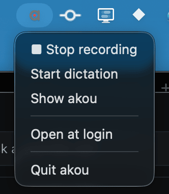
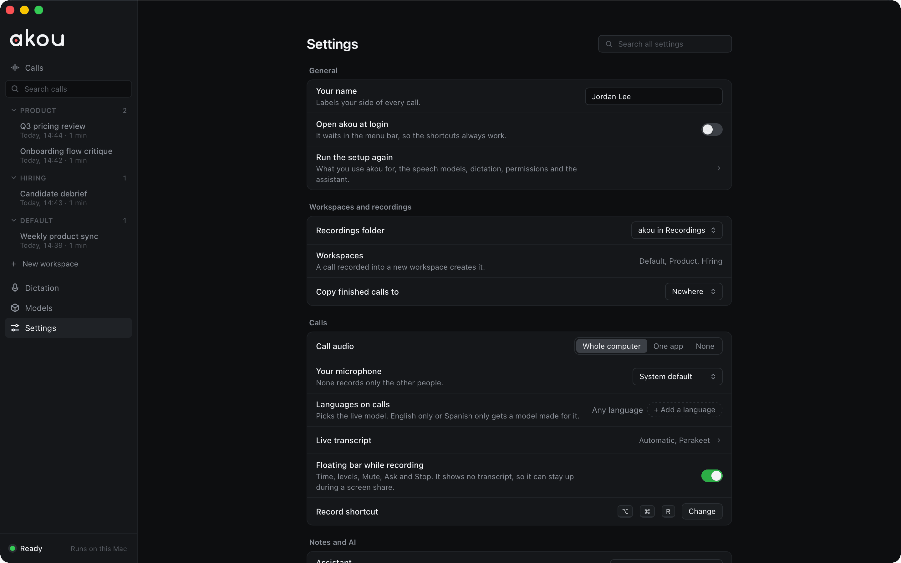

# Usage

akou is one window with three columns: your calls on the left, the transcript in the middle, and Ask and your notes on the right. Everything here also exists on the command line and the local API, so what you do in the window and what your agent does land in the same call. See [Agents and the command line](agents.md).

## The first run

The first time akou opens, it asks what you will use it for: **Calls**, **Dictation** or **Both**. It then asks only the steps that choice needs: where calls go, the permissions, the dictation key and engine, the speech models and the assistant. The models step downloads the speech models once, about 3.0 GB, and Record stays disabled with its reason until they are on disk. **Run the setup again** in Settings brings the same steps back. See [Getting started](getting-started.md).

## The sidebar

- **Calls**, grouped by workspace, newest first, with the live call on top. Each row shows the title, the day and the length.
- **Search calls** finds a call by its title or workspace. It never searches what was said: that belongs to the system you hand calls to ([Hand-off to your knowledge system](knowledge-handoff.md)).
- **New workspace** adds a workspace. A call recorded into a new workspace also creates it.
- **Dictation**, **Models** and **Settings** open their pages in the window. You leave a page from the sidebar.
- The row at the foot says whether akou can record: **Ready · Runs on this Mac**, or what is missing, such as **Models missing · Set up**.

## Recording a call

The Record row at the top holds everything a new call needs:

- the **workspace** menu, which also offers **New workspace…**;
- the **call title** (optional; you can rename the call later);
- the **Live:** menu, which picks the model that writes the live transcript from the models on this Mac, and offers the Models page when there are none;
- the **Mic** and **Call** meters, one for each side of the call;
- **Record**, with its shortcut beside it. The default is `Option+Command+R`, and it works from any app; Settings changes it.

While a call records, the row shows **REC**, the elapsed time, **Stop**, and buttons to mute your microphone and to pause. A bar under it reminds you to tell the others you are recording, with **Copy a notice** to paste into the meeting chat, and **Dismiss**. While the meeting app is in front, a small floating bar shows the time, the levels, Mute, Ask and Stop. It carries no transcript text, so it can stay up during a screen share; Settings turns it off (**Floating bar while recording**).

The first Record asks macOS for the microphone and for the system audio of the call. See [Permissions](getting-started.md#permissions).

## The call header and the transcript

Over the transcript, the header shows the call's title, day, length, workspace and number of lines, and a chip for each speaker with their talk time. Click the title to rename the call, live or saved; the call's folder keeps its first name. **Copy transcript** copies the transcript so far as Markdown, and **Share** turns on a read-only live link to the call on your own network (off until you turn it on; `share.bind` in [Configuration](configuration.md#share) picks the network).

Every line of the transcript carries its time of day and its speaker. Lines still being spoken are drafts and change as more audio arrives; after the call, the final pass rewrites the transcript with its accurate model and labels the speakers again. While you scroll back during a call, **Back to live** returns to the newest line.

Right-click a line, or press `Shift+F10` on it, for its menu: **Play from here**, **Copy line**, **Copy with time and speaker** (`[15:41:07 Maya] ...`), **Name this speaker…** and **Fix this line…**. A word you fix once on its line is fixed on every line of the call that has the same heard form, and a name or term you fix is learned for the workspace too.

## Speakers

A new voice shows up as `c1?`, `c2?` and so on until you name it. Click a speaker's chip, or pick **Name this speaker…** on one of their lines, to name them; the same menu merges two speakers who are really one person (**Merge into**) and splits them again. Your own side is labelled with the name from Settings (**Your name**). An agent can do the same with `akou name c2 Maya`.

## Notes

The note input sits at the foot of the right column. Type a line and press Enter: the note is stamped with the time you wrote it. Four markers set its kind:

| Start with | It becomes |
|---|---|
| `- ` | a bullet |
| `[] ` | an action item, with a checkbox |
| `? ` | an open question |
| `# ` | a section heading |

A note added by your agent (`akou note`, `akou_add_note`) lands in the same list, with a tag saying where it came from.

## Ask

The box at the top of the right column answers questions about the open call, live or saved. Its menu holds ready questions: **Catch me up**, **Was my name mentioned?**, **Decisions so far**, **Action items**, and **What did Maya say?** for each named speaker. The answer shows as a card, with the times and speakers of the lines it cites (`[15:41 Maya]`), and the excerpts it was given under it.

akou builds a small context from the call on your Mac and sends only that to the assistant you picked in Settings: your Claude Code or Codex, a local model, or an API with your own key. With no assistant set up, the box becomes **Search this call** and finds the exact words, with their times. See [Providers](providers.md).

## The player

When the open call has a recording, a player bar sits under the transcript: play and pause, the position, the speed, and a balance between your mic and the call. **Play from here** on a line starts at that line.

## The menu bar

akou keeps an item in the macOS menu bar, the akou mark, with a red dot while a call records. Its menu stops the recording, starts a dictation, brings the window back, turns **Open at login** on or off, and quits akou. The application menu, **akou** beside the Apple menu while the window is in front, has **Settings…** and **Install Command-Line Tool…**, which puts the `akou` command on your `PATH` ([The command line](getting-started.md#the-command-line)).

## Models and Settings

The **Models** page lists the speech models on this Mac with their sizes, downloads the ones that are missing, and lets you cancel a download. The live models for the Record row's **Live:** menu, such as streaming Nemotron, are downloaded from here too.

The **Settings** page is plain rows grouped by topic, with a search box at the top. Every change saves on its own. There is no account to sign in to.

Every setting, including the ones the page does not show, is listed with its default in [Configuration](configuration.md).
