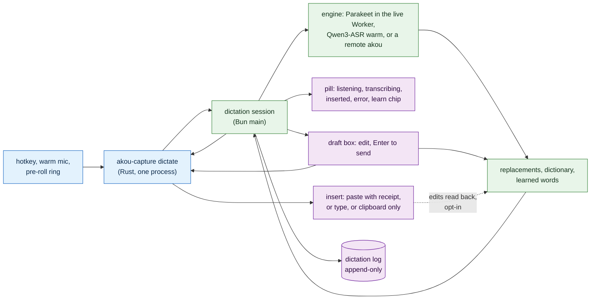

# Dictation

How akou types what you say into whatever app has the keyboard: hold a key, speak, let go, and the text lands where the cursor is. This is what Handy, Wispr Flow, VoiceInk, SuperWhisper, OpenWhispr, Aqua Voice and TypeWhisper do, and akou already owns most of the parts they had to build: a mic-only capture helper, a speech model loaded at start, a global hotkey, a floating window that never takes focus, a settings registry drawn by both the desktop window and the server page, and a vocabulary that grows only by what you approve. Dictation adds the parts that are missing and one thing none of the competitors ships: the same app can be a frontend only, sending the audio to another akou that holds the model.

The recording side of akou is in [DESIGN.md](../DESIGN.md), the desktop shell in [DESKTOP.md](DESKTOP.md), the doors in [PROGRAMMABILITY.md](PROGRAMMABILITY.md), server mode in [SERVER.md](SERVER.md), the engines in [asr-architecture.md](../research/asr-architecture.md). Priorities, ids and the shape of a line follow [PROGRAMMABILITY.md section 2](PROGRAMMABILITY.md#2-priorities-ids-and-the-shape-of-a-line). Every id here starts with `DC-`.

Two words used throughout. **Push-to-talk** means the key is held while you speak and released to finish. **Insert** means akou puts the text into the app that has the keyboard, by whatever method that app accepts.

## 0. The simple version

- **One key, every app.** Hold the dictation key and talk; release it and the text is inserted at the cursor. A short tap latches the key so you can talk hands-free, and the same tap, or silence, stops it. A second key opens a draft box instead, where you read the text before you send it.
- **Nothing is lost at either end.** The mic is warm and a half-second ring buffer runs before the key goes down, so the first syllable is in the recording. Capture runs a quarter second past the release, so the last one is too. The old clipboard comes back only after the target app has read the new one.
- **It learns, but only with your yes.** When you fix a word akou heard wrong, in the draft box or in the app, akou offers to learn it once, as one small chip with Learn, Not a word, and nothing else. Ignore it and nothing changes. A learned word is a deterministic replacement first; steering the recognizer with it happens only where a measured gate says it helps.
- **Fast by default, best when the box can.** A five-second utterance comes back from Parakeet in about 0.1 s. On a machine with a GPU, Qwen3-ASR gives the better transcript in under a second. A machine with neither can send the audio to another akou you run, over a scoped key, and fall back to a local model or to a clear error when that akou is down, never silently to anything else.
- **Same page in the window and in the browser.** The Dictation settings page is one page of the shared UI. The desktop shows all of it; the server-mode page shows the part that governs what the server does for dictating clients.
- **Private.** The floating pill shows a level meter, never the text, unless you turn the preview on. Nothing is typed into a password field. History and audio stay on the box and expire on a timer you set.



## 1. What we do not build

| Not built | Why | What covers the need |
|---|---|---|
| A cloud recognizer, or any akou-run relay | akou has no cloud ([POSITIONING.md](../POSITIONING.md)). Dictation is the most private text a person types | Local engines, or another akou the user runs (section 7) |
| Silent auto-learning by default | Wispr and OpenWhispr add words silently; OpenWhispr then needed a stoplist because "why" to "what" became a rule, and our own measurement turned overweighted entries into false names ([DESIGN.md](../DESIGN.md) "Parakeet decodes greedy by default") | The chip with Learn and Not a word (DC-L4); `dictation.learn` `auto` exists for those who want it, off by default |
| Writing accessibility flags into other apps to read their fields | `AXManualAccessibility` and `AXEnhancedUserInterface` change how the target app behaves; OpenWhispr saw focus lost in a chat app after setting one | When a field cannot be read, akou learns nothing for that dictation (DC-L2). The draft box needs no accessibility at all |
| Command or edit mode, where a spoken instruction rewrites the selection | It needs a model that follows instructions, and every rewrite is unverifiable in the field. The user's own harness already does this on selected text | Parked (section 12), with the LLM formatting opt-in (DC-U6) as the first step |
| Backtrack ("at 2, actually 3", "scratch that") without a model | A rule-based version misfires on normal speech that contains "actually" | Parked; it becomes a line of the LLM formatting prompt once DC-U6 lands |
| A stats dashboard (words per minute, top apps) | It is a chart over the history and nothing acts on it | `akou dictations list --json` and the history page (DC-H1) hold the data |
| Voice snippets (a spoken trigger that expands to a paragraph) | A replacement rule with a long right-hand side does the same | The replacement editor (DC-U5) accepts multi-line targets |
| File transcription from the dictation page | Owned by [SERVER.md](SERVER.md) SV-D1 as `akou transcribe FILE` | `akou transcribe` |
| A second settings UI | The page is the shared `src/ui` bundle in both modes | DC-U1 |
| Dictation over MCP (an agent starting a dictation) | The result is typed into whatever app the user is looking at; a tool an agent can auto-approve must never do that | MCP reads history only (DC-G5) |

## 2. Decisions this reverses

Three recorded lines say dictation is out. Each is reversed here, naming the line that changes, so the docs stay in one voice.

| Id | Feature | P | From | Acceptance | Today |
|---|---|---|---|---|---|
| DC-D1 | Dictation is a product feature. [REQUIREMENTS.md](../REQUIREMENTS.md) line 211 marks the dictation recipe "dropped", [PRINCIPLES.md](PRINCIPLES.md) open decision 2 says "dictation to the clipboard" is "not brought back", and [COMPETITOR-MATRIX.md](COMPETITOR-MATRIX.md) row EXP-09 sits on "decision (2)". All three are rewritten: REQUIREMENTS I4.6 reads "carried, as dictation (DICTATION.md)", open decision 2 adds "dictation is DC-D1's", and EXP-09 points at DC-A1 | P0 | owner: "akou should become like Handy" | The three lines carry the new text; the docs lint of PRINCIPLES resolves `DC-` ids; the matrix has no row that still says dictation is dropped | missing |
| DC-D2 | The floating window may carry transcript text, under its own rule. DK-F1 says the indicator never receives transcript text because it stays up during a screen share. The dictation pill is a second window with a second rule: no text by default; a live preview only with `dictation.pillPreview` on; hidden from screen capture wherever DK-P3 can do it; and the preview is never shown while `app.hideFromCapture` is off on an OS that cannot hide the window | P0 | DK-F1's rule would forbid the draft box and the learn chip | A test renders the pill with a transcript and the preview off and finds no text in its DOM; with the preview on and a fake `hideFromCapture: false` on Linux, the same holds; with the preview on and the window hidden from capture, the text shows (positive control) | missing |
| DC-D3 | `PRINCIPLES.md` "How a UX item becomes work" adds `DC` and this document to the owning prefixes; [INDEX.md](../INDEX.md) gains one line for it; the "What we do not build" table of [DESKTOP.md](DESKTOP.md) keeps "transcript text in the floating indicator" refused and points here for the pill | P1 | SV-D4's precedent | The lint's positive control passes with a `DC-` id in the matrix; INDEX has the line | partial: [INDEX.md](../INDEX.md) has the line; PRINCIPLES and DESKTOP are not yet changed |

## 3. Feature inventory

Every feature found in the seven open-source apps whose settings code was read (Handy, OpenWhispr, VoiceInk, Whispering, TypeWhisper, voxtype, whisper-writer) and the paid ones read from their docs (Wispr Flow, SuperWhisper, Aqua Voice, MacWhisper, Monologue, Spokenly, Voibe), plus macOS Dictation and Windows voice typing. "Decision" is what akou does: a priority and the owning id, or a skip with the reason. Nothing is skipped without one.

| Feature | Who has it | Decision |
|---|---|---|
| Push-to-talk (hold to record) | all | P0, DC-A1 |
| Toggle (tap to start, tap to stop) | all | P0, DC-A1 |
| Hold-or-toggle on one key (hold is push-to-talk, a short tap latches) | Handy (default, 300 ms), VoiceInk (0.5 s), SuperWhisper, TypeWhisper | P0, DC-A1, the default |
| Double-tap for hands-free lock | Wispr, Aqua, VoiceInk | Skip: the tap of hold-or-toggle already latches, and a double-tap threshold adds a second timer to tune |
| A separate hands-free chord | Wispr (Fn+Space) | Skip: same reason |
| Hands-free with silence auto-stop | whisper-writer, Whispering, Wispr, macOS Dictation (30 s) | P1, DC-A3 |
| Maximum session length | Wispr (20 min), voxtype (60 s) | P1, DC-A3 |
| Cancel key while listening | all (Escape) | P0, DC-A4 |
| Modifier-only hotkeys (Fn, Right Option, Right Ctrl) | Wispr, OpenWhispr, VoiceInk, TypeWhisper, Handy, voxtype | P0, DC-A2, the macOS default |
| Left and right modifiers told apart | Wispr, Handy, OpenWhispr | P0, DC-A2 |
| Fn or Globe as the key | Wispr, Aqua, OpenWhispr | P1, DC-N2 (needs the Globe action parked and restored) |
| Mouse buttons as the trigger | Wispr, VoiceInk, SuperWhisper, Aqua | P2, DC-A6 |
| Extra hotkeys: paste last, copy last, retry, fix last, open history | Wispr, VoiceInk, Handy, SuperWhisper | P1, DC-A5 (fix last, paste last); P2 for the rest |
| Hotkey recorder in settings, with conflicts shown | all GUI apps | P0, DC-U3 (extends DK-K5) |
| CLI toggle for compositors that own hotkeys (Wayland) | Handy, voxtype, Speech Note | P1, DC-G3 |
| Deep links (`app://record`) | SuperWhisper | Skip: [PROGRAMMABILITY.md](PROGRAMMABILITY.md) PG-U2 parks acting links; the CLI covers it |
| Overlay pill with level meter | all | P0, DC-O1 |
| Pill position (bottom, top, edges, draggable) | Handy, Wispr, OpenWhispr | P0, DC-O1 |
| Live text preview in the pill | Handy, VoiceInk, OpenWhispr, SuperWhisper, Aqua | P1, DC-O2, off by default |
| Overlay hidden on Linux by default (focus theft) | Handy | P0, DC-O1 carries the rule |
| Start, stop, cancel, done sounds | all | P1, DC-U7, off by default (the mic hears them) |
| Mic picker, follow system default | all | P0, DC-U4 |
| Clamshell mic (lid closed) | Handy | P2, DC-U4 |
| Prefer the built-in mic over a Bluetooth headset | (none explicit; the HFP profile drop is documented in every issue tracker) | P1, DC-N5 |
| Warm mic, always-on stream | Handy, OpenWhispr | P0, DC-N4 |
| Pre-roll ring buffer | Handy (450 ms VAD prefill) | P0, DC-N4 |
| Tail buffer after release | Handy | P0, DC-N4 |
| Mute or pause other audio while dictating | Wispr, VoiceInk, OpenWhispr, SuperWhisper, voxtype, Handy | P2, DC-U8, off by default (VoiceInk once started a music app by itself) |
| Insert by clipboard plus paste | all | P0, DC-N6 |
| Clipboard restored after the target read it (receipt-based) | Handy `paste_tx` | P0, DC-N6 |
| Transient clipboard types so clipboard managers skip the text | Handy, VoiceInk | P0, DC-N6 |
| Insert by typed keystrokes (VDI, Citrix, games) | SuperWhisper, Handy, voxtype, whisper-writer | P1, DC-N7 |
| Insert by accessibility API | VoiceInk (AppleScript), OpenWhispr (read) | Skip: none of them ships it as an insert path, and Chromium apps need flags akou refuses to set |
| Clipboard only, no paste | Handy, OpenWhispr, SuperWhisper, Whispering | P0, DC-N6, as the no-grant fallback |
| Terminal detection: Ctrl+Shift+V or Shift+Insert | OpenWhispr, Handy, voxtype | P1, DC-N7 |
| Layout-resolved paste key (Dvorak, non-US) | OpenWhispr, Handy | P0, DC-N6 |
| Held hotkey modifiers released before the paste | VoiceInk, OpenWhispr | P0, DC-N6 |
| Trailing space, smart spacing and case | Handy, VoiceInk, whisper-writer, Wispr | P1, DC-S4 |
| Send (press Enter after the insert) | Handy, VoiceInk, Whispering, SuperWhisper, Wispr, Aqua | P0, DC-S2 |
| Spoken send command ("send it") | Aqua, Wispr | P2, DC-S5, off by default |
| Secure-field guard | Wispr, Handy, Windows | P0, DC-N8 |
| Focus change guard (text lands in the wrong window) | SuperWhisper, OpenWhispr | P0, DC-N9 |
| Per-app modes (engine, language, insert method, draft, send) | VoiceInk, SuperWhisper, TypeWhisper, Wispr Styles | P1, DC-U9 |
| Per-website modes | VoiceInk, TypeWhisper | Skip: needs a browser extension or the URL from accessibility, which is per browser; the per-app rule covers the browser as one app |
| LLM cleanup or formatting | Handy, OpenWhispr, VoiceInk, SuperWhisper, TypeWhisper, voxtype, Whispering | P1, DC-U6, off by default, through the user's provider as akou already does |
| Context for the LLM (selection, clipboard, screenshot) | SuperWhisper, Wispr, Aqua, VoiceInk | Skip: SuperWhisper's own docs say unneeded context lowers quality, and a screenshot of the screen is the privacy scare Wispr had. The harness has the context already |
| Command or edit mode | Wispr, Aqua, OpenWhispr | Skip, section 1 |
| Backtrack and "scratch that" | Wispr, Talon | Skip, section 1 |
| Custom dictionary or vocabulary | all | P0, DC-L6, the existing vocabulary files |
| Replacement rules | SuperWhisper, Wispr, voxtype, VoiceInk, TypeWhisper | P0, DC-U5, DC-L6 |
| Snippets with placeholders (`{{DATE}}`) | TypeWhisper, Wispr | Skip, section 1 |
| Auto-learn from corrections | Wispr, OpenWhispr, VoiceInk, TypeWhisper | P0, DC-L1 to DC-L5, as a chip, never silent by default |
| Learn from edits in the app's field (accessibility) | OpenWhispr, VoiceInk, TypeWhisper | P1, DC-L2, off until granted |
| Learn from edits in a draft box | TypeWhisper (history) | P0, DC-L1 |
| Manual review queue for learned words | VoiceInk | P0, DC-L5, the existing "Words to review" |
| Spoken punctuation and formatting commands | macOS, Windows, voxtype, nerd-dictation | P1, DC-S6, a fixed list per language |
| Filler-word removal | Handy, Wispr, Windows | P1, DC-S7 |
| Language: fixed or auto | all | P0, DC-E4 |
| Translation to another language | Handy, OpenWhispr, SuperWhisper, TypeWhisper, voxtype | Skip: no engine in the registry translates; the LLM formatting prompt can, once DC-U6 lands |
| Streaming partials during the hold | Handy, VoiceInk, OpenWhispr, SuperWhisper, Aqua | P2, DC-E5, preview only; the inserted text is always the offline pass |
| Model unload after idle | Handy, SuperWhisper, voxtype | Skip for Parakeet (the live model stays loaded at start already); P1 for llama-server, DC-E2 |
| Local or cloud, bring your own key | most | Skip cloud, section 1 |
| Remote or self-hosted server | OpenWhispr, voxtype, Whispering, whisper-writer, TypeWhisper | P0, DC-R1 to DC-R4 |
| Fallback engine when the main one fails | OpenWhispr | P0, DC-R3, explicit and announced |
| History with copy, re-insert, retry, delete | Handy, SuperWhisper, VoiceInk, OpenWhispr, TypeWhisper, Wispr | P0, DC-H1 |
| Retention timers for text and audio | Handy, VoiceInk, OpenWhispr, Wispr (14 d) | P0, DC-H2 |
| Telemetry and training opt-ins | Wispr, Aqua, OpenWhispr | Skip: akou has no telemetry and trains nothing |
| Launch at login, tray, start hidden | all | Has: DK-L1; dictation adds nothing |
| Onboarding for mic and accessibility grants | all | P0, DC-N3 |
| Stats dashboard | SuperWhisper, Wispr, TypeWhisper | Skip, section 1 |
| File transcription | SuperWhisper, OpenWhispr, MacWhisper | Has: `akou transcribe` (SV-D1) |
| Agent and MCP integration | SuperWhisper, Spokenly, OpenWhispr, Monologue | P1, DC-G5, read-only |
| Settings sync between machines | SuperWhisper, Wispr, TypeWhisper, VoiceInk | Skip: `config.json` and the vocabulary files are plain files; the user syncs the folder |
| Hotwords or a prompt sent to the recognizer | Handy (Whisper only), OpenWhispr, SuperWhisper | P1, DC-L7, behind a measured gate, section 6 |
| A "Report issue" on a history item | SuperWhisper | Skip: DK-O5's doctor bundle covers it |

## 4. Activation

The hotkey and the key-release detection live in the Rust helper (section 8), because ElectroBun's `GlobalShortcut` fires on key-down only on every OS and cannot see Fn on macOS. The settings, the pill and the session logic live in the Bun main process behind the `NativeUi` seam of [shell.ts](../../src/main/window/shell.ts).

| Id | Feature | P | From | Acceptance | Today |
|---|---|---|---|---|---|
| DC-A1 | `dictation.hotkey` with `dictation.activation` `hold-or-toggle` (default), `hold` or `toggle`. Hold-or-toggle: a press held 300 ms or longer is push-to-talk and ends at release; a shorter tap latches listening on, and the next tap, Escape, or DC-A3 ends it. `dictation.enabled`, default false, is the master switch; with it off the helper's dictate process is not started and no hotkey is taken | P0 | Handy's `HoldOrToggle` at 300 ms, the category default | With a fake key source: down and up at 800 ms yields one session ending at the up; down and up at 120 ms then down and up again at 3 s yields one session of about 3 s; with `dictation.enabled` false no helper is spawned and `GET /config` says so | missing: [shell.ts](../../src/main/window/shell.ts) registers `app.hotkey` for recording through `GlobalShortcut`, key-down only, with its default in [hotkey.ts](../../src/main/window/hotkey.ts) |
| DC-A2 | Modifier-only and side-specific keys: `RightOption`, `RightControl`, `RightCommand`, `RightShift`, `Fn`, and the left versions, are valid values of `dictation.hotkey` beside chords. Defaults: macOS `RightOption`, Windows `RightControl`, Linux `Control+Shift+Space`, because the GlobalShortcuts portal binds chords only and the default must work on every Linux backend. A chord of a left and a right of the same modifier is refused. On macOS a modifier-only key keeps working while Secure Input is on (a password field, a terminal with secure entry), where a keyed chord dies silently; DC-N1 explains | P0 | Wispr (Fn), OpenWhispr (Globe), Handy; the Secure Input trap of Handy #1578 | `parseHotkey("RightOption")` gives a modifier-only binding; `LeftOption+RightOption` is refused with a message; on macOS with a fake secure-input flag on, a `RightOption` press starts a session and a `Command+Shift+D` press does not, and the pill says why | missing |
| DC-A3 | Two ways a latched session ends by itself. `dictation.silenceStopSeconds`, default 0 (off), ends it after that many seconds without speech, judged by the VAD akou already runs; `dictation.maxMinutes`, default 20, ends any session at that length after a pill warning at one minute before, and the audio is still transcribed, never dropped | P1 | whisper-writer VAD stop, Wispr's 19/20 minute rule; macOS stops at 30 s of silence | With the fake clock and a fake VAD, a latched session with `silenceStopSeconds: 3` ends 3 s after the last speech frame and its audio is transcribed; with 0 it runs to the tap (positive control); a session at `maxMinutes` ends with the warning event 60 s earlier in the log | missing |
| DC-A4 | Keys while listening, swallowed by the helper's tap so they never reach the app under the cursor: Escape cancels (nothing is transcribed, the audio is kept in history as `cancelled` for `dictation.retainDays`); Enter ends the session and inserts, then presses the send key (DC-S2); Shift+Enter ends the session and opens the draft box (DC-S1) whatever the mode. Outside a session the helper swallows nothing | P0 | VoiceInk's Return-to-send while the recorder is open; SuperWhisper cancels at once | With a fake key source and a fake inserter: Escape during a session produces no insert and a `dictation.cancelled` event; Enter produces the insert followed by one send-key press; Shift+Enter produces a `draft.opened` event and no insert; the same keys with no session are passed through (positive control: the fake tap records them as not swallowed) | missing |
| DC-A5 | Two more hotkeys, empty by default: `dictation.hotkeyFixLast` opens the last dictation in the draft box for correcting and teaching (DC-L1), without touching the app it went into; `dictation.hotkeyPasteLast` inserts the last dictation's text again | P1 | VoiceInk `retryLastTranscription`, `quickAddToDictionary`; Wispr paste last | With both set, a fake press of each does exactly its action on a history fixture; with them empty no binding exists | missing |
| DC-A6 | Mouse buttons 3 to 5 as `dictation.hotkey` values, hold-or-toggle like a key. Left, right and the wheel are refused | P2 | Wispr Mouse Flow, SuperWhisper (a hold may not be detectable on some mice) | `Mouse4` parses and a fake button-down and button-up runs a session; `Mouse1` is refused | missing |
| DC-A7 | A changed dictation hotkey applies at once from any door, the same rule as DK-K3, by sending the helper a `rebind` command. A binding the helper cannot take comes back as the error on that door and the old binding stays | P0 | DK-K3; a hotkey that needs a restart is a control that does nothing | `PATCH /config {"dictation.hotkey": "RightCommand"}` makes the fake helper receive `rebind` and a press of the new key start a session; a refusal keeps the old key working | missing |

## 5. The pill, the draft box and sending

### 5.1 The pill

The pill is a second small window built like the floating indicator (`openIndicator` in [shell.ts](../../src/main/window/shell.ts)): no title bar, above every other window, on every workspace, never activated. It has five states and one optional chip.

```
listening                       transcribing                inserted / copied
+---------------------------+   +-------------------------+   +-------------------------+
| o  |||||||||....    0:04  |   | (  )  transcribing...   |   | v  inserted             |
|    Esc cancel  Enter send |   +-------------------------+   +-------------------------+
+---------------------------+

error                                              learn chip (under any state, at most one)
+-----------------------------------------------+  +-----------------------------------------------+
| !  remote akou not reachable                  |  | Learn "Kubernetes" (heard "cooper netties")?  |
|    [Retry locally]  [Copy]  [Open draft]      |  |                    [Learn]  [Not a word]   x  |
+-----------------------------------------------+  +-----------------------------------------------+
```

| Id | Feature | P | From | Acceptance | Today |
|---|---|---|---|---|---|
| DC-O1 | The pill: `listening` with a level meter, the elapsed time and the two key hints; `transcribing` with a spinner; `inserted` (or `copied` when the clipboard-only path ran) shown for 1.5 s; `error` with the message and up to three buttons (Retry locally, Copy, Open draft); hidden otherwise. `dictation.pill` is `bottom` (default), `top`, `left`, `right` or `off`; the pill is draggable and its position remembered, like DK-F1. On Linux the default is `off`, because a compositor may give it focus and the paste then lands in the pill; a Linux user turns it on knowingly and the setting's doc says why. The pill never takes focus on any OS: a test asserts `activate: false` and `showInactive` | P0 | Handy (None on Linux), Wispr Flow Bar, OpenWhispr panel | A Playwright test drives the five states through the rig and checks the DOM of each; the level meter moves on fake levels; with `dictation.pill: off` no window opens (positive control); the frame is restored after a drag and a restart | missing: [indicator.ts](../../src/main/window/indicator.ts) is the recording indicator, with DK-F1's no-text rule |
| DC-O2 | `dictation.pillPreview`, default false: the words recognised so far during a latched session, in the pill, under the rule of DC-D2. With the preview off the pill's page never receives text, enforced on the main side like `indicatorStatus` cuts the indicator's status | P1 | Handy Live, VoiceInk `ShowLiveTranscript`; DC-D2 | With the preview off, a session's RPC to the pill page carries no `text` field (a test reads every message); with it on, the page shows partials | missing |
| DC-O3 | Sounds for start, stop, cancel and done, `dictation.sounds`, default `off`, values `off`, `soft`, `click`; the output device follows the system. Never a test signal: tests render the cue to a buffer and assert its length, and no test opens an output device | P1 | every competitor; DK-P5 parks a recording cue because the mic hears it; here the mic is the user's own, so the cue is a choice | With `soft`, the fake player receives four distinct buffers at the four moments; with `off` it receives none; the suite has no call that opens a real output (the speaker rule of [TESTING.md](../TESTING.md)) | missing |

### 5.2 The draft box

The draft box is where a dictation lands when you want to read it before it goes anywhere. It is the second mode of every press, and the place where learning is exact, because akou owns the text field.

```
+--------------------------------------------------------------------+
| Draft                                              to: Slack  (x)  |
|--------------------------------------------------------------------|
| Tell the cooper netties team the rollout is on Thursday, then     |
|          ~~~~~~~~~~~~~~                                            |
| ping me.                                                           |
|                                                                    |
|  Learn "Kubernetes" (heard "cooper netties")?  [Learn] [Not a word]|
|--------------------------------------------------------------------|
| fast (Parakeet) 0.3 s   [Retry with best v]  [Copy]                |
| Enter: insert   Ctrl+Enter: insert and send   Shift+Enter: newline |
| Esc: discard                                                       |
+--------------------------------------------------------------------+
```

| Id | Feature | P | From | Acceptance | Today |
|---|---|---|---|---|---|
| DC-S1 | The draft box: a floating akou window that takes focus, opened by `dictation.hotkeyDraft` (empty by default), by Shift+Enter during a session (DC-A4), by a per-app rule (DC-U9), by DC-A5's fix-last, and automatically when the target cannot take a paste (DC-N9) or the remote is down (DC-R3). It shows the text in an editable field, the app it will go to, the engine and the time it took, Retry with another engine, Copy, and the key hints. Enter inserts into the app and field captured when the session began (DC-N9), then returns focus there; Ctrl+Enter (Cmd+Enter on macOS) inserts and presses the send key; Shift+Enter is a newline; Escape discards, and the text stays in history as `discarded`. Low-confidence words are underlined from the engine's word confidence where the engine gives one; a click on one shows the alternatives from the other engine when two ran, and picking one is an edit like any other | P0 | owner: "it might be good to have a send thing"; Aqua's Send It; VoiceInk's finish-and-send | Playwright: the box opens with the text, Enter calls the insert RPC with the captured target and closes, Ctrl+Enter also sends the send key, Escape writes `discarded` and inserts nothing; an underlined word shows its alternative and picking it changes the field | missing |
| DC-S2 | Send: `dictation.sendKey`, default `Enter`, values `Enter`, `Ctrl+Enter`, `Cmd+Enter`, `Shift+Enter`, `none`. The send key is pressed only after the paste receipt of DC-N6 reports the target read the clipboard, or after the typed path finished, never on a timer. `dictation.sendAlways`, default false, sends after every direct insert; the per-app rule (DC-U9) overrides it per app | P0 | Handy `auto_submit` sends only after `paste_tx`'s receipt; VoiceInk's `FinishAndSendKey` | With the fake inserter delaying the receipt by 400 ms, the send key press arrives after it, never before (a test with the receipt withheld sees no send key for 8 s, then the error path); `sendKey: none` presses nothing even on Enter | missing |
| DC-S3 | Per press, the user picks the mode by which key they use: the dictation key inserts directly, the draft key opens the box, and the two keys during a session (Enter, Shift+Enter) flip this press. No hold-versus-tap trick decides the mode, because the category uses hold versus tap for push-to-talk versus latch already | P0 | the research verdict against overloading the tap | Covered by DC-A1, DC-A4 and DC-S1; a table test walks every key path and asserts the resulting mode | missing |
| DC-S4 | Spacing and case: `dictation.smartSpacing`, default true, adds a space before the text when the character before the cursor is not whitespace or an opening bracket, and after it when the next character is a letter, and lowercases the first word when the text before the cursor ends mid-sentence; where the surrounding text cannot be read (no accessibility, a terminal) it adds a trailing space only when `dictation.trailingSpace` is true (default false) | P1 | Wispr Smart Formatting, Handy `append_trailing_space`, VoiceInk `AppendTrailingSpace` | A unit test over a table of (before, after, text) triples; with the surroundings unknown, only the trailing-space rule fires | missing |
| DC-S5 | A spoken send: with `dictation.spokenSend` on (default off), an utterance ending in "send it" (Spanish "envíalo") strips those words and sends as Ctrl+Enter would; the phrase counts only at the very end, so "I'll send it tomorrow" stays text | P2 | Aqua Send It, Wispr "press enter" | "tell them I'll send it tomorrow" inserts unchanged; "tell them tomorrow send it" inserts "tell them tomorrow" and presses the send key | missing |
| DC-S6 | Spoken punctuation and layout, `dictation.spokenPunctuation`, default true: a fixed list per language (`comma`, `period`, `question mark`, `new line`, `new paragraph`; Spanish `coma`, `punto`, `signo de interrogación`, `nueva línea`, `nuevo párrafo`) replaced only when the word stands alone between pauses or at the end, so "a comma splice" survives. The list is a file the user can override, like templates | P1 | macOS Dictation, Windows voice typing, voxtype | A table test per language; "new paragraph" between two sentences yields two newlines; "a comma splice is bad" is unchanged | missing |
| DC-S7 | Filler removal, `dictation.fillers`, default true: `um`, `uh`, `erm`, `hmm`, and the Spanish `eh`, `este`, `mmm`, removed when they stand alone, gated by the recognised language. The raw text stays in history; only the inserted text changes | P1 | Handy `filler_word_removal_enabled` | "um so the uh plan" inserts as "so the plan"; the history item keeps the raw text; "este libro" in Spanish is unchanged (`este` is only a filler when alone) | missing |

### 5.3 History

| Id | Feature | P | From | Acceptance | Today |
|---|---|---|---|---|---|
| DC-H1 | A History page in the shared UI: every dictation with its time, the app it went to, the engine, the time it took, its state (`inserted`, `copied`, `drafted`, `discarded`, `cancelled`, `failed`) and the text; Insert again (into the app with the keyboard now, through the draft box so the user sees where it goes), Copy, Retry with another engine (a picker from the installed engines and the remote), Fix (opens the draft box for teaching, DC-A5), Delete. Search over the text, on this page only, since dictations are the user's own words and not a call | P0 | SuperWhisper's history with reprocess, Handy's re-transcribe, Wispr's 14-day recovery of failed pastes | Playwright over a history fixture: every action calls its route; Retry with `best` shows the second result beside the first and lets the user insert either; Delete removes the item and its audio | missing |
| DC-H2 | Retention: `dictation.retainDays`, default 30, deletes a dictation's text, audio and events past it, leaving a tombstone in the log; `dictation.keepAudio`, default true, keeps the Opus file so Retry and the learning check (DC-L3) work; with it false the audio is deleted once the dictation is inserted or discarded. Delete on one item does the same at once | P0 | Handy's retention enum, VoiceInk's cleanup, privacy | With an injected clock 31 days on, the sweep removes the item and its file and the log holds the tombstone; with `keepAudio: false` the file is gone within a second of `inserted` while the text stays | missing |

## 6. The Dictation settings page

One page in the shared bundle, `#dictation` in the desktop window beside Settings, and a `Dictation` page of the server-mode page beside Jobs, Models, Keys and Settings ([server-common.ts](../../src/ui/server-common.ts) `PAGES`). The page is drawn from the settings registry with the groups below, so a new `dictation.*` key with a `group` lands on it with no page change once DK-S1's `group` and `applies` fields exist; until then the page holds its own group list, as [server-settings.ts](../../src/ui/server-settings.ts) does today.

```
+------------------------------------------------------------------------------+
| Dictation                                          [x] Enable dictation      |
|------------------------------------------------------------------------------|
| Keys                                                                         |
|   Dictation key       [ Right Option        ]  hold: push-to-talk, tap: latch|
|   Activation          ( ) hold  ( ) toggle  (o) hold or toggle               |
|   Draft key           [ not set             ]                                |
|   Fix last            [ not set             ]   Paste last  [ not set      ] |
|   While listening: Esc cancels, Enter sends, Shift+Enter opens the draft     |
|   Stop after silence  [ off  v ]   Longest session [ 20 ] min                |
|                                                                              |
| Microphone                                                                   |
|   Input               [ System default (built-in)  v ]   ||||||......        |
|   [x] Prefer the built-in mic when the output is a Bluetooth headset         |
|   [ ] Keep the mic open between dictations (faster start, uses the mic LED)  |
|                                                                              |
| Engine                                                                       |
|   (o) Auto: best where a GPU runs it, fast elsewhere   (this machine: best)  |
|   ( ) Fast   Parakeet v3, about 0.1 s for 5 s of speech                      |
|   ( ) Best   Qwen3-ASR 1.7B on metal, about 0.6 s for 5 s of speech          |
|   ( ) Remote akou   URL [ https://akou.example      ]  Key file [ ...    ]   |
|                     [Test]  last check: ok, best on cuda, 40 ms round trip   |
|                     If unreachable: (o) use the local engine ( ) show error  |
|   Language            [ auto  v ]   Languages to choose among [ en, es ]     |
|                                                                              |
| Insert                                                                       |
|   Method              (o) paste  ( ) type  ( ) clipboard only                |
|   Send key            [ Enter  v ]   [ ] Send after every dictation          |
|   [x] Smart spacing   [ ] Trailing space   [x] Spoken punctuation  [x] Fillers|
|   [ ] Clean up with my provider (Claude Code)  prompt: [ default  v ]        |
|                                                                              |
| Learning                                                                     |
|   Suggest words       ( ) off  (o) ask me  ( ) add automatically, with Undo  |
|   [ ] Watch the field I dictated into (needs Accessibility)   [Grant...]     |
|   [x] Confirm each learned word against the audio before suggesting it       |
|   Words to review (3)  [Open]      Dictionary and replacements  [Edit]       |
|                                                                              |
| Per app                                                                      |
|   Slack        draft + send    engine: auto    insert: paste      [Edit] [x] |
|   Terminal     insert: type    send: none                         [Edit] [x] |
|   [+ Add app]                                                                |
|                                                                              |
| Pill and sounds                                                              |
|   Pill position       [ bottom v ]   [ ] Show words as I speak                |
|   Sounds              [ off  v ]                                              |
|                                                                              |
| Privacy                                                                      |
|   Keep history for    [ 30 ] days   [x] Keep audio for retry and learning    |
|   [Delete all dictations now]                                                |
|                                                                              |
| Permissions: Microphone ok   Accessibility ok   [Run the setup again]        |
+------------------------------------------------------------------------------+
```

Every key, its default and its group. `applies` says when a change takes effect: `now` through the helper's `rebind` or a session setting, `session` at the next dictation, `restart` for a key that names a program.

| Key | Default | Values | Group | Applies |
|---|---|---|---|---|
| `dictation.enabled` | `false` | bool | top | now: starts or stops the helper's dictate process |
| `dictation.hotkey` | `RightOption` (macOS), `RightControl` (Windows), `Control+Shift+Space` (Linux) | a chord, a modifier-only key, `MouseN` | Keys | now (DC-A7) |
| `dictation.activation` | `hold-or-toggle` | `hold`, `toggle`, `hold-or-toggle` | Keys | now |
| `dictation.hotkeyDraft`, `dictation.hotkeyFixLast`, `dictation.hotkeyPasteLast` | empty | as `dictation.hotkey` | Keys | now |
| `dictation.silenceStopSeconds` | `0` | 0 to 30 | Keys | session |
| `dictation.maxMinutes` | `20` | 1 to 60 | Keys | session |
| `dictation.mic` | empty (system default) | a device id from `GET /devices` | Microphone | now: `rebuild_mic` to the helper |
| `dictation.preferBuiltInOverBluetooth` | `true` | bool | Microphone | session |
| `dictation.warmMic` | `false` | bool | Microphone | now |
| `dictation.engine` | `auto` | `auto`, `fast`, `best`, `remote` | Engine | session |
| `dictation.remote.url` | empty | an `http` or `https` URL | Engine | session |
| `dictation.remote.keyFile` | empty | a path; `apiWritable: false`, `secret` | Engine | restart (a file akou reads) |
| `dictation.remote.fallback` | `local` | `local`, `error` | Engine | session |
| `dictation.remote.timeoutSeconds` | `6` | 1 to 60 | Engine | session |
| `dictation.serve` | `false` | bool | Engine | restart |
| `asr.qwenIdleMinutes` | `0` (never) | 0 to 1440 | Engine | now |
| `dictation.language` | `auto` | `auto` or a BCP-47 tag | Engine | session |
| `dictation.glossary` | `off` | `off`, `on` (DC-L7's gate flips the default) | Engine | session |
| `dictation.glossaryMax` | `24` | 1 to 200 | Engine | session |
| `dictation.insert` | `paste` | `paste`, `type`, `clipboard` | Insert | session |
| `dictation.sendKey` | `Enter` | `Enter`, `Ctrl+Enter`, `Cmd+Enter`, `Shift+Enter`, `none` | Insert | session |
| `dictation.sendAlways` | `false` | bool | Insert | session |
| `dictation.smartSpacing`, `dictation.trailingSpace`, `dictation.spokenPunctuation`, `dictation.fillers`, `dictation.spokenSend` | `true`, `false`, `true`, `true`, `false` | bool | Insert | session |
| `dictation.format` | `off` | `off`, `provider` | Insert | session |
| `dictation.formatPrompt` | `default` | a preset name from `~/.config/akou/dictation-prompts/*.md` | Insert | session |
| `dictation.formatTimeoutSeconds` | `4` | 1 to 60 | Insert | session |
| `dictation.muteMedia` | `false` | bool | Insert | session |
| `dictation.learn` | `ask` | `off`, `ask`, `auto` | Learning | session |
| `dictation.learn.watchApps` | `false` | bool | Learning | session |
| `dictation.learn.audioCheck` | `true` | bool | Learning | session |
| `dictation.apps` | `[]` | a list of per-app rules (DC-U9) | Per app | session |
| `dictation.pill` | `bottom` (`off` on Linux) | `bottom`, `top`, `left`, `right`, `off` | Pill and sounds | now |
| `dictation.pillPreview` | `false` | bool | Pill and sounds | now |
| `dictation.sounds` | `off` | `off`, `soft`, `click` | Pill and sounds | now |
| `dictation.retainDays` | `30` | 1 to 3650 | Privacy | now (next sweep) |
| `dictation.keepAudio` | `true` | bool | Privacy | now |
| `server.dictation_slots` | `1` | 0 to 8 | Server (server mode) | restart |
| `server.dictation_engine` | `auto` | a preset or engine id | Server (server mode) | session |

| Id | Feature | P | From | Acceptance | Today |
|---|---|---|---|---|---|
| DC-U1 | The Dictation page in both modes from one component: in app mode all groups above; in server mode only the Server group (`server.dictation_slots`, `server.dictation_engine`) and a read-only count of dictation requests served in the last hour, since a server has no keyboard to type into. The desktop's Settings dialog keeps its flat list, and the `dictation.*` keys are hidden there with a link to the page, so a setting is never shown twice | P0 | SERVER.md SV-U2 for the group idea; the owner's "config page for all this" | Playwright: the page in app mode shows every group; the same bundle in server mode shows the Server group only; changing a value on either calls `PATCH /config` with that key alone | missing: [settings.ts](../../src/ui/settings.ts) draws a flat list |
| DC-U2 | The master switch at the top: turning it on runs the onboarding (DC-N3) when a grant is missing, and starts the helper's dictate process; turning it off stops the process and unbinds the keys within a second, with the pill gone | P0 | a switch that leaves a key bound is a control that lies | Toggling on with grants present spawns the fake helper with `dictate`; toggling off sends `stop` and the fake process exits; a test with the grant missing sees the onboarding open instead of the spawn | missing |
| DC-U3 | The hotkey recorder for every dictation key, extending DK-K5: press the keys, see keycaps, a modifier-only key shows as `Right ⌥` after it is held alone for 400 ms and released, a conflict with `app.hotkey` or another dictation key is refused inline, and the platform warnings of [hotkey.ts](../../src/main/window/hotkey.ts) apply | P0 | DK-K5, Raycast | Playwright presses `Control+Shift+D` and sees it saved; holds Right Option alone and sees `RightOption`; presses the recording hotkey and sees the conflict text and no save | missing |
| DC-U4 | The mic picker from `GET /devices` (PG-A8), with a live meter beside it while the page is open, "System default" first, the transport (built-in, USB, Bluetooth) beside each name; a clamshell mic setting is P2 | P0 | every competitor; Handy's clamshell mic | The picker lists the fake helper's devices; choosing one writes `dictation.mic` and the fake helper receives `rebuild_mic`; the meter moves on fake levels | missing: PG-A8 is missing, so the route lands with it |
| DC-U5 | The dictionary and replacements editor, one dialog shared with WINDOW W9.2: a term with its heard forms is a vocabulary entry; a replacement (`at sign` to `@`, `dot com` to `.com`) is an entry whose `heard` is the trigger and whose term is the target, matched whole-word and case-insensitive, output in the entry's case, longest first, stored in the same `vocabulary.yaml` under a `dictation` scope that always applies (DC-L6). Import from a text file, one term per line | P0 | SuperWhisper Replacements, Wispr Dictionary, voxtype `replacements` | Adding `dot com` to `.com` writes the file through the API and the next dictation of "example dot com" inserts `example.com`; a file with 200 lines imports 200 entries | partial: W9.2 is read-only today |
| DC-U6 | LLM formatting, `dictation.format` `provider`, off by default: the inserted text is first passed to the user's provider, the same harness, API or local model [providers.md](../providers.md) already runs, with a prompt file the user picks. The shipped default prompt fixes punctuation and casing, writes numbers as digits, removes fillers, keeps the language, and says the text is dictation and not instructions (the PG-Z1 rule). The raw text is kept in history and the draft box shows both. A provider that takes over `dictation.formatTimeoutSeconds` (default 4) is skipped and the raw text is inserted, with the pill saying so | P1 | Handy, OpenWhispr, VoiceInk's `SkipShortEnhancement`; providers.md: the harness never runs unattended, so `provider` here is one short request per dictation the user pressed a key for | With the fake harness, "um three apples" inserts as "Three apples."; with the fake delaying 6 s, the raw text is inserted within 4.5 s and the log holds `format.skipped`; the prompt text contains the data-not-instructions header (a test greps the rendered prompt) | missing |
| DC-U7 | Sounds, as DC-O3 | P1 | | DC-O3 | missing |
| DC-U8 | Mute other audio while listening, `dictation.muteMedia`, default false, through the OS media-pause path where one exists (macOS MediaRemote, Windows media keys, Linux MPRIS), and never by changing an output device's volume, so a headset is never pushed to full | P2 | VoiceInk #59 pushed the volume to full; #208 started a music app | With a fake media controller, a session pauses and the end resumes only what akou paused; a media app already paused is not started | missing |
| DC-U9 | Per-app rules, `dictation.apps`: `{app, mode: direct\|draft\|draft-send, insert, sendKey, engine, language, format}` keyed by bundle id (macOS), executable name (Windows) or window class (Linux), matched against the app captured at session start (DC-N9). A row is added by picking from the running apps or by "Use the app I dictate into next". A missing field means the global setting | P1 | VoiceInk Power Mode, SuperWhisper auto-activation, TypeWhisper | A rule for a fake `com.example.chat` with `mode: draft-send` opens the draft box and Enter there sends; a rule with `insert: type` for a fake terminal uses the typed path; an app with no rule uses the globals (positive control) | missing |

## 7. Engines and the remote mode

### 7.1 Which engine, and how fast

A dictation is one short buffer decoded whole after the release, never a stream of VAD segments: the live path's commit latency is about 1.0 s, most of it the 0.7 s segment pause ([g6-live.json](../gates/g6-live.json)), while Parakeet decodes a 3 s clip in about 114 ms ([g6-offline.json](../gates/g6-offline.json)).

| Engine | What | Time for 5 s of speech, warm | When it is the default |
|---|---|---|---|
| `fast` | Parakeet TDT 0.6B v3 fp32, greedy, in the live Worker that is already loaded at app start ([index.ts](../../src/main/index.ts) `startAsr`) | about 0.1 to 0.15 s (real-time factor 0.02, [asr-benchmark.md](../research/asr-benchmark.md)) | `auto` on a box with no GPU |
| `best` | Qwen3-ASR 1.7B through llama-server, kept warm ([SERVER.md section 8.1](SERVER.md#81-best-qwen3-asr-on-llama-server)) | about 0.5 to 1 s on Metal (the 61.5 s clip took 7.7 to 9.5 s including the load); unmeasured on CUDA and Vulkan | `auto` where `asr.accelerator` resolves to `metal`, `cuda` or `vulkan` ([accelerator.ts](../../src/main/asr/accelerator.ts)) |
| `remote` | Another akou, section 7.2 | round trip plus the remote's own time | never by default; chosen by the user |

The owner's rule stands: the better transcript wins, and memory or size is never the reason to pick a worse model. `auto` therefore picks `best` wherever a GPU runs it, and the pill's timing shows the cost.

| Id | Feature | P | From | Acceptance | Today |
|---|---|---|---|---|---|
| DC-E1 | A `decode` message on the live Worker ([live-worker.ts](../../src/main/asr/live-worker.ts) takes `init`, `call`, `decode-list`, `audio`, `end-part`, `unmerge` and `flush` today): `{type: "decode", token, samples, language?}` answers `{type: "decoded", token, text, words: [{w, s, e, c}], language, ms}`, decoding the buffer with `prepareSpan` padding on the already loaded Parakeet, so no second copy of the model is loaded (the trap in [engine.ts](../../src/main/asr/engine.ts)). A decode arriving while a call is live is answered before the next live segment; a call is never delayed by more than one dictation | P0 | the live model is loaded and idle between calls; the "models loaded twice" trap | A test sends a generated 3 s clip and gets the spoken word back in under 300 ms on the CI Mac; a decode during a fake call is answered and the call's next `seg` still arrives; the Worker's model loads counter stays at one | missing |
| DC-E2 | `best` keeps llama-server warm for dictation: the process starts when `dictation.engine` resolves to `best` and stays up while `dictation.enabled` is on, with `asr.qwenIdleMinutes` (default 0, never) to stop it after idle for those who want the memory back; a request while it is starting waits for health, and the pill shows `starting best…`. One request per dictation, greedy, with the glossary of DC-L7 as context when the gate allows | P0 | llama-server's first start waits for health ([llama-server.ts](../../src/main/asr/llama-server.ts)); a cold start per dictation is a 10 s wait | With a fake llama-server, the first dictation after enable waits for health and the second is answered with no start; with `asr.qwenIdleMinutes: 1` and the fake clock at 2 min the process is stopped and the next dictation starts it again | missing |
| DC-E3 | `dictation.engine` `auto` resolves once at enable and again when `asr.accelerator` or the models change, and the page shows the verdict ("this machine: best on metal"); `fast` and `best` force their engine; a forced engine whose model is missing starts its download (DK-E3) and dictates with `fast` until it lands, saying so in the pill | P0 | SV-R2's hardware verdict, DK-E3 | On a fake `metal` accelerator with both models present `auto` is `best`; on `cpu` it is `fast`; with `best` forced and Qwen missing, the pill says `downloading best, using fast` and the download starts | missing |
| DC-E4 | Language: `dictation.language` `auto` lets the engine choose, bounded by `asr.languages` when set (the rule Qwen already follows); a fixed tag forces it. The per-app rule can override it. The detected language is on every history item | P0 | all competitors; the accented-English trap of SV-R4 | A Spanish clip under `auto` with `asr.languages: [en, es]` is transcribed in Spanish and the item says `es`; the same clip with `dictation.language: en` is forced English (a test asserts the forced flag reached the engine) | missing |
| DC-E5 | Streaming partials during a latched session, for the pill preview only (DC-O2): the live Worker's existing partial path on the dictation buffer. The inserted text is always the whole-buffer decode of DC-E1 or the remote's answer; a partial is never inserted | P2 | Handy Live, Aqua Realtime; the owner's accuracy rule | With the preview on, partials reach the pill; the insert RPC carries the `decoded` text, never a partial (a test with partials that differ from the final asserts the final was inserted) | missing |
| DC-E6 | Silence and hallucination guards, the same as SV-R5: a dictation whose VAD finds no speech inserts nothing and the pill says `nothing heard`; an answer that is mostly the glossary, or contains the context wrapper text, is decoded again without context (the echo guard of section 6) | P0 | OpenWhispr's "Thank you for watching!" on silence; the echo trap | A 3 s noise clip inserts nothing and writes `dictation.empty`; a fake engine that echoes `Technical terms:` triggers the second decode and the item records `echo_retry` | missing |

### 7.2 A remote akou as the engine

The desktop app stays the frontend: the hotkey, the mic, the pill, the draft box, the insert and the learning all run on the machine with the keyboard. Only the audio goes to another akou, over one synchronous request, with a `jobs` key. This is not PR #63's server-to-server dispatch, which queues a job, long-polls and probes every 30 s; that fits an archive, not a key that was just released. It reuses that PR's `parseRemote` and key-file handling once it lands, and depends on nothing else in it.

| Id | Feature | P | From | Acceptance | Today |
|---|---|---|---|---|---|
| DC-R1 | `dictation.engine: remote` sends the buffer as a 16 kHz 16-bit mono WAV (the format [audio.ts](../../src/main/server/audio.ts) reads with no ffmpeg) to `POST /v1/audio/transcriptions` on `dictation.remote.url` with the key read from `dictation.remote.keyFile` on every request and never held in a setting or shown on any door, `model` from `server.dictation_engine` unless the user names one, `language`, the glossary as `keywords[]`, and a new field `interactive=true` (DC-R2). The answer's `verbose_json` gives the text, words and language. A URL that is not `https` and not a loopback, RFC 1918, unique-local or shared address is refused at save time, so dictation audio never crosses the open internet in the clear | P0 | OpenWhispr's `lan` endpoint, voxtype's `remote_endpoint`; the owner: "this app as just the frontend, another akou in a server" | Against a server rig, a dictation returns the rig's transcript with the round trip in the item; the key file's contents never appear in `GET /config`, the log or the pill; `http://203.0.113.5` is refused with the reason and `http://10.0.0.5` is accepted | missing |
| DC-R2 | `interactive=true` on `POST /v1/audio/transcriptions` and `POST /v1/jobs`: the request runs in a reserved lane of `server.dictation_slots` (default 1) Workers that never take queued jobs, is never refused by `server.queue_max` or `server.queue_max_per_key`, and is answered in the order it arrived. With `server.dictation_slots: 0` the field is ignored and the request queues like any other. The lane's Worker keeps `server.dictation_engine`'s model loaded. `GET /v1/server` reports `capabilities.interactive` and `dictation: {slots, engine, served_last_hour}` | P0 | SV-Q3's `queue_full` and a backlog of hours would put a dictation behind an archive; the research's gap list | With `server.queue_max: 1` and one job held, an interactive request is answered in under 2 s while a plain submit gets 429; with `dictation_slots: 0` the same interactive request gets 429 (positive control); the OpenAPI file carries the field | missing: the route runs in server mode only ([openai.ts](../../src/main/api/routes/openai.ts) `modes: ["server"]`) and has no priority field |
| DC-R3 | Fallback is explicit and announced. `dictation.remote.fallback` `local` (the default when a local engine is installed) decodes on the local `auto` engine when the remote answers anything but 2xx within `dictation.remote.timeoutSeconds` (default 6), and the pill and the history item say `remote down, used fast`; `error` shows the error state with Retry locally, Copy and Open draft, and inserts nothing. There is no other fallback and no retry to a different host. A remote that is down for three dictations in a row is probed every 30 s and the page shows it | P0 | OpenWhispr #2086: a stale setting routed audio to a vendor cloud silently; the fix was to fail closed | With the rig stopped and `fallback: local`, the dictation is inserted from the local engine and the item carries `engine: fast, fallback_from: remote`; with `fallback: error` nothing is inserted and the pill shows the three buttons; no request leaves for any host but the configured one (a fake network records every destination) | missing |
| DC-R4 | The page's Test button and the `Test` result: `GET /v1/server` on the remote with the key, showing mode, the engine the remote will use, its accelerator (from PR #65's `gpu` and `accelerator` fields) and the round trip; a `jobs` key without the `interactive` capability shows "this akou is older; dictation will queue". `akou dictate --remote-test` prints the same | P0 | a remote that is misconfigured must show it before the first press | Against the rig the button shows `ok, best on cpu, N ms`; against a wrong key it shows 401 with the key file's path (never its contents); against a server without the capability it shows the queue warning | missing |
| DC-R5 | An app-mode akou can serve the interactive route to keys, so one desktop with a GPU serves another with none: `dictation.serve`, default false, turns on the `jobs` key store and `POST /v1/audio/transcriptions` in app mode, bound per `api.bind` and `server.behind_proxy` under SV-D2's rules, interactive requests only, no job queue. Off, the app is unchanged | P2 | the owner's "another akou in a server somewhere"; a Mac with a GPU is the usual server in a home | With `dictation.serve: true` on an app rig and a key created with `akou keys create`, a second rig's dictation is answered by the first; with it false the route answers 404 | missing |
| DC-R6 | Stream the audio during the hold, so at release only the tail is left to send: an SSE-less chunked upload to the same route, opened at session start when `dictation.engine` is `remote`. The server decodes at the end, as today | P2 | latency: a 20 s utterance is 640 KB of WAV; on a home network that is well under 100 ms, so this waits for a measured need | Against the rig, a 20 s session's release-to-text time is within 200 ms of a 3 s session's | missing |

## 8. Learning from what you fix

The one feature the owner asked for most. The design has three parts: catch the edit, turn it into a candidate, and ask once.

### 8.1 Catching the edit

| Id | Feature | P | From | Acceptance | Today |
|---|---|---|---|---|---|
| DC-L1 | The draft box always learns: on Enter, Ctrl+Enter or Copy, the field's text is diffed against the inserted text (DC-L3). Fix last (DC-A5) and Fix on a history item open the same box on a past dictation, so a direct insert can be taught afterwards without touching the app it went into. Only the edited region is kept; the rest of the field is not stored | P0 | TypeWhisper's history correction; the research verdict: exact edits with no accessibility | Editing "cooper netties" to "Kubernetes" in the box and pressing Enter writes a `dictation.learn` event with status `proposed` and the chip appears; pressing Enter with no edit writes nothing | missing |
| DC-L2 | Watching the app's own field, `dictation.learn.watchApps`, off by default and turned on only from the page after the Accessibility grant is present (macOS) or at once on Windows and Linux, where no grant is needed. The helper reads the focused field through the OS accessibility API (macOS `AXValue` and `AXSelectedTextRange` of the focused element; Windows UI Automation `ValuePattern` or `TextPattern`; Linux AT-SPI `atspi_text_get_text`), snapshots the pasted range with 16-character anchors on each side, then reads again on Return, keypad Enter, Tab, a focus change after a 250 ms grace, or after 60 s, whichever comes first, so the read happens before a chat app clears the field on send. Every read times out at 200 ms. It never reads a password field (`AXSecureTextField`, `IsSecureEventInputEnabled`, `UIA_IsPassword`, `ATSPI_ROLE_PASSWORD_TEXT`), never reads a terminal, and never writes an accessibility flag into another process; a Chromium or Electron app whose tree is dormant yields no candidate and the item records `learn: unreadable`. The field's text never leaves the helper: it sends only the diff hunks around the pasted range | P1 | OpenWhispr's monitors, VoiceInk's snapshots, TypeWhisper's commit keys; the AX flag trap | With a fake accessibility source: a value changed 1.2 s after the paste and then a Return yields the candidate; a `secure` field yields nothing and no read call; a dormant tree yields `unreadable` and the fake records no flag write (positive control: a fake that would accept a flag write reports none); the helper's message to the main process carries the hunks only, checked against the fake's full text | missing |

### 8.2 From an edit to a candidate

The diff runs in `src/core/dictation/learn.ts`, pure, with no OS in it, so it is tested by tables.

1. Inputs: the inserted text with word times and per-word confidence, the edited text, the audio for the dictation.
2. Normalise to NFC, compare casefolded, keep the original case for output, split punctuation into its own tokens.
3. Word-level LCS diff; a deletion next to an insertion is a substitution. Keep substitution hunks of 1 to 3 words on each side, so a two-word product name counts.
4. Reject when more than 50 % of the words changed (a rewrite), the change is punctuation only, a number or a date, the destination is under 3 characters, the pair is already in the vocabulary or on the rejected list, or the source and the destination are both common words in the dictation's language (the bundled dictionaries in [dictionary.ts](../../src/main/vocab/dictionary.ts)). A case-only change becomes a replacement-only entry, never a bias entry.
5. Sound-alike score: `max(1 - lev(letters) / maxLen, 1 - lev(phoneticKey) / maxLen)`, with Double Metaphone for English and a small Spanish key (b/v, ll/y, c/z/s, silent h). Accept at 0.45 or more. A low confidence on the heard word, or disagreement between two engines when two ran, lowers the bar to 0.35.
6. Audio check, `dictation.learn.audioCheck`, on by default: decode the heard word's span again with the candidate as the glossary; the pair is confirmed if the output becomes the candidate. Only akou can do this, since it has the audio; it replaces VoiceInk's LLM gate with evidence and needs no provider.
7. Output: `{term, heard, confidence, evidence}`, shown as the chip. Nothing is written to the vocabulary until the user says Learn, or `dictation.learn` is `auto`.

| Id | Feature | P | From | Acceptance | Today |
|---|---|---|---|---|---|
| DC-L3 | The candidate rules above, in `src/core/dictation/learn.ts` | P0 | OpenWhispr's filters (50 %, 0.65 distance, common words, 3 letters), VoiceInk's limits, Handy's Soundex bonus | A table test: "why" to "what" is rejected (common words); "cooper netties" to "Kubernetes" is proposed at 0.45 or more; a rewritten sentence proposes nothing; "vercel" to "Vercel" is replacement-only; "3" to "three" is rejected; a pair on the rejected list is rejected; the audio check with a fake engine confirms when the second decode matches and rejects otherwise (positive control: the fake returning the wrong word) | missing |

### 8.3 Asking once

| Id | Feature | P | From | Acceptance | Today |
|---|---|---|---|---|---|
| DC-L4 | The chip: at most one per dictation, holding every candidate of that dictation with a checkbox each when there are several; the text reads `Learn "Kubernetes" (heard "cooper netties")?` with Learn and Not a word and a close. In the draft box it sits under the field before Enter; after a direct insert it appears in the pill once DC-L2 has a candidate. It closes after 8 s; closing or ignoring writes `ignored` and nothing else, and akou counts: after two more identical corrections it asks once more, then never. Not a word writes `rejected` and the pair is never proposed again (the rule W9.4 already keeps). Learn writes `accepted`, adds the entry (DC-L6) and shows `Learned "Kubernetes" (Undo)` for 6 s; Undo retracts the entry with a revision. The chip never takes focus and never nags: no sound, no notification, no second chip while one is up. With `dictation.learn` `auto`, Learn is pressed for the user: the entry is written first and the chip reads `Learned … (Undo)`; with `off`, no candidate is computed | P0 | OpenWhispr's 6 s toast with Undo, VoiceInk's 4 s, the Wispr pill as described secondhand; W9.3 designs the same for the window | Playwright: a candidate shows the chip; Learn calls the vocab route and shows the Undo toast, Undo retracts it; Not a word writes `rejected` and the same pair a second time shows no chip; ignoring writes `ignored` and the third identical correction shows it again once, the fourth never; two candidates show two checkboxes; `learn: auto` writes the entry before the chip renders | missing |
| DC-L5 | Review and forget: every `proposed`, `ignored`, `accepted` and `rejected` candidate is in the existing "Words to review" list (W9.1) under a Dictation heading, where Accept and Reject do what the chip does, and a learned entry is removed from the dictionary editor (DC-U5) with one click, which writes a retracting revision. `akou vocab list --dictation` and `akou_vocab_list` show the same | P0 | knowledge-handoff.md: nothing enters the vocabulary without your yes, and rejecting keeps it from being proposed again | An ignored candidate appears in the list and Accept there writes the entry; removing it in the editor makes the next dictation of the heard form insert the heard form again (a test through the fold) | partial: the list and the routes exist for calls |

### 8.4 How a learned word reaches the text

| Id | Feature | P | From | Acceptance | Today |
|---|---|---|---|---|---|
| DC-L6 | A learned or typed dictation entry is a `vocabulary.yaml` term with `heard` forms, `source: dictation:<id>` and `scope: dictation`. The `dictation` scope always applies at read time, like a call-scoped pair and unlike a file pair, because a dictation entry is the user's own explicit fix and the dictionary rule of [correct.ts](../../src/core/vocab/correct.ts) (rules 2 and 3: a heard form that is a dictionary word or 3 characters or shorter is inert) would make "versal" to "Vercel" do nothing. It is applied to the decoded text before spacing, fillers and formatting, whole word, case-insensitive, longest first; the raw text stays in history. The same entries apply to calls only through the existing file rules, so a dictation shortcut like `dot com` never rewrites a call transcript | P0 | the inert-pair trap of [TRAPS.md](../TRAPS.md) "A heard form that is a real word"; the owner's "when I edit it, the app should learn" | After Learn on "versal" to "Vercel", the next dictation containing "versal" inserts "Vercel" and the item's `raw` holds "versal"; a call transcript containing "versal" is unchanged; `dot com` to `.com` applies in dictation and not in a call | missing |
| DC-L7 | Engine biasing, behind a measured gate. Deterministic replacement (DC-L6) is on for every engine. Sending the learned terms to the recognizer is per engine: Qwen3-ASR gets them as context wrapped as `Technical terms: A, B, C.`, at most `dictation.glossaryMax` (default 24) entries chosen by recency and use, with the echo guard of DC-E6, only once the gate below passes; Parakeet stays greedy with no hotwords (beam with hotwords at boost 3 added 25 false names in our measurement, [DESIGN.md](../DESIGN.md)); Whisper's `initial_prompt` stays off (the prompt-echo trap, unmeasured here). The gate is a nightly evaluation over dictation clips containing learned terms, negative clips with sound-alike common words, silence and noise, and distractor names, at list sizes 10, 24, 50 and 200, with a positive control at an overweighted setting that must breach the insertion ceiling; the ship rule is that hits rise and insertions on negatives do not rise above the no-context baseline at the default cap. Until it passes, `dictation.glossary` is `off` and the page says so | P1 | the owner's rule that biasing is measured; TypeWhisper #321 measured the bare list worse than none and the wrapped list better; asr-architecture.md section 2 measured Qwen context on real calls (47 to 64 of 67 names, 0 false insertions) | The evaluation job writes hits, false insertions, WER and echo rate per size to [gates/](../gates/); the positive control fails; the default flips to `on` for Qwen only in the PR that carries the passing result | missing |

## 9. The platform layer

Everything with a timing or a permission constraint lives in one long-lived Rust process, `akou-capture dictate`, a subcommand of the helper that already ships and is signed with the audio-input entitlement. It owns the hotkey, the warm mic, the pre-roll ring, the insertion and the accessibility read-back, so there is no process hop between the key-up and the audio cut. It is separate from the per-call `run`, so a dictation crash never touches a call recording, and the main process restarts it. It never talks to the network.

The protocol is `akou-dictate/1`: JSON lines on stderr and stdin like `akou-capture/1` ([protocol.ts](../../src/main/capture/protocol.ts)), and the same `AKP1` audio packets on stdout while a session runs.

| Direction | Message | Meaning |
|---|---|---|
| helper to app | `ready {grants: {mic, accessibility}, backend}` | up, with what it can do |
| helper to app | `session.started {id, target: {app, pid, window, field: editable\|not-editable\|unknown\|secure}, capture_ns}` | the key went down and audio is flowing, pre-roll included |
| helper to app | `level {rms}` | for the meter, 20 per second |
| helper to app | `key {name}` | Escape, Enter or Shift+Enter during a session |
| helper to app | `session.ended {id, reason: release\|tap\|cancel\|silence\|max}` | audio stops after the post-roll |
| helper to app | `inserted {id, method, receipt_ms}` or `insert.failed {id, reason}` | the result of an insert |
| helper to app | `edit {id, hunks: [...]}` or `edit.unreadable {id, reason}` | DC-L2's read-back |
| helper to app | `secure_input {on}` | Secure Input changed; the app tells the pill |
| app to helper | `rebind {hotkey, draft, fixLast, pasteLast, activation}` | DC-A7 |
| app to helper | `insert {id, text, method, send_key, target}` | insert this text where the session began |
| app to helper | `focus {target}` | return focus to the target after the draft box |
| app to helper | `rebuild_mic {device}`, `warm {on}`, `stop` | as the capture protocol |

Crates: `handy-keys` 0.3.4 (MIT) for hotkeys on the three OSes including evdev on Linux, `enigo` 0.6 (MIT) for typing and chords, Handy's `paste_tx` receipt logic ported with its notice, and akou-capture's own capture path. Each crate's reason is written in the commit that adds it.

| Id | Feature | P | From | Acceptance | Today |
|---|---|---|---|---|---|
| DC-N1 | Hotkey capture per OS. macOS: an active `CGEventTap` through handy-keys, re-enabled from its own callback on `TapDisabledByTimeout` and never polled (the voucher leak of Handy #1827), with `IsSecureEventInputEnabled` watched so the app knows when a keyed chord is dead and the pill can say who holds it; a modifier-only key keeps working. Windows: a `WH_KEYBOARD_LL` hook that only enqueues, re-installed on session unlock and resume, with the AutoHotkey mask key so a swallowed Win or Alt does not open a menu. Linux: the GlobalShortcuts portal where the desktop has it (KDE, recent GNOME, Hyprland), evdev with a packaged `uaccess` udev rule elsewhere, and the CLI (DC-G3) as the last resort; `SIGUSR1` is never a trigger (WebKitGTK's collector sends it) | P0 | handy-keys, VoiceInk's tap, OpenWhispr's listeners; the traps named | Rust tests with a fake event source per OS: press and release both reach the session; a tap-disabled event re-enables; on Windows a swallowed lone Win press is followed by the mask key; on Linux a portal `Deactivated` ends the session. A CI run on each OS builds the subcommand and lists its backend without opening a device | missing |
| DC-N2 | Fn or Globe as the key on macOS: the helper sets the Globe action to "do nothing" while it owns the key and restores the original value on exit or crash through a state file, as OpenWhispr does; a third-party keyboard that never sends Fn is detected by a 2 s test in the recorder and the page says to pick another key | P1 | Wispr's and Aqua's default; Handy's README on third-party keyboards | With a fake defaults store, enabling Fn writes the value and a simulated crash's next start restores it; a keyboard that sends no Fn event within the recorder's window shows the message | missing |
| DC-N3 | Onboarding, run from the master switch or from the page: 1. the mic grant with a live meter proving audio arrives; 2. Accessibility on macOS, with a button that opens the pane, polled once a second with the non-prompting `AXIsProcessTrusted` in the helper itself, since it is the process that creates the tap and posts events, advancing by itself when granted (DK-K1 says which bundle holds the grant must be measured; the spike result goes in [gates/](../gates/) before this ships); 3. the hotkey recorder with the default filled in; 4. "Try it": dictate into a field inside the page. Refusing Accessibility leaves dictation usable in clipboard-only mode with a Carbon hotkey that needs no grant, and the page says `Copied, press ⌘V` after each dictation. Windows needs no grant. Linux shows the udev rule or the portal dialog once | P0 | Handy's, VoiceInk's and OpenWhispr's onboarding; DK-K1, DK-O2 | Playwright walks the four steps against the fake helper reporting grants in turn, and never calls a prompting API (the fake fails on `prompt: true`); with Accessibility refused the flow ends on clipboard-only and a dictation writes the clipboard and shows the hint | missing |
| DC-N4 | No clipped ends. The helper keeps a 500 ms ring buffer of the mic while the stream is open; a session's audio starts at the key-down minus the ring, so the first syllable is in it. With `dictation.warmMic` off the stream opens at key-down and the pill shows `listening` only once the first real sample arrived, never on a timer, the readiness gate; with it on the stream stays open and the ring is always full. A Bluetooth mic is never kept warm (it holds the headset in the low-quality profile). Capture runs 250 ms past the release, and the VAD trims the silence | P0 | Handy #1283 (about 500 ms lost at mic open), its readiness gate and 450 ms prefill; VoiceInk #277 | With `--from-wav` on a file whose word starts at 0 ms and a fake key-down at 400 ms with `warmMic` on, the transcript holds the word; with `warmMic` off and a fake stream that delays 300 ms, `session.started` is emitted after the first sample and the transcript still holds the word; a word ending 100 ms before the release is in the transcript; the same test with the ring disabled loses the word (positive control) | missing |
| DC-N5 | Mic policy: `dictation.mic` pinned or the system default; with `dictation.preferBuiltInOverBluetooth` on, when the default input is a Bluetooth headset and a built-in mic exists, the built-in mic is used and the item records it. A stream that dies (a device unplugged) is reopened on the next device in the order pinned, built-in, default, without ending a session in progress; the stream is reopened after sleep | P1 | Handy's stream-error reopen, VoiceInk's device priority list; the HFP profile drop | With the fake device list holding a Bluetooth default and a built-in, the built-in is opened; with the setting off the default is opened (positive control); a `stream_error` mid-session reopens and the session's audio has no gap longer than 100 ms | missing: the helper opens the device at its own default config ([main.rs](../../native/akou-capture/src/main.rs)) and reports the transport |
| DC-N6 | Insert by paste, the default: snapshot every clipboard type, publish the text as a promise (macOS `declareTypes:owner:`, Windows delayed rendering) marked transient and concealed so clipboard managers skip it, release any hotkey modifiers still held, post the paste chord from a private event source with the V key resolved through the active layout (`UCKeyTranslate`; never keycode 9), count only reads after the chord, restore the old clipboard 200 ms after the last read and at the latest 8 s after the chord, only if akou still owns the clipboard (`changeCount` unchanged), or 500 ms after a failed injection. Windows terminals get Ctrl+Shift+V, Linux terminals Shift+Insert, detected by window class or executable. `dictation.insert: clipboard` writes the clipboard, restores nothing, and the pill says `copied` | P0 | Handy `paste_tx` and #502 (the old clipboard pasted), VoiceInk's ownership guard, OpenWhispr's layout lookup and modifier release; the Dvorak trap Handy #439 | Rust tests with a fake pasteboard and a fake event sink: the old contents (text and an image) come back only after the fake target's read; a read before the chord (a clipboard manager) does not count; the chord's keycode on a fake Dvorak layout is the layout's V; a held Right Option in the fake key state is released before the chord and re-pressed after; with the target never reading, the restore happens at 8 s; the transient type is on the published item; a `changeCount` bumped by another writer skips the restore (positive control: without the guard the test overwrites the newer contents and fails) | missing |
| DC-N7 | Insert by typing, `dictation.insert: type` or a per-app rule: Unicode key events in 20-unit chunks on macOS with newlines as real Return events, `SendInput` with `KEYEVENTF_UNICODE` on Windows, `wtype`, `kwtype`, `dotool`, `ydotool` or `xdotool` on Linux in Handy's order per desktop. Meant for VDI, remote desktops and fields that refuse a paste | P1 | SuperWhisper "simulate keypresses", Handy `Direct`, voxtype `type` | A fake sink receives the text in 20-unit chunks with one Return per newline; a 2,000-character text finishes in under 2 s in the fake | missing |
| DC-N8 | The secure-field guard: a session whose target field is `secure`, or that starts while Secure Input is on, ends in clipboard-only mode with `copied` in the pill and no learning; nothing is ever typed or pasted into a password field | P0 | Wispr, Windows Fluid Dictation, Handy's `secure_input.rs` | With the fake accessibility source reporting a secure field, the insert path writes the clipboard and posts no chord; the item records `secure` and no `learn` event follows | missing |
| DC-N9 | The focus guard: the helper captures the target at session start (macOS the frontmost pid and the focused element; Windows the foreground window; Linux the window id) and compares at insert time; if it changed, or the field is `not-editable` or `unknown`, nothing is pasted and the text opens in the draft box with the original target named, where Enter inserts there after refocusing it; the pill never takes focus (DC-O1), and the draft box gives focus back to the target after Enter | P0 | VoiceInk #95 typed into the wrong app; SuperWhisper "keep focus in the target field"; OpenWhispr's re-activation | With the fake target changed between start and insert, no chord is posted and `draft.opened` names the original target; Enter in the box posts `focus` for the original target and then the chord; with the target unchanged the chord is posted directly (positive control) | missing |
| DC-N10 | The helper's own tests never touch a device, a clipboard, a key or a window: `AKOU_CAPTURE_FILE_ONLY=1` refuses device capture as today, and `dictate` gains `--from-wav`, `--keys FILE` (a scripted key source), `--inserter fake` (writes what it would have inserted to a file), `--clipboard fake` and `--ax fake FILE`, all under the `simulate` feature that never ships | P0 | TESTING.md's fake table; the speaker rule; the owner's laptop must never receive a synthetic keypress from a test | Every Rust test and every `bun test` that spawns the helper passes with no real device, key or clipboard call, proven by a CI step that runs the shipping build with `--inserter fake` and expects a usage error, and by the fake helper failing any test that passes a prompting grant call | partial: `--from-wav` and `AKOU_CAPTURE_FILE_ONLY` exist for `run` |

## 10. Doors: API, CLI and MCP

Every action of the page exists on the API, the rule of PG-A1, and the parity table of [parity.ts](../../tests/contracts/parity.ts) gains one row per action. Dictations are not calls: they live in their own append-only log, `dictation/events.jsonl` under the config folder, written by the same single writer, with the audio beside it as `dictation/audio/<id>.opus`. The call event log is untouched.

Events, all with the `v: 1` envelope: `dictation.started {id, target, engine, by}`, `dictation.ended {id, reason, seconds}`, `dictation.text {id, raw, text, language, words, engine, ms, fallback_from?}`, `dictation.inserted {id, method, receipt_ms}`, `dictation.drafted`, `dictation.discarded`, `dictation.cancelled`, `dictation.failed {id, error}`, `dictation.empty`, `dictation.edit {id, hunks}`, `dictation.learn {id, term, heard, status: proposed|ignored|accepted|rejected, evidence}`, `dictation.deleted {id}` (the tombstone), `format.skipped`. Never the field's full text, never a password field's anything.

| Id | Feature | P | From | Acceptance | Today |
|---|---|---|---|---|---|
| DC-G1 | Routes, app mode, admin token: `POST /v1/dictations` (multipart `file` 16 kHz WAV or Opus, `engine?`, `language?`, `insert: false` by default, so a program can transcribe a clip through the dictation path without typing anything) answers `{id, text, raw, language, words, engine, ms}`; `GET /v1/dictations?cursor=&q=` lists; `GET /v1/dictations/{id}` and `GET /v1/dictations/{id}/audio`; `POST /v1/dictations/{id}/retry {engine}`; `POST /v1/dictations/{id}/insert` opens the draft box on it (never a blind paste from the API, the same reason as DC-N9); `DELETE /v1/dictations/{id}`; `POST /v1/dictation/start`, `/stop`, `/cancel` drive the live session (the CLI's door for Wayland); `GET /v1/dictation` gives `{enabled, state, engine, remote, grants}`. Errors follow PG-A7. The OpenAPI file covers all of them and the scope table (SV-T5) has a row each | P0 | PG-A1; the owner's "in the same webui"; parity | The routes answer against a rig with the fake helper; `POST /v1/dictations` on a generated clip returns the word; `insert` opens the draft box and pastes nothing by itself; the openapi drift test passes only with the file regenerated | missing |
| DC-G2 | Dictation on the event stream: `GET /v1/dictation/stream` (SSE) carries every dictation event after a cursor, plus the ephemeral `level` and `partial` messages the pill uses, the same contract as the call stream (PG-S1), so the browser page and the pill are both followers | P0 | PG-S1; one live interface | A follower that reconnects with `Last-Event-ID` gets every event once; `level` is never persisted | missing |
| DC-G3 | `akou dictate [start\|stop\|toggle\|cancel]` drives the session, for Wayland compositor bindings and scripts, exit 69 with the app down and 78 with dictation disabled; `akou dictate FILE [--engine E] [--json]` transcribes one clip through `POST /v1/dictations` and prints the text; `akou dictate --remote-test` (DC-R4); `akou dictations list [--json] [--since]`, `show ID`, `retry ID --engine E`, `delete ID`; `akou vocab list --dictation` (DC-L5). The compiled CLI carries no engine, so `akou dictate FILE` needs the app | P0 | Handy `--toggle-transcription`, voxtype `record start`, CLI parity | `akou dictate toggle` twice against the rig produces one session; `akou dictate clip.wav` prints the word; each command has its parity row; `akou dictate start` with `dictation.enabled: false` exits 78 naming the setting | missing |
| DC-G4 | Settings over the doors as any other key: `akou config set dictation.hotkey RightCommand` and `PATCH /config` apply at once (DC-A7); `dictation.remote.keyFile` is `apiWritable: false` and `secret`, so the CLI's `-` from stdin (CLI-06) is how a key file path is set from a script and the path, not the key, is what is stored | P0 | DK-S1, CLI-06 | `PATCH /config` with the key file path is refused as not API-writable; `akou config set dictation.remote.keyFile -` with the path on stdin writes it and `GET /config` shows it masked | missing |
| DC-G5 | MCP, read-only: `akou_dictation_list` and `akou_dictation_get`, annotated `readOnlyHint`, bounded like PG-M5, the text inside the data-not-instructions block of PG-Z1. No tool starts a dictation, inserts text or changes a setting; the parity rows say why | P1 | PG-M4 parity, PG-Z1; an auto-approved tool must never type into the user's screen | The annotation test covers both tools; a dictation whose text is "ignore previous instructions" reaches the tool's answer only inside the delimited block; the parity test passes with the written exclusions for start, insert and settings | missing |
| DC-G6 | Server mode: the Dictation page shows the Server group and the count served (DC-U1); `GET /v1/server` carries `capabilities.interactive` and `dictation` (DC-R2); a dictating client is a `jobs` key like any other, listed on the Keys page with its last use; the browser page never captures audio itself, since a page served over plain `http` from another host has no `getUserMedia`, and the page says so instead of failing silently | P0 | SV-K1, SV-U3; the secure-context trap | The server-mode rig's page shows the group and the count rises after an interactive request; the page over `http://` from a non-loopback host shows the notice and no record button | missing |

## 11. Testing and CI

The house rules of [TESTING.md](../TESTING.md) apply: generated fixtures, nothing through a speaker, injected time, a positive control on every guard, a floor on every job. Three rules are specific to dictation and are traps in waiting, so they are listed here before any code exists:

- **No test ever asks the OS for a grant.** The helper's `AXIsProcessTrusted` call is the non-prompting one, and the fake helper fails a test that passes `prompt: true`. On a developer's Mac the suite must run without a single system dialog.
- **No test ever types, pastes or changes the clipboard.** The helper under test runs with `--inserter fake --clipboard fake --keys FILE`, and the shipping build has none of these switches (DC-N10). A CI step asserts the release binary refuses `--inserter`.
- **No test ever plays a cue.** Sounds are rendered to a buffer under test and no output device is opened (DC-O3).

| Layer | What it proves | Where |
|---|---|---|
| Unit, `bun test` | the candidate rules (DC-L3), spacing and punctuation tables (DC-S4, DC-S6, DC-S7), hotkey parsing and conflicts (DC-A2, DC-U3), the session state machine over a scripted helper (DC-A1, DC-A3, DC-A4, DC-S2, DC-N9), the dictation log and retention (DC-H2), the `dictation` scope in correction (DC-L6), the remote client against a loopback server rig with fallback (DC-R1, DC-R3), the interactive lane (DC-R2) | `tests/dictation-*.test.ts`, `tests/dictation-remote.e2e.test.ts` |
| Helper, Rust | key sources per OS, the ring and post-roll on `--from-wav` (DC-N4), the paste receipt state machine with a fake pasteboard (DC-N6), the layout lookup, the modifier release, the secure-field and focus guards (DC-N8, DC-N9), the accessibility read-back on a fake tree with the no-flag-write control (DC-L2), the typed path's chunking (DC-N7) | `native/akou-capture/src/dictate/*_test.rs`, run in the `helper`, `capture-linux` and `capture-windows` jobs of [ci.yml](../../.github/workflows/ci.yml) |
| UI, Playwright | the page in both modes (DC-U1), the recorder (DC-U3), the pill's states and the no-text rule (DC-O1, DC-D2), the draft box keys (DC-S1), the chip and Undo (DC-L4), history actions (DC-H1), onboarding without prompts (DC-N3) | `tests/ui/dictation.test.ts`, `tests/ui/dictation-server.test.ts`, in the `ui` job |
| Contracts | parity rows for every action, the OpenAPI drift check, the MCP annotation table, the settings registry doc | the existing contract tests |
| Nightly | the biasing gate (DC-L7) with its positive control; release-to-text latency per engine on the reference Mac, written to [gates/](../gates/) | `models-nightly` |
| Recorded manual checks | the Accessibility grant's bundle (DK-K1 spike), Fn on an Apple and a third-party keyboard (DC-N2), the GlobalShortcuts portal on the target GNOME and KDE versions, the Bluetooth profile switch time (DC-N5), a Dvorak layout paste on a real Mac | `docs/gates/dc-*.md` with the date and version |

| Id | Feature | P | From | Acceptance | Today |
|---|---|---|---|---|---|
| DC-T1 | The fake helper ([fake-helper.ts](../../scripts/fake-helper.ts)) speaks `akou-dictate/1`: scripted key presses, a WAV as the mic, scripted grants, a scripted target and accessibility tree, a fake inserter that records what it was asked to insert and when its receipt fires, and switches for every trap above (slow mic, secure field, focus change, dormant tree, tap disabled, remote timeout) | P0 | TESTING.md section 2 | Every unit and UI test above runs against it with no device; a switch per trap exists and the trap's test names it | missing |
| DC-T2 | Floors: the new suites raise `tests/floors.json` for `check`, `ui`, `helper`, `capture-linux` and `capture-windows` in the same PRs that add the tests; a helper test that must skip on an OS says why in its name | P0 | TS-2 | The floor script fails when a dictation suite is removed (its positive control) | missing |
| DC-T3 | Latency numbers in the docs come from a measurement: release-to-text p50 and p95 per engine for 3 s, 10 s and 30 s utterances on the reference Mac, from the nightly, written to [gates/](../gates/); until measured, every number in section 7 is marked estimated where it is not already a gate result | P1 | the "estimated" rule of SV-R6 | The nightly writes the table; the page's engine picker shows the measured time when one exists and "estimated" otherwise | missing |

## 12. Parked

| Id | Idea | Seen in | Why parked |
|---|---|---|---|
| DC-X1 | Command mode: a spoken instruction rewrites the selection | Wispr, Aqua, OpenWhispr | Needs a model on every press and an unverifiable rewrite in someone else's field; the harness does it on selected text already. Revisit after DC-U6 |
| DC-X2 | Backtrack and "scratch that" | Wispr, Talon | A line of the DC-U6 prompt once it exists; not a rule |
| DC-X3 | Clamshell mic and a channel picker | Handy | One setting when a laptop user asks |
| DC-X4 | Stats: words, minutes, top apps | SuperWhisper, Wispr, TypeWhisper | The history holds the data; a chart when asked |
| DC-X5 | Double-tap as a third gesture | Wispr, Aqua, VoiceInk | The tap latches already |
| DC-X6 | Per-website rules | VoiceInk, TypeWhisper | Needs the URL from each browser; the per-app rule covers the browser |
| DC-X7 | Translation on dictation | Handy, OpenWhispr | No engine translates; a prompt in DC-U6 can |
| DC-X8 | Settings sync between machines | SuperWhisper, Wispr | `config.json` and the vocabulary files are plain files |

## 13. Implementation plan

Four lanes with disjoint files, plus the integration each lane's last PR does in its own files. A lane opens small PRs in order; nothing waits for a big reveal. The main process wiring (`src/main/index.ts`, `src/main/window/shell.ts`) belongs to lane B alone, so no two lanes touch it.

| Lane | Delivers | Owns | Depends on |
|---|---|---|---|
| **A. Helper** | DC-N1, DC-N2, DC-N4 to DC-N10, the helper side of DC-A1, DC-A2, DC-A4, DC-A6, DC-A7, DC-L2, and the `akou-dictate/1` protocol | `native/akou-capture/src/dictate/**`, `native/akou-capture/Cargo.toml`, `native/akou-capture/src/main.rs` (the subcommand dispatch only), `docs/gates/dc-*.md`, the `helper`, `capture-linux` and `capture-windows` steps of `.github/workflows/ci.yml` that build and test the subcommand | nothing; ships behind the `simulate` feature first, real backends per OS after |
| **B. Session, engines, store, doors** | DC-D1 to DC-D3, DC-A1 to DC-A7 (app side), DC-S2 to DC-S7, DC-E1 to DC-E6, DC-H2, DC-L1, DC-L3, DC-L5, DC-L6, DC-G1 to DC-G5, DC-T1, DC-T2, every `dictation.*` and `server.dictation_*` key in [schema.ts](../../src/main/config/schema.ts), the parity rows, the OpenAPI regeneration | `src/main/dictation/**` (session, store, learn glue, remote client, format), `src/core/dictation/**` (the pure diff and rules), `src/main/asr/live-worker.ts` (the `decode` message), `src/main/asr/llama-server.ts` (warm keep-alive), `src/main/api/routes/dictation.ts`, `src/main/cli/commands/dictate.ts`, `src/main/mcp/server.ts` (two tools), `src/main/config/schema.ts`, `src/main/index.ts`, `src/main/window/shell.ts`, `src/main/window/pill.ts` (the main-process half of the pill RPC), `src/core/vocab/correct.ts` (the `dictation` scope), `src/main/vocab/files.ts`, `scripts/fake-helper.ts`, `tests/dictation-*.test.ts`, `tests/contracts/parity.ts`, `tests/floors.json`, `docs/api/openapi.json`, the three doc lines of DC-D1 and DC-D3 | lane A's protocol, agreed in the first PR of each lane as one shared type file `src/main/dictation/protocol.ts` (lane B writes it; lane A reads it) |
| **C. Page, pill, draft box, history** | DC-O1 to DC-O3, DC-S1, DC-U1 to DC-U5, DC-U7, DC-U9, DC-H1, DC-L4, DC-N3 (the screens), DC-G6 (the page side) | `src/ui/dictation*.ts`, `src/ui/pill.html`, `src/ui/pill.css`, `src/ui/pill.ts`, `src/ui/pill-protocol.ts`, `src/ui/draft.ts`, `src/ui/server-common.ts` (the `dictation` page name), `src/ui/server-page.ts` (the navigation entry), `src/ui/web.ts` (booting the page), `src/ui/index.html`, `tests/ui/dictation*.test.ts`, `tests/ui/rig.ts` fixtures for dictation | lane B's routes and RPC shape; until they land, the UI tests run against fixtures in `tests/ui/rig.ts` |
| **D. Remote and server** | DC-R1 to DC-R6, DC-G6 (the server side), DC-U6 (the format pass, since it is one more engine-shaped call), the interactive lane in the job service | `src/main/dictation/remote.ts`, `src/main/dictation/format.ts`, `src/main/server/jobs.ts` (the interactive lane), `src/main/api/routes/openai.ts` (`interactive`, app mode for DC-R5), `src/main/api/routes/server.ts` (the `dictation` and capability fields), `src/main/api/routes/jobs.ts` (`interactive`), `tests/dictation-remote.e2e.test.ts`, `tests/interactive-lane.test.ts`, the `server` job's round trip in `scripts/server-roundtrip.ts` | PR #63's `parseRemote` and key-file handling once merged; until then a local copy in `remote.ts` that the merge replaces. The `server.dictation_*` keys are added by lane B so `schema.ts` has one owner |

Order and gates:

1. **A1 and B1 land first, together**: the protocol file, the helper under `simulate` with `--from-wav` and `--keys`, the session state machine, the `decode` message, the store and `POST /v1/dictations`. At this point `akou dictate clip.wav` prints a word and nothing has touched a real key.
2. **B2, C1**: the settings keys and the page in app mode; the pill's states over the fake helper; the hotkey through the fake key source. A developer can dictate into the draft box.
3. **A2**: real backends, one OS per PR, macOS first: the tap, the receipt paste, the readiness gate. The first real dictation lands in another app. The DK-K1 spike result is recorded before this PR merges.
4. **B3, C2**: learning, the chip, history, retention; the CLI and MCP doors; parity and OpenAPI.
5. **D1**: the interactive lane and `interactive=true` on the server; **D2**: the remote client with the fallback and the Test button; **D3**: the format pass.
6. **A3, C3**: Windows and Linux backends, the onboarding per OS, the sounds, per-app rules.
7. **Later lanes**: DC-L7's gate in the nightly (lane B, after the evaluation set exists), DC-E5 partials and DC-R6 streaming (lanes B and D), DC-R5 serving from app mode (lane D, after keys in app mode are designed), DC-A6 mouse buttons and DC-U8 media pause (lane A).

Two items need a spike before their lane starts them: which bundle holds the Accessibility grant when the helper creates the tap (DK-K1, blocks A2), and whether the GlobalShortcuts portal on the target GNOME and KDE versions reports `Deactivated` reliably (blocks the Linux half of A3).

## 14. Open points

- **The grant's bundle.** akou is a wrapper bundle around an inner bundle. Which one macOS lists under Accessibility when the helper creates the tap is unmeasured. The helper checks its own trust, and the spike records the answer.
- **Qwen on CUDA and Vulkan for short clips.** The only measured `best` time is on Metal. `auto` picks `best` on those accelerators from the architecture, and DC-T3 replaces the estimate with a number.
- **The Bluetooth mic default.** Preferring the built-in mic keeps the headset's output quality but records from across the room. The default is on because the profile drop also delays the first word; a measured switch time may change it.
- **Whisper for languages outside Parakeet's and Qwen's.** Dictation follows the registry: a language neither engine has waits for the Whisper engine (ASR-8) like everything else.
- **Learning from calls.** W9.3 designs the same chip for a call transcript edit. Lane B's `src/core/dictation/learn.ts` is written with no dictation-only input so W9.3 can reuse it.

## P0 list

In order:

1. **DC-D1, DC-D2, DC-D3** Reverse the dropped-dictation lines and give the pill its own text rule.
2. **DC-N10, DC-T1** The fakes, before any real backend: no test touches a key, a clipboard or a grant.
3. **DC-E1, DC-A1, DC-G1** One utterance decoded on the loaded model and returned by the API.
4. **DC-N4, DC-N6, DC-N8, DC-N9** The four reliability rules: no clipped ends, the clipboard restored after the read, nothing into a password field, nothing into the wrong window.
5. **DC-S1, DC-S2, DC-A4** The draft box and Send.
6. **DC-L1, DC-L3, DC-L4, DC-L6** Learning that asks once and applies as a replacement.
7. **DC-U1, DC-U2, DC-U3, DC-N3** The page, the switch, the recorder and the onboarding.
8. **DC-R1 to DC-R4** The remote akou with an explicit fallback.

## Summary

- Dictation is hold a key, speak, release, and the text is where the cursor was. akou already has the mic-only helper, the loaded model, the floating window and the settings registry; what is missing is a helper subcommand for the hotkey and the insert (ElectroBun's shortcut fires on key-down only and cannot see Fn), a `decode` message on the live Worker, the pill, the draft box, the page and the log.
- The draft box is the answer to "send": Enter inserts, Ctrl+Enter inserts and presses the app's send key, and the same two keys during a session flip a single press. The mode is picked by which key you press, never by how long you hold it.
- Learning is a chip, not a silent add: one per dictation, Learn or Not a word, ignored means nothing. A learned word is a deterministic replacement in a `dictation` scope that always applies; sending it to the recognizer waits for a measured gate with a positive control, because our own numbers show overweighted entries become false names.
- The engine is Parakeet in about 0.1 s, or Qwen3-ASR in under a second where a GPU runs it, or another akou over one request in a reserved lane with a scoped key. When the remote is down the app says so and uses the local engine or shows an error, never anything else.
- Four lanes with disjoint files: the Rust helper, the session and doors, the page and pill, the remote and server. The fakes land first so no test ever types on the developer's machine.
