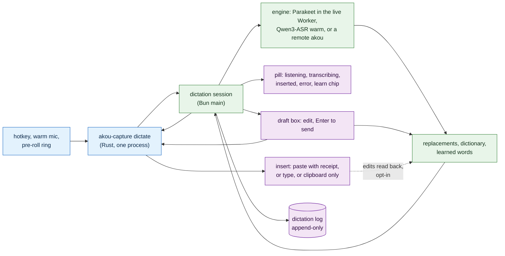

# Dictation

How akou types what you say into whatever app has the keyboard: hold a key, speak, let go, and the text lands where the cursor is. This is what Handy, Wispr Flow, VoiceInk, SuperWhisper, OpenWhispr, Aqua Voice and TypeWhisper do, and akou already owns most of the parts they had to build: a mic-only capture helper, a speech model loaded at start, a global hotkey, a floating window that never takes focus, a settings registry drawn by both the desktop window and the server page, and a vocabulary that grows only by what you approve. Dictation adds the parts that are missing and one thing none of the competitors ships: the same app can be a frontend only, sending the audio to another akou that holds the model, and a machine can run it with no local model at all.

The recording side of akou is in [DESIGN.md](../DESIGN.md), the desktop shell in [DESKTOP.md](DESKTOP.md), the doors in [PROGRAMMABILITY.md](PROGRAMMABILITY.md), server mode in [SERVER.md](SERVER.md), the engines in [asr-architecture.md](../research/asr-architecture.md). Priorities, ids and the shape of a line follow [PROGRAMMABILITY.md section 2](PROGRAMMABILITY.md#2-priorities-ids-and-the-shape-of-a-line). Every id here starts with `DC-`.

Two words used throughout. **Push-to-talk** means the key is held while you speak and released to finish. **Insert** means akou puts the text into the app that has the keyboard, by whatever method that app accepts.

## 0. The simple version

- **One key, every app.** Hold the dictation key and talk; release it and the text is inserted at the cursor. A short tap latches the key so you can talk hands-free, and the same tap, or silence, stops it. A second key opens a draft box instead, where you read the text before you send it.
- **Nothing is lost at either end.** The first press opens the mic and the pill says `listening` only once real audio arrives; after each dictation the mic stays open for 30 s with a half-second ring buffer running, so a quick follow-up keeps its first syllable too (never on a Bluetooth headset). Capture runs a quarter second past the release, so the last syllable is in. The old clipboard comes back only after the target app has read the new one.
- **It learns, but only with your yes.** When you fix a word akou heard wrong, in the draft box or right in the app you dictated into (the default path, P0), akou offers to learn it once, as one small chip with Learn, Not a word, and nothing else. Ignore it and nothing changes. A learned word is a deterministic replacement in dictation only, never in a call transcript; steering the recognizer with it happens only where a measured gate says it helps.
- **Fast by default, best when the box can.** A five-second utterance comes back from Parakeet in about 0.1 s. On a machine with a GPU, Qwen3-ASR gives the better transcript in under a second. A machine with neither can send the audio to another akou you run, over a scoped key, and fall back to a local model or to a clear error when that akou is down, never silently to anything else. A local `best` that fails or stalls falls back to `fast`, and says so.
- **Same page in the window and in the browser.** The Dictation settings page is one page of the shared UI. The desktop shows all of it; the server-mode page shows the part that governs what the server does for dictating clients.
- **You always know it is listening.** The pill, the tray icon and a soft cue (on by default wherever the pill is off) show `listening` and `transcribing`; a latched session stops itself after 30 s of silence.
- **Private.** The floating pill shows a level meter, never the text, unless you turn the preview on. Nothing is typed into a password field. History and audio stay on the box and expire on a timer you set.


```mermaid
flowchart LR
  classDef door fill:#e3f2fd,stroke:#1565c0,color:#0d2a4a
  classDef core fill:#e8f5e9,stroke:#2e7d32,color:#14321c
  classDef out fill:#f3e5f5,stroke:#6a1b9a,color:#2e0b40

  Key["hotkey, warm mic,<br/>pre-roll ring"]:::door
  Helper["akou-capture dictate<br/>(Rust, one process)"]:::door
  Sess["dictation session<br/>(Bun main)"]:::core
  Eng["engine: Parakeet in the live Worker,<br/>Qwen3-ASR warm, or a remote akou"]:::core
  Vocab["replacements, dictionary,<br/>learned words"]:::core
  Pill["pill: listening, transcribing,<br/>inserted, error, learn chip"]:::out
  Draft["draft box: edit, Enter to send"]:::out
  Ins["insert: paste with receipt,<br/>or type, or clipboard only"]:::out
  Hist[("dictation log<br/>append-only")]:::out

  Key --> Helper --> Sess --> Eng --> Vocab --> Sess
  Sess --> Pill
  Sess --> Draft --> Helper
  Sess --> Helper --> Ins
  Sess --> Hist
  Draft --> Vocab
  Ins -.->|edits read back,<br/>opt-in| Vocab
```

## 1. What we do not build

| Not built | Why | What covers the need |
|---|---|---|
| A cloud recognizer, or any akou-run relay | akou has no cloud ([POSITIONING.md](../POSITIONING.md)). Dictation is the most private text a person types | Local engines, or another akou the user runs (section 7) |
| Silent auto-learning by default | Wispr and OpenWhispr add words silently; OpenWhispr then needed a stoplist because "why" to "what" became a rule, and our own measurement turned overweighted entries into false names ([DESIGN.md](../DESIGN.md) "Parakeet decodes greedy by default") | The chip with Learn and Not a word (DC-L4); `dictation.learn` `auto` exists for those who want it, off by default |
| Writing accessibility flags into other apps to read their fields | `AXManualAccessibility` and `AXEnhancedUserInterface` change how the target app behaves; OpenWhispr saw focus lost in a chat app after setting one | When a field cannot be read, akou learns nothing for that dictation (DC-L2). The draft box needs no accessibility at all |
| Command or edit mode, where a spoken instruction rewrites the selection | It needs a model that follows instructions, and every rewrite is unverifiable in the field. The user's own harness already does this on selected text | Parked (section 12), with the LLM formatting opt-in (DC-U6) as the first step |
| Backtrack ("at 2, actually 3", "scratch that") without a model | A rule-based version misfires on normal speech that contains "actually" | Parked; it becomes a line of the LLM formatting prompt once DC-U6 lands |
| A stats dashboard (words per minute, top apps) | It is a chart over the history and nothing acts on it | `akou dictations list --json` and the history page (DC-H1) hold the data |
| Voice snippets (a spoken trigger that expands to a paragraph) | A replacement rule with a long right-hand side does the same | The replacement editor (DC-U5) accepts multi-line targets |
| File transcription from the dictation page | Owned by [SERVER.md](SERVER.md) SV-D1 as `akou transcribe FILE` | `akou transcribe` |
| A second settings UI | The page is the shared `src/ui` bundle in both modes | DC-U1 |
| Dictation over MCP (an agent starting a dictation) | The result is typed into whatever app the user is looking at; a tool an agent can auto-approve must never do that | MCP reads history only (DC-G5) |

## 2. Decisions this reverses

Three recorded lines say dictation is out. Each is reversed here, naming the line that changes, so the docs stay in one voice.

| Id | Feature | P | From | Acceptance | Today |
|---|---|---|---|---|---|
| DC-D1 | Dictation is a product feature. [REQUIREMENTS.md](../REQUIREMENTS.md) line 211 marks the dictation recipe "dropped", [PRINCIPLES.md](PRINCIPLES.md) open decision 2 says "dictation to the clipboard" is "not brought back", and [COMPETITOR-MATRIX.md](COMPETITOR-MATRIX.md) row EXP-09 sits on "decision (2)". All three are rewritten: REQUIREMENTS I4.6 reads "carried, as dictation (DICTATION.md)", open decision 2 adds "dictation is DC-D1's", and EXP-09 points at DC-A1 | P0 | owner: "akou should become like Handy" | The three lines carry the new text; the matrix has no row that still says dictation is dropped (a grep over the three files for "dropped" next to "dictation" finds nothing) | has: REQUIREMENTS I4.6, PRINCIPLES open decision 2 and matrix row EXP-09 carry the new text |
| DC-D2 | The floating window may carry transcript text, under its own rule. DK-F1 says the indicator never receives transcript text because it stays up during a screen share. The dictation pill is a second window with a second rule: no text by default; a live preview only with `dictation.pillPreview` on; hidden from screen capture wherever DK-P3 can do it; and the preview is never shown while `app.hideFromCapture` is off on an OS that cannot hide the window. `app.hideFromCapture` is DK-P3's (P1, not in the schema yet): until it lands, `dictation.pillPreview` stays off, refuses `true` with that reason, and its doc says so | P0 | DK-F1's rule would forbid the draft box and the learn chip | Before DK-P3, `PATCH /config {"dictation.pillPreview": true}` is refused naming DK-P3. A test renders the pill with a transcript and the preview off and finds no text in its DOM; with the preview on and a fake `hideFromCapture: false` on Linux, the same holds; with the preview on and the window hidden from capture, the text shows (positive control) | partial: the pill page has no text field in any state and reads each field by name ([pill-protocol.ts](../../src/ui/pill-protocol.ts), tested in `tests/ui/dictation.test.ts`); `dictation.pillPreview` is in the registry and refuses `true` naming DK-P3 ([schema.ts](../../src/main/config/schema.ts)); the main side ([pill.ts](../../src/main/window/pill.ts)) builds every state from named fields and sends a partial only through `pillPreview`, with the window never hidden from capture before DK-P3. `tests/ui/dictation-pill-main.test.ts` feeds the real pill page from it over a session with a known transcript: no words with the preview off, none with it on and the window not hidden, the partial with both (the positive control) |
| DC-D3 | `PRINCIPLES.md` "How a UX item becomes work" adds `DC` and this document to the owning prefixes; [INDEX.md](../INDEX.md) gains one line for it; the "What we do not build" table of [DESKTOP.md](DESKTOP.md) keeps "transcript text in the floating indicator" refused and points here for the pill. The docs lint PRINCIPLES describes does not exist yet, so this item writes it first: `tests/docs-ids.test.ts` parses every `\| ID \|` row of the owning docs, fails when a matrix owner id does not resolve or when two docs define one id | P1 | SV-D4's precedent; PRINCIPLES "A lint keeps it honest" | The lint passes on the tree; its positive control, a matrix row pointing at `DC-Z99`, fails it; INDEX has the line | has: [INDEX.md](../INDEX.md) has the line, PRINCIPLES lists `SV` and `DC` among the owning prefixes, DESKTOP's refusal points here for the pill, and `tests/docs-ids.test.ts` is the lint, with `DC-Z99` as its positive control |

## 3. Feature inventory

Every feature found in the seven open-source apps whose settings code was read (Handy, OpenWhispr, VoiceInk, Whispering, TypeWhisper, voxtype, whisper-writer) and the paid ones read from their docs (Wispr Flow, SuperWhisper, Aqua Voice, MacWhisper, Monologue, Spokenly, Voibe), plus macOS Dictation and Windows voice typing. "Decision" is what akou does: a priority and the owning id, or a skip with the reason. Every row has one; "research list" marks a row taken from the review of these apps where no single app is the source.

| Feature | Who has it | Decision |
|---|---|---|
| Push-to-talk (hold to record) | all | P0, DC-A1 |
| Toggle (tap to start, tap to stop) | all | P0, DC-A1 |
| Hold-or-toggle on one key (hold is push-to-talk, a short tap latches) | Handy (default, 300 ms), VoiceInk (0.5 s), SuperWhisper, TypeWhisper | P0, DC-A1, the default |
| Double-tap for hands-free lock | Wispr, Aqua, VoiceInk | Skip: the tap of hold-or-toggle already latches, and a double-tap threshold adds a second timer to tune |
| A separate hands-free chord | Wispr (Fn+Space) | Skip: same reason |
| Hands-free with silence auto-stop | whisper-writer, Whispering, Wispr, macOS Dictation (30 s) | P1, DC-A3 |
| Continuous mode: keep listening and insert at every pause | whisper-writer | Skip: each pause inserts into whatever has focus minutes later, which the focus guard (DC-N9) cannot vouch for; a latched session into the draft box covers long dictation |
| Maximum session length | Wispr (20 min), voxtype (60 s) | P1, DC-A3 |
| Cancel key while listening | all (Escape) | P0, DC-A4 |
| Modifier-only hotkeys (Fn, Right Command, Right Ctrl) | Wispr, OpenWhispr, VoiceInk, TypeWhisper, Handy, voxtype | P0, DC-A2, the macOS and Windows default |
| Another key during a modifier-only hold cancels the session and passes the chord through | OpenWhispr (Fn+Arrow), Handy | P0, DC-A1 |
| Left and right modifiers told apart | Wispr, Handy, OpenWhispr | P0, DC-A2 |
| Fn or Globe as the key | Wispr, Aqua, OpenWhispr | P1, DC-N2 (needs the Globe action parked and restored) |
| Mouse buttons as the trigger | Wispr, VoiceInk, SuperWhisper, Aqua | P2, DC-A6 |
| Extra hotkeys: paste last, copy last, retry, fix last, open history | Wispr, VoiceInk, Handy, SuperWhisper | P0, DC-A5 fix last (Shift with the dictation key by default); P1 paste last; P2 for the rest |
| Hotkey recorder in settings, with conflicts shown | all GUI apps | P0, DC-U3 (extends DK-K5) |
| CLI toggle for compositors that own hotkeys (Wayland) | Handy, voxtype, Speech Note | P1, DC-G3 |
| Deep links (`app://record`) | SuperWhisper | Skip: [PROGRAMMABILITY.md](PROGRAMMABILITY.md) PG-U2 parks acting links; the CLI covers it |
| Overlay pill with level meter | all | P0, DC-O1 |
| Clickable Stop and Cancel on the pill | all overlays | P0, DC-O1 |
| Tray or menu bar state, and a click to start | SuperWhisper | P0, DC-O4 |
| Language switch in the pill | research list | P2, DC-E4 |
| Pill position (bottom, top, edges, draggable) | Handy, Wispr, OpenWhispr | P0, DC-O1 |
| Live text preview in the pill | Handy, VoiceInk, OpenWhispr, SuperWhisper, Aqua | P1, DC-O2, off by default |
| Overlay hidden on Linux by default (focus theft) | Handy | P0, DC-O1 carries the rule |
| Start, stop, cancel, done sounds | all (Handy at full volume, OpenWhispr on) | P1, DC-O3, on by default wherever the pill is off |
| Mic picker, follow system default | all | P0, DC-U4 |
| Clamshell mic (lid closed) | Handy | P2, DC-U4 |
| Prefer the built-in mic over a Bluetooth headset | (none explicit; the HFP profile drop is documented in every issue tracker) | P1, DC-N5 |
| Warm mic, always-on stream | Handy (`lazy_stream_close`), OpenWhispr (`micWarmHoldSeconds`) | P0, DC-N4, `auto`: open for 30 s after each dictation |
| Pre-roll ring buffer | Handy (450 ms VAD prefill) | P0, DC-N4 |
| Tail buffer after release | Handy | P0, DC-N4 |
| Mute or pause other audio while dictating | Wispr, VoiceInk, OpenWhispr, SuperWhisper, voxtype, Handy | P2, DC-U8, off by default (VoiceInk once started a music app by itself) |
| Insert by clipboard plus paste | all | P0, DC-N6 |
| Clipboard restored after the target read it (receipt-based) | Handy `paste_tx` | P0, DC-N6 |
| Keep the transcript in the clipboard, no restore | Handy (`DontModify`), OpenWhispr (`keepTranscriptionInClipboard`) | P1, DC-N6, `dictation.restoreClipboard` |
| A fixed per-app paste delay | research list | Skip: the receipt of DC-N6 replaces a fixed delay |
| Paste into an elevated window fails with no error (Windows UIPI) | research list | P0, DC-N6: detected, clipboard only with a hint |
| Transient clipboard types so clipboard managers skip the text | Handy, VoiceInk | P0, DC-N6 |
| Insert by typed keystrokes (VDI, Citrix, games) | SuperWhisper, Handy, voxtype, whisper-writer | P1, DC-N7 |
| Insert by accessibility API | VoiceInk (AppleScript), OpenWhispr (read) | Skip: none of them ships it as an insert path, and Chromium apps need flags akou refuses to set |
| Clipboard only, no paste | Handy, OpenWhispr, SuperWhisper, Whispering | P0, DC-N6, as the no-grant fallback |
| Terminal detection: Ctrl+Shift+V or Shift+Insert | OpenWhispr, Handy, voxtype | P1, DC-N7 |
| Layout-resolved paste key (Dvorak, non-US) | OpenWhispr, Handy | P0, DC-N6 |
| Held hotkey modifiers released before the paste | VoiceInk, OpenWhispr | P0, DC-N6 |
| Trailing space, smart spacing and case | Handy, VoiceInk, whisper-writer, Wispr | P1, DC-S4 |
| Send (press Enter after the insert) | Handy, VoiceInk, Whispering, SuperWhisper, Wispr, Aqua | P0, DC-S2 |
| Spoken send command ("send it") | Aqua, Wispr | P2, DC-S5, off by default |
| Secure-field guard | Wispr, Handy, Windows | P0, DC-N8 |
| Focus change guard (text lands in the wrong window) | SuperWhisper, OpenWhispr | P0, DC-N9 |
| Per-app modes (engine, language, insert method, draft, send) | VoiceInk, SuperWhisper, TypeWhisper, Wispr Styles | P1, DC-U9 |
| Per-website modes | VoiceInk, TypeWhisper | Skip: needs a browser extension or the URL from accessibility, which is per browser; the per-app rule covers the browser as one app |
| LLM cleanup or formatting | Handy, OpenWhispr, VoiceInk, SuperWhisper, TypeWhisper, voxtype, Whispering | P1, DC-U6, off by default, through the user's provider as akou already does |
| Context for the LLM (selection, clipboard, screenshot) | SuperWhisper, Wispr, Aqua, VoiceInk | Skip: SuperWhisper's own docs say unneeded context lowers quality, and a screenshot of the screen is the privacy scare Wispr had. The harness has the context already |
| Command or edit mode | Wispr, Aqua, OpenWhispr | Skip, section 1 |
| Backtrack and "scratch that" | Wispr, Talon | Skip, section 1 |
| Custom dictionary or vocabulary | all | P0, DC-L6, the existing vocabulary files |
| Replacement rules | SuperWhisper, Wispr, voxtype, VoiceInk, TypeWhisper | P0, DC-U5, DC-L6 |
| Snippets with placeholders (`{{DATE}}`, `{{CLIPBOARD}}`) | TypeWhisper, Wispr | Skip: a static replacement cannot produce them, and `{{CLIPBOARD}}` pastes whatever was copied last into a field the user did not look at; fixed text is a replacement (DC-U5), and a date can be a line of the DC-U6 prompt |
| Auto-learn from corrections | Wispr, OpenWhispr, VoiceInk, TypeWhisper | P0, DC-L1 to DC-L5, as a chip, never silent by default |
| Learn from edits in the app's field (accessibility) | OpenWhispr, VoiceInk, TypeWhisper | P0, DC-L2, on wherever the read needs no new grant |
| Learn from edits in a draft box | TypeWhisper (history) | P0, DC-L1 |
| Manual review queue for learned words | VoiceInk | P0, DC-L5, the existing "Words to review" |
| Spoken punctuation and formatting commands | macOS, Windows, voxtype, nerd-dictation | P1, DC-S6, a fixed list per language |
| Filler-word removal | Handy, Wispr, Windows | P1, DC-S7 |
| Language: fixed or auto | all | P0, DC-E4 |
| Translation to another language | Handy, OpenWhispr, SuperWhisper, TypeWhisper, voxtype | Skip: no engine in the registry translates; the LLM formatting prompt can, once DC-U6 lands |
| Streaming partials during the hold | Handy, VoiceInk, OpenWhispr, SuperWhisper, Aqua | P2, DC-E5, preview only; the inserted text is always the offline pass |
| Model unload after idle | Handy, SuperWhisper, voxtype | Skip for Parakeet (the live model stays loaded at start already); P1 for llama-server, DC-E2 |
| Local or cloud, bring your own key | most | Skip cloud, section 1 |
| Remote or self-hosted server | OpenWhispr, voxtype, Whispering, whisper-writer, TypeWhisper | P0, DC-R1 to DC-R4 |
| Fallback engine when the main one fails | OpenWhispr | P0, DC-R3, explicit and announced |
| History with copy, re-insert, retry, delete | Handy, SuperWhisper, VoiceInk, OpenWhispr, TypeWhisper, Wispr | P0, DC-H1 |
| Retention timers for text and audio | Handy, VoiceInk, OpenWhispr, Wispr (14 d) | P0, DC-H2 |
| Telemetry and training opt-ins | Wispr, Aqua, OpenWhispr | Skip: akou has no telemetry and trains nothing |
| Launch at login, tray, start hidden | all | Has: DK-L1; dictation adds nothing |
| Onboarding for mic and accessibility grants | all | P0, DC-N3 |
| Stats dashboard | SuperWhisper, Wispr, TypeWhisper | Skip, section 1 |
| File transcription | SuperWhisper, OpenWhispr, MacWhisper | Has: `akou transcribe` (SV-D1) |
| Agent and MCP integration | SuperWhisper, Spokenly, OpenWhispr, Monologue | P1, DC-G5, read-only |
| Settings sync between machines | SuperWhisper, Wispr, TypeWhisper, VoiceInk | Skip: `config.json` and the vocabulary files are plain files; the user syncs the folder |
| Hotwords or a prompt sent to the recognizer | Handy (Whisper only), OpenWhispr, SuperWhisper | P1, DC-L7, behind a measured gate, section 8.4 |
| A "Report issue" on a history item | SuperWhisper | Skip: DK-O5's doctor bundle covers it |

## 4. Activation

The hotkey and the key-release detection live in the Rust helper (section 8), because ElectroBun's `GlobalShortcut` fires on key-down only on every OS and cannot see Fn on macOS. The settings, the pill and the session logic live in the Bun main process behind the `NativeUi` seam of [shell.ts](../../src/main/window/shell.ts).

| Id | Feature | P | From | Acceptance | Today |
|---|---|---|---|---|---|
| DC-A1 | `dictation.hotkey` with `dictation.activation` `hold-or-toggle` (default), `hold` or `toggle`. Hold-or-toggle: a press held 300 ms or longer is push-to-talk and ends at release; a shorter tap latches listening on, and the next tap, Escape, or DC-A3 ends it. The interrupt rule, for a modifier-only key: a press counts only when it is released with no other key pressed in between. Any other key pressed while it is held cancels at once (nothing transcribed: a press still under 300 ms leaves no trace, a confirmed hold ends as `cancelled`), passes that key through unchanged and never latches, so Right ⌘+C or Right Ctrl+C stays a copy; the modifier itself is never swallowed. Once the press is a session (held 300 ms, or latched), Escape, Enter and Shift+Enter are DC-A4's even while the modifier is still down, so Enter during a push-to-talk hold ends and sends instead of reaching the app as Right ⌘+Enter; before that, Enter is the interrupt rule like any key. A press of the dictation key while a session is transcribing is DC-A4's. `dictation.enabled`, default false, is the master switch; with it off the helper's dictate process is not started and no hotkey is taken | P0 | Handy's `HoldOrToggle` at 300 ms, the category default | With a fake key source: down and up at 800 ms yields one session ending at the up; down and up at 120 ms then down and up again at 3 s yields one session of about 3 s; `RightCommand` down, `c` down and up, `RightCommand` up within 120 ms yields no session and the fake tap reports `c` not swallowed, while the same presses without `c` latch (positive control); a 1 s hold with `c` at 800 ms ends as `cancelled` and passes `c` through; with `dictation.enabled` false no helper is spawned and `GET /config` says so | has: the helper's rule in [activation.rs](../../native/akou-capture/src/dictate/activation.rs), its port for the fake helper in [activation.ts](../../src/core/dictation/activation.ts) held to the same tables, and `dictation.enabled` and `dictation.activation` in [service.ts](../../src/main/dictation/service.ts); a press interrupted before it became a session sends nothing, a confirmed hold interrupted ends as `cancel` |
| DC-A2 | Modifier-only and side-specific keys: `RightOption`, `RightControl`, `RightCommand`, `RightShift`, `Fn`, and the left versions, are valid values of `dictation.hotkey` beside chords. Defaults: macOS `RightCommand`, since Option is the symbol layer of every ISO layout (Spanish, German, French and Italian type `@`, `#`, `[`, `]`, `{`, `}`, `\|`, `\` and `€` with it) and no layout puts characters on Command; Windows `RightControl`, with the interrupt rule of DC-A1 keeping Right Ctrl+C a copy; Linux `Control+Shift+Space`, because the GlobalShortcuts portal binds chords only and the default must work on every Linux backend. `hotkeyWarning` in [hotkey.ts](../../src/main/window/hotkey.ts), which today warns about AltGr off macOS only, also warns on macOS for a modifier-only Option key and for Option with a character key and no other modifier. A chord of a left and a right of the same modifier is refused. On macOS a modifier-only key keeps working while Secure Input is on (a password field, a terminal with secure entry), where a keyed chord dies silently; DC-N1 explains | P0 | Wispr (Fn), OpenWhispr (Globe), Handy, VoiceInk (Right Command); the Secure Input trap of Handy #1578 | `parseHotkey("RightCommand")` gives a modifier-only binding; `LeftOption+RightOption` is refused with a message; `hotkeyWarning("RightOption", "darwin")` names the symbol layer and `hotkeyWarning("RightCommand", "darwin")` is null; on macOS with a fake secure-input flag on, a `RightCommand` press starts a session and a `Command+Shift+D` press does not, and the pill says why | partial: `parseHotkey`, the fix-last form, the macOS Option warning and the defaults in [hotkey.ts](../../src/main/window/hotkey.ts), refused at save through `dictation.hotkey`; the Secure Input case waits for the helper's backend and the pill |
| DC-A3 | Two ways a latched session ends by itself. `dictation.silenceStopSeconds`, default 30, ends a latched session (never a push-to-talk hold) after that many seconds without speech, judged by the VAD akou already runs, so a forgotten tap does not paste minutes of room noise; 0 turns it off; `dictation.maxMinutes`, default 20, ends any session at that length after a pill warning at one minute before, and the audio is still transcribed, never dropped | P1 | whisper-writer VAD stop, Wispr's 19/20 minute rule; macOS stops at 30 s of silence | With the fake clock and a fake VAD, a latched session with `silenceStopSeconds: 3` ends 3 s after the last speech frame and its audio is transcribed; with 0 it runs to the tap (positive control); a session at `maxMinutes` ends with the warning event 60 s earlier in the log | missing |
| DC-A4 | Keys during a session, on a backend that reports `swallow_keys` in `ready` (the macOS event tap, the Windows hook, evdev with a grab and re-injection). From the moment the press is a session (a chord at key-down, a modifier-only key once DC-A1 confirms it) until `inserted` or `insert.failed` (at most the 8 s receipt timeout of DC-N6), the helper swallows Escape, Enter and Shift+Enter so they never reach the app under the cursor. While listening: Escape cancels (nothing is transcribed, the audio is kept in history as `cancelled` for `dictation.retainDays`); Enter ends the session and inserts, then presses the send key (DC-S2); Shift+Enter ends the session and opens the draft box (DC-S1) whatever the mode. While transcribing, so the natural release-then-Enter never sends an empty field: Enter means send after the insert, Escape cancels the insert and keeps the text in history as `cancelled`. A press of the dictation key while transcribing is refused with a pill flash (`still transcribing`), never queued; a press while the draft box has focus appends the new dictation to the draft. On a backend without `swallow_keys` (the GlobalShortcuts portal, the CLI) no key but the hotkey does anything in a session, the pill shows only the hotkey hint, and sending is the draft box's or `dictation.sendAlways`'s. Outside a session the helper swallows nothing | P0 | VoiceInk's Return-to-send while the recorder is open; SuperWhisper cancels at once; the Handy `auto_submit` race | With a fake key source and a fake inserter: Escape during a session produces no insert and a `dictation.cancelled` event; Enter produces the insert followed by one send-key press; Shift+Enter produces a `draft.opened` event and no insert; Enter 200 ms after the release, before the fake receipt, is swallowed and yields the insert then the send key; a dictation key press while transcribing starts no session and flashes `still transcribing`; a fake backend without `swallow_keys` passes Enter through and the pill shows no Enter hint; the same keys with no session are passed through (positive control: the fake tap records them as not swallowed) | missing |
| DC-A5 | Two more hotkeys. `dictation.hotkeyFixLast` (P0) opens the last dictation in the draft box for correcting and teaching (DC-L1), without touching the app it went into; its default is Shift with the dictation key (`Shift+RightCommand` on macOS, `Shift+RightControl` on Windows), Shift held before the dictation key goes down, since Shift pressed during a hold is DC-A1's interrupt; Linux `Control+Shift+Period`. `dictation.hotkeyPasteLast` (P1, empty by default) inserts the last dictation's text again | P0 (fix last), P1 (paste last) | VoiceInk `retryLastTranscription`, `quickAddToDictionary`; Wispr paste last; the owner's learning ask on the default path | With the defaults, Shift down then `RightCommand` down and up opens the last dictation in the fake draft box and starts no session; `RightCommand` down then Shift is the interrupt (positive control); with paste last set, a fake press inserts the last text; with it empty no binding exists | partial: `dictation.hotkeyFixLast` and `dictation.hotkeyPasteLast` are settings and the default fix-last binding is sent to the helper; the helper does not act on them and the draft box is not written |
| DC-A6 | Mouse buttons 3 to 5 as `dictation.hotkey` values, hold-or-toggle like a key. Left, right and the wheel are refused | P2 | Wispr Mouse Flow, SuperWhisper (a hold may not be detectable on some mice) | `Mouse4` parses and a fake button-down and button-up runs a session; `Mouse1` is refused | partial: the helper parses `Mouse3` to `Mouse5` (swallowed like a chord's key, so Mouse4 does not also go back a page) and runs a session from a fake button in [activation.rs](../../native/akou-capture/src/dictate/activation.rs); the macOS tap sees buttons 3 to 5, and Windows installs a `WH_MOUSE_LL` hook only while a button is bound or the recorder is open; Linux and the app's hotkey parser are not written |
| DC-A7 | A changed dictation hotkey applies at once from any door, the same rule as DK-K3, by sending the helper a `rebind` command. A binding the helper cannot take comes back as the error on that door and the old binding stays | P0 | DK-K3; a hotkey that needs a restart is a control that does nothing | `PATCH /config {"dictation.hotkey": "RightShift"}` makes the fake helper receive `rebind` and a press of the new key start a session; a refusal keeps the old key working | has: a change to any dictation key waits for the helper's `rebound` before it is saved, and a `rebind.failed` is the door's `bad_setting` error with the old key kept ([index.ts](../../src/main/index.ts) `saveConfig`) |

## 5. The pill, the draft box and sending

### 5.1 The pill

The pill is a second small window built like the floating indicator (`openIndicator` in [shell.ts](../../src/main/window/shell.ts)): no title bar, above every other window, on every workspace, never activated. It has five states and one optional chip. On macOS it is an `NSPanel` with the `NonactivatingPanel` style, so a click on one of its buttons never takes the keyboard from the target app.

```
listening                           transcribing                inserted / copied
+-------------------------------+   +-------------------------+   +-------------------------+
| o  |||||||||....    0:04      |   | (  )  transcribing 0:03 |   | v  inserted             |
|    Esc cancel  Enter send     |   +-------------------------+   +-------------------------+
|              [Stop]  [Cancel] |
+-------------------------------+

error                                              learn chip (under any state, at most one)
+-----------------------------------------------+  +-----------------------------------------------+
| !  remote akou not reachable                  |  | Learn "Kubernetes" (heard "cooper netties")?  |
|    [Retry locally]  [Copy]  [Open draft]      |  |                    [Learn]  [Not a word]   x  |
+-----------------------------------------------+  +-----------------------------------------------+
```

| Id | Feature | P | From | Acceptance | Today |
|---|---|---|---|---|---|
| DC-O1 | The pill: `listening` with a level meter, the elapsed time, the key hints (DC-A4, only those the backend can honour) and clickable Stop and Cancel for a user away from the keyboard; `transcribing` with a spinner and the elapsed time once past 2 s; `inserted` (or `copied` when the clipboard-only path ran) shown for 1.5 s; `error` with the message and up to three buttons (Retry, Copy, Open draft); hidden otherwise. It opens on the display that holds the target window captured at session start. `dictation.pill` is `bottom` (default), `top`, `left`, `right` or `off`; the pill is draggable and its position remembered per display, like DK-F1. On Linux the default is `off`, because a compositor may give it focus and the paste then lands in the pill; a Linux user turns it on knowingly and the setting's doc says why; the tray (DC-O4) and the cue (DC-O3) carry the state there. The pill never takes focus on any OS, a click included: macOS opens it with `styleMask: {NonactivatingPanel: true}` (in ElectroBun 2.0.1's `BrowserWindow`, to be declared in [electrobun-sdk.d.ts](../../src/main/window/electrobun-sdk.d.ts) and the `NativeUi` seam), `activate: false` and `showInactive`; Windows sets `WS_EX_NOACTIVATE` through `bun:ffi`, since the SDK has no flag for it | P0 | Handy (None on Linux), Wispr Flow Bar, OpenWhispr panel; `activate: false` governs only the first show, a click on a plain window still activates it | A Playwright test drives the five states through the rig and checks the DOM of each; Stop and Cancel call the session routes; the level meter moves on fake levels; with `dictation.pill: off` no window opens (positive control); the frame is restored after a drag and a restart; a unit test on the `NativeUi` fake asserts the pill's options carry `NonactivatingPanel: true` on macOS and the no-activate style on Windows; with a fake target on the second display the pill opens there | partial: the page side ([pill.ts](../../src/ui/pill.ts)) has the five states, the meter, the honoured hints and the buttons, tested in `tests/ui/dictation.test.ts`. The main side ([pill.ts](../../src/main/window/pill.ts), `syncPill` in [shell.ts](../../src/main/window/shell.ts)) opens the window hidden while dictation runs and `dictation.pill` is not `off`, shows it without focus for a session, tells it listening (the Escape hint only where the key source swallows keys), transcribing, inserted or copied for 1.5 s and an error for 5 s, and answers Stop and Cancel through the session door; the page pulls the state when it boots. macOS opens it with `NonactivatingPanel`, Windows with `WS_EX_NOACTIVATE` ([native.ts](../../src/main/window/native.ts)); its place follows the edge, and a drag is kept per edge in `shell.json`. Not yet: the error's buttons (they wait for the draft box), the chip (DC-L4), the target's display (the helper does not report it), and a place per display. `dictation.pill` defaults to `off` on Linux ([schema.ts](../../src/main/config/schema.ts)) |
| DC-O2 | `dictation.pillPreview`, default false: the words recognised so far during a latched session, in the pill, under the rule of DC-D2. With the preview off the pill's page never receives text, enforced on the main side like `indicatorStatus` cuts the indicator's status | P1 | Handy Live, VoiceInk `ShowLiveTranscript`; DC-D2 | With the preview off, a session's RPC to the pill page carries no `text` field (a test reads every message); with it on, the page shows partials | partial: the pill page shows the `preview` message while listening and drops it at the next state ([pill.ts](../../src/ui/pill.ts)), and `pillPreview` in [pill-protocol.ts](../../src/ui/pill-protocol.ts) is the gate the main side sends each partial through (the preview on and the window hidden from capture), tested in `tests/ui/dictation.test.ts`; the main side sends a partial only through that gate (`preview` in [pill.ts](../../src/main/window/pill.ts)), and a test reads every message of a session for the words; the partials themselves (DC-E5) are not written |
| DC-O3 | Sounds for start, stop, cancel and done, `dictation.sounds`, default `auto`, values `auto`, `off`, `soft`, `click`; `auto` is `soft` whenever the pill is off (the Linux default) and `off` while the pill shows, so a session is never silent and invisible at once. The start cue plays before the readiness gate opens the session and the stop cue after the post-roll ends, and the VAD trims the edges, so the recognizer does not transcribe them; the output device follows the system. Never a test signal: tests render the cue to a buffer and assert its length, and no test opens an output device | P1 | every competitor ships cues on (Handy at volume 1.0, OpenWhispr `audioCuesEnabled: true`); DK-P5 parks a recording cue because a call's mic hears it; here the mic is the user's own | With `soft`, the fake player receives four distinct buffers at the four moments; with `off` it receives none; with `auto` and the pill off it receives four, with the pill on none; the suite has no call that opens a real output (the speaker rule of [TESTING.md](../TESTING.md)) | partial: [dictation-cues.ts](../../src/ui/dictation-cues.ts) has the `auto` rule, renders the eight cues as WAV bytes and hands them to a player seam, tested with a fake player in `tests/ui/dictation-cues.test.ts`; no session calls it yet, and no real player is written |
| DC-O4 | The tray icon carries `listening` and `transcribing` on every OS, whatever the pill setting, and its menu has Start dictation and Stop (the same routes as DC-G1). With the pill off, the learn chip falls back to one `showNotification` per dictation with candidates plus a count on the page's "Words to review" | P0 | SuperWhisper's menu bar; the pill is off on Linux by default, so there must be one other signal | With the pill off, a fake session puts the tray fake in `listening` then `transcribing` then idle; the menu's Start calls `POST /v1/dictation/start`; a candidate with the pill off yields one notification and a review count of one | partial: the tray's title says `dictating` and `transcribing` and its menu has Start dictation and Stop, through the same session door as `POST /v1/dictation/start` ([shell.ts](../../src/main/window/shell.ts) `trayMenu`, `trayTitle`); the notification and review count with the pill off wait for the chip (DC-L4) |

### 5.2 The draft box

The draft box is where a dictation lands when you want to read it before it goes anywhere. It is the second mode of every press, and the place where learning is exact, because akou owns the text field.

```
+--------------------------------------------------------------------+
| Draft                                              to: Slack  (x)  |
|--------------------------------------------------------------------|
| Tell the cooper netties team the rollout is on Thursday, then      |
|          ~~~~~~~~~~~~~~                                            |
| ping me.                                                           |
|                                                                    |
|  Learn "Kubernetes" (heard "cooper netties")?  [Learn] [Not a word]|
|--------------------------------------------------------------------|
| fast (Parakeet) 0.3 s   [Retry with best v]  [Copy]                |
| Enter: insert   Ctrl+Enter: insert and send   Shift+Enter: newline |
| Esc: discard                                                       |
+--------------------------------------------------------------------+
```

| Id | Feature | P | From | Acceptance | Today |
|---|---|---|---|---|---|
| DC-S1 | The draft box: a floating akou window, opened by `dictation.hotkeyDraft` (empty by default), by Shift+Enter during a session (DC-A4), by a per-app rule (DC-U9), by DC-A5's fix-last, by Fix in history, and automatically when the target cannot take a paste (DC-N9) or the remote is down (DC-R3). The deliberate opens take focus. The automatic ones happen exactly when the user may be typing somewhere else, so they open with `showInactive` and take focus only on a click or a press of the draft key; keystrokes meant for another window never land in the draft. It shows the text in an editable field, the app it will go to, the engine and the time it took, Retry with another engine, Copy, and the key hints. Enter inserts into the app and field captured when the session began (DC-N9), then returns focus there; Ctrl+Enter (Cmd+Enter on macOS) inserts and presses the send key; Shift+Enter is a newline; Escape discards, and the text stays in history as `discarded`. Low-confidence words are underlined from the engine's word confidence where the engine gives one (Parakeet and Qwen do; the remote's `verbose_json` carries no words today), and otherwise the box says `no confidence from this engine` and underlines nothing; a click on an underlined word shows the alternatives from the other engine when two ran, and picking one is an edit like any other | P0 | owner: "it might be good to have a send thing"; Aqua's Send It; VoiceInk's finish-and-send | Playwright: the box opens with the text, Enter calls the insert RPC with the captured target and closes, Ctrl+Enter also sends the send key, Escape writes `discarded` and inserts nothing; an underlined word shows its alternative and picking it changes the field; with a fake engine that returns no words nothing is underlined and the note shows; an automatic open leaves focus where it was (the fake window records no `activate`) and a click moves it into the box | partial: the page side ([draft.ts](../../src/ui/draft.ts)) has the keys, the underlines, the other readings, the no-confidence note and the focus rule, tested in `tests/ui/dictation.test.ts`. The main side ([draft.ts](../../src/main/dictation/draft.ts), the window in [shell.ts](../../src/main/window/shell.ts)) opens the box hidden while dictation runs, shows it without the keyboard when the focus guard refuses an insert and with it from `POST /v1/dictations/{id}/insert`; Enter has the helper bring the captured target forward and insert there, Ctrl/Cmd+Enter presses `dictation.sendKey` after it, a refused insert opens the box again with the user's text, Escape writes `discarded` for a dictation that never reached the app, Copy goes through the helper's clipboard-only insert and Retry shows the new reading (`tests/dictation-draft.test.ts`, `tests/dictation-draft.e2e.test.ts`). The draft key, Shift+Enter and per-app opens wait for the helper (DC-A4, DC-A5) and DC-U9 |
| DC-S2 | Send: `dictation.sendKey`, default `Enter`, values `Enter`, `Ctrl+Enter`, `Cmd+Enter`, `Shift+Enter`, `none`. The send key is pressed only after the paste receipt of DC-N6 reports the target read the clipboard, or after the typed path finished, never on a timer. `dictation.sendAlways`, default false, sends after every direct insert; the per-app rule (DC-U9) overrides it per app. In clipboard-only mode (the no-grant fallback of DC-N3, a secure field, `dictation.insert: clipboard`) nothing is pasted, so send is skipped and the pill says `copied, press ⌘V` (Ctrl+V off macOS) | P0 | Handy `auto_submit` sends only after `paste_tx`'s receipt; VoiceInk's `FinishAndSendKey` | With the fake inserter delaying the receipt by 400 ms, the send key press arrives after it, never before (a test with the receipt withheld sees no send key for 8 s, then the error path); `sendKey: none` presses nothing even on Enter; in clipboard-only mode Enter presses nothing and the pill shows the paste hint | missing |
| DC-S3 | Per press, the user picks the mode by which key they use: the dictation key inserts directly, the draft key opens the box, and the two keys during a session (Enter, Shift+Enter) flip this press. No hold-versus-tap trick decides the mode, because the category uses hold versus tap for push-to-talk versus latch already | P0 | the research verdict against overloading the tap | Covered by DC-A1, DC-A4 and DC-S1; a table test walks every key path and asserts the resulting mode | missing |
| DC-S4 | Spacing and case: `dictation.smartSpacing`, default true, adds a space before the text when the character before the cursor is not whitespace or an opening bracket, and after it when the next character is a letter, and lowercases the first word when the text before the cursor ends mid-sentence. Reading the text around the cursor is the same accessibility read as DC-L2 and sits behind the same one setting, `dictation.readField`; where the surrounding text cannot be read (the setting off, no accessibility, a terminal) it adds a trailing space only when `dictation.trailingSpace` is true (default false) | P1 | Wispr Smart Formatting, Handy `append_trailing_space`, VoiceInk `AppendTrailingSpace` | A unit test over a table of (before, after, text) triples; with the surroundings unknown, only the trailing-space rule fires; with `dictation.readField` off the fake accessibility source records no read | missing |
| DC-S5 | A spoken send: with `dictation.spokenSend` on (default off), an utterance ending in "send it" (Spanish "envíalo") strips those words and sends as Ctrl+Enter would; the phrase counts only at the very end, so "I'll send it tomorrow" stays text | P2 | Aqua Send It, Wispr "press enter" | "tell them I'll send it tomorrow" inserts unchanged; "tell them tomorrow send it" inserts "tell them tomorrow" and presses the send key | missing |
| DC-S6 | Spoken punctuation and layout, `dictation.spokenPunctuation`, default false until the DC-L7 nightly measures it: "punto", "coma", "period" and "point" are ordinary words ("ese es el punto", "the period ended"), both engines already punctuate, and an unmeasured rewrite of what was said is the thing the owner's rule forbids. When on, a fixed list per language (`comma`, `period`, `question mark`, `new line`, `new paragraph`; Spanish `coma`, `punto`, `signo de interrogación`, `nueva línea`, `nuevo párrafo`) is replaced only when the word stands alone between pauses, judged from word times, or, on an engine with no word times (Qwen, the remote), only at the very end of the utterance. The raw text is kept and the draft box shows it. The list is a file the user can override, like templates | P1 | macOS Dictation, Windows voice typing, voxtype | A table test per language; "new paragraph" between two sentences with a pause yields two newlines; "a comma splice is bad" is unchanged; with a fake engine that returns no words, "ese es el punto de hoy" is unchanged and "hasta mañana punto" ends in `.`; with the default off nothing is replaced (positive control for the switch) | has: the rule in [punctuation.ts](../../src/core/dictation/punctuation.ts) (a pause of 0.3 s on both sides, or the end of the utterance with no word times), applied after the fillers; the user's file is `dictation-punctuation.json` in the config folder, a language in it replacing the shipped list ([punctuation.ts](../../src/main/dictation/punctuation.ts)); tested in `tests/dictation-punctuation.test.ts`. A dictation in a language with no list replaces nothing; with no language known, every list applies. `new line` and `new paragraph` insert `\n`, which is text when pasted; the helper's `type` method turns every `\n` into a Return key press, so when `dictation.insert: type` arrives (DC-N7) those marks must not reach it as `\n`. The DC-L7 nightly that would turn it on is not written |
| DC-S7 | Filler removal, `dictation.fillers`, default true: `um`, `uh`, `erm`, `hmm`, and the Spanish `eh`, `este`, `mmm`, removed when they stand alone, gated by the recognised language. The raw text stays in history; only the inserted text changes | P1 | Handy `filler_word_removal_enabled` | "um so the uh plan" inserts as "so the plan"; the history item keeps the raw text; "este libro" in Spanish is unchanged (`este` is only a filler when alone) | has: [fillers.ts](../../src/core/dictation/fillers.ts) after the vocabulary, gated by the language the engine found, else by `dictation.languages` (`asr.languages` when empty); with no language at all only the hesitation sounds go, never `eh` or `este`. The punctuation around a removed filler is mended, and the raw text stays in history |

### 5.3 History

| Id | Feature | P | From | Acceptance | Today |
|---|---|---|---|---|---|
| DC-H1 | A History page in the shared UI: every dictation with its time, the app it went to, the engine, the time it took, its state (`inserted`, `copied`, `drafted`, `discarded`, `cancelled`, `failed`) and the text; Insert again (into the app with the keyboard now, through the draft box so the user sees where it goes), Copy, Retry with another engine (a picker from the installed engines and the remote), Fix (opens the draft box for teaching, DC-A5), Delete. Search over the text, on this page only, since dictations are the user's own words and not a call | P0 | SuperWhisper's history with reprocess, Handy's re-transcribe, Wispr's 14-day recovery of failed pastes | Playwright over a history fixture: every action calls its route; Retry with `best` shows the second result beside the first and lets the user insert either; Delete removes the item and its audio | partial: the page side ([dictation-history.ts](../../src/ui/dictation-history.ts)) lists, searches and pages, and calls insert (Fix adds `fix: true`), retry and delete, tested against fixtures in `tests/ui/dictation.test.ts` and on the real routes there: a spoken dictation through the fake helper is listed, Retry with `best` (Qwen over the fake llama-server) shows its reading beside the first, Insert on either opens the draft box with that text, and Delete removes the item and its audio file; a retry that fell back names the engine it asked for; Insert again uses the dictation's captured target, so a clip sent to the API opens only through Fix. The retry picker lists fast, best and remote rather than the installed engines, since `GET /dictation` does not list them |
| DC-H2 | Retention: `dictation.retainDays`, default 30, deletes a dictation's text, audio and events past it, leaving a tombstone in the log; `0` keeps only the last dictation, for paste-last and fix-last. `dictation.keepAudio`, default true, keeps the Opus file so Retry and the learning check (DC-L3) work; with it false the audio is deleted when the learn window closes (the chip closed or ignored, or DC-L2's 60 s read-back window over), since the check runs after the insert. Delete on one item does the same at once | P0 | Handy's retention enum, VoiceInk's cleanup, privacy | With an injected clock 31 days on, the sweep removes the item and its file and the log holds the tombstone; with `retainDays: 0` a second dictation tombstones the first; with `keepAudio: false` the file survives `inserted`, the audio check runs on it, and it is gone within a second of the learn window closing while the text stays | partial: `dictation.deleted` is the tombstone; deleting one, all, or by `retainDays` (at start, hourly and at each new dictation) writes the log again without the dictation's other events ([store.ts](../../src/main/dictation/store.ts) `forget`) and deletes the audio. A spoken dictation's audio is kept as `dictation/audio/<id>.wav`, a 16 kHz 16-bit WAV rather than Opus, since the app has no Opus codec of its own ([audio.ts](../../src/main/dictation/audio.ts)); a password field's is never written. With `keepAudio` off the file survives the insert and goes when the learn window closes: at once when nothing was inserted or `dictation.learn` is off, else 60 s after the insert or when `closeLearnWindow` is called, and at the next start for any window left open ([service.ts](../../src/main/dictation/service.ts)). Not yet: the learning check running on that file, since nothing feeds DC-L3 an edit until DC-L1 or DC-L2 lands |

## 6. The Dictation settings page

One page in the shared bundle, `#dictation` in the desktop window beside Settings, and a `Dictation` page of the server-mode page beside Jobs, Models, Keys and Settings ([server-common.ts](../../src/ui/server-common.ts) `PAGES`). The page is drawn from the settings registry with the groups below, so a new `dictation.*` key with a `group` lands on it with no page change once DK-S1's `group` and `applies` fields exist; until then the page holds its own group list, as [server-settings.ts](../../src/ui/server-settings.ts) does today.

```
+------------------------------------------------------------------------------+
| Dictation                                          [x] Enable dictation      |
|------------------------------------------------------------------------------|
| Keys                                                                         |
|   Dictation key       [ Right Command       ]  hold: push-to-talk, tap: latch|
|   Activation          ( ) hold  ( ) toggle  (o) hold or toggle               |
|   Draft key           [ not set             ]                                |
|   Fix last            [ Shift + Right Cmd   ]   Paste last  [ not set      ] |
|   While listening: Esc cancels, Enter sends, Shift+Enter opens the draft     |
|   Stop after silence  [ 30 s v ]   Longest session [ 20 ] min                |
|                                                                              |
| Microphone                                                                   |
|   Input               [ System default (built-in)  v ]   ||||||......        |
|   [x] Prefer the built-in mic when the output is a Bluetooth headset         |
|   Keep the mic open   ( ) off  (o) 30 s after each dictation  ( ) always     |
|                                                                              |
| Engine                                                                       |
|   (o) Auto: best where a GPU runs it, fast elsewhere   (this machine: best)  |
|   ( ) Fast   Parakeet v3, about 0.1 s for 5 s of speech                      |
|   ( ) Best   Qwen3-ASR 1.7B on metal, about 0.6 s for 5 s of speech          |
|   ( ) Remote akou   URL [ https://akou.example      ]  Key [ ********    ]   |
|                     [Test]  last check: ok, best on cuda, no biasing, 40 ms  |
|                     If unreachable: (o) use the local engine ( ) show error  |
|                     No local model needed; none is downloaded for this       |
|   Language            [ auto  v ]   Languages to choose among [ as calls v ] |
|                                                                              |
| Insert                                                                       |
|   Method              (o) paste  ( ) type  ( ) clipboard only                |
|   Send key            [ Enter  v ]   [ ] Send after every dictation          |
|   [x] Smart spacing   [ ] Trailing space   [ ] Spoken punctuation [x] Fillers|
|   [x] Put the old clipboard back after the paste                             |
|   [ ] Clean up with my provider (Claude Code)  prompt: [ default  v ]        |
|                                                                              |
| Learning                                                                     |
|   Suggest words       ( ) off  (o) ask me  ( ) add automatically, with Undo  |
|   [x] Read the field I dictated into, for spacing and learning               |
|   [x] Confirm each learned word against the audio before suggesting it       |
|   Words to review (3)  [Open]      Dictionary and replacements  [Edit]       |
|                                                                              |
| Per app                                                                      |
|   Slack        draft + send    engine: auto    insert: paste      [Edit] [x] |
|   Terminal     insert: type    send: none                         [Edit] [x] |
|   [+ Add app]                                                                |
|                                                                              |
| Pill and sounds                                                              |
|   Pill position       [ bottom v ]   [ ] Show words as I speak               |
|   Sounds              [ auto v ]  (on while the pill is off)                 |
|                                                                              |
| Privacy                                                                      |
|   Keep history for    [ 30 ] days   [x] Keep audio for retry and learning    |
|   [Delete all dictations now]                                                |
|                                                                              |
| Permissions: Microphone ok   Accessibility ok   [Run the setup again]        |
+------------------------------------------------------------------------------+
```

Every key, its default and its group. `applies` says when a change takes effect: `now` through the helper's `rebind` or a session setting, `session` at the next dictation, `restart` for a key that names a program.

| Key | Default | Values | Group | Applies |
|---|---|---|---|---|
| `dictation.enabled` | `false` | bool | top | now: starts or stops the helper's dictate process |
| `dictation.hotkey` | `RightCommand` (macOS), `RightControl` (Windows), `Control+Shift+Space` (Linux) | a chord, a modifier-only key, `MouseN` | Keys | now (DC-A7) |
| `dictation.activation` | `hold-or-toggle` | `hold`, `toggle`, `hold-or-toggle` | Keys | now |
| `dictation.hotkeyFixLast` | Shift with the dictation key; `Control+Shift+Period` (Linux) | as `dictation.hotkey` | Keys | now |
| `dictation.hotkeyDraft`, `dictation.hotkeyPasteLast` | empty | as `dictation.hotkey` | Keys | now |
| `dictation.silenceStopSeconds` | `30` (latched sessions only) | 0 (off) to 600 | Keys | session |
| `dictation.maxMinutes` | `20` | 1 to 60 | Keys | session |
| `dictation.mic` | empty (system default) | a device id from `GET /devices` | Microphone | now: `rebuild_mic` to the helper |
| `dictation.preferBuiltInOverBluetooth` | `true` | bool | Microphone | session |
| `dictation.warmMic` | `auto` | `off`, `auto` (open from the first press until 30 s after each dictation), `always`; never on a Bluetooth mic | Microphone | now |
| `dictation.engine` | `auto` | `auto`, `fast`, `best`, `remote` (refused while `dictation.remote.url` is empty) | Engine | session |
| `dictation.localTimeoutSeconds` | `10` | 2 to 120, plus 0.2 s per second of audio | Engine | session |
| `dictation.remote.url` | empty | an `https` URL, or `http` to a private address (DC-R1); written from the desktop window (its RPC) or the config file only, never over the HTTP API | Engine | session |
| `dictation.remote.key` | empty | a `jobs` key of the remote; `secret: true` | Engine | now |
| `dictation.remote.fallback` | `local` (`error` when no local model is installed) | `local`, `error` | Engine | session |
| `dictation.remote.timeoutSeconds` | `6` | 1 to 60, the budget before any audio; the request's timeout adds 0.25 s per second of audio | Engine | session |
| `asr.qwenIdleMinutes` | `0` (never) | 0 to 1440 | Engine | now |
| `dictation.language` | `auto` | `auto` or a BCP-47 tag | Engine | session |
| `dictation.languages` | empty (follows `asr.languages`) | BCP-47 tags | Engine | session |
| `dictation.glossary` | `off` | `off`, `on` (DC-L7's gate flips the default) | Engine | session |
| `dictation.glossaryMax` | `24` | 1 to 24 (the decoder's and the remote route's cap; DC-L7's gate may lift it) | Engine | session |
| `dictation.insert` | `paste` | `paste`, `type`, `clipboard` | Insert | session |
| `dictation.sendKey` | `Enter` | `Enter`, `Ctrl+Enter`, `Cmd+Enter`, `Shift+Enter`, `none` | Insert | session |
| `dictation.sendAlways` | `false` | bool | Insert | session |
| `dictation.restoreClipboard` | `true` | bool | Insert | session |
| `dictation.smartSpacing`, `dictation.trailingSpace`, `dictation.spokenPunctuation`, `dictation.fillers`, `dictation.spokenSend` | `true`, `false`, `false`, `true`, `false` | bool | Insert | session |
| `dictation.format` | `off` | `off`, `provider` | Insert | session |
| `dictation.formatPrompt` | `default` | a preset name from `~/.config/akou/dictation-prompts/*.md` | Insert | session |
| `dictation.formatTimeoutSeconds` | empty: 15 for the harness, 4 for an API or a local model | 1 to 60 | Insert | session |
| `dictation.muteMedia` | `false` | bool | Insert | session |
| `dictation.learn` | `ask` | `off`, `ask`, `auto` | Learning | session |
| `dictation.readField` | `true` (read only once the grant it needs is present) | bool | Learning | session |
| `dictation.learn.audioCheck` | `true` | bool | Learning | session |
| `dictation.apps` | `[]` | per-app rules (DC-U9), a new `apps` setting type | Per app | session |
| `dictation.pill` | `bottom` (`off` on Linux) | `bottom`, `top`, `left`, `right`, `off` | Pill and sounds | now |
| `dictation.pillPreview` | `false` | bool | Pill and sounds | now |
| `dictation.sounds` | `auto` | `auto`, `off`, `soft`, `click` | Pill and sounds | now |
| `dictation.retainDays` | `30` | 0 (keep only the last) to 3650 | Privacy | now (next sweep) |
| `dictation.keepAudio` | `true` | bool | Privacy | now |
| `server.dictation_slots` | `1` | 0 to 8 | Server (server mode) | restart |
| `server.dictation_engine` | `auto` | a preset or engine id | Server (server mode) | session |

| Id | Feature | P | From | Acceptance | Today |
|---|---|---|---|---|---|
| DC-U1 | The Dictation page in both modes from one component: in app mode all groups above; in server mode only the Server group (`server.dictation_slots`, `server.dictation_engine`) and a read-only count of dictation requests served in the last hour, since a server has no keyboard to type into. The desktop's Settings dialog keeps its flat list, and the `dictation.*` keys are hidden there with a link to the page, so a setting is never shown twice | P0 | SERVER.md SV-U2 for the group idea; the owner's "config page for all this" | Playwright: the page in app mode shows every group; the same bundle in server mode shows the Server group only; changing a value on either calls `PATCH /config` with that key alone | done on the page side; routes in DC-G1: [dictation-page.ts](../../src/ui/dictation-page.ts) draws the page in both modes and Settings links to it; `tests/ui/dictation*.test.ts` runs it on the real registry in both modes (every group and every `dictation.*` key in the app, the Server group and the served count in server mode, one key per `PATCH /config`) |
| DC-U2 | The master switch at the top: turning it on runs the onboarding (DC-N3) when a grant is missing, and starts the helper's dictate process; turning it off stops the process and unbinds the keys within a second, with the pill gone | P0 | a switch that leaves a key bound is a control that lies | Toggling on with grants present spawns the fake helper with `dictate`; toggling off sends `stop` and the fake process exits; a test with the grant missing sees the onboarding open instead of the spawn | partial: the app starts and stops the helper's `dictate` with the switch (`applyDictation` in [index.ts](../../src/main/index.ts)); the page side ([dictation-page.ts](../../src/ui/dictation-page.ts)) runs the setup instead of saving when a grant is missing and keeps the switch off with the reason while the microphone is refused, tested in `tests/ui/dictation.test.ts` against a fixture; `GET /dictation` is not written, so in the app the page never sees a missing grant and the switch saves as before |
| DC-U3 | The hotkey recorder for every dictation key, extending DK-K5: press the keys, see keycaps, a modifier-only key shows as `Right ⌘` after it is held alone for 400 ms and released, a conflict with `app.hotkey` or another dictation key is refused inline, and the platform warnings of [hotkey.ts](../../src/main/window/hotkey.ts) apply. The webview tells Right from Left (`KeyboardEvent.code`) but never sees Fn or Globe on macOS, so while the recorder is open the helper sends its own `key` messages and Fn is taken from those. In the no-grant fallback of DC-N3 the recorder takes chords only and says why | P0 | DK-K5, Raycast | Playwright presses `Control+Shift+D` and sees it saved; holds Right Command alone and sees `RightCommand`; a fake helper `key {name: "Fn"}` while recording saves `Fn`; with the fake grants in fallback, a modifier-only press is refused with the reason; presses the recording hotkey and sees the conflict text and no save | partial: the recorder ([dictation-recorder.ts](../../src/ui/dictation-recorder.ts)) takes chords, a side's modifier held alone, the helper's `Fn` over the window's `recordDictationKeys` RPC, refuses conflicts and, in the fallback, a key alone, tested in `tests/ui/dictation.test.ts`; the main side of `recordDictationKeys` and the grants on `GET /dictation` are not written |
| DC-U4 | The mic picker from `GET /devices` (PG-A8), with a live meter beside it while the page is open, "System default" first, the transport (built-in, USB, Bluetooth) beside each name; a clamshell mic setting is P2 | P0 | every competitor; Handy's clamshell mic | The picker lists the fake helper's devices; choosing one writes `dictation.mic` and the fake helper receives `rebuild_mic`; the meter moves on fake levels | partial: the page side ([dictation-mic.ts](../../src/ui/dictation-mic.ts)) reads the `inputs` of `GET /devices` (the helper's `devices` line, with an optional `transport`), keeps a saved mic that is not plugged in, falls back to the text box with the reason, and shows the meter over the window's `watchDictationMic`, tested against fixtures in `tests/ui/dictation.test.ts`; `GET /devices` (PG-A8), `rebuild_mic` on a change and the level forwarding are not written |
| DC-U5 | The dictionary and replacements editor, one dialog shared with WINDOW W9.2: a term with its heard forms is a vocabulary entry; a replacement (`at sign` to `@`, `dot com` to `.com`) is an entry whose `heard` is the trigger and whose term is the target, matched whole-word and case-insensitive, output in the entry's case, longest first, stored in the same `vocabulary.yaml` with `scope: dictation`, which applies in every dictation and never in a call (DC-L6). Import from a text file, one term per line | P0 | SuperWhisper Replacements, Wispr Dictionary, voxtype `replacements` | Adding `dot com` to `.com` writes the file through the API and the next dictation of "example dot com" inserts `example.com`; a file with 200 lines imports 200 entries | done: the editor ([dictation-dictionary.ts](../../src/ui/dictation-dictionary.ts)) adds a word or a replacement through `POST /vocab {scope: dictation}`, keeps a known term's spelling, forms, scope, note, `decode: false` and unconfirmed state (the route replaces the entry but keeps its `source` and `added_at`), finds the same term by the server's key (`Wi Fi` is `Wi-Fi`, `cafe` is `café`), turns a word into a calls entry, removes in one click, imports a text file through `POST /vocab/import {scope: dictation}` (a word the file holds for calls stays one), lists the words of the shown call's workspace read only with their file, and Settings opens this one editor. A replacement that opens with a closing mark (`,`, `)`, or a dot not followed by a capital) joins the word before it, so "example dot com" inserts `example.com` while `.NET` keeps its space ([vocab.ts](../../src/main/dictation/vocab.ts)). Tested in `tests/ui/dictation.test.ts`, end to end on the real app: the page adds `dot com` to `.com`, the file holds it with `scope: dictation`, and the next dictation through the fake helper inserts `example.com`; 200 lines import 200 entries. A term needs a letter or a digit, so `at sign` to `@` is still refused |
| DC-U6 | LLM formatting, `dictation.format` `provider`, off by default: the inserted text is first passed to the user's provider, the same harness, API or local model [providers.md](../providers.md) already runs, with a prompt file the user picks. The shipped default prompt fixes punctuation and casing, writes numbers as digits, removes fillers, keeps the language, and says the text is dictation and not instructions (the PG-Z1 rule). The raw text is kept in history and the draft box shows both. A provider that takes over `dictation.formatTimeoutSeconds` is skipped and the raw text is inserted, with the pill saying so. The default follows the provider: a harness call (`claude -p`) takes several seconds to start (unmeasured here; DC-T3 measures it), so its default is 15 s; an API or a local model already configured in providers.md answers in about a second, so its default is 4 s, and the page recommends the local model as the low-latency choice, as OpenWhispr's local cleanup does | P1 | Handy, OpenWhispr, VoiceInk's `SkipShortEnhancement`; providers.md: the harness never runs unattended, so `provider` here is one short request per dictation the user pressed a key for | With the fake harness, "um three apples" inserts as "Three apples."; with a fake API provider delaying 6 s and the default timeout, the raw text is inserted within 4.5 s and the log holds `format.skipped`; the prompt text contains the data-not-instructions header (a test greps the rendered prompt) | partial: the pass runs after every text rule and before the insert ([session.ts](../../src/main/dictation/session.ts), `formatPass` in [format.ts](../../src/main/dictation/format.ts)), reads `dictation.format`, `dictation.formatPrompt` and `dictation.formatTimeoutSeconds` at each dictation, never runs on a password field, and on a skip inserts the raw text, logs `format.skipped` and shows "formatting skipped" in the pill (`tests/dictation-format.test.ts`). The draft box showing raw beside formatted and the page recommending the local model are the page's |
| DC-U7 | Sounds, as DC-O3 | P1 | | DC-O3 | partial: the page's Sounds row says what `auto` does with the pill as it is set, and says so when a dictation would neither show nor sound, tested in `tests/ui/dictation.test.ts`; the cues themselves are DC-O3's |
| DC-U8 | Mute other audio while listening, `dictation.muteMedia`, default false, through the OS media-pause path where one exists (macOS MediaRemote, Windows media keys, Linux MPRIS), and never by changing an output device's volume, so a headset is never pushed to full | P2 | VoiceInk #59 pushed the volume to full; #208 started a music app | With a fake media controller, a session pauses and the end resumes only what akou paused; a media app already paused is not started | missing |
| DC-U9 | Per-app rules, `dictation.apps`: `{app, mode: direct\|draft\|draft-send, insert, sendKey, engine, language, format}` keyed by bundle id (macOS), executable name (Windows) or window class (Linux), matched against the app captured at session start (DC-N9). `SettingType` has no list of objects today (`integer`, `number`, `boolean`, `string`, `string[]`, `hooks` in [schema.ts](../../src/main/config/schema.ts)), so this adds an `apps` type with its own validator and settings-page editor, the way `hooks` did. A row is added by picking from the running apps or by "Use the app I dictate into next". A missing field means the global setting | P1 | VoiceInk Power Mode, SuperWhisper auto-activation, TypeWhisper | A rule for a fake `com.example.chat` with `mode: draft-send` opens the draft box and Enter there sends; a rule with `insert: type` for a fake terminal uses the typed path; an app with no rule uses the globals (positive control); `PATCH /config` with an unknown field in a rule is refused by the `apps` validator | partial: the page side ([dictation-apps.ts](../../src/ui/dictation-apps.ts)) edits the rules on the Dictation page and saves the whole list per edit, tested in `tests/ui/dictation.test.ts`; picking from the running apps, "Use the app I dictate into next" and applying a rule to a session are not written |

## 7. Engines and the remote mode

### 7.1 Which engine, and how fast

A dictation is one buffer decoded after the release, never a stream of live VAD segments; a buffer over 30 s is cut at pauses into spans of at most 30 s, the finalize pass's rule. Why not the live path: the live path's commit latency is about 1.0 s, most of it the 0.7 s segment pause ([g6-live.json](../gates/g6-live.json)), while Parakeet decodes a 3 s clip in about 114 ms ([g6-offline.json](../gates/g6-offline.json)).

| Engine | What | Time for 5 s of speech, warm | When it is the default |
|---|---|---|---|
| `fast` | Parakeet TDT 0.6B v3 fp32, greedy, in the live Worker that is already loaded at app start ([index.ts](../../src/main/index.ts) `startAsr`) | about 0.1 to 0.15 s (real-time factor 0.02, [asr-benchmark.md](../research/asr-benchmark.md)) | `auto` on a box with no GPU |
| `best` | Qwen3-ASR 1.7B through llama-server, kept warm ([SERVER.md section 8.1](SERVER.md#81-best-qwen3-asr-on-llama-server)) | about 0.5 to 1 s on Metal (the 61.5 s clip took 7.7 to 9.5 s including the load); unmeasured on CUDA and Vulkan | `auto` where `asr.accelerator` resolves to anything but `cpu` (`metal`, `cuda`, `vulkan`, or a user-set `sycl` or `rocm`; [accelerator.ts](../../src/main/asr/accelerator.ts)) |
| `remote` | Another akou, section 7.2 | round trip plus the remote's own time | never by default; chosen by the user |

The owner's rule stands: the better transcript wins, and memory or size is never the reason to pick a worse model. `auto` therefore picks `best` wherever a GPU runs it, and the pill's timing shows the cost.

| Id | Feature | P | From | Acceptance | Today |
|---|---|---|---|---|---|
| DC-E1 | A `decode` message on the live Worker ([live-worker.ts](../../src/main/asr/live-worker.ts) takes `init`, `call`, `decode-list`, `audio`, `end-part`, `unmerge` and `flush` today): `{type: "decode", token, samples, language?}` answers `{type: "decoded", token, text, words: [{w, s, e, c}], language, ms}`, decoding with `prepareSpan` padding on the already loaded Parakeet, so no second copy of the model is loaded (the trap in [engine.ts](../../src/main/asr/engine.ts)). The buffer is split at pauses into spans of at most 30 s with the span logic of [finalize-worker.ts](../../src/main/asr/finalize-worker.ts) (`maxSpanSeconds: 30`), since the live path resets its VAD every 15 s and one 20-minute decode would hold the Worker for 24 s or more. While a call is live, spans are decoded one at a time between live segments, so the call's transcript waits at most one span, about 0.6 s at real-time factor 0.02 | P0 | the live model is loaded and idle between calls; the "models loaded twice" trap | A test sends a generated 3 s clip and gets the spoken word back; a generated 70 s clip is decoded as three spans and all three words come back in order; a decode during a fake call is answered and the call's next `seg` arrives between two spans, never after all of them; the Worker's model loads counter stays at one. Timings go to the DC-T3 nightly, not to a PR test | has: `decode` in [live-worker.ts](../../src/main/asr/live-worker.ts), one span per turn of the event loop so call audio runs between spans; `language` is accepted and not sent, since Parakeet detects it |
| DC-E2 | `best` keeps llama-server warm for dictation: the process starts when `dictation.engine` resolves to `best` and stays up while `dictation.enabled` is on, with `asr.qwenIdleMinutes` (default 0, never) to stop it after idle for those who want the memory back; a request while it is starting keeps the audio, the pill shows `loading model` with the elapsed time, and the decode runs when health answers. One request per dictation, greedy, with the glossary of DC-L7 as context when the gate allows. A local `best` has an exit like the remote's (DC-R3): a request that fails (llama-server died, out of memory, health never reached) or takes longer than `dictation.localTimeoutSeconds` (10 s plus 0.2 s per second of audio) is decoded with `fast`, the item records `fallback_from: best`, and the pill says `best failed, used fast`. The same holds for `fast` while the live Worker is still `loading` after launch: the press is accepted, the audio kept, and the decode runs when the Worker is ready | P0 | llama-server's first start waits for health ([llama-server.ts](../../src/main/asr/llama-server.ts)); a cold start per dictation is a 10 s wait; a local engine with no exit leaves the session in `transcribing` | With a fake llama-server, the first dictation after enable waits for health and the second is answered with no start; with `asr.qwenIdleMinutes: 1` and the fake clock at 2 min the process is stopped and the next dictation starts it again; a fake that exits mid-request yields the `fast` text with `fallback_from: best`; a fake that never answers does the same at the timeout; a press while the fake Worker is `loading` shows `loading model` and inserts once it reports ready | has: [best.ts](../../src/main/dictation/best.ts) keeps Qwen's llama-server up while dictation is on and `dictation.engine` resolves to `best`, stops it after `asr.qwenIdleMinutes`, and falls back to `fast` with `fallback_from: best` on a failure or past the timeout; a Metal server gives way to a final pass instead of stopping it. `GET /v1/dictation` says `loading` while the model loads; the pill shows `loading model` under transcribing when the engine was loading at the release, and the engine's notice (`best failed, used fast`) beside `inserted`; the glossary waits for DC-L7 |
| DC-E3 | `dictation.engine` `auto` resolves once at enable and again when `asr.accelerator` or the models change, and the page shows the verdict ("this machine: best on metal"); `fast` and `best` force their engine; a forced engine whose model is missing starts its download (DK-E3) and dictates with `fast` until it lands, saying so in the pill. The frontend-only profile: `remote` never starts a download for dictation, and the engine picker and onboarding say "No local model needed"; on a machine with no local model `dictation.remote.fallback` resolves to `error` and the page says why; `remote` with an empty `dictation.remote.url` is refused at save, and saving a URL runs the Test of DC-R4 and shows its result (a failing Test does not block the save, since the remote may be off for the moment) | P0 | SV-R2's hardware verdict, DK-E3; the owner's "this app as just the frontend" | On a fake `metal` accelerator with both models present `auto` is `best`; on `cpu` it is `fast`; with `best` forced and Qwen missing, the pill says `downloading best, using fast` and the download starts; with `remote` and no local model, no download starts, `GET /v1/dictation` reports `fallback: error`, and a stopped rig shows the error state; `PATCH /config {"dictation.engine": "remote"}` with no URL is refused | partial: `auto` is `best` where Qwen's llama-server runs on anything but the CPU and Qwen is downloaded, else `fast`, read at each press, with the reason as `verdict` on `GET /v1/dictation`; `auto` starts no download by itself, while `best` chosen with Qwen missing starts it and dictates with `fast` meanwhile ([engines.ts](../../src/main/dictation/engines.ts)); `remote` needs no local model and with none its fallback is `error`. The page showing the verdict and running the Test on save is the page's |
| DC-E4 | Language: `dictation.language` `auto` lets the engine choose, bounded by `dictation.languages` (empty follows `asr.languages`, so editing it on the Dictation page never changes call transcription); a fixed tag forces it on engines that take one (Qwen, the remote's Qwen). Parakeet v3 identifies the language itself and takes no language parameter in the sherpa path, so `fast` ignores a forced tag and the page shows "fast picks the language itself" beside the picker. The per-app rule can override it. The detected language is on every history item. A language switch in the pill, cycling `dictation.languages`, is P2 | P0 | all competitors; the accented-English trap of SV-R4 | A Spanish clip under `auto` with `dictation.languages: [en, es]` is transcribed in Spanish and the item says `es`; the same clip with `dictation.language: en` on `best` is forced English (a test asserts the forced flag reached the engine); on `fast` the forced tag is not sent and the item records `language_forced: false`; changing `dictation.languages` leaves `asr.languages` unchanged | partial: `dictation.language` forces `best` and the remote, `fast` ignores it and the item records `language_forced: false`, and `dictation.languages` (else `asr.languages`) bounds `best`'s `auto`; the per-app override waits for per-app rules in the session, and the page's "fast picks the language itself" line for the page |
| DC-E5 | Streaming partials during a latched session, for the pill preview only (DC-O2): the live Worker's existing partial path on the dictation buffer. The inserted text is always the whole-buffer decode of DC-E1 or the remote's answer; a partial is never inserted | P2 | Handy Live, Aqua Realtime; the owner's accuracy rule | With the preview on, partials reach the pill; the insert RPC carries the `decoded` text, never a partial (a test with partials that differ from the final asserts the final was inserted) | missing |
| DC-E6 | Silence and hallucination guards, the same as SV-R5: a dictation whose VAD finds no speech inserts nothing and the pill says `nothing heard`; an answer that is mostly the glossary, or contains the context wrapper text, is decoded again without context (the echo guard of section 6) | P0 | OpenWhispr's "Thank you for watching!" on silence; the echo trap | A 3 s noise clip inserts nothing and writes `dictation.empty`; a fake engine that echoes `Technical terms:` triggers the second decode and the item records `echo_retry` | partial: a buffer in which the live Worker's VAD hears no speech is never handed to any engine and writes `dictation.empty` (`decodeDictation` in [session.ts](../../src/main/dictation/session.ts), the Worker's `speech` message); an answer holding the wrapper, or mostly the glossary, is decoded again with `context: false` and the item records `echo_retry` ([echo.ts](../../src/core/dictation/echo.ts)). The pill's `nothing heard` waits for the pill's main side; no engine sends context until DC-L7 |

### 7.2 A remote akou as the engine

The desktop app stays the frontend: the hotkey, the mic, the pill, the draft box, the insert and the learning all run on the machine with the keyboard. Only the audio goes to another akou, over one synchronous request, with a `jobs` key. This is not `server.remotes`, the server-to-server dispatch of [remotes.ts](../../src/main/server/remotes.ts) (#63), which queues a job, long-polls and probes every 30 s; that fits an archive, not a key that was just released. It reuses that file's URL checks (the ones in `parseRemote`) and `REMOTE_PROBE_MS` for the down-probe, and nothing else. The key is a secret setting rather than a key file: `server.remotes` is file-only because it decides where every upload goes, while a dictating user sets their own remote from the page, and no competitor makes the user write a file by hand.

| Id | Feature | P | From | Acceptance | Today |
|---|---|---|---|---|---|
| DC-R1 | `dictation.engine: remote` sends the buffer as a 16 kHz 16-bit mono WAV (the format [audio.ts](../../src/main/server/audio.ts) reads with no ffmpeg) to `POST /v1/audio/transcriptions` on `dictation.remote.url` with `dictation.remote.key` as the bearer, a `secret: true` setting like `webhook.secret`: set from the page, `PATCH /config` or `akou config set dictation.remote.key -` from stdin, applied at once, never shown by any door. The request carries `model` from `server.dictation_engine` unless the user names one, `language`, `interactive=true` (DC-R2), and `keywords[]` only when `dictation.glossary` is `on`: on the server, `keywords[]` is the hotword list "up to the 24 the decoder takes" ([openai.ts](../../src/main/api/routes/openai.ts)), so sending it by default would run the unmeasured biasing DC-L7 forbids. The remote applies its own engine policy past that. The answer's `verbose_json` gives the text and the language; its `words` list is empty by design today, so remote results carry no word times or confidences and every feature that needs them says so (DC-S1, DC-S6, DC-L3). An `https` URL always passes. An `http` URL passes only when every address it resolves to is loopback, RFC 1918, unique-local (fc00::/7) or shared (100.64.0.0/10, which Tailscale uses), checked at save and again before each request, since a name (a MagicDNS or `.local` name) can resolve somewhere else later; so dictation audio never crosses the open internet in the clear | P0 | OpenWhispr's `lan` endpoint, voxtype's `remote_endpoint`; the owner: "this app as just the frontend, another akou in a server" | Against a server rig, a dictation returns the rig's transcript with the round trip in the item; the key never appears in `GET /config`, the log or the pill; `http://203.0.113.5` is refused with the reason and `http://10.0.0.5` is accepted; with a fake resolver, `http://box.example` resolving to 10.0.0.5 is accepted and refused at the next request once it resolves to 203.0.113.5; the rig records no `keywords[]` with the glossary off and the glossary's terms with it on | done: [remote.ts](../../src/main/dictation/remote.ts) sends the WAV with the key as the bearer, `interactive=true` and `model` from `server.dictation_engine` unless named; `dictation.remote.key` is `secret: true` in [schema.ts](../../src/main/config/schema.ts) (`tests/dictation-remote.e2e.test.ts`, `dictation-keys.e2e`). The app sends no `keywords[]` yet, even with `dictation.glossary` on, until DC-L7's gate exists |
| DC-R2 | `interactive=true` on `POST /v1/audio/transcriptions` and `POST /v1/jobs`: the request runs in a reserved lane of `server.dictation_slots` (default 1) Workers that never take queued jobs, is never refused by `server.queue_max` or `server.queue_max_per_key`, and is answered in the order it arrived. With `server.dictation_slots: 0` the field is ignored and the request queues like any other. The lane's Worker keeps `server.dictation_engine`'s model loaded. `GET /v1/server` reports `capabilities.interactive` and `dictation: {slots, engine, served_last_hour}` | P0 | SV-Q3's `queue_full` and a backlog of hours would put a dictation behind an archive; the research's gap list | With `server.queue_max: 1` and one job held, an interactive request is answered in under 2 s while a plain submit gets 429; with `dictation_slots: 0` the same interactive request gets 429 (positive control); the OpenAPI file carries the field | done: `interactive=true` on both routes ([openai.ts](../../src/main/api/routes/openai.ts), [jobs.ts](../../src/main/api/routes/jobs.ts)) takes the `server.dictation_slots` lane, skips the queue limits and falls back to the queue with 0 slots; `GET /v1/server` reports `capabilities.interactive` and `dictation` ([server.ts](../../src/main/api/routes/server.ts)); `tests/interactive-lane.test.ts`, with a 429 control at 0 slots |
| DC-R3 | Fallback is explicit and announced. `dictation.remote.fallback` `local` (the default when a local engine is installed; with none, the setting resolves to `error` and the page says so) decodes on the local `auto` engine when the remote answers anything but 2xx within the request's timeout, and the pill and the history item say `remote down, used fast`. The timeout grows with the audio: `dictation.remote.timeoutSeconds` (default 6, the connect and first-byte budget) plus 0.25 s per second of audio, so a 20-minute latched session gets 306 s on a GPU remote instead of falling back by construction; `transcribing` shows the elapsed time past 2 s; `error` shows the error state with Retry locally, Copy and Open draft, and inserts nothing. There is no other fallback and no retry to a different host. A remote that is down for three dictations in a row is probed every 30 s and the page shows it | P0 | OpenWhispr #2086: a stale setting routed audio to a vendor cloud silently; the fix was to fail closed | With the rig stopped and `fallback: local`, the dictation is inserted from the local engine and the item carries `engine: fast, fallback_from: remote`; with `fallback: error` nothing is inserted and the pill shows the three buttons; a fake remote answering a 600 s clip after 100 s is used, not fallen back from; no request leaves for any host but the configured one (a fake network records every destination) | missing |
| DC-R4 | The page's Test button and the `Test` result: `GET /v1/server` on the remote with the key, showing mode, the engine the remote will use, its accelerator (the `gpu` and `accelerator` fields of #65), whether it will bias ("no biasing" while `dictation.glossary` is off, else the list size sent) and the round trip; a `jobs` key without the `interactive` capability shows "this akou is older; dictation will queue". The same test is `GET /v1/dictation/remote-test` and `akou dictate --remote-test` | P0 | a remote that is misconfigured must show it before the first press | Against the rig the button shows `ok, best on cpu, no biasing, N ms`; against a wrong key it shows 401 (never the key); against a server without the capability it shows the queue warning | missing |
| DC-R6 | Stream the audio during the hold, so at release only the tail is left to send: an SSE-less chunked upload to the same route, opened at session start when `dictation.engine` is `remote`. The server decodes at the end, as today | P2 | latency: a 20 s utterance is 640 KB of WAV; on a home network that is well under 100 ms, so this waits for a measured need | Against the rig, a 20 s session's release-to-text time is within 200 ms of a 3 s session's | done: the session opens the remote request at the press (`open()` in [session.ts](../../src/main/dictation/session.ts)), sends each packet as it arrives (`onPacket`) and drops the request on cancel, stop, no speech or helper exit; against the rig over a slow link a 20 s hold's release-to-text is within 200 ms of a 3 s hold's, and the same engine without `open` is more than 200 ms slower (`tests/dictation-remote.e2e.test.ts`) |

## 8. Learning from what you fix

The one feature the owner asked for most. The design has three parts: catch the edit, turn it into a candidate, and ask once.

### 8.1 Catching the edit

| Id | Feature | P | From | Acceptance | Today |
|---|---|---|---|---|---|
| DC-L1 | The draft box always learns: on Enter, Ctrl+Enter or Copy, the field's text is diffed against the inserted text (DC-L3). Fix last (DC-A5) and Fix on a history item open the same box on a past dictation, so a direct insert can be taught afterwards without touching the app it went into. Only the edited region is kept; the rest of the field is not stored | P0 | TypeWhisper's history correction; the research verdict: exact edits with no accessibility | Editing "cooper netties" to "Kubernetes" in the box and pressing Enter writes a `dictation.learn` event with status `proposed` and the chip appears; pressing Enter with no edit writes nothing | partial: on Enter, Ctrl/Cmd+Enter and Copy the field is diffed against the text the box opened with, each candidate written `proposed` and the chip sent to the box ([draft.ts](../../src/main/dictation/draft.ts)); Fix (`fix: true`) opens the box for teaching and inserts nothing. Fix last waits for the helper to act on its key (DC-A5) |
| DC-L2 | Watching the app's own field, `dictation.readField`, on by default wherever the read needs no new grant: on macOS the paste already needs the Accessibility grant, so the read starts once that grant is present; Windows and Linux need none. This is what makes learning work on the default path, a direct insert into Slack corrected in Slack. The same setting gates the spacing read of DC-S4, and the page says the read serves both. The helper reads the focused field through the OS accessibility API (macOS `AXValue` and `AXSelectedTextRange` of the focused element; Windows UI Automation `ValuePattern` or `TextPattern`; Linux AT-SPI `atspi_text_get_text`), snapshots the pasted range with 16-character anchors on each side, then reads again on Return, keypad Enter, Tab, a focus change after a 250 ms grace, or after 60 s, whichever comes first, so the read happens before a chat app clears the field on send. Every read times out at 200 ms. It never reads a password field (`AXSecureTextField`, `IsSecureEventInputEnabled`, `UIA_IsPassword`, `ATSPI_ROLE_PASSWORD_TEXT`), never reads a terminal, and never writes an accessibility flag into another process; a Chromium or Electron app whose tree is dormant yields no candidate and the item records `learn: unreadable`. The field's text never leaves the helper: it sends only the diff hunks around the pasted range. The reads run on a worker thread of the helper, never on the thread that answers the key tap (DC-N1) | P0 | OpenWhispr's monitors, VoiceInk's snapshots, TypeWhisper's commit keys; the AX flag trap | With a fake accessibility source: a value changed 1.2 s after the paste and then a Return yields the candidate; a `secure` field yields nothing and no read call; a dormant tree yields `unreadable` and the fake records no flag write (positive control: a fake that would accept a flag write reports none); the helper's message to the main process carries the hunks only, checked against the fake's full text; with `dictation.readField` off no read call is made; on macOS with the grant missing the setting reads as waiting for the grant and no read call is made | partial: the helper's half on a fake field in [readback.rs](../../native/akou-capture/src/dictate/readback.rs) and [session.rs](../../native/akou-capture/src/dictate/session.rs) (snapshot at the receipt, 16-character anchors, reads on a commit key, a focus change after 250 ms or at 60 s, word hunks only, no read when off, secure, a terminal or without the grant); macOS reads `AXValue` and the caret, Windows reads UI Automation's value or text pattern; the Linux read and the app's side are not written. The `Targets` trait has no call that writes to another process, so the no-flag-write rule holds by construction rather than by a fake that could accept one |

### 8.2 From an edit to a candidate

The diff runs in `src/core/dictation/learn.ts`, pure, with no OS in it, so it is tested by tables.

1. Inputs: the inserted text with per-word confidence and word times where the engine gives them (Parakeet gives both; Qwen gives confidence and no times, `timestamps: false` in [qwen.ts](../../src/main/asr/qwen.ts); the remote gives neither today), the edited text, the audio for the dictation.
2. Normalise to NFC, compare casefolded, keep the original case for output, split punctuation into its own tokens.
3. Word-level LCS diff; a deletion next to an insertion is a substitution. Keep substitution hunks of 1 to 3 words on each side, so a two-word product name counts.
4. Reject when more than 50 % of the words changed (a rewrite), the change is punctuation only, a number or a date, the destination is under 3 characters, the pair is already in the vocabulary or on the rejected list, or the source and the destination are both common words in the dictation's language (the bundled dictionaries in [dictionary.ts](../../src/main/vocab/dictionary.ts)). A case-only change becomes a replacement-only entry, never a bias entry.
5. Sound-alike score: `max(1 - lev(letters) / maxLen, 1 - lev(phoneticKey) / maxLen)`, with Double Metaphone for English and a small Spanish key (b/v, ll/y, c/z/s, silent h). Accept at 0.45 or more. A low confidence on the heard word, or disagreement between two engines when two ran, lowers the bar to 0.35; with no confidence the bar stays at 0.45.
6. Audio check, `dictation.learn.audioCheck`, on by default: decode again with the candidate as the only glossary term, and the pair is confirmed if the output now holds the candidate where it held the heard form. It runs on Qwen, locally: the whole utterance, the candidate as context, so no word times are needed. Parakeet cannot do it, since the loaded recognizer is greedy and refuses hotwords ([sherpa.ts](../../src/main/asr/sherpa.ts)) and a beam copy would load the model twice. Where no local Qwen runs (a `fast`-only or frontend-only machine) the check is skipped and the candidate records `evidence: none`. Only akou can do this, since it has the audio; it replaces VoiceInk's LLM gate with evidence and needs no provider.
7. Output: `{term, heard, confidence, evidence}`, shown as the chip. Nothing is written to the vocabulary until the user says Learn, or `dictation.learn` is `auto`.

| Id | Feature | P | From | Acceptance | Today |
|---|---|---|---|---|---|
| DC-L3 | The candidate rules above, in `src/core/dictation/learn.ts` | P0 | OpenWhispr's filters (50 %, 0.65 distance, common words, 3 letters), VoiceInk's limits, Handy's Soundex bonus | A table test: "why" to "what" is rejected (common words); "cooper netties" to "Kubernetes" is proposed at 0.45 or more; a rewritten sentence proposes nothing; "vercel" to "Vercel" is replacement-only; "3" to "three" is rejected; a pair on the rejected list is rejected; the audio check with a fake engine confirms when the second decode matches and rejects otherwise (positive control: the fake returning the wrong word); with a fake engine that returns no words and no Qwen, the candidate is proposed with `evidence: none` and the bar at 0.45; with a fake Qwen that returns no word times the check still runs on the whole utterance | has: the rules and the audio check in [learn.ts](../../src/core/dictation/learn.ts), tested by table in `tests/dictation-learn.test.ts`; nothing calls it yet, since the draft box (DC-L1) and the field read-back (DC-L2) are what feed it an edit |

### 8.3 Asking once

| Id | Feature | P | From | Acceptance | Today |
|---|---|---|---|---|---|
| DC-L4 | The chip: at most one per dictation, holding every candidate of that dictation with a checkbox each when there are several; the text reads `Learn "Kubernetes" (heard "cooper netties")?` with Learn and Not a word and a close. In the draft box it sits under the field before Enter; after a direct insert it appears in the pill once DC-L2 has a candidate, and with the pill off it falls back to DC-O4's notification and review count. It closes after 8 s; closing or ignoring writes `ignored` and nothing else, and akou counts: after two more identical corrections it asks once more, then never. Not a word writes `rejected` and the pair is never proposed again (the rule W9.4 already keeps). Learn writes `accepted`, adds the entry (DC-L6) and shows `Learned "Kubernetes" (Undo)` for 6 s; Undo retracts the entry with a revision. The chip never takes focus and never nags: no sound, no notification, no second chip while one is up. With `dictation.learn` `auto`, Learn is pressed for the user: the entry is written first and the chip reads `Learned … (Undo)`; with `off`, no candidate is computed | P0 | OpenWhispr's 6 s toast with Undo, VoiceInk's 4 s, the Wispr pill as described secondhand; W9.3 designs the same for the window | Playwright: a candidate shows the chip; Learn calls the vocab route and shows the Undo toast, Undo retracts it; Not a word writes `rejected` and the same pair a second time shows no chip; ignoring writes `ignored` and the third identical correction shows it again once, the fourth never; two candidates show two checkboxes; `learn: auto` writes the entry before the chip renders | partial: the page side ([dictation-chip.ts](../../src/ui/dictation-chip.ts)) has one chip, the checkboxes, the 8 s ignore and the 6 s Undo, tested in `tests/ui/dictation.test.ts`. In the draft box ([draft.ts](../../src/main/dictation/draft.ts)) Learn writes the `scope: dictation` entry and `accepted`, Not a word `rejected`, closing `ignored`, Undo takes the entry back out, the chip shows the first and the third time a fix is seen and never after Not a word (`shouldAsk` in [learn.ts](../../src/core/dictation/learn.ts)), and `auto` writes before the chip. The chip in the pill after a direct insert waits for DC-L2's app side, and the notification with the pill off for DC-O4 |
| DC-L5 | Review and forget: every `proposed`, `ignored`, `accepted` and `rejected` candidate is in the existing "Words to review" list (W9.1) under a Dictation heading, where Accept and Reject do what the chip does. The list reads `vocab.propose` events from the call logs today, whose `ProposalStatus` is `proposed \| accepted \| rejected` ([events.ts](../../src/core/log/events.ts)); it gains a second source, `dictation/events.jsonl`, and `ignored` is a status of `dictation.learn` only, so the call event schema does not change. A learned entry is removed from the dictionary editor (DC-U5) with one click, which writes a retracting revision. `akou vocab list --dictation` and `akou_vocab_list` show the same | P0 | knowledge-handoff.md: nothing enters the vocabulary without your yes, and rejecting keeps it from being proposed again | An ignored candidate appears in the list and Accept there writes the entry; removing it in the editor makes the next dictation of the heard form insert the heard form again (a test through the fold) | partial: the list and the routes exist for calls |

### 8.4 How a learned word reaches the text

| Id | Feature | P | From | Acceptance | Today |
|---|---|---|---|---|---|
| DC-L6 | A learned or typed dictation entry is a `vocabulary.yaml` term with `heard` forms, `source: dictation:<id>` and a new key `scope: dictation`, added to `ENTRY_KEYS` in [files.ts](../../src/main/vocab/files.ts) and to `RuleScope` in [correct.ts](../../src/core/vocab/correct.ts). In dictation such an entry always applies, like a call-scoped pair and unlike a file pair, because it is the user's own explicit fix and the dictionary rule of `heardFormApplies` (a heard form that is a dictionary word or 3 characters or shorter is inert) would make "versal" to "Vercel" do nothing. It is applied to the decoded text before spacing, fillers and formatting, whole word, case-insensitive, longest first; the raw text stays in history. The call side drops every `scope: dictation` entry when it builds its rules: without that, `heardFormApplies` lets any pair whose heard form is not a dictionary word ("versal", "cooper netties") rewrite call transcripts. A user who wants a learned word in calls too removes the scope in the editor (DC-U5), which makes it an ordinary file entry under the call rules | P0 | the inert-pair trap of [TRAPS.md](../TRAPS.md) "A heard form that is a real word"; the owner's "when I edit it, the app should learn" | After Learn on "versal" to "Vercel", the next dictation containing "versal" inserts "Vercel" and the item's `raw` holds "versal"; a fold test over a generated call log containing "versal" and "example dot com", with the entries `versal` to `Vercel` and `dot com` to `.com` both `scope: dictation`, leaves the call text unchanged; the same `versal` entry without the scope rewrites the call (positive control); a file with an unknown `scope` value is refused | partial: `scope: dictation` in [files.ts](../../src/main/vocab/files.ts) and `RuleScope` in [correct.ts](../../src/core/vocab/correct.ts); every dictation's text goes through the vocabulary before it is inserted, with the raw text in the log; the app drops these entries from everything a call reads (`callEntries`): its text, its decode list, its final pass, the vocabulary pass and the vocabulary in force (`GET /calls/:id/vocab`). `GET /vocab` still lists them for the editor; the API names the key `entryScope`, because an entry's `scope` there is the file it came from. The chip's Learn writes such an entry to the global file under the same lock as `POST /vocab`, and refuses a term the file holds for calls (`learnPair` in [vocab.ts](../../src/main/dictation/vocab.ts)); the next dictation of the heard form inserts the fix, tested in `tests/dictation-draft.e2e.test.ts` |
| DC-L7 | Engine biasing, behind a measured gate. Deterministic replacement (DC-L6) is on for every engine. Sending the learned terms to the recognizer is per engine: Qwen3-ASR gets them as context wrapped as `Technical terms: A, B, C.`, at most `dictation.glossaryMax` (default 24, capped at 24 because that is what the decoder and the remote route take) entries chosen by recency and use, with the echo guard of DC-E6, only once the gate below passes; Parakeet stays greedy with no hotwords (beam with hotwords at boost 3 added 25 false names in our measurement, [DESIGN.md](../DESIGN.md)); Whisper's `initial_prompt` stays off (the prompt-echo trap, unmeasured here). The gate is a nightly evaluation over dictation clips containing learned terms, negative clips with sound-alike common words, silence and noise, and distractor names, at list sizes 10 and 24 (50 and 200 once the decoder and the remote route lift their cap of 24, which the gate may propose), with a positive control at an overweighted setting that must breach the insertion ceiling; the ship rule is that hits rise and insertions on negatives do not rise above the no-context baseline at the default cap. Until it passes, `dictation.glossary` is `off` and the page says so | P1 | the owner's rule that biasing is measured; TypeWhisper #321 measured the bare list worse than none and the wrapped list better; asr-architecture.md section 2 measured Qwen context on real calls (47 to 64 of 67 names, 0 false insertions) | The evaluation job writes hits, false insertions, WER and echo rate per size to [gates/](../gates/); the positive control fails; the default flips to `on` for Qwen only in the PR that carries the passing result | missing |

## 9. The platform layer

Everything with a timing or a permission constraint lives in one long-lived Rust process, `akou-capture dictate`, a subcommand of the helper that already ships and is signed with the audio-input entitlement. It owns the hotkey, the warm mic, the pre-roll ring, the insertion and the accessibility read-back, so there is no process hop between the key-up and the audio cut. It is separate from the per-call `run`, so a dictation crash never touches a call recording, and the main process restarts it. It never talks to the network.

The protocol is `akou-dictate/1`: JSON lines on stderr and stdin like `akou-capture/1` ([protocol.ts](../../src/main/capture/protocol.ts)), and the same `AKP1` audio packets on stdout while a session runs.

| Direction | Message | Meaning |
|---|---|---|
| helper to app | `ready {protocol, version, grants: {mic, accessibility}, backend, swallow_keys}` | up, with what it can do; a grant is `granted`, `denied` or `not-needed`; `swallow_keys` is false on the portal and CLI backends (DC-A4) |
| helper to app | `session.started {id, target: {app, pid, window, field: editable\|not-editable\|unknown\|secure}, capture_ns, mic?: {transport, why}}` | the key went down and audio is flowing, pre-roll included; `mic` is the input a device backend chose (DC-N5), `transport` `built-in`, `bluetooth` or `other`, `why` `pinned`, `built-in` (instead of a Bluetooth default), `default` or `fallback`; a file mic sends none |
| helper to app | `level {rms}` | for the meter, 20 per second |
| helper to app | `key {name}` | Escape, Enter or Shift+Enter during a session and until its insert settles; the hotkey's name when it is pressed while a session is still transcribing (DC-A4's flash); any key, Fn included, while the recorder is open (DC-U3) |
| helper to app | `grant.lost {name}` | a grant present at `ready` is gone (DC-N1) |
| helper to app | `session.ended {id, reason: release\|tap\|key\|cancel\|silence\|max\|stop}` | audio stops after the post-roll; `key` is Enter or Shift+Enter ending it (the `key` line comes first), `cancel` and `stop` end at once |
| helper to app | `inserted {id, method, receipt_ms, reason}` or `insert.failed {id, reason}` | the result of an insert; `inserted.reason` is present only when the helper chose clipboard-only: `secure` (DC-N8) or `elevated` (a Windows admin window); `insert.failed.reason` is `focus-changed`, `not-editable` or `field-unknown` (DC-N9: the app opens the draft box), `no-receipt` (the target never read in 8 s), `clipboard-changed` (another writer took the clipboard before the target read), `no-v-key`, `no-inserter`, or the backend's error |
| helper to app | `edit {id, hunks: [{inserted, now, at}]}` or `edit.unreadable {id, reason}` | DC-L2's read-back, exactly one per `insert` with `read_field: true` that landed by paste or typing: each hunk is a run of words the user changed (`inserted` what akou put there, `now` what the field holds, `at` the index of its first inserted word), empty when nothing changed; words added before the first inserted word or after the last are the user typing on, not a correction, and never leave the helper; `reason` is `unreadable` (a dormant tree, a failed read), `lost` (the text or its anchors are gone, or the app cleared the field), `too-long`, or `not-read` (a terminal, Secure Input, or the grant missing) |
| helper to app | `secure_input {on}` | Secure Input changed; the app tells the pill |
| helper to app | `mic {open}` | the warm stream opened or closed (DC-N4) |
| helper to app | `rebound {hotkey}` or `rebind.failed {hotkey, reason}` | the answer to `rebind`; on a refusal the old binding stays (DC-A7) |
| helper to app | `warn {code, msg}`, `stopped {reason}` | as the capture protocol |
| app to helper | `rebind {hotkey, draft, fixLast, pasteLast, activation}` | DC-A7 |
| app to helper | `insert {id, text, method, send_key, target, restore, read_field}` | insert this text where the session began; `method` is `paste` (default), `type` or `clipboard`; `send_key` is `Enter`, `Ctrl+Enter`, `Cmd+Enter`, `Shift+Enter` or `none` (default); `restore` is `dictation.restoreClipboard`, default true; `read_field` is `dictation.readField` for this insert (DC-L2), default false, so an app that never sends it never causes a read; any other value is refused |
| app to helper | `settled {id}` | this session will not be inserted (empty, drafted, cancelled while transcribing): stop swallowing Escape and Enter now rather than after 8 s |
| app to helper | `focus {target}` | return focus to the target after the draft box |
| app to helper | `session.start`, `session.stop`, `session.cancel` | the tray's and the CLI's door (DC-G1, DC-G3): a latched session, as if the key were tapped |
| app to helper | `rebuild_mic {device, prefer_built_in}`, `warm {mode}`, `record_keys {on}`, `stop` | as the capture protocol; `rebuild_mic` carries `dictation.mic` (`default` when empty) and `dictation.preferBuiltInOverBluetooth` (default true), and the app sends it after `ready` and on a change; `record_keys` streams `key` for the recorder |

Every line in both directions is one JSON object tagged by `type`; a `capture_ns` is a decimal string. The helper's side, with the exact field names, is [dictate/protocol.rs](../../native/akou-capture/src/dictate/protocol.rs).

Crates: `handy-keys` 0.3.4 (MIT) as the reference for the hotkey listeners on the three OSes including evdev on Linux. Its own blocking takes a fixed set of registered hotkeys, and DC-A4 decides per event whether Escape or Enter is swallowed, so the macOS tap is the helper's own `CGEventTap` on `objc2-core-graphics`, set up the way handy-keys' listener is; `enigo` 0.6 (MIT) for typing and chords, Handy's `paste_tx` receipt logic ported with its notice, and akou-capture's own capture path. Each crate's reason is written in the commit that adds it.

| Id | Feature | P | From | Acceptance | Today |
|---|---|---|---|---|---|
| DC-N1 | Hotkey capture per OS. On every OS the thread that answers the tap or hook only decides swallow-or-pass from in-memory state and enqueues; it never waits on the mic, the pasteboard, an accessibility read or the paste receipt, because a macOS tap that misses its timeout is disabled and every keystroke on the machine stalls until it is re-enabled. macOS: an active `CGEventTap` through handy-keys, re-enabled from its own callback on `TapDisabledByTimeout` and never polled (the voucher leak of Handy #1827), with `IsSecureEventInputEnabled` watched so the app knows when a keyed chord is dead and the pill can say who holds it; a modifier-only key keeps working. An Accessibility grant lost after enable (revoked, or reset by a re-signed build) kills the tap silently, so the helper re-checks the non-prompting `AXIsProcessTrusted` when a session fails to start and on wake, and sends `grant.lost`; the pill and the page say "Accessibility lost" with the Grant button. Windows: a `WH_KEYBOARD_LL` hook that only enqueues, re-installed on session unlock and resume, with the AutoHotkey mask key so a swallowed Win or Alt does not open a menu. Linux: the GlobalShortcuts portal where the desktop has it (KDE, recent GNOME, Hyprland), evdev with a packaged `uaccess` udev rule elsewhere, and the CLI (DC-G3) as the last resort; `SIGUSR1` is never a trigger (WebKitGTK's collector sends it) | P0 | handy-keys, VoiceInk's tap, OpenWhispr's listeners; the traps named | Rust tests with a fake event source per OS: press and release both reach the session; a tap-disabled event re-enables; on Windows a swallowed lone Win press is followed by the mask key; on Linux a portal `Deactivated` ends the session; a fake inserter stalled for 1 s does not delay the fake tap's reply; a fake trust check turning false yields `grant.lost`. A CI run on each OS builds the subcommand and lists its backend without opening a device | partial: the OS-independent tap front in [tap.rs](../../native/akou-capture/src/dictate/tap.rs) (decide and queue under a short lock, the worker carries it out; re-enable with the keys released in the gap; the Windows mask key; the portal's `Activated` and `Deactivated`; commit keys for DC-L2), `grant.lost` and `secure_input` from the worker, on fakes; the macOS tap in [mac.rs](../../native/akou-capture/src/dictate/mac.rs), with `grant.lost` on wake and when the mic will not open ([live.rs](../../native/akou-capture/src/dictate/live.rs)), checked in CI on a real tap with posted keys; `dictate --probe` names the backend on every OS in CI; the Windows `WH_KEYBOARD_LL` hook in [win.rs](../../native/akou-capture/src/dictate/win.rs), installed again on unlock and resume, with the mask key posted before a Win or Alt release, checked in CI on a real desktop with posted keys. The Linux portal and evdev are missing |
| DC-N2 | Fn or Globe as the key on macOS: the helper sets the Globe action to "do nothing" while it owns the key and restores the original value on exit or crash through a state file, as OpenWhispr does; a third-party keyboard that never sends Fn is detected by a 2 s test in the recorder and the page says to pick another key | P1 | Wispr's and Aqua's default; Handy's README on third-party keyboards | With a fake defaults store, enabling Fn writes the value and a simulated crash's next start restores it; a keyboard that sends no Fn event within the recorder's window shows the message | partial: the helper side in [globe.rs](../../native/akou-capture/src/dictate/globe.rs), the saved value in akou's own preferences domain, checked on fakes and in CI on a real Mac with a kill ([dc-n2-globe-key.md](../gates/dc-n2-globe-key.md)); whether the system follows the change without a login, and the recorder's message, are open |
| DC-N3 | Onboarding, run from the master switch or from the page: 1. the mic grant with a live meter proving audio arrives; 2. Accessibility on macOS, with a button that opens the pane, polled once a second with the non-prompting `AXIsProcessTrusted` in the helper itself, since it is the process that creates the tap and posts events, advancing by itself when granted (DK-K1 says which bundle holds the grant must be measured; the spike result goes in [gates/](../gates/) before this ships); 3. the hotkey recorder with the default filled in; 4. "Try it": dictate into a field inside the page. Refusing Accessibility leaves dictation usable in clipboard-only mode with a Carbon hotkey that needs no grant, and the page says `Copied, press ⌘V` after each dictation. Carbon's `RegisterEventHotKey` takes keyed chords only, so in that mode a modifier-only key cannot be bound: the recorder takes chords only, the default becomes `Control+Shift+Space`, and the page says why. Refusing the microphone leaves dictation off, the switch names the reason, and the step shows the link to the Privacy pane. Windows needs no grant. Linux shows the udev rule or the portal dialog once | P0 | Handy's, VoiceInk's and OpenWhispr's onboarding; DK-K1, DK-O2 | Playwright walks the four steps against the fake helper reporting grants in turn, and never calls a prompting API (the fake fails on `prompt: true`); with Accessibility refused the flow ends on clipboard-only, the hotkey shown is a chord, a modifier-only binding is refused with the reason, and a dictation writes the clipboard and shows the hint; with the mic refused the switch stays off with the reason and the Privacy link | partial: the four screens ([dictation-setup.ts](../../src/ui/dictation-setup.ts)) read the grants once a second, open the Microphone and Accessibility panes, fall back to clipboard only with a chord, and turn dictation on, tested in `tests/ui/dictation.test.ts` against the window's fake main side; `GET /dictation` is not written, so in the app the setup never opens; the helper's level for the meter (`watchDictationMic`), the Linux udev rule and portal screens, and the DK-K1 spike are not written |
| DC-N4 | No clipped ends. The helper keeps a 500 ms ring buffer of the mic while the stream is open; a session's audio starts at the key-down minus the ring, so the first syllable is in it. `dictation.warmMic`: `off` opens the stream at key-down; `auto`, the default, opens it at the first key-down and keeps it open until 30 s after each session ends, so a follow-up within 30 s starts with a full ring; `always` keeps it open while dictation is enabled. Whenever the stream opens at key-down, the pill shows `listening` only once the first real sample arrived, never on a timer: the readiness gate. A Bluetooth mic is never kept warm under `auto` or `always` (it holds the headset in the low-quality profile). Capture runs 250 ms past the release, and the VAD trims the silence | P0 | Handy #1283 (about 500 ms lost at mic open), its readiness gate and 450 ms prefill, `lazy_stream_close`; OpenWhispr `micWarmHoldSeconds`; VoiceInk #277 | With `--from-wav` on a file whose word starts at 0 ms and a fake key-down at 400 ms with `warmMic: always`, the transcript holds the word; with `auto`, a second session 10 s after the first finds the stream open and a session 40 s after finds it closed; with `warmMic: off` and a fake stream that delays 300 ms, `session.started` is emitted after the first sample and the transcript still holds the word; a word ending 100 ms before the release is in the transcript; the same test with the ring disabled loses the word (positive control) | partial: the ring, the 30 s warm hold, the readiness gate, the 250 ms post-roll and the Bluetooth rule in [mic.rs](../../native/akou-capture/src/dictate/mic.rs), on a fake stream; the macOS device stream in [mac.rs](../../native/akou-capture/src/dictate/mac.rs), stamped by sample count; from the WAV to the transcript through the simulate helper and the fake recognizer in [dictation-preroll.e2e.test.ts](../../tests/dictation-preroll.e2e.test.ts) (the first syllable kept by the ring and lost with `--ring-ms 0`, the readiness gate, the post-roll), and the 30 s warm hold through `--from-wav` in [sim.rs](../../native/akou-capture/src/dictate/sim.rs). The VAD trim and the Windows and Linux streams are missing |
| DC-N5 | Mic policy: `dictation.mic` pinned or the system default; with `dictation.preferBuiltInOverBluetooth` on, when the default input is a Bluetooth headset and a built-in mic exists and is available (a MacBook with its lid closed lists no usable built-in mic, and the helper checks the lid state where the OS reports it), the built-in mic is used and the item records it; otherwise the default device is used. A stream that dies (a device unplugged) is reopened on the next device in the order pinned, built-in, default, without ending a session in progress; the stream is reopened after sleep | P1 | Handy's stream-error reopen, VoiceInk's device priority list; the HFP profile drop | With the fake device list holding a Bluetooth default and a built-in, the built-in is opened; with the setting off the default is opened (positive control); with the fake lid closed the Bluetooth default is opened; a `stream_error` mid-session reopens and the session's audio has no gap longer than 100 ms | partial: the choice in [inputs.rs](../../native/akou-capture/src/dictate/inputs.rs) and the reopen on the next device in [live.rs](../../native/akou-capture/src/dictate/live.rs), on fakes; macOS lists its inputs with their Core Audio transport and reads the lid ([mac.rs](../../native/akou-capture/src/dictate/mac.rs)); the app does not send `rebuild_mic` yet, so the setting's default applies; the Bluetooth profile switch time and Windows and Linux are open |
| DC-N6 | Insert by paste, the default: snapshot every clipboard type, publish the text as a promise (macOS `declareTypes:owner:`, Windows delayed rendering) marked transient and concealed so clipboard managers skip it, release any hotkey modifiers still held, post the paste chord from a private event source with the V key resolved through the active layout (`UCKeyTranslate`; never keycode 9), count only reads after the chord, restore the old clipboard 200 ms after the last read and at the latest 8 s after the chord, only if akou still owns the clipboard (`changeCount` unchanged), or 500 ms after a failed injection. Linux uses the same receipts: an X11 `SelectionRequest` for the text and a Wayland `wl_data_source.send` are the reads, under the same 200 ms and 8 s rule. Windows terminals get Ctrl+Shift+V, Linux terminals Shift+Insert, detected by window class or executable. On Windows a foreground window running elevated (UIPI) silently drops a paste from a normal process, so the helper checks the target's integrity level, goes clipboard-only and the pill says `copied: this window runs as administrator, press Ctrl+V`. `dictation.restoreClipboard: false` leaves the transcript in the clipboard after the paste. `dictation.insert: clipboard` writes the clipboard, restores nothing, and the pill says `copied` | P0 | Handy `paste_tx` and #502 (the old clipboard pasted), VoiceInk's ownership guard, OpenWhispr's layout lookup and modifier release; the Dvorak trap Handy #439 | Rust tests with a fake pasteboard and a fake event sink: the old contents (text and an image) come back only after the fake target's read; a read before the chord (a clipboard manager) does not count; the chord's keycode on a fake Dvorak layout is the layout's V; a held Right Option in the fake key state is released before the chord and re-pressed after; with the target never reading, the restore happens at 8 s; the transient type is on the published item; a `changeCount` bumped by another writer skips the restore (positive control: without the guard the test overwrites the newer contents and fails); on the Linux fakes a `SelectionRequest` counts as the read; a fake elevated target gets no chord and the clipboard hint; with `restoreClipboard: false` nothing is restored | partial: the receipt core on fakes; the macOS pasteboard promise, snapshot and restore and the layout's V in [mac_insert.rs](../../native/akou-capture/src/dictate/mac_insert.rs), checked in CI by a real paste into a text view ([dc-n6-mac-paste-promise.md](../gates/dc-n6-mac-paste-promise.md)); a clipboard the helper reads as empty (or may not read) keeps the dictation as a lasting copy instead of restoring nothing; the Linux receipts in [selection.rs](../../native/akou-capture/src/dictate/selection.rs) on a fake display server (an X11 `SelectionRequest` or a Wayland `send` for the text after the chord is the read, `TARGETS` and the password-manager hint are not, a lost selection is never taken back). Windows publishes by delayed rendering (`WM_RENDERFORMAT` is the read) with the clipboard-history opt-outs in [win_insert.rs](../../native/akou-capture/src/dictate/win_insert.rs), goes clipboard-only for a window at a higher integrity level, and is checked in CI by a real paste into a text box. The X11 and Wayland connections are pending |
| DC-N7 | Insert by typing, `dictation.insert: type` or a per-app rule: Unicode key events in 20-unit chunks on macOS with newlines as real Return events, `SendInput` with `KEYEVENTF_UNICODE` on Windows, `wtype`, `kwtype`, `dotool`, `ydotool` or `xdotool` on Linux in Handy's order per desktop. Meant for VDI, remote desktops and fields that refuse a paste | P1 | SuperWhisper "simulate keypresses", Handy `Direct`, voxtype `type` | A fake sink receives the text in 20-unit chunks with one Return per newline; a 2,000-character text arrives whole and in order. The time it takes goes to the DC-T3 nightly | partial: the core on fakes; macOS types Unicode key events ([mac_insert.rs](../../native/akou-capture/src/dictate/mac_insert.rs)), checked in CI on a real text view; Windows types `KEYEVENTF_UNICODE` events ([win_insert.rs](../../native/akou-capture/src/dictate/win_insert.rs)), checked in CI on a real text box; Linux pending |
| DC-N8 | The secure-field guard: a session whose target field is `secure`, or that starts while Secure Input is on, ends in clipboard-only mode with `copied` in the pill and no learning; nothing is ever typed or pasted into a password field | P0 | Wispr, Windows Fluid Dictation, Handy's `secure_input.rs` | With the fake accessibility source reporting a secure field, the insert path writes the clipboard and posts no chord; the item records `secure` and no `learn` event follows | partial: the core on fakes; macOS reads the secure field and Secure Input and conceals the copy; Windows reads UI Automation's password flag and marks the copy for clipboard managers and history to skip; Linux pending |
| DC-N9 | The focus guard: the helper captures the target at session start (macOS the frontmost pid and the focused element; Windows the foreground window; Linux the window id) and compares at insert time; if it changed, or the field is `not-editable` or `unknown`, nothing is pasted and the text opens in the draft box with the original target named, where Enter inserts there after refocusing it; the pill never takes focus (DC-O1), and the draft box gives focus back to the target after Enter | P0 | VoiceInk #95 typed into the wrong app; SuperWhisper "keep focus in the target field"; OpenWhispr's re-activation | With the fake target changed between start and insert, no chord is posted and `dictation.drafted` names the original target; Enter in the box posts `focus` for the original target and then the chord; with the target unchanged the chord is posted directly (positive control) | partial: the core on fakes; macOS captures the target and waits for it to come to the front after `focus`; Windows does the same with the foreground window and UI Automation's focused element; Linux pending. The app sends a refused dictation (`focus-changed`, `not-editable`, `field-unknown`) to the draft box as `dictation.drafted` naming the original app, and the box's Enter sends `focus` and then the insert |
| DC-N10 | The helper's own tests never touch a device, a clipboard, a key or a window: `AKOU_CAPTURE_FILE_ONLY=1` refuses device capture as today, and `dictate` gains `--from-wav`, `--keys FILE` (a scripted key source), `--inserter fake` (writes what it would have inserted to a file), `--clipboard fake` and `--ax fake FILE`, all under the `simulate` feature that never ships | P0 | TESTING.md's fake table; the speaker rule; the owner's laptop must never receive a synthetic keypress from a test | Every Rust test and every `bun test` that spawns the helper passes with no real device, key or clipboard call, proven by a CI step that runs the shipping build with `--inserter fake` and expects a usage error, and by the fake helper failing any test that passes a prompting grant call | has: `--from-wav`, `--keys`, `--inserter fake`, `--clipboard fake`, `--ax fake`, `--speed`, `--mic-open-delay`, `--mic-bluetooth` and `--ring-ms` in [sim.rs](../../native/akou-capture/src/dictate/sim.rs) under `simulate`, refused as a usage error by the shipping build and checked in CI on its release binary; the fake helper fails a run whose app line asks for a prompt (`"prompt": true`, [fake-helper.ts](../../scripts/fake-helper.ts)) |

## 10. Doors: API, CLI and MCP

Every action of the page exists on the API, the rule of PG-A1, and the parity table of [parity.ts](../../tests/contracts/parity.ts) gains one row per action. Dictations are not calls: they live in their own append-only log, `dictation/events.jsonl` under the config folder, written by the same single writer, with the audio beside it as `dictation/audio/<id>.opus`. The call event log is untouched.

Events, all with the `v: 1` envelope: `dictation.started {id, target, engine, by}`, `dictation.ended {id, reason, seconds}`, `dictation.text {id, raw, text, language, words, engine, ms, fallback_from?}`, `dictation.inserted {id, method, receipt_ms}`, `dictation.drafted`, `dictation.discarded`, `dictation.cancelled`, `dictation.failed {id, error}`, `dictation.empty`, `dictation.edit {id, hunks}`, `dictation.learn {id, term, heard, status: proposed|ignored|accepted|rejected, evidence}`, `dictation.deleted {id}` (the tombstone), `format.skipped`. Never the field's full text, never a password field's anything.

| Id | Feature | P | From | Acceptance | Today |
|---|---|---|---|---|---|
| DC-G1 | Routes, app mode, admin token: `POST /v1/dictations` (multipart `file` 16 kHz WAV or Opus, `engine?`, `language?`, `insert: false` by default, so a program can transcribe a clip through the dictation path without typing anything) answers `{id, text, raw, language, words, engine, ms}`; `GET /v1/dictations?cursor=&q=` lists; `GET /v1/dictations/{id}` and `GET /v1/dictations/{id}/audio`; `POST /v1/dictations/{id}/retry {engine}`; `POST /v1/dictations/{id}/insert` opens the draft box on it (never a blind paste from the API, the same reason as DC-N9); `DELETE /v1/dictations/{id}`, and `DELETE /v1/dictations` for the page's "Delete all dictations now"; `POST /v1/dictation/start`, `/stop`, `/cancel` drive the live session (the CLI's door for Wayland and the tray's); `GET /v1/dictation` gives `{enabled, state, engine, fallback, remote, grants}`; `GET /v1/dictation/remote-test` is DC-R4's Test. "Run the setup again" has no route by design: onboarding is a walkthrough in the window that asks the OS for grants, and its state is readable as `grants` on `GET /v1/dictation`; the parity table carries that exclusion. Errors follow PG-A7. The OpenAPI file covers all of them and the scope table (SV-T5) has a row each | P0 | PG-A1; the owner's "in the same webui"; parity | The routes answer against a rig with the fake helper; `POST /v1/dictations` on a generated clip returns the word; `insert` opens the draft box and pastes nothing by itself; `DELETE /v1/dictations` leaves only tombstones and no audio files; the openapi drift test passes only with the file regenerated | has: every route in [dictation.ts](../../src/main/api/routes/dictation.ts); `GET /v1/dictations/{id}/audio` serves the kept WAV, `retry` decodes it again and answers the new reading beside the dictation without changing it, and `insert` opens the draft box (`no_draft_box` with none) and pastes nothing, tested in `tests/dictation-draft.e2e.test.ts` |
| DC-G2 | Dictation on the event stream: `GET /v1/dictation/stream` (SSE) carries every dictation event after a cursor, plus the ephemeral `level` and `partial` messages the pill uses, the same contract as the call stream (PG-S1), so the browser page and the pill are both followers | P0 | PG-S1; one live interface | A follower that reconnects with `Last-Event-ID` gets every event once; `level` is never persisted | partial: `GET /v1/dictation/stream` in [dictation.ts](../../src/main/api/routes/dictation.ts) carries every log event after the cursor (`after` or `Last-Event-ID`) and the helper's `level`; `partial` waits for DC-E5 |
| DC-G3 | `akou dictate [start\|stop\|toggle\|cancel]` drives the session, for Wayland compositor bindings and scripts, exit 69 with the app down and 78 with dictation disabled; `akou dictate FILE [--engine E] [--json]` transcribes one clip through `POST /v1/dictations` and prints the text; `akou dictate --remote-test` (DC-R4); `akou dictations list [--json] [--since]`, `show ID`, `retry ID --engine E`, `delete ID`; `akou vocab list --dictation` (DC-L5). The compiled CLI carries no engine, so `akou dictate FILE` needs the app | P0 | Handy `--toggle-transcription`, voxtype `record start`, CLI parity | `akou dictate toggle` twice against the rig produces one session; `akou dictate clip.wav` prints the word; each command has its parity row; `akou dictate start` with `dictation.enabled: false` exits 78 naming the setting | partial: `akou dictate FILE`, `start`, `stop`, `toggle`, `cancel` and `--remote-test`, and `akou dictations list`, `show`, `retry` and `delete` in [dictate.ts](../../src/main/cli/commands/dictate.ts); `vocab list --dictation` waits for DC-L5 |
| DC-G4 | Settings over the doors as any other key: `akou config set dictation.hotkey RightShift` and `PATCH /config` apply at once (DC-A7); `dictation.remote.key` is `secret: true` like `provider.apiKey`, so it is written by the page, `PATCH /config` or the CLI's `-` from stdin (CLI-06) and never shown back | P0 | DK-S1, CLI-06 | `akou config set dictation.remote.key -` with the key on stdin writes it and `GET /config` shows it masked; the next remote request carries it with no restart | has: every `dictation.*` key is in the registry, `dictation.remote.key` is a secret, and the remote engine reads its settings at each dictation |
| DC-G5 | MCP, read-only: `akou_dictation_list` and `akou_dictation_get`, annotated `readOnlyHint`, bounded like PG-M5, the text inside the data-not-instructions block of PG-Z1. No tool starts a dictation, inserts text or changes a setting; the parity rows say why | P1 | PG-M4 parity, PG-Z1; an auto-approved tool must never type into the user's screen | The annotation test covers both tools; a dictation whose text is "ignore previous instructions" reaches the tool's answer only inside the delimited block; the parity test passes with the written exclusions for start, insert and settings | has: `akou_dictation_list` and `akou_dictation_get` in [server.ts](../../src/main/mcp/server.ts), read-only, the text inside the `<call-text>` block; the parity rows say why no tool starts, deletes or tests a dictation |
| DC-G6 | Server mode: the Dictation page shows the Server group and the count served (DC-U1); `GET /v1/server` carries `capabilities.interactive` and `dictation` (DC-R2); a dictating client is a `jobs` key like any other, listed on the Keys page with its last use; the browser page never captures audio itself, since a page served over plain `http` from another host has no `getUserMedia`, and the page says so instead of failing silently | P0 | SV-K1, SV-U3; the secure-context trap | The server-mode rig's page shows the group and the count rises after an interactive request; the page over `http://` from a non-loopback host shows the notice and no record button | partial: `GET /v1/server` carries `capabilities.interactive` and `dictation`; the server-mode page shows the Server group, the count and the no-microphone notice ([dictation-page.ts](../../src/ui/dictation-page.ts)); the Keys page does not list a dictating client yet |

## 11. Testing and CI

The house rules of [TESTING.md](../TESTING.md) apply: generated fixtures, nothing through a speaker, injected time, a positive control on every guard, a floor on every job. Three rules are specific to dictation and are traps in waiting, so they are listed here before any code exists:

- **No test ever asks the OS for a grant.** The helper's `AXIsProcessTrusted` call is the non-prompting one, and the fake helper fails a test that passes `prompt: true`. On a developer's Mac the suite must run without a single system dialog.
- **No test ever types, pastes or changes the clipboard.** The helper under test runs with `--inserter fake --clipboard fake --keys FILE`, and the shipping build has none of these switches (DC-N10). A CI step asserts the release binary refuses `--inserter`.
- **No test ever plays a cue.** Sounds are rendered to a buffer under test and no output device is opened (DC-O3).

| Layer | What it proves | Where |
|---|---|---|
| Unit, `bun test` | the candidate rules (DC-L3), spacing and punctuation tables (DC-S4, DC-S6, DC-S7), hotkey parsing and conflicts (DC-A2, DC-U3), the session state machine over a scripted helper (DC-A1, DC-A3, DC-A4, DC-S2, DC-N9), the dictation log and retention (DC-H2), the `dictation` scope in correction (DC-L6), the remote client against a loopback server rig with fallback (DC-R1, DC-R3), the interactive lane (DC-R2) | `tests/dictation-*.test.ts`, `tests/dictation-remote.e2e.test.ts` |
| Helper, Rust | key sources per OS, the ring and post-roll on `--from-wav` (DC-N4), the paste receipt state machine with a fake pasteboard (DC-N6), the layout lookup, the modifier release, the secure-field and focus guards (DC-N8, DC-N9), the accessibility read-back on a fake tree with the no-flag-write control (DC-L2), the typed path's chunking (DC-N7) | `native/akou-capture/src/dictate/*_test.rs`, run in the `helper`, `capture-linux` and `capture-windows` jobs of [ci.yml](../../.github/workflows/ci.yml) |
| UI, Playwright | the page in both modes (DC-U1), the recorder (DC-U3), the pill's states and the no-text rule (DC-O1, DC-D2), the draft box keys (DC-S1), the chip and Undo (DC-L4), history actions (DC-H1), onboarding without prompts (DC-N3) | `tests/ui/dictation.test.ts`, `tests/ui/dictation-server.test.ts`, in the `ui` job |
| Contracts | parity rows for every action, the OpenAPI drift check, the MCP annotation table, the settings registry doc | the existing contract tests |
| Nightly | the biasing gate (DC-L7) with its positive control; spoken punctuation on its negative clips (DC-S6); release-to-text latency per engine on the reference Mac, the typed path's speed (DC-N7) and the harness formatting latency (DC-U6), written to [gates/](../gates/). PR tests assert behaviour only, never a wall-clock bound, since shared runners make those flaky and TS-1 forbids widening them | `models-nightly` |
| Recorded manual checks | the Accessibility grant's bundle (DK-K1 spike), Fn on an Apple and a third-party keyboard (DC-N2), the GlobalShortcuts portal on the target GNOME and KDE versions, the Bluetooth profile switch time (DC-N5), a Dvorak layout paste on a real Mac | `docs/gates/dc-*.md` with the date and version |

| Id | Feature | P | From | Acceptance | Today |
|---|---|---|---|---|---|
| DC-T1 | The fake helper ([fake-helper.ts](../../scripts/fake-helper.ts)) speaks `akou-dictate/1`: scripted key presses, a WAV as the mic, scripted grants, a scripted target and accessibility tree, a fake inserter that records what it was asked to insert and when its receipt fires, and switches for every trap above (slow mic, secure field, focus change, dormant tree, tap disabled, remote timeout) | P0 | TESTING.md section 2 | Every unit and UI test above runs against it with no device; a switch per trap exists and the trap's test names it | has: `fake-helper.ts dictate` speaks the helper's lines (checked against [akou-dictate/](../../tests/fixtures/akou-dictate/) from both sides) with scripted keys, a WAV mic, scripted grants and field, a scripted accessibility tree (`--ax`, the real helper's `<ms> {target}` lines, with its insert guards), a fake inserter, and switches for a slow mic, a secure field, a focus change, a dormant tree and a disabled tap; it runs `session.start`, `session.stop` and `session.cancel` as the helper does. The same session paths run against the real helper's simulate build in the `helper` job on the three OSes (`tests/dictation-helper.e2e.test.ts`). The remote timeout lives in the remote rig |
| DC-T2 | Floors: the new `bun test` suites raise the `check:darwin`, `check:linux`, `check:win32`, `ui:linux` and `ui-webkit:linux` floors of `tests/floors.json` in the same PRs that add the tests. `cargo test` in the `helper`, `capture-linux` and `capture-windows` jobs has no floor today; lane A adds a junit floor for it (`helper:*` keys) in its first PR. A test that must skip on an OS says why in its name | P0 | TS-2 | The floor script fails when a dictation suite is removed (its positive control), and the new `helper:*` floor fails when a Rust dictate test is removed | has: the `check:*`, `ui:linux` and `helper:*` floors in [floors.json](../../tests/floors.json) sit at the counts CI runs, checked by [test-floor.ts](../../scripts/ci/test-floor.ts); a junit file from one test file fails the `check` floor, and one Rust test fewer fails `helper:darwin`. `ui-webkit:linux` has no job yet, so its floor of 43 stands until one exists |
| DC-T3 | Latency numbers in the docs come from a measurement: release-to-text p50 and p95 per engine for 3 s, 10 s and 30 s utterances on the reference Mac, from the nightly, written to [gates/](../gates/); until measured, every number in section 7 is marked estimated where it is not already a gate result | P1 | the "estimated" rule of SV-R6 | The nightly writes the table; the page's engine picker shows the measured time when one exists and "estimated" otherwise | missing |

## 12. Parked

| Id | Idea | Seen in | Why parked |
|---|---|---|---|
| DC-X1 | Command mode: a spoken instruction rewrites the selection | Wispr, Aqua, OpenWhispr | Needs a model on every press and an unverifiable rewrite in someone else's field; the harness does it on selected text already. Revisit after DC-U6 |
| DC-X2 | Backtrack and "scratch that" | Wispr, Talon | A line of the DC-U6 prompt once it exists; not a rule |
| DC-X3 | Clamshell mic and a channel picker | Handy | One setting when a laptop user asks |
| DC-X4 | Stats: words, minutes, top apps | SuperWhisper, Wispr, TypeWhisper | The history holds the data; a chart when asked |
| DC-X5 | Double-tap as a third gesture | Wispr, Aqua, VoiceInk | The tap latches already |
| DC-X6 | Per-website rules | VoiceInk, TypeWhisper | Needs the URL from each browser; the per-app rule covers the browser |
| DC-X7 | Translation on dictation | Handy, OpenWhispr | No engine translates; a prompt in DC-U6 can |
| DC-X8 | Settings sync between machines | SuperWhisper, Wispr | `config.json` and the vocabulary files are plain files |
| DC-X9 | An app-mode akou serving the interactive route to another machine's keys, so one desktop with a GPU serves another with none | the owner's "another akou in a server somewhere" | DESIGN 6.3 rule 1 and SV-D2 keep app mode loopback-only with one token; serving other machines from app mode reverses that and needs its own decision row naming the guard that replaces it. Until then a GPU desktop serves dictation by running server mode (`AKOU_SERVER=1`) |

## 13. Implementation plan

Four lanes with disjoint files, plus the integration each lane's last PR does in its own files. A lane opens small PRs in order; nothing waits for a big reveal. The main process wiring (`src/main/index.ts`, `src/main/window/shell.ts`, `src/main/api/server.ts`) belongs to lane B alone, so no two lanes touch it; where another lane needs wiring there, B lands a seam first and the other lane fills it in its own file.

| Lane | Delivers | Owns | Depends on |
|---|---|---|---|
| **A. Helper** | DC-N1, DC-N2, DC-N4 to DC-N10, the helper side of DC-A1, DC-A2, DC-A4, DC-A5, DC-A6, DC-A7 and DC-L2, and the `akou-dictate/1` protocol on the Rust side | `native/akou-capture/src/dictate/**`, `native/akou-capture/Cargo.toml`, `native/akou-capture/src/main.rs` (the subcommand dispatch only), `docs/gates/dc-*.md`, the `helper`, `capture-linux` and `capture-windows` steps of `.github/workflows/ci.yml` that build and test the subcommand, and the new `helper:*` keys of `tests/floors.json` | nothing; ships behind the `simulate` feature first, real backends per OS after |
| **B. Session, engines, store, doors** | DC-D1 to DC-D3, DC-A1 to DC-A7 (app side), DC-O4 (main side), DC-S2 to DC-S7, DC-E1 to DC-E6, DC-H2, DC-L1, DC-L3, DC-L5 (routes), DC-L6, DC-G1 to DC-G5, DC-T1, DC-T2, every `dictation.*` and `server.dictation_*` key in [schema.ts](../../src/main/config/schema.ts) with the new `apps` type, the parity rows | `src/main/dictation/**` except `remote.ts` and `format.ts` (session, store, learn glue, the shared `protocol.ts`), `src/core/dictation/**` (the pure diff and rules, the dictation event types), `src/main/asr/live-worker.ts` (the `decode` message), `src/main/asr/llama-server.ts` (warm keep-alive), `src/main/api/routes/dictation.ts`, `src/main/api/routes/vocab.ts` (the review list's second source), `src/main/api/server.ts` (route registration), `src/main/cli/cli.ts` and `src/main/cli/commands/dictate.ts`, `src/main/mcp/server.ts` (two tools), `src/main/config/schema.ts`, `src/main/index.ts` (including `server.dictation_slots` passed into `new JobService({...})` as a `dictationSlots` option), `src/main/window/shell.ts` (the pill window with `NonactivatingPanel`, the tray states), `src/main/window/electrobun-sdk.d.ts`, `src/main/window/hotkey.ts`, `src/main/window/pill.ts` (the main-process half of the pill RPC), `src/core/vocab/correct.ts` and `src/main/vocab/files.ts` (the `dictation` scope), `scripts/fake-helper.ts`, `tests/dictation-*.test.ts`, `tests/docs-ids.test.ts`, `tests/contracts/parity.ts`, the three doc lines of DC-D1 and DC-D3 | lane A's protocol, agreed in the first PR of each lane as one shared type file `src/main/dictation/protocol.ts` (lane B writes it; lane A reads it) |
| **C. Page, pill, draft box, history** | DC-O1 to DC-O3 (the pages), DC-S1, DC-U1 to DC-U5, DC-U7, DC-U9, DC-H1, DC-L4, DC-L5 (the list's Dictation heading), DC-N3 (the screens), DC-G6 (the page side) | `src/ui/dictation*.ts`, `src/ui/pill.html`, `src/ui/pill.css`, `src/ui/pill.ts`, `src/ui/pill-protocol.ts`, `src/ui/draft.html`, `src/ui/draft.ts`, `src/ui/settings.ts` (hiding `dictation.*`, the `apps` editor), `src/ui/app.ts` (the `#dictation` page in the window, the Dictation heading of "Words to review"), `src/ui/protocol.ts`, `src/ui/server-common.ts` (the `dictation` page name), `src/ui/server-page.ts` (the navigation entry), `src/ui/web.ts` (booting the page), `src/ui/index.html`, `electrobun.config.ts` (the pill and draft views), `tests/ui/dictation*.test.ts`, `tests/ui/rig.ts` fixtures for dictation | lane B's routes and RPC shape; until they land, the UI tests run against fixtures in `tests/ui/rig.ts` |
| **D. Remote and server** | DC-R1 to DC-R4, DC-R6, DC-G6 (the server side), DC-U6 (the format pass, since it is one more engine-shaped call), the interactive lane in the job service | `src/main/dictation/remote.ts`, `src/main/dictation/format.ts`, `src/main/server/jobs.ts` (the interactive lane, reading B's `dictationSlots` option), `src/main/api/routes/openai.ts` (`interactive`), `src/main/api/routes/server.ts` (the `dictation` and capability fields), `src/main/api/routes/jobs.ts` (`interactive`), `tests/dictation-remote.e2e.test.ts`, `tests/interactive-lane.test.ts`, the `server` job's round trip in `scripts/server-roundtrip.ts` | the URL checks and `REMOTE_PROBE_MS` of [remotes.ts](../../src/main/server/remotes.ts) (read, not changed); B's `dictation.remote.*` and `server.dictation_*` keys and the `dictationSlots` seam, so `schema.ts` and `index.ts` have one owner |

`docs/api/openapi.json` is generated, so it cannot have one owner: every PR that changes a route (lanes B and D) regenerates it with `scripts/openapi.ts`, and a conflict is resolved by regenerating after the rebase, never by hand. `tests/floors.json` needs an edit only for a new key or a new skip (adding tests needs none): lane A adds the `helper:*` keys, and any other lane edits it only to raise a `maxSkip` in the PR that adds the skip.

Order and gates:

1. **A1 and B1 land first, together**: the protocol file, the helper under `simulate` with `--from-wav` and `--keys`, the session state machine, the `decode` message, the store and `POST /v1/dictations`. At this point `akou dictate clip.wav` prints a word and nothing has touched a real key.
2. **B2, C1**: the settings keys and the page in app mode; the pill's states over the fake helper; the hotkey through the fake key source. A developer can dictate into the draft box.
3. **A2**: real backends, one OS per PR, macOS first: the tap, the receipt paste, the readiness gate, the field read-back. The first real dictation lands in another app. The DK-K1 spike result is recorded before this PR merges.
4. **B3, C2**: learning from the draft box and from the field, the chip, history, retention; the CLI and MCP doors; parity and OpenAPI.
5. **D1**: the interactive lane and `interactive=true` on the server; **D2**: the remote client with the fallback and the Test button; **D3**: the format pass.
6. **A3, C3**: Windows and Linux backends, the onboarding per OS, the sounds, per-app rules. The desktop app ships for macOS arm64 only today (`release.yml`, "macOS arm64 only"; Windows and Linux get the CLI), so A3 and C3 accept on CI until Windows and Linux app builds exist, which is its own item.
7. **Later lanes**: DC-L7's gate in the nightly (lane B, after the evaluation set exists), DC-E5 partials and DC-R6 streaming (lanes B and D), DC-A6 mouse buttons and DC-U8 media pause (lane A).

Two items need a spike before their lane starts them: which bundle holds the Accessibility grant when the helper creates the tap (DK-K1, blocks A2), and whether the GlobalShortcuts portal on the target GNOME and KDE versions reports `Deactivated` reliably (blocks the Linux half of A3).

## 14. Open points

- **The grant's bundle.** akou is a wrapper bundle around an inner bundle. Which one macOS lists under Accessibility when the helper creates the tap is unmeasured. The helper checks its own trust, and the spike records the answer.
- **Qwen on CUDA and Vulkan for short clips.** The only measured `best` time is on Metal. `auto` picks `best` on those accelerators from the architecture, and DC-T3 replaces the estimate with a number.
- **The Bluetooth mic default.** Preferring the built-in mic keeps the headset's output quality but records from across the room. The default is on because the profile drop also delays the first word; a measured switch time may change it.
- **Whisper for languages outside Parakeet's and Qwen's.** Dictation follows the registry: a language neither engine has waits for the Whisper engine (ASR-8) like everything else.
- **Who may set the remote's URL.** Decided: `dictation.remote.url` is written from the desktop window, over its RPC, and from the config file, never over the HTTP API. It is the same rule as `webhook.url` and `server.remotes`: an address transcripts or keys are sent to cannot be changed by a program holding the API token, so `PATCH /config` over HTTP refuses it. A browser page shows the URL and cannot change it; server mode does not show it.
- **Learning from calls.** W9.3 designs the same chip for a call transcript edit. Lane B's `src/core/dictation/learn.ts` is written with no dictation-only input so W9.3 can reuse it.

## P0 list

In order:

1. **DC-D1, DC-D2, DC-D3** Reverse the dropped-dictation lines and give the pill its own text rule.
2. **DC-N10, DC-T1** The fakes, before any real backend: no test touches a key, a clipboard or a grant.
3. **DC-E1, DC-A1, DC-G1** One utterance decoded on the loaded model and returned by the API.
4. **DC-N4, DC-N6, DC-N8, DC-N9** The four reliability rules: no clipped ends, the clipboard restored after the read, nothing into a password field, nothing into the wrong window.
5. **DC-S1, DC-S2, DC-A4, DC-O1, DC-O4** The draft box, Send, and a session that is always visible.
6. **DC-L1, DC-L2, DC-A5 (fix last), DC-L3, DC-L4, DC-L5, DC-L6** Learning that asks once and applies as a replacement in dictation only, on the default direct-insert path as well as in the draft box.
7. **DC-U1, DC-U2, DC-U3, DC-N3** The page, the switch, the recorder and the onboarding.
8. **DC-E2, DC-E3, DC-R1 to DC-R4** An exit for every engine: the local `best` falls back to `fast`, the remote falls back or errors, and a machine with no local model works as a frontend.

## Summary

- Dictation is hold a key (Right Command on macOS, since Option types symbols on most layouts), speak, release, and the text is where the cursor was; another key during the hold passes through as a normal shortcut. akou already has the mic-only helper, the loaded model, the floating window and the settings registry; what is missing is a helper subcommand for the hotkey and the insert (ElectroBun's shortcut fires on key-down only and cannot see Fn), a `decode` message on the live Worker, the pill, the draft box, the page and the log.
- The draft box is the answer to "send": Enter inserts, Ctrl+Enter inserts and presses the app's send key, and the same two keys during a session flip a single press. The mode is picked by which key you press, never by how long you hold it.
- Learning is a chip, not a silent add: one per dictation, Learn or Not a word, ignored means nothing. It works on the default path: the helper reads back the field you dictated into (the grant the paste already needs), and Shift with the dictation key reopens the last dictation to fix it. A learned word is a deterministic replacement in a `dictation` scope that applies in dictation and never in a call; sending it to the recognizer, locally or to a remote, waits for a measured gate with a positive control, because our own numbers show overweighted entries become false names.
- The engine is Parakeet in about 0.1 s, or Qwen3-ASR in under a second where a GPU runs it, or another akou over one request in a reserved lane with a scoped key. When the remote is down the app says so and uses the local engine or shows an error, never anything else; a failing local `best` falls back to `fast` the same way.
- Four lanes with disjoint files: the Rust helper, the session and doors, the page and pill, the remote and server. The fakes land first so no test ever types on the developer's machine.
