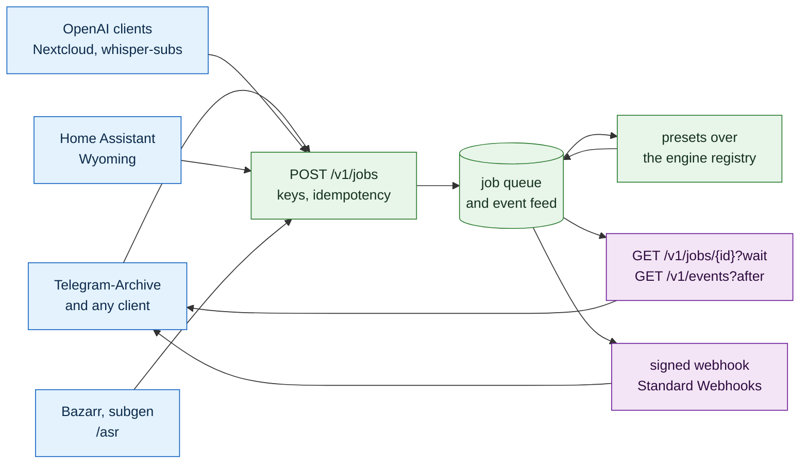

# Server mode

How akou runs as a transcription service that other programs call over the network: the Docker image, the keys, the job API, the signed callbacks, the endpoints other tools already speak, the presets, and the web UI that configures it all. The app and the server are one code base and one API. Server mode is the same `/v1` with file jobs added, bound to a network address behind per-client keys.

The first client is [Telegram-Archive](https://github.com/GeiserX/Telegram-Archive), which uploads every voice message it archives and stores the transcript beside the audio. The contracts here are written so that any other program can do the same. The recording side of akou is in [DESIGN.md](../DESIGN.md); the programmable side that already exists is in [PROGRAMMABILITY.md](PROGRAMMABILITY.md). This document adds to both and repeats neither. Priorities, ids and the shape of a line follow [PROGRAMMABILITY.md section 2](PROGRAMMABILITY.md#2-priorities-ids-and-the-shape-of-a-line).

## 0. The simple version

- **One image, any box.** `docker run geiserx/akou:<version>` starts the same Bun core the desktop app runs, without ElectroBun, on linux/amd64 and linux/arm64. Models live on a volume. A CUDA tag exists for NVIDIA. TLS is the reverse proxy's job.
- **One job, one result.** A client uploads a file to `POST /v1/jobs`, gets an id back at once, and reads the result by long-poll, by the per-key event feed, or by a signed webhook to a URL it names. The result is one JSON shape with text, language, words, segments and the engine that made it.
- **Pull is the truth, push is the hint.** Every job's outcome sits in a per-key event feed a client can read after any cursor. Webhooks are signed per the Standard Webhooks spec, retried for a day, and never the only way to learn a result. A client behind NAT with no reachable URL loses nothing.
- **Presets, not model names.** `lite`, `fast`, `best`, `fusion` and `auto`. A client says how much it cares; the server maps that to engines the hardware can run.
- **Three dialects for free.** The OpenAI transcription endpoint, the Wyoming protocol and Bazarr's `/asr`. Nextcloud, Home Assistant, Bazarr and whisper-subs work with no code on their side.
- **Self-hosted, still.** There is no akou cloud and no relay. Server mode is the user's own box reachable by the user's own programs.

## 1. What we do not build

| Not built | Why | What covers the need |
|---|---|---|
| An akou cloud, or a hosted relay between a client and a home server | The user's data leaves the user's box. [POSITIONING.md](../POSITIONING.md) line 15 and [PROGRAMMABILITY.md section 1](PROGRAMMABILITY.md#1-what-we-do-not-build) refuse it, and server mode does not change that | The user's own reverse proxy, a VPN, or a tunnel the user runs |
| TLS inside akou | Certificates, renewal and ciphers are a proxy's job, and every self-hosted stack already has one | A documented Caddy and nginx block, and a refusal to bind a non-loopback address without `server.behind_proxy` set |
| A Deepgram-compatible `/v1/listen` | Two niche servers offer subsets and no client we care about needs it | The OpenAI endpoint, which every integration already speaks |
| A client SDK | Unchanged from [PROGRAMMABILITY.md](PROGRAMMABILITY.md#1-what-we-do-not-build) | The OpenAPI file (PG-A2), which now also covers the job routes |
| A plugin runtime | Unchanged | Hooks, files, the API |
| Cross-job search, a library, a transcript editor | A knowledge tool's job. Clients keep their own copy and their own search | Every client stores the result; akou deletes it after `server.retain_days` |
| A multi-tenant service with users, billing and quotas per person | One box, one owner, a few client programs. Keys are for programs, not people | Per-key scopes, rate and concurrency limits |
| Streaming file transcription over WebSocket | The Realtime API shape belongs to live capture, which the app already does | `stream=true` SSE on the OpenAI endpoint for progress; jobs for everything else |

## 2. Decisions this reverses

Three recorded decisions block server mode. Each is reversed here on purpose, with the line that changes named so the docs stay in one voice.

| Id | Feature | P | From | Acceptance | Today |
|---|---|---|---|---|---|
| SV-D1 | Transcribing a file is a product feature. [REQUIREMENTS.md](../REQUIREMENTS.md) line 79 says the opposite and [PRINCIPLES.md](PRINCIPLES.md) open decision 2 parks it. Both are rewritten: file jobs are the server's reason to exist, and the app gains `akou transcribe FILE` as the same job from the command line | P0 | Telegram-Archive; every competitor in the matrix has file input | REQUIREMENTS F1.8 reads "carried, as a job"; open decision 2 is closed with a pointer here; `akou transcribe sample.ogg` prints a transcript on a Linux box with no sound server | missing: [REQUIREMENTS.md](../REQUIREMENTS.md) line 79, [PRINCIPLES.md](PRINCIPLES.md) line 222 |
| SV-D2 | Loopback by default, network by choice. DESIGN 6.3 rule 1 says "bind 127.0.0.1 only". The rule becomes: the app binds loopback and the one-token guard stays as it is; server mode binds `api.bind` and swaps the guard for per-key auth, and refuses to start on a non-loopback address unless `server.behind_proxy` is true | P0 | Server mode needs a reachable port | The security test of DESIGN 6.3 still passes in app mode. In server mode a request with a browser `Origin` header and a valid key is accepted, because a browser is a legitimate client of the web UI there; the cross-origin refusal moves to the login (SV-U1) | missing: [DESIGN.md](../DESIGN.md) line 601, [server.ts](../../src/main/api/server.ts) line 210 |
| SV-D3 | The 64 KB body cap applies to JSON routes only. Upload routes take multipart bodies up to `server.max_upload_mb`, default 512, and stream them to disk | P0 | [guard.ts](../../src/main/api/guard.ts) line 39 caps every body | A 300 MB upload to `POST /v1/jobs` succeeds; a 300 MB JSON body to `POST /calls` still gets 413 | missing |
| SV-D4 | The "What we do not build" tables in [PROGRAMMABILITY.md](PROGRAMMABILITY.md#1-what-we-do-not-build) and [POSITIONING.md](../POSITIONING.md) say what stays refused after this doc: cloud, relay, SDK, plugin runtime, connectors. They point here for the rest | P1 | docs-lag | Both tables carry one line pointing at this document and no line that contradicts it | missing |

## 3. The image and the process

The server is `src/main/index.ts` under plain Bun, the entry the headless app already uses, with `AKOU_SERVER=1`. No ElectroBun, no tray, no hotkey, no login item, no capture helper. `akou-diarize` ships in the image for jobs that ask for speakers.

| Id | Feature | P | From | Acceptance | Today |
|---|---|---|---|---|---|
| SV-P1 | A Dockerfile at the repo root that builds `geiserx/akou:<semver>` for linux/amd64 and linux/arm64 with buildx, from the release tag, pinned base image, non-root user, `AKOU_HOME=/data` and `AKOU_MODELS_DIR=/models` as volumes. Never a `latest` tag | P0 | every self-hosted competitor ships one | `docker run -p 8476:8476 -v models:/models geiserx/akou:X` answers `GET /healthz` within 60 s on both architectures in CI (SV-T1). `id -u` inside is not 0 | missing |
| SV-P2 | A CUDA variant `geiserx/akou:<semver>-cuda` on an NVIDIA runtime base, used by the `best` and `fusion` presets when a GPU is present | P1 | presets need a GPU path | The CUDA image on a runner with a GPU reports `gpu: cuda` from `GET /v1/server` and runs `best` faster than the CPU image on the same file | missing |
| SV-P3 | `akou models pull <preset\|engine>` downloads and verifies the models a preset needs, resumable, with the same checksum table the app uses; `akou models import <dir>` copies from a folder for machines with no internet | P0 | a 3 GB download on first start is not a start | On an empty volume `akou models pull fast` leaves the Parakeet v3 files with matching SHA-256; a second run downloads nothing; a truncated file is re-fetched | partial: [models.ts](../../src/main/asr/models.ts) downloads on demand inside the app, no CLI verb |
| SV-P4 | `GET /healthz` with no token: `{ok, version, models_ready, queue_depth}`. 200 when the API answers, 503 while models load. Docker `HEALTHCHECK` uses it | P0 | Compose `depends_on: condition: service_healthy` | Curl with no header gets 200; while a pull runs it gets 503 with `models_ready: false` | missing |
| SV-P5 | `api.bind` setting, default `127.0.0.1`, server-mode default `0.0.0.0`; `server.behind_proxy` gates any non-loopback bind and enables `X-Forwarded-For` for rate limits and audit | P0 | SV-D2 | Starting with `api.bind=0.0.0.0` and `server.behind_proxy=false` exits with a message naming both keys | missing: [server.ts](../../src/main/api/server.ts) line 210 and [page-server.ts](../../src/main/window/page-server.ts) line 124 hard-code loopback |
| SV-P6 | Opus and every other container decoded through `ffmpeg` in the image, resampled to 16 kHz mono float, and the same path fixes the final pass on recorded calls, which today needs a `.wav` beside each Opus part | P0 | [index.ts](../../src/main/index.ts) line 1460 refuses "Opus decoding is not built" | An `.ogg` voice note, an `.m4a`, an `.mp3` and a `.webm` each produce a transcript; a recorded call's final pass runs with no `.wav` on disk | missing: [index.ts](../../src/main/index.ts) lines 186 and 264 read `part-N.wav` |
| SV-P7 | Desktop-only parts are off in server mode: tray, hotkey, login item, floating indicator, capture helper start, tailnet detection for share links. Each checks one `isServer()` and never logs a warning about a missing display | P1 | DK-T6 covers Linux without a tray; server mode has no display at all | The server starts on a box with no `DISPLAY`, no PulseAudio and no `xdg-open`, and its log has zero lines about any of them | partial: `AKOU_HEADLESS` exists ([schema.ts](../../src/main/config/schema.ts) line 102) but the capture helper still starts |
| SV-P8 | A `linux-arm64` CLI target beside the three existing ones, and the compiled CLI on Linux can start the server in the foreground with `akou serve` | P1 | [build-cli.ts](../../scripts/build-cli.ts) lines 32 to 34 list darwin-arm64, linux-x64 and windows-x64; [client.ts](../../src/main/cli/client.ts) line 123 returns no launch command off macOS | `akou serve` from the arm64 tarball on an Ubuntu arm64 runner answers `/healthz`; `akou --version` prints on a Raspberry Pi 5 | missing |
| SV-P9 | A documented reverse proxy: one Caddy block and one nginx block in [install.md](../install.md), with the upload size, the SSE read timeout and the WebSocket upgrade for the web UI | P1 | TLS stays outside | Following the block as written, `curl https://akou.example/v1/server` works and a 60 s long-poll is not cut at 30 s | missing |

## 4. Identity, keys and limits

One box serves a few programs. Each program gets a key, sees its own jobs only, and has its own webhook secret.

| Id | Feature | P | From | Acceptance | Today |
|---|---|---|---|---|---|
| SV-K1 | `GET /v1/server`, no token: `{name: "akou", version, mode: "server"\|"app", presets: [...], engines: [...], gpu, capabilities: {jobs, webhooks, events, openai, wyoming, bazarr}}`. Clients use it to tell akou from a plain OpenAI-compatible server and to list presets before offering them in their own settings | P0 | Telegram-Archive shows the preset list in its settings from this route | The route answers on both modes; `capabilities.jobs` is false in app mode until SV-J1 lands there too; the presets array equals the preset table of section 8 | missing |
| SV-K2 | `akou keys create --name NAME [--scope jobs\|admin] [--callback-host HOST ...]` prints `ak_<32 random bytes, base64url>` once and a `whsec_<24 bytes base64>` once, then stores only the SHA-256 of the key and the secret encrypted at rest with a per-install key in `AKOU_HOME`. `akou keys list` shows id, name, scopes, created, last used. `akou keys revoke ID` | P0 | one bearer token for everyone is not identity | The printed key authenticates; the file in `AKOU_HOME` contains neither the key nor the plain secret; a revoked key gets 401 on the next request | missing: one token file ([guard.ts](../../src/main/api/guard.ts) line 38), no identity |
| SV-K3 | Scopes: `jobs` reads and writes its own jobs, events and results; `admin` also manages keys, settings and the jobs of every key. The app's own token keeps `admin`. A `jobs` key that calls `PATCH /v1/config` gets 403 | P0 | least privilege | A test with both scopes over every route in the OpenAPI file asserts each response against a table in the test | missing |
| SV-K4 | Callback hosts are an allowlist per key. `POST /v1/jobs` with a `callback_url` whose host is not on the key's list gets 422 `callback_not_allowed`. A key created with `--callback-host '*'` accepts any host that passes the SSRF rules of SV-E7 | P0 | an attacker with a key must not turn akou into a scanner of the LAN | A key with `--callback-host archive.lan` accepts `https://archive.lan/api/x` and refuses `https://other.lan/` | missing |
| SV-K5 | Per-key limits: `server.rate_per_minute` default 60, `server.concurrency_per_key` default 2, `server.queue_max` default 200. Over the rate returns 429 with `Retry-After`; over the queue returns 503 `queue_full` | P1 | a runaway client must not starve the others | 100 uploads in one second from one key yield 60 accepted and 40 refused with 429; a second key is unaffected | missing |
| SV-K6 | Audit events in the server's own log: `key.created`, `key.revoked`, `key.refused` with the key id prefix and the source address, `job.created`, `job.done`, `job.failed`, `webhook.done`, `webhook.disabled`. Never the audio, never the text | P1 | DESIGN 8: the log is the truth | A test creates, uses and revokes a key and reads exactly those events back; a grep of the log for a transcript sentence finds nothing | partial: `webhook.done` exists ([webhook.ts](../../src/main/handoff/webhook.ts)), nothing else |

## 5. Jobs

A job is a file plus options. It lives in a queue, runs through the same finalize worker the app uses on a recorded call, and ends as a result the client reads by any of three paths. The app's "one call at a time" rule ([manager.ts](../../src/main/call/manager.ts) line 248) applies to capture only; jobs run up to `server.workers`, default 1 on CPU and one per GPU.

| Id | Feature | P | From | Acceptance | Today |
|---|---|---|---|---|---|
| SV-J1 | `POST /v1/jobs`, multipart. Fields: `file` (required, any container ffmpeg reads), `preset` (`lite\|fast\|best\|fusion\|auto`, default `auto`), `language` (BCP-47 or `auto`, default `auto`), `keywords[]` (hotwords, 24 max), `diarize` (bool, default false), `callback_url` (optional), `metadata` (JSON up to 4 KB, echoed back untouched). Answers `202 {id, status: "queued", created_at, links: {self, result, events}}` | P0 | Telegram-Archive; AssemblyAI, Deepgram and Gladia all take a submit call that returns an id | A voice note submitted with `metadata: {"x": 1}` comes back done with the same metadata; a body with no `file` gets 422 with the one error shape of PG-A7 | missing |
| SV-J2 | `Idempotency-Key` header. Same key and same body hash return the existing job with 200, not a new one; same key while the first is still uploading gets 409 `in_flight`; same key with a different body hash gets 422 `idempotency_mismatch`. Keys expire with the job | P0 | Telegram-Archive sends the audio's content hash so a retried drain never transcribes twice; IETF idempotency-key draft | Two identical submits produce one job and one result; the second answers with the first id | missing |
| SV-J3 | States `queued`, `running`, `done`, `failed`, `cancelled`, each with a time. `GET /v1/jobs/{id}?wait=<0..60>` holds the request until the job leaves `queued` or `running`, or the wait ends, and then answers the current state. `GET /v1/jobs?status=&cursor=` lists the key's own jobs | P0 | a client with no callback needs one cheap wait | A 5 s clip submitted then fetched with `wait=60` answers `done` in one request; a `wait=1` on a queued job answers `queued` after one second | missing |
| SV-J4 | The result shape, at `GET /v1/jobs/{id}/result`: `{job_id, status, text, language, language_confidence, duration_s, words: [{w, s, e, c}], segments: [{s, e, text, speaker}], engine: {name, version, preset, models: [...]}, confidence, metadata}`. `words` is empty when no engine gave word times; `speaker` is null unless `diarize`; `confidence` is the mean word confidence, or the engine's segment confidence when there are no words | P0 | Telegram-Archive stores every field; fusion needs per-word confidence | A JSON-schema test over the result of each preset; `engine.models` names the model ids the engine registry knows | missing |
| SV-J5 | `?format=json\|verbose_json\|text\|srt\|vtt` on the result route. `verbose_json` is the OpenAI shape of SV-C1; `srt` and `vtt` come from `segments`, and from `words` grouped to lines of at most 42 characters when there are words | P1 | matrix EXP-01; open decision 2 dropped SRT and VTT and SV-D1 brings them back as formats of a job | The `srt` of a 30 s clip opens in ffmpeg as subtitles with the right count of cues; `vtt` starts with `WEBVTT` | missing |
| SV-J6 | `DELETE /v1/jobs/{id}`: a queued or running job is cancelled; a finished job's audio and result are deleted. The event feed keeps the id and the final state only. `server.retain_days`, default 7, does the same on a timer | P0 | privacy: the client owns the data, akou holds a copy only as long as needed | After delete, the result route answers 404 and the file is gone from disk; after the retention timer the same holds for an untouched job | missing |
| SV-J7 | A mono path through the finalize worker. Today the worker reads the left channel as the mic and the right as the call ([finalize-worker.ts](../../src/main/asr/finalize-worker.ts) lines 5 to 6). A job has one channel and no "you": every line is a speaker label when `diarize` is on and `null` otherwise, and the VAD cut points, the whole-timeline rule and the span halving all apply unchanged | P0 | the pipeline is the same, the input is not a call | A stereo call file and a mono job file both transcribe; the job never emits `you`; a job with `diarize: true` on a two-speaker clip labels two speakers | missing |
| SV-J8 | `akou transcribe FILE [--preset P] [--language L] [--format F] [--diarize] [--wait]` on the CLI: submits a job to the server it is pointed at, waits, prints the result. `akou jobs list`, `akou jobs show ID`, `akou jobs cancel ID`. Parity with the routes in the one parity table (TS-13) | P1 | CLI-* parity; the recipes in [install.md](../install.md) should be one command | `akou transcribe note.ogg --format text` prints the text and exits 0; pointed at a stopped server it exits 69 | missing |

## 6. Events and webhooks

The webhook the app already has is one URL and one secret in the config file, with three retries in memory ([webhook.ts](../../src/main/handoff/webhook.ts) line 20) and a signature with no timestamp. Server mode needs one endpoint per key, a durable outbox and replay protection. The new scheme is the [Standard Webhooks](https://github.com/standard-webhooks/standard-webhooks/blob/main/spec/standard-webhooks.md) spec, so every receiver library that speaks it verifies akou with no custom code. The app's `X-Akou-Signature` webhook stays as it is for call hand-off, and gains the same headers beside its own. This supersedes the parked PG-W4 ([PROGRAMMABILITY.md](PROGRAMMABILITY.md) line 211).

| Id | Feature | P | From | Acceptance | Today |
|---|---|---|---|---|---|
| SV-E1 | A per-key, ordered, persisted event feed. `GET /v1/events?after=<cursor>&wait=<0..60>` returns the key's events after the cursor, oldest first, with the next cursor. Types: `transcription.completed`, `transcription.failed`, `transcription.cancelled`. `Accept: text/event-stream` gives the same as SSE, resumable with `Last-Event-ID`, the same contract as the call stream (PG-S1) | P0 | pull is the truth; a client behind NAT | A client that missed a day reads every outcome since its cursor in one call; a restart of the server loses no event | missing |
| SV-E2 | Webhook delivery per Standard Webhooks: headers `webhook-id` (one id per event, kept across retries), `webhook-timestamp` (unix seconds), `webhook-signature: v1,<base64>`, where the signature is HMAC-SHA256 over `{webhook-id}.{webhook-timestamp}.{raw body}` with the key's `whsec_` secret decoded from base64. The signature header holds a space-separated list so a rotated secret signs twice during the overlap | P0 | replay protection that PG-W4 parked; every receiver library verifies this shape | The reference verifier from the spec accepts a delivery; a body changed by one byte is refused; a delivery re-sent after 6 minutes is refused by the timestamp check | missing: `X-Akou-Signature` has no timestamp ([webhook.ts](../../src/main/handoff/webhook.ts) line 7) |
| SV-E3 | The body: `{type, timestamp, data}`. For `transcription.completed`, `data` is the result of SV-J4, inline when the body is at most 256 KB, otherwise `data` carries `result_url` instead of `text`, `words` and `segments`. For `transcription.failed`, `data` is `{job_id, status: "failed", error: {code, message}, metadata}` | P0 | voice notes are always small, so the client needs no second request | A 20 s clip's delivery carries the text inline; a 3 hour file's delivery carries `result_url` and no `text` | missing |
| SV-E4 | Retry schedule with jitter: at once, 5 s, 5 min, 30 min, 2 h, 5 h, 10 h, 14 h, 20 h, 24 h. Only 2xx counts. 3xx is not followed. `410 Gone` disables the endpoint at once and writes `webhook.disabled`. 30 s request timeout | P0 | Standard Webhooks; ElevenLabs and AssemblyAI schedules for comparison | A receiver that fails four times and then accepts gets the delivery on the fifth try with the same `webhook-id`; a receiver answering 410 gets no sixth try | missing: three tries at 2, 10 and 30 s |
| SV-E5 | A durable outbox: every delivery and its attempt count are on disk in `AKOU_HOME` before the first try, so a restart resumes the schedule where it stopped | P0 | in-memory retries die with the process | Kill the server between attempt 2 and 3; on restart the delivery goes out once more with the same id | missing |
| SV-E6 | `akou hooks run --job ID` resends a job's delivery with its original `webhook-id`, and the jobs dashboard (SV-U4) has the same button. Extends PG-H2 | P2 | PG-H2 | A delivery that exhausted its schedule reaches a receiver that now accepts | missing |
| SV-E7 | SSRF rules for callback URLs: `http` and `https` only; RFC 1918 and unique-local addresses are allowed, because a self-hosted client on the same LAN is the normal case; `127.0.0.0/8`, `::1`, `169.254.0.0/16`, `fe80::/10`, `0.0.0.0` and the cloud metadata address are refused at submit time and again at delivery time after DNS resolution, so a name that resolves to a refused address after submit is still refused | P0 | Standard Webhooks security section; a key holder must not probe the box | A callback to `http://169.254.169.254/` gets 422 at submit; a hostname that resolves to `127.0.0.1` at delivery time is logged as `webhook.refused` and not sent | missing |

## 7. Compatible endpoints

Each dialect is a thin translation onto SV-J1 and SV-J4. None has its own engine path.

| Id | Feature | P | From | Acceptance | Today |
|---|---|---|---|---|---|
| SV-C1 | OpenAI `POST /v1/audio/transcriptions`, multipart, synchronous. Fields: `file`, `model` (a preset name or an engine id; unknown names map to `auto`), `language`, `prompt` (added to hotwords), `response_format` (`json`, `text`, `srt`, `vtt`, `verbose_json`, `diarized_json`), `temperature` (accepted, ignored), `timestamp_granularities[]` (`word`, `segment`), `stream` (SSE with `transcript.text.delta`, `transcript.text.segment`, `transcript.text.done`), `chunking_strategy` (accepted, ignored), `known_speaker_names[]` (accepted, ignored until diarization names speakers). `verbose_json` carries `language`, `duration`, `text`, `words`, `segments` with the OpenAI segment fields, and `usage` | P0 | the de facto integration point: Nextcloud, Home Assistant, whisper-subs, LocalAI, speaches, vLLM all speak it | A conformance test replays every request shape in the OpenAI OpenAPI file's transcription operation and validates every response against its schema (SV-T3); the official `openai` Python client with `base_url` set gets a transcript | missing |
| SV-C2 | Wyoming on TCP `server.wyoming_port`, default 10300: `describe` answers `info.asr[]` with one entry per preset, `languages` from the engine registry, `installed` from the model state, `supports_transcript_streaming: false`, `requires_external_vad: false`; then `transcribe`, `audio-start`, `audio-chunk`, `audio-stop` and the `transcript {text, language}` reply. Off by default in app mode | P1 | Home Assistant Assist adds a speech-to-text engine by host and port with no code | The `wyoming` Python package's client gets a transcript from a 16 kHz chunk stream; Home Assistant's Wyoming integration discovers it and shows the preset names | missing |
| SV-C3 | Bazarr `POST /asr?task=transcribe&language=&output=srt&encode=false` with raw 16 kHz mono s16le in `audio_file`, and `POST /detect-language` answering `{detected_language, language_code}` | P2 | Bazarr and subgen speak this and nothing else | Bazarr's `whisperai` provider pointed at akou downloads a subtitle for a sample video | missing |
| SV-C4 | The OpenAPI file of PG-A2 covers every route in this document, and `GET /v1/server` links to it | P1 | PG-A2 | The CI diff check of PG-A2 covers the job, event, key and OpenAI routes | missing |

Who each dialect unlocks:

| Dialect | Clients that work with no change on their side |
|---|---|
| Jobs and events (SV-J, SV-E) | Telegram-Archive, and any program that wants callbacks, idempotency and a replayable feed |
| OpenAI (SV-C1) | Nextcloud `integration_openai`, whisper-subs worker pools, Home Assistant's OpenAI-compatible speech-to-text integrations, Open WebUI, the `openai` client libraries |
| Wyoming (SV-C2) | Home Assistant Assist, Rhasspy, the `wyoming` satellite tools |
| Bazarr `/asr` (SV-C3) | Bazarr, subgen |

## 8. Presets and hardware

A preset is a name for an engine chain and its decode settings. The engine registry (DK-E1 to DK-E4), the speech-engine settings (DK-S2, DK-S3), the fusion tests (TS-16, TS-16c, TS-16d), re-transcription (TRN-16) and the engine design doc (akou-q4t.1) own the engines themselves. This section owns only how a preset maps onto them and how the hardware is read. Nothing below adds an engine that the registry does not list.

| Preset | Chain | Hardware it is meant for | Measured or estimated |
|---|---|---|---|
| `lite` | Silero VAD, Parakeet TDT 0.6B v3 int8 for its 25 languages, Nemotron 3.5 ASR streaming 0.6B for languages Parakeet lacks, both through sherpa-onnx | arm64 boards, N100-class x64 | Estimated. Parakeet int8 runs at real time on a Cortex-A53; a Pi 5 is faster |
| `fast` | Parakeet TDT 0.6B v3 fp32 with hotwords, routed by language id to Qwen3-ASR 0.6B int8 where Parakeet has no model | Any x64 CPU, the default on CPU | Measured on the reference Mac: real-time factor 0.049 for Parakeet fp32 ([asr-benchmark.md](../research/asr-benchmark.md)). The 4-core x64 figure is gate G6 in [ROADMAP.md](../ROADMAP.md) and still open |
| `best` | Qwen3-ASR 1.7B first, Whisper large-v3 for languages outside Qwen's 30, Nemotron 3 diarization when asked | CUDA, or Apple silicon through the native app; offered on CPU and labelled slow there | Measured: Qwen 1.7B leads the Open ASR Leaderboard English average among open models. Speed on a consumer GPU is estimated |
| `fusion` | Parakeet v3, Qwen3-ASR 1.7B, Whisper large-v3 turbo, Canary 1B v2 when installed; word-aligned vote with per-word confidence; a tie-break by the configured provider when `asr.final.fusion` is `provider` | CUDA, or an overnight CPU run | Estimated until TS-16d proves fusion beats the best single engine |
| `auto` | Reads the hardware once at start and picks: CUDA present, `best`; Apple silicon in the app, `best`; Intel iGPU with Vulkan, `fast` with whisper.cpp Vulkan for Whisper only; arm64 with under 8 GB, `lite`; anything else, `fast` | Everyone who did not choose | The choice is logged once and shown in `GET /v1/server` |

| Id | Feature | P | From | Acceptance | Today |
|---|---|---|---|---|---|
| SV-R1 | The five presets above as one table in code, each naming engine ids from the registry, `asr.threads`, quantisation, beam or greedy, diarizer and fusion mode. `GET /v1/server` lists them with `available: true\|false` from the installed models | P0 | a client says how much it cares, not which model | A test asserts every engine id in the table exists in the registry; a preset with a missing model is listed as unavailable and a job asking for it gets 409 `preset_unavailable` with the `akou models pull` line to run | missing: one engine, `provider: "cpu"` hard-coded ([sherpa.ts](../../src/main/asr/sherpa.ts) line 221) |
| SV-R2 | Hardware detection for `auto`: CUDA through the ONNX Runtime provider list, Apple silicon through the platform, Intel iGPU through Vulkan device enumeration, arm64 memory through the OS. Runs once at start, cached, overridable with `server.hardware` | P1 | `auto` is the default | On the CUDA image with a GPU, `auto` resolves to `best`; on the CPU image on the same box it resolves to `fast`; `server.hardware=cpu` forces `fast` anywhere | missing |
| SV-R3 | Execution providers per platform in the registry: CPU everywhere; CUDA for sherpa-onnx and vLLM-served engines in the CUDA image; Vulkan through whisper.cpp for Whisper only on Intel iGPUs, because Parakeet on CPU is already faster than Whisper on an iGPU; CoreML and MLX only in the native app on Apple silicon, since Docker on a Mac has no Metal. Open decision 7 in [PRINCIPLES.md](PRINCIPLES.md) line 227 is closed by this line: a bundled per-OS runtime is allowed when the registry lists it | P1 | measured on whisper-subs: Vulkan gives Whisper two to four times on a UHD 770 and nothing for Canary | The engine registry's per-platform table drives which engines `GET /v1/server` lists; a Vulkan image on an Intel box lists Whisper with `provider: vulkan` | missing |
| SV-R4 | Language routing: the client's `language` hint first; then the engine's own language id when it has one, with a confidence floor of 0.8; then the multilingual fallback of the preset. Below the floor the job runs the fallback and records both guesses in `language_confidence` | P1 | Qwen 1.7B labelled 30 of 56 accented English clips as another language in the benchmark | An accented English clip with `language: en` never leaves Parakeet; the same clip with `auto` and a low id confidence goes to the fallback and reports the confidence it saw | missing |
| SV-R5 | Silence and hallucination guards on every job: VAD trims leading and trailing silence, a clip with no speech returns `text: ""` and `segments: []` with `status: done`, never an invented sentence | P0 | sherpa-onnx fixed Qwen3, Moonshine and Cohere hallucinations on silence in 1.13.7 and 1.13.8 | Ten seconds of room noise through every preset return empty text | partial: the final pass checks energy before loading a model ([finalize-worker.ts](../../src/main/asr/finalize-worker.ts) line 6) |
| SV-R6 | Published numbers: per preset, per image, per reference box, the real-time factor and peak memory on the same 66 minute file and the same 60 voice notes, in [gates/](../gates/), regenerated by the nightly job. Until a number is measured the docs say "estimated" | P1 | every speed claim above that is not on the reference Mac is an estimate | The nightly writes a table; a preset with no row is shown as estimated in `GET /v1/server`'s `presets[].measured` | missing |

## 9. The web UI in server mode

The page server already serves the window's bundle over HTTP on loopback with a one-time code ([page-server.ts](../../src/main/window/page-server.ts) line 124). Server mode serves the same bundle behind the proxy, adds a login, and shows the server's own screens. The settings registry is the flat list of [schema.ts](../../src/main/config/schema.ts); grouped settings with `values`, `group` and `applies` are DK-S1 and DK-S4 and this section depends on them.

| Id | Feature | P | From | Acceptance | Today |
|---|---|---|---|---|---|
| SV-U1 | An admin login: `server.admin_password_hash` set with `akou admin set-password` or an `admin` key pasted once; the browser keeps a session token in `sessionStorage` as today, never a cookie, so there is no CSRF; the page refuses to load over plain HTTP on a non-loopback address unless `server.behind_proxy` is set | P0 | a page on the network needs a door | A wrong password gets 401 and a 2 s delay; a right one shows the dashboard; the session dies with the tab | missing: a one-time code minted by the local CLI |
| SV-U2 | Settings groups in server mode: Engines and presets, Server (bind, proxy, limits, retention), Keys, Webhooks, Provider for fusion. Recorder-only groups and screens (devices, hotkeys, tray, capture) are hidden with `applies: ["app"]` | P1 | DK-S1, DK-S4 | The settings page in server mode shows no device picker; the same build in app mode does | missing: a flat list in [settings.ts](../../src/ui/settings.ts) |
| SV-U3 | A Keys screen: create with name, scopes and callback hosts, show the key and the secret once, list with last used, revoke. The same routes the CLI of SV-K2 uses | P1 | SV-K2 | Creating a key in the browser and using it from curl works; the key is never shown again after the dialog closes | missing |
| SV-U4 | A Jobs dashboard: queue and running with elapsed time, done and failed with the error, filter by key and state, open a result, resend a webhook (SV-E6), cancel, delete. Live over the same SSE feed as SV-E1 with an `admin` session | P1 | Scriberr, speaches and LocalAI all show a queue | Submitting a job from curl shows it running on the dashboard within one second; cancelling from the dashboard makes the long-poll answer `cancelled` | missing |
| SV-U5 | A preset picker with the hardware verdict: what `auto` chose and why, each preset's availability, the `akou models pull` line for a missing one, and the measured or estimated speed from SV-R6 | P1 | DK-E2, DK-E3, DK-E4 | Choosing an unavailable preset offers the pull and shows progress from DK-E2 | missing |

## 10. What all-in-one means

The self-hosted transcription tools we compared share a floor. akou in server mode has to have every line of it before any of the lines that set it apart count.

Table stakes, in every serious tool: file upload in any container, batch submission, more than one model with a downloader, CPU and CUDA images, text, SRT, VTT and JSON output, word or segment times, language detection, VAD, speaker labels, a REST API, a job queue, and a web page with a queue view.

What akou adds that no single tool combines today:

- The three dialects on one port: jobs with signed callbacks, the OpenAI endpoint and Wyoming. Today a user runs speaches for one, wyoming-faster-whisper for another and a webhook shim for the third.
- A replayable per-key event feed beside the webhook. No self-hosted competitor signs its webhooks, and none lets a client catch up after a day offline.
- Presets that read the hardware, with the choice and its reason visible.
- Language routing across engines, with the caller's hint first.
- Fusion of several engines per word, with the confidence exposed on every word.
- Hotwords from the client on every request.
- Published, regenerated speed and accuracy numbers per preset and box.
- The same core and the same API as the desktop recorder, so a transcript from a recorded call and a transcript from an uploaded file have the same shape and the same engines.

What stays out, on purpose: an editor, a library, search across jobs, users and billing, and any cloud.

## 11. Proof

| Id | Feature | P | From | Acceptance | Today |
|---|---|---|---|---|---|
| SV-T1 | A `server` CI job on `ubuntu-24.04` and `ubuntu-24.04-arm`: build the image, start it with a cached models volume, wait for `/healthz`, submit one voice note with each of `fast` and `lite`, read the result by long-poll, by the event feed and by a webhook to a receiver inside the job, and diff the three | P0 | [CI-CD.md](../CI-CD.md); CI-22 covers the desktop artifacts, not a server | The job is required on main; removing the webhook receiver's signature check makes it fail on a tampered body, which is the positive control | missing: no arm runner in [release.yml](../../.github/workflows/release.yml), no image |
| SV-T2 | A signed-webhook round trip in the unit suite with the Standard Webhooks reference verifier, plus the negative cases: wrong secret, edited body, stale timestamp, replayed id | P0 | SV-E2 | All four negatives are refused; the positive passes with the spec's own test vectors | missing |
| SV-T3 | An OpenAI conformance test that loads the transcription operation from a pinned copy of the OpenAI OpenAPI file and checks every request field and every `response_format` against its schema | P0 | SV-C1 | Renaming one field in akou's response fails the test | missing |
| SV-T4 | A Wyoming `describe` and `transcribe` test with the `wyoming` package's client against the server in CI | P1 | SV-C2 | The info answer lists every preset; a chunk stream returns the expected text | missing |
| SV-T5 | A key and scope test that walks every route in the OpenAPI file with a `jobs` key, an `admin` key, a revoked key and no key, and asserts each status against one table | P0 | SV-K3 | Adding a route without a row in the table fails the test | missing |

## 12. Open points

- **The queue store.** The event log per call is the app's truth. A job could be a call folder created from a file, reusing the log, the fold and every reader, or a separate jobs table. The first keeps one truth and one export; the second is simpler for retention and per-key listing. The engine design (akou-q4t.1) should decide, since the finalize worker is shared either way.
- **Fusion by the provider unattended.** Open decision 8 in [PRINCIPLES.md](PRINCIPLES.md) line 228 says the harness never runs unattended. In server mode there is no one at the keyboard, so the `fusion` preset's tie-break must use the OpenAI-compatible or Anthropic provider, or a deterministic vote, and never the harness. This document assumes that and the decision should be closed the same way.
- **The 64 KB cap in app mode.** SV-D3 lifts it for upload routes only. `akou transcribe` in app mode goes through the same route, so the app's guard learns the upload exception too.
- **Same-box clients over Docker.** A client in another container on the same Docker network reaches akou by service name. The contract assumes nothing about that; it is a convenience in each client's compose example.
- **arm64 speed.** Every arm64 number here is scaled from a Cortex-A53 measurement. A Raspberry Pi 5 and an Apple silicon box under Linux need a real run before the `lite` preset claims a time.
- **Telegram's own transcripts.** A client that also holds a Telegram Premium account can fetch Telegram's transcript for a message and submit it as a second opinion. Whether fusion accepts an external text as one voter is an engine-design question, not a server one.
- **Docs index.** [INDEX.md](../INDEX.md) lists one line per document and needs a line for this one when it merges.
