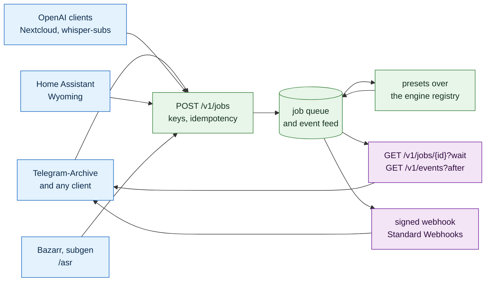

# Server mode

How akou runs as a transcription service that other programs call over the network: the Docker image, the keys, the job API, the signed callbacks, the endpoints other tools already speak, the presets, and the web UI that configures it all. The app and the server are one code base and one API. Server mode is the same `/v1` with file jobs added, bound to a network address behind per-client keys.

The first client is [Telegram-Archive](https://github.com/GeiserX/Telegram-Archive), which uploads every voice message it archives and stores the transcript beside the audio. The contracts here are written so that any other program can do the same. The recording side of akou is in [DESIGN.md](../DESIGN.md); the programmable side that already exists is in [PROGRAMMABILITY.md](PROGRAMMABILITY.md). Priorities, ids and the shape of a line follow [PROGRAMMABILITY.md section 2](PROGRAMMABILITY.md#2-priorities-ids-and-the-shape-of-a-line).

## 0. The simple version

- **One image, any box.** `docker run geiserx/akou:<version>` starts the same Bun core the desktop app runs, without ElectroBun, on linux/amd64 and linux/arm64. Models live on a volume. A CUDA tag exists for NVIDIA. TLS is the reverse proxy's job.
- **One job, one result.** A client uploads a file to `POST /v1/jobs`, gets an id back at once, and reads the result by long-poll, by the per-key event feed, or by a signed webhook to a URL it names. The result is one JSON shape with text, language, words, segments and the engine that made it.
- **Pull is the truth, push is the hint.** Every job's outcome sits in a per-key event feed a client can read after any cursor. Webhooks are signed per the Standard Webhooks spec, retried for a day, and never the only way to learn a result. A client behind NAT with no reachable URL loses nothing.
- **Presets, not model names.** `lite`, `fast`, `best`, `fusion` and `auto`. A client says how much it cares; the server maps that to engines the hardware can run.
- **Three dialects for free.** The OpenAI transcription endpoint, the Wyoming protocol and Bazarr's `/asr`. Nextcloud, Home Assistant, Bazarr and whisper-subs work with no code on their side.
- **Self-hosted, still.** There is no akou cloud and no relay. Server mode is the user's own box reachable by the user's own programs.

## 1. What we do not build

| Not built | Why | What covers the need |
|---|---|---|
| An akou cloud, or a hosted relay between a client and a home server | The user's data leaves the user's box. [POSITIONING.md](../POSITIONING.md) line 15 and [PROGRAMMABILITY.md section 1](PROGRAMMABILITY.md#1-what-we-do-not-build) refuse it, and server mode does not change that | The user's own reverse proxy, a VPN, or a tunnel the user runs |
| TLS inside akou | Certificates, renewal and ciphers are a proxy's job, and every self-hosted stack already has one | A documented Caddy and nginx block, and a refusal to bind a non-loopback address without `server.behind_proxy` set |
| A Deepgram-compatible `/v1/listen` | Two niche servers offer subsets and no client we care about needs it | The OpenAI endpoint, which every integration already speaks |
| A client SDK | Unchanged from [PROGRAMMABILITY.md](PROGRAMMABILITY.md#1-what-we-do-not-build) | The OpenAPI file (PG-A2), which now also covers the job routes |
| A plugin runtime | Unchanged | Hooks, files, the API |
| Cross-job search, a library, a transcript editor | A knowledge tool's job. Clients keep their own copy and their own search | Every client stores the result; akou deletes it after `server.retain_days` |
| A multi-tenant service with users, billing and quotas per person | One box, one owner, a few client programs. Keys are for programs, not people | Per-key scopes, rate and concurrency limits |
| Streaming file transcription over WebSocket | The Realtime API shape belongs to live capture, which the app already does | `stream=true` SSE on the OpenAI endpoint for progress; jobs for everything else |

## 2. Decisions this reverses

Three recorded decisions block server mode. Each is reversed here on purpose, with the line that changes named so the docs stay in one voice.

| Id | Feature | P | From | Acceptance | Today |
|---|---|---|---|---|---|
| SV-D1 | Transcribing a file is a product feature. [REQUIREMENTS.md](../REQUIREMENTS.md) line 79 says the opposite and [PRINCIPLES.md](PRINCIPLES.md) open decision 2 parks it. Both are rewritten: file jobs are the server's reason to exist, and the app gains `akou transcribe FILE` as the same job from the command line | P0 | Telegram-Archive; every competitor in the matrix has file input | REQUIREMENTS F1.8 reads "carried, as a job"; open decision 2 is closed with a pointer here; with `akou serve` (SV-P8) running on a Linux box with no sound server, `akou transcribe sample.ogg` prints a transcript | partial: [REQUIREMENTS.md](../REQUIREMENTS.md) F1.8 and open decision 2 of [PRINCIPLES.md](PRINCIPLES.md) are rewritten; `akou transcribe FILE` ([commands/transcribe.ts](../../src/main/cli/commands/transcribe.ts)) uploads, waits and prints the text, tested against a server rig with a WAV; the run on a Linux box waits for `akou serve` (SV-P8) and ffmpeg in the image (SV-P6) |
| SV-D2 | Loopback by default, network by choice. Two rules of DESIGN 6.3 change in server mode. Rule 1, "bind 127.0.0.1 only": the app keeps it and the one-token guard as they are; server mode binds `api.bind`, swaps the guard for per-key auth, and refuses to start on a non-loopback address unless `server.behind_proxy` is true. Rule 3, `Host` must be exactly `127.0.0.1:<port>` or `localhost:<port>` ([guard.ts](../../src/main/api/guard.ts) lines 64 to 67): in server mode `Host` must equal `server.public_host` when set, or any host when `server.behind_proxy` is true. DNS rebinding does not apply to a keyed non-loopback listener, so this is a safe relaxation | P0 | Server mode needs a reachable port, and a proxied request carries the proxy's host name | The security test of DESIGN 6.3 still passes in app mode. In server mode a request through a proxy with `Host: akou.example` and a valid key is accepted, and so is one with a browser `Origin` header, because a browser is a legitimate client of the web UI there; the cross-origin refusal moves to the login (SV-U1) | has: `serverGuard` in [guard.ts](../../src/main/api/guard.ts), the bind in `apiBind` ([index.ts](../../src/main/index.ts)); tests in `tests/server-mode.e2e.test.ts` |
| SV-D3 | The 64 KB body cap applies to JSON routes only. Upload routes are exempt from the JSON-only rule of [guard.ts](../../src/main/api/guard.ts) line 86, take multipart bodies up to `server.max_upload_mb`, default 512, set Bun's body limit per upload route to that size, and stream the body to disk. The JSON cap stays 64 KB everywhere else | P0 | Four separate checks refuse a large multipart body today | A 300 MB upload to `POST /v1/jobs` succeeds; a 300 MB JSON body to `POST /calls` still gets 413; a multipart body to `POST /calls` still gets 415 | partial: the guard exempts routes added with `upload: true` and Bun's limit is raised to `server.max_upload_mb` (Bun has one limit per server, so the guard holds every other route to 64 KB); streaming the body to disk is the job route's (SV-J1), and no upload route exists until it lands |
| SV-D4 | The docs that own the refusals and the ids say where server mode stands. The "What we do not build" table in [PROGRAMMABILITY.md](PROGRAMMABILITY.md#1-what-we-do-not-build) and the non-goals list in [POSITIONING.md](../POSITIONING.md) keep cloud, relay, SDK, plugin runtime and connectors refused and point here for the rest. [PRINCIPLES.md](PRINCIPLES.md) "How a UX item becomes work" adds `SV` and this doc to the list of owning prefixes, so the docs lint resolves `SV-` ids. [INDEX.md](../INDEX.md) gains the one line for this document. [COMPETITOR-MATRIX.md](COMPETITOR-MATRIX.md) repoints EXP-01 to SV-J5 and any server row to its SV id | P1 | docs-lag; [PRINCIPLES.md](PRINCIPLES.md) line 232 lists W, DK, CLI, PG, TS and CI only, and line 235 says the lint fails on an owner id that does not resolve | The lint's positive control passes with an `SV-` id in the matrix; both refusal lists carry one line pointing here and none that contradicts it; INDEX has the line | missing |

## 3. The image and the process

The server is `src/main/index.ts` under plain Bun, the entry the headless app already uses, with `AKOU_SERVER=1`. No ElectroBun, no tray, no hotkey, no login item, no capture helper. `akou-diarize` ships in the image for jobs that ask for speakers.

| Id | Feature | P | From | Acceptance | Today |
|---|---|---|---|---|---|
| SV-P1 | A Dockerfile at the repo root that builds `geiserx/akou:<semver>` for linux/amd64 and linux/arm64 with buildx, from the release tag, pinned base image, non-root user, `AKOU_HOME=/data` and `AKOU_MODELS_DIR=/models` as volumes. Never a `latest` tag | P0 | every self-hosted competitor ships one | `docker run -p 8476:8476 -v models:/models geiserx/akou:X` answers `GET /healthz` within 60 s on both architectures in CI (SV-T1). `id -u` inside is not 0 | partial: the [Dockerfile](../../Dockerfile) and the `image` job of [release.yml](../../.github/workflows/release.yml) build it on both architectures, non-root, pinned, with no `latest`; `GET /healthz` from the host waits for SV-P4's route and SV-P5's non-loopback bind, which the `server` job of [ci.yml](../../.github/workflows/ci.yml) checks. The container binds 0.0.0.0, so it starts only with `server.behind_proxy` set in the data volume, as [install.md](../install.md) shows; the job starts it that way with the port published on 127.0.0.1. The image never sets it for the operator |
| SV-P2 | A CUDA variant `geiserx/akou:<semver>-cuda` on an NVIDIA runtime base, used by the `best` and `fusion` presets when a GPU is present | P1 | presets need a GPU path | The CUDA image on a runner with a GPU reports `gpu: cuda` from `GET /v1/server` and runs `best` faster than the CPU image on the same file | missing |
| SV-P3 | `akou models pull <preset\|engine>` takes a preset or engine argument and runs without a running app, so an image build or an entrypoint can pull before the server starts; `akou models import DIR` gains the same no-app path | P0 | a 3 GB download on first start is not a start | On an empty volume with no server running, `akou models pull fast` leaves the Parakeet v3 files with matching SHA-256; a second run downloads nothing; a truncated file is re-fetched | built: `akou models pull fast` and `akou models pull MODEL` run with no app ([setup.ts](../../src/main/cli/commands/setup.ts), [presets.ts](../../src/main/asr/presets.ts)); `lite`, `best` and `fusion` exit 69 until their engines exist, and `auto` is `fast` until SV-R2 |
| SV-P4 | `GET /healthz` with no token: `{ok, version, models_ready, queue_depth}`. 200 when the API answers, 503 while models load. Docker `HEALTHCHECK` uses it | P0 | Compose `depends_on: condition: service_healthy` | Curl with no header gets 200; while a pull runs it gets 503 with `models_ready: false` | has: [routes/server.ts](../../src/main/api/routes/server.ts); 503 while a pull runs and while the recognizer loads the files, `models_ready` true only once it is ready; `queue_depth` counts the queued and running jobs |
| SV-P5 | `api.bind` setting, default `127.0.0.1`, server-mode default `0.0.0.0`; `server.behind_proxy` gates any non-loopback bind; `server.trusted_proxies`, a CIDR list, default empty, names the peers whose `X-Forwarded-For` is believed for rate limits and audit. From any other peer the TCP address is the source address | P0 | SV-D2; Docker publishes the port, so a direct client can send its own `X-Forwarded-For` | Starting with `api.bind=0.0.0.0` and `server.behind_proxy=false` exits with a message naming both keys; a request from a peer outside `server.trusted_proxies` with a forged `X-Forwarded-For` is audited under the peer's own address | has: `api.bind`, `server.behind_proxy`, `server.trusted_proxies` in [schema.ts](../../src/main/config/schema.ts), `sourceAddress` in [net.ts](../../src/main/api/net.ts); a refused key is logged as `key.refused` with the source |
| SV-P6 | In the image, Opus and every other container are decoded through `ffmpeg`, one apt line, and resampled to 16 kHz mono float before a job enters the worker | P0 | [index.ts](../../src/main/index.ts) line 1460 refuses "Opus decoding is not built"; `package.json` has no ffmpeg or Opus dependency | An `.ogg` voice note, an `.m4a`, an `.mp3` and a `.webm` each produce a transcript in the image | has: ffmpeg is in the image and `decodeAudio` ([decode.ts](../../src/main/asr/decode.ts)) turns any container into 16 kHz mono float; [server-smoke.ts](../../scripts/server-smoke.ts) transcribes all four containers in the image in the `server` job, and that job's round trip sends an Ogg Opus voice note as a job. A job decodes its upload through it ([audio.ts](../../src/main/server/audio.ts)), except a 16-bit PCM WAV at 16 kHz, which is read directly |
| SV-P10 | The desktop app decodes its own Opus parts for the final pass, either by bundling ffmpeg per OS or by an Opus decoder in the native helper, so a recorded call's final pass runs with no `.wav` beside each part. The image path of SV-P6 does not cover the app | P1 | the CHANGELOG says a final pass runs after every call, and today it cannot read the call's audio | A recorded call's final pass runs on macOS, Windows and Linux with no `.wav` on disk | missing: [index.ts](../../src/main/index.ts) lines 186 and 264 read `part-N.wav`, [finalize-worker.ts](../../src/main/asr/finalize-worker.ts) lines 84 to 86 say the app has no decoder |
| SV-P7 | Desktop-only parts are off in server mode: the capture helper lookup and its warnings, and tailnet detection for share links. Tray, hotkey, login item and the floating indicator live in the ElectroBun shell, which is absent under plain Bun already. Each remaining check is one `isServer()` and never logs a warning about a missing display or sound server | P1 | DK-T6 covers Linux without a tray; server mode has no display at all | The server starts on a box with no `DISPLAY`, no PulseAudio and no `xdg-open`, and its log has zero lines about any of them | partial: `AKOU_HEADLESS` ([schema.ts](../../src/main/config/schema.ts) line 105) never spawns the helper, since the spawn happens at `POST /calls` ([manager.ts](../../src/main/call/manager.ts) lines 240 to 242); `locateHelper` and its warnings still run at start ([index.ts](../../src/main/index.ts) lines 359 to 363), and tailnet detection is unchecked |
| SV-P8 | A `linux-arm64` CLI target beside the three existing ones, and the compiled CLI on Linux can start the server in the foreground with `akou serve`. SV-D1's acceptance depends on it, so it is P0 | P0 | [build-cli.ts](../../scripts/build-cli.ts) lines 32 to 34 list darwin-arm64, linux-x64 and windows-x64; [client.ts](../../src/main/cli/client.ts) line 123 returns no launch command off macOS, so the CLI exits 69 with nothing to talk to | `akou serve` from the arm64 tarball on an Ubuntu arm64 runner answers `/healthz`; `akou --version` prints on a Raspberry Pi 5 | partial: `linux-arm64` is built on `ubuntu-24.04-arm` in [release.yml](../../.github/workflows/release.yml) and `akou serve` runs the server in the foreground ([serve.ts](../../src/main/cli/commands/serve.ts)); the single-file CLI carries no speech engine, so its `akou serve` answers the API, says it cannot transcribe, and the image or a checkout does the transcribing. `/healthz` waits for SV-P4; the Raspberry Pi 5 run is by hand |
| SV-P9 | A documented reverse proxy: one Caddy block and one nginx block in [install.md](../install.md), with the upload size, response buffering off and a long read timeout for the SSE streams and the 60 s long-poll. There is no WebSocket to upgrade: the page server streams over SSE ([page-server.ts](../../src/main/window/page-server.ts) line 333) and ElectroBun's RPC socket never leaves the desktop shell | P1 | TLS stays outside | Following the block as written, `curl https://akou.example/v1/server` works, a 60 s long-poll is not cut at 30 s, and an SSE event arrives within one second instead of when a buffer fills | missing |

## 4. Identity, keys and limits

One box serves a few programs. Each program gets a key, sees its own jobs only, and has its own webhook secret.

| Id | Feature | P | From | Acceptance | Today |
|---|---|---|---|---|---|
| SV-K1 | `GET /v1/server`, no token: `{name: "akou", version, mode: "server"\|"app", presets: [...], engines: [...], gpu, capabilities: {jobs, webhooks, events, openai, wyoming, bazarr}}`. Clients use it to tell akou from a plain OpenAI-compatible server and to list presets before offering them in their own settings. A client ignores capability flags it does not know, so the object can grow | P0 | Telegram-Archive shows the preset list in its settings from this route | The route answers on both modes; `capabilities.jobs` is false in app mode until SV-J1 lands there too; the presets array equals the preset table of section 8 | has: [routes/server.ts](../../src/main/api/routes/server.ts), presets from [presets.ts](../../src/main/server/presets.ts); a capability is true once its route exists |
| SV-K2 | `akou keys create --name NAME [--scope jobs\|admin] [--callback-host HOST ...]` prints `ak_<32 random bytes, base64url>` once and a `whsec_<24 bytes base64>` once. The `ak_` key is stored as its SHA-256, which is enough for 32 random bytes. The `whsec_` secret is stored plain in a 0600 file under the same atomic-write rules as the token file ([guard.ts](../../src/main/api/guard.ts) lines 114 to 119); moving it to the OS keychain is PG-Z3. `akou keys list` shows id, name, scopes, created, last used. `akou keys revoke ID` | P0 | one bearer token for everyone is not identity | The printed key authenticates; the keys file is mode 0600 and does not contain the `ak_` key; a revoked key gets 401 on the next request | has: [keys.ts](../../src/main/api/keys.ts) and `akou keys` ([commands/server.ts](../../src/main/cli/commands/server.ts)); the keys file works with no app running and the server reads it again when it changes |
| SV-K3 | Scopes: `jobs` reads and writes its own jobs, events and results; `admin` also manages keys, settings and the jobs of every key. The app's own token keeps `admin`. A `jobs` key that calls `PATCH /v1/config` gets 403 | P0 | least privilege | A test with both scopes over every route in the OpenAPI file asserts each response against a table in the test | has: `access` on every route and one check in the guard ([access.ts](../../src/main/api/access.ts)); `tests/server-access.e2e.test.ts` walks the route table until the OpenAPI file exists (PG-A2) |
| SV-K4 | Callback hosts are an allowlist per key, and the allowlist is the real guard against a key holder pointing akou at other machines. `POST /v1/jobs` with a `callback_url` whose host is not on the key's list gets 422 `callback_not_allowed`. The entry `*` allows public hosts only: a loopback, unspecified, RFC 1918, shared (`100.64.0.0/10`), link-local or unique-local address, or `localhost`, is reached only when the key lists it by name, and a name that resolves into those blocks is SV-E7's to refuse at delivery. There is no separate scope for this | P0 | an attacker with a key must not turn akou into a scanner of the LAN | A key with `--callback-host archive.lan` accepts `https://archive.lan/api/x` and refuses `https://other.lan/`; a key with `--callback-host '*'` accepts both; a key with only `*` is refused for `10.0.0.5` and `127.0.0.1`, and the same key with `10.0.0.5` listed is accepted there | has: `requireCallbackAllowed` ([caller.ts](../../src/main/api/caller.ts)) answers 422 `callback_not_allowed`, the name Telegram-Archive uses, on `POST /v1/jobs`; a host the key reaches only through `*` is delivered to public addresses only, checked after DNS ([server/webhooks.ts](../../src/main/server/webhooks.ts)) |
| SV-K5 | Per-key limits: `server.rate_per_minute` default 60, `server.concurrency_per_key` default 2, `server.queue_max` default 200. Over the rate returns 429 with `Retry-After`; over the queue returns 503 `queue_full` | P1 | a runaway client must not starve the others | 100 uploads in one second from one key yield 60 accepted and 40 refused with 429; a second key is unaffected | missing |
| SV-K6 | Audit events in the server's own log: `key.created`, `key.revoked`, `key.refused` with the key id prefix and the source address, `job.created`, `job.done`, `job.failed`, `webhook.done`, `webhook.disabled`. Never the audio, never the text | P1 | DESIGN section 10 line 310 names `events.jsonl` the source of truth with one writer, and [AGENTS.md](../../AGENTS.md) line 27 makes the log append-only; the server's own events follow the same rule | A test creates, uses and revokes a key and reads exactly those events back; a grep of the log for a transcript sentence finds nothing | partial: `webhook.done` exists ([webhook.ts](../../src/main/handoff/webhook.ts)); `key.refused` is a log line (`serverGuard` in [guard.ts](../../src/main/api/guard.ts)) naming only an `ak_` key's first 7 characters, and a request with no key is not logged |

## 5. Jobs

A job is a file plus options. It lives in a `jobs` table in an SQLite file under `AKOU_HOME`, runs through the same finalize worker the app uses on a recorded call, and ends as a result the client reads by any of three paths. A job is not a call: the call event log is untouched, and the same SQLite file holds the per-key event feed of section 6 and the webhook outbox. The app's "one call at a time" rule ([manager.ts](../../src/main/call/manager.ts) line 248) applies to capture only; jobs run up to `server.workers`, default 1 on CPU and one per GPU.

| Id | Feature | P | From | Acceptance | Today |
|---|---|---|---|---|---|
| SV-J1 | `POST /v1/jobs`, multipart. Fields: `file` (required, any container ffmpeg reads), `preset` (`lite\|fast\|best\|fusion\|auto`, default `auto`), `language` (BCP-47 or `auto`, default `auto`), `keywords[]` (hotwords, 24 max), `diarize` (bool, default false), `callback_url` (optional), `metadata` (JSON up to 4 KB, echoed back untouched). Answers `202 {id, status: "queued", created_at, links: {self, result, events}}` | P0 | Telegram-Archive; AssemblyAI, Deepgram and Gladia all take a submit call that returns an id | A voice note submitted with `metadata: {"x": 1}` comes back done with the same metadata; a body with no `file` gets 422 with the one error shape of PG-A7 | has: [routes/jobs.ts](../../src/main/api/routes/jobs.ts), in server mode only; Bun parses the multipart body in memory before the file is written to disk, so the streaming half of SV-D3 is still open; audio longer than `server.max_audio_minutes` (default 240) fails `too_long` as soon as the decode passes the limit, before the whole file is held in memory |
| SV-J2 | `Idempotency-Key` header, scoped to the API key and kept as long as the job. The comparison is the key and the SHA-256 of the uploaded `file` only, never `metadata` or the options. Same key and same file return 200 with the existing job in whatever state it is, queued, running, done or failed, so a caller never sees 409. Same key with a different file gets 422 `idempotency_conflict` | P0 | Telegram-Archive sends the audio's SHA-256 so a retried drain never transcribes twice, and the same audio under two archive rows shares one job; IETF idempotency-key draft | Two identical submits produce one job and one result, and the second answers 200 with the first id while the first is still running; the same key with another file answers 422 | has: [routes/jobs.ts](../../src/main/api/routes/jobs.ts) and the unique index on key and idempotency key in [server/store.ts](../../src/main/server/store.ts) |
| SV-J3 | States `queued`, `running`, `done`, `failed`, `cancelled`, each with a time. `GET /v1/jobs/{id}?wait=<0..60>` holds the request until the job leaves `queued` or `running`, or the wait ends, and then answers the current state. `GET /v1/jobs?status=&cursor=` lists the key's own jobs; it serves the dashboard and the CLI, and a client that reconciles uses the event feed of SV-E1 instead | P0 | a client with no callback needs one cheap wait | A 5 s clip submitted then fetched with `wait=60` answers `done` in one request; a `wait=1` on a queued job answers `queued` after one second | has: [routes/jobs.ts](../../src/main/api/routes/jobs.ts), `wait` up to 60 s |
| SV-J4 | The result shape, at `GET /v1/jobs/{id}/result`: `{job_id, status, text, language, language_confidence, duration_s, words: [{w, s, e, c}], segments: [{s, e, text, speaker}], engine: {name, version, preset, models: [...]}, confidence, metadata}`. `words` is empty when no engine gave word times; `speaker` is null unless `diarize`; `confidence` is the mean word confidence, or the engine's segment confidence when there are no words | P0 | Telegram-Archive stores every field; fusion needs per-word confidence | A JSON-schema test over the result of each preset; `engine.models` names the model ids the engine registry knows | partial: `jobResult` in [server/jobs.ts](../../src/main/server/jobs.ts); `words` is empty and both confidences are null, since no built engine gives word times or confidences; `lite`, `best` and `fusion` answer 409 `preset_unavailable`, so the schema test covers `fast` and `auto` |
| SV-J5 | `?format=json\|verbose_json\|text\|srt\|vtt` on the result route. `verbose_json` is the OpenAI shape of SV-C1; `srt` and `vtt` come from `segments`, and from `words` grouped to lines of at most 42 characters when there are words | P1 | matrix EXP-01; open decision 2 dropped SRT and VTT and SV-D1 brings them back as formats of a job | The `srt` of a 30 s clip opens in ffmpeg as subtitles with the right count of cues; `vtt` starts with `WEBVTT` | missing |
| SV-J6 | `DELETE /v1/jobs/{id}`: a queued job is dropped, a running job's Worker is terminated and the job marked `cancelled`, a finished job's audio and result are deleted. The event feed keeps the id and the final state only, marked `deleted: true`, so a scrubbed `transcription.completed` is never read as an empty transcript. `server.retain_days`, default 7, does the same on a timer | P0 | privacy: the client owns the data, akou holds a copy only as long as needed | After delete, the result route answers 404 and the file is gone from disk; a delete during a run makes a pending long-poll answer `cancelled` within two seconds; after the retention timer the same holds for an untouched job | has: [server/jobs.ts](../../src/main/server/jobs.ts), the Worker terminated by `JobWorker.cancel` ([finalize-worker.ts](../../src/main/asr/finalize-worker.ts)), retention hourly; a recorded call's final pass, `runFinal` in [index.ts](../../src/main/index.ts), still has no abort path |
| SV-J7 | A mono path through the finalize worker. Today the worker reads the left channel as the mic and the right as the call ([finalize-worker.ts](../../src/main/asr/finalize-worker.ts) lines 6 to 7) and refuses any WAV that is not two channels, 16-bit, 16 kHz. A job has one channel and no "you": every line is a speaker label when `diarize` is on and `null` otherwise, and the VAD cut points, the whole-timeline rule and the span halving all apply unchanged | P0 | the pipeline is the same, the input is not a call | A stereo call file and a mono job file both transcribe; the job never emits `you`; a job with `diarize: true` on a two-speaker clip labels two speakers | has: `runJobPass` and `JobWorker` in [finalize-worker.ts](../../src/main/asr/finalize-worker.ts) |
| SV-J9 | The job store: one SQLite file under `AKOU_HOME`, opened with `bun:sqlite`, with the tables `jobs`, `events` (the per-key feed, SV-E1) and `outbox` (SV-E5), written in one transaction per state change. The call event log is not touched and a job never creates a call folder. Retention and per-key listing are one query each | P0 | SV-J1 to SV-J6 and section 6 all need a store, and the call log's one-writer rule does not fit a queue | A server restarted mid-queue resumes the queued jobs in order and loses no event; `sqlite3 jobs.db .tables` shows the three tables and nothing else | has: [server/store.ts](../../src/main/server/store.ts), `jobs.db` under the config folder; a job left running is queued again at start, once: a job running at a second stop fails `interrupted`, since the job itself may be what stops the server |
| SV-J8 | `akou transcribe FILE [--preset P] [--language L] [--format F] [--diarize] [--wait]` on the CLI: submits a job to the server it is pointed at, waits, prints the result. `akou jobs list`, `akou jobs show ID`, `akou jobs cancel ID`. Parity with the routes in the one parity table (TS-13) | P1 | CLI-* parity; the recipes in [install.md](../install.md) should be one command | `akou transcribe note.ogg --format text` prints the text and exits 0; pointed at a stopped server it exits 69 | missing |

## 6. Events and webhooks

The webhook the app already has is one URL and one secret in the config file, with four tries kept in memory ([webhook.ts](../../src/main/handoff/webhook.ts) lines 19 to 21) and a signature with no timestamp. Server mode needs one endpoint per key, a durable outbox and replay protection. The new scheme is the [Standard Webhooks](https://github.com/standard-webhooks/standard-webhooks/blob/main/spec/standard-webhooks.md) spec, so every receiver library that speaks it verifies akou with no custom code. The app's `X-Akou-Signature` webhook stays as it is for call hand-off, and gains the same headers beside its own. This supersedes the parked PG-W4 ([PROGRAMMABILITY.md](PROGRAMMABILITY.md) line 211).

| Id | Feature | P | From | Acceptance | Today |
|---|---|---|---|---|---|
| SV-E1 | A per-key, ordered, persisted event feed. `GET /v1/events?after=<cursor>&wait=<0..60>` returns the key's events after the cursor, oldest first, with the next cursor. Types: `transcription.completed`, `transcription.failed`, `transcription.cancelled`; a client ignores types it does not know. `Accept: text/event-stream` gives the same as SSE, resumable with `Last-Event-ID`, the same contract as the call stream (PG-S1) | P0 | pull is the truth; a client behind NAT | A client that missed a day reads every outcome since its cursor in one call; a restart of the server loses no event | has: `GET /v1/events` in [routes/jobs.ts](../../src/main/api/routes/jobs.ts). The body is `{events: [{id, cursor, type, timestamp, job_id, data}], cursor, has_more}`: `id` is the event's `webhook-id` (SV-E2), `cursor` the value to pass as `after`, `data` the webhook body's `data` (SV-E3), and the top-level `cursor` the last event's, or `after` when the page is empty. A page holds up to `limit` events (default 500, at most 1000) and stops early past 1 MiB of `data`, always holding at least one event; `has_more` is true when the key has events after the page, so a client reads again at once instead of waiting. SSE sends each event object as one `event: event` message whose `id` is its cursor |
| SV-E2 | Webhook delivery per Standard Webhooks: headers `webhook-id` (one id per event, kept across retries), `webhook-timestamp` (unix seconds), `webhook-signature: v1,<base64>`, where the signature is HMAC-SHA256 over `{webhook-id}.{webhook-timestamp}.{raw body}` with the key's `whsec_` secret decoded from base64. The signature header holds a space-separated list so a rotated secret signs twice during the overlap | P0 | replay protection that PG-W4 parked; every receiver library verifies this shape | The reference verifier from the spec accepts a delivery; a body changed by one byte is refused; a delivery re-sent after 6 minutes is refused by the timestamp check | has: [server/webhooks.ts](../../src/main/server/webhooks.ts); a key has one secret today, so the list has one entry until secrets rotate; the call hand-off webhook ([webhook.ts](../../src/main/handoff/webhook.ts)) keeps `X-Akou-Signature` |
| SV-E3 | The body: `{type, timestamp, data}`. For `transcription.completed`, `data` is the result of SV-J4, inline when the body is at most 256 KB, otherwise `data` carries `result_url` instead of `text`, `words` and `segments`. For `transcription.failed`, `data` is `{job_id, status: "failed", error: {code, message}, metadata}` | P0 | voice notes are always small, so the client needs no second request | A 20 s clip's delivery carries the text inline; a 3 hour file's delivery carries `result_url` and no `text` | has: `completedData` in [server/webhooks.ts](../../src/main/server/webhooks.ts) |
| SV-E4 | Retry schedule with jitter: at once, 5 s, 5 min, 30 min, 2 h, 5 h, 10 h, 14 h, 20 h, 24 h. Only 2xx counts. 3xx is not followed. `410 Gone` disables the endpoint at once and writes `webhook.disabled`. 30 s request timeout | P0 | Standard Webhooks; ElevenLabs and AssemblyAI schedules for comparison | A receiver that fails four times and then accepts gets the delivery on the fifth try with the same `webhook-id`; a receiver answering 410 gets no sixth try | has: [server/webhooks.ts](../../src/main/server/webhooks.ts); `webhook.disabled` is a line in the server log until the audit events of SV-K6; the call hand-off webhook keeps its four tries ([webhook.ts](../../src/main/handoff/webhook.ts)) |
| SV-E5 | A durable outbox, the `outbox` table of the job store (SV-J9): every delivery and its attempt count are on disk before the first try, so a restart resumes the schedule where it stopped | P0 | in-memory retries die with the process | Kill the server between attempt 2 and 3; on restart the delivery goes out once more with the same id | has: the `outbox` table of [server/store.ts](../../src/main/server/store.ts), each try recorded before it is made |
| SV-E6 | `akou hooks run --job ID` resends a job's delivery with its original `webhook-id`, and the jobs dashboard (SV-U4) has the same button. Extends PG-H2 | P2 | PG-H2 | A delivery that exhausted its schedule reaches a receiver that now accepts | missing |
| SV-E7 | Address rules for callback URLs: `http` and `https` only, no redirects followed. RFC 1918, unique-local and loopback addresses are allowed, because a self-hosted client on the same box or the same LAN is the normal case and the per-key host allowlist of SV-K4 is the real guard. Link-local and metadata addresses, `169.254.0.0/16`, `fe80::/10` and the IPv6 metadata address `fd00:ec2::254`, are refused at submit time and again at delivery time after DNS resolution, so a name that resolves there after submit is still refused | P0 | Standard Webhooks security section; a key holder must not reach the box's metadata service | A callback to `http://169.254.169.254/` gets 422 at submit; a hostname that resolves to `169.254.1.1` at delivery time is logged as `webhook.refused` and not sent; a callback to `http://127.0.0.1:8080/` from a key that allows that host is delivered | has: [server/webhooks.ts](../../src/main/server/webhooks.ts); plain `http` reaches loopback, RFC 1918 and unique-local addresses only, and a delivery dials the address that passed the check while `https` verifies the host name |

## 7. Compatible endpoints

Each dialect is a thin translation onto SV-J1 and SV-J4. None has its own engine path.

| Id | Feature | P | From | Acceptance | Today |
|---|---|---|---|---|---|
| SV-C1 | OpenAI `POST /v1/audio/transcriptions`, multipart, synchronous. Fields: `file`, `model` (a preset name or an engine id; unknown names map to `auto`), `language`, `prompt` and `keywords[]` (both added to hotwords), `response_format` (`json`, `text`, `srt`, `vtt`, `verbose_json`, `diarized_json`), `temperature` (accepted, ignored), `timestamp_granularities[]` (`word`, `segment`), `stream` (SSE with `transcript.text.delta`, `transcript.text.segment`, `transcript.text.done`), `chunking_strategy` (accepted, ignored), `known_speaker_names[]` (accepted, ignored until diarization names speakers). `verbose_json` carries `language`, `duration`, `text`, `words`, `segments` with the OpenAI segment fields, and `usage` | P0 | the de facto integration point: Nextcloud, Home Assistant, whisper-subs, LocalAI, speaches, vLLM all speak it | A conformance test replays every request shape in the OpenAI OpenAPI file's transcription operation and validates every response against its schema (SV-T3); the official `openai` Python client with `base_url` set gets a transcript | has: [routes/openai.ts](../../src/main/api/routes/openai.ts); the official `openai` Python client 2.8.1 was checked by hand (json, verbose_json, text, stream); CI runs the conformance test of SV-T3, not the Python client |
| SV-C2 | Wyoming on TCP `server.wyoming_port`, default 10300: `describe` answers `info.asr[]` with one program `akou` holding one model per preset, `languages` from the engine registry, `installed` from the model state, and `supports_transcript_streaming: false`; then `transcribe`, `audio-start`, `audio-chunk`, `audio-stop` and the `transcript {text, language}` reply. Whether the info shape also carries a `requires_external_vad` field is checked against the `wyoming` package before SV-T4 is written. Off by default in app mode | P1 | Home Assistant Assist adds a speech-to-text engine by host and port with no code | The `wyoming` Python package's client gets a transcript from a 16 kHz chunk stream; Home Assistant's Wyoming integration discovers it and lists the preset names as models | missing |
| SV-C3 | Bazarr `POST /asr?task=transcribe&language=&output=srt&encode=false` with raw 16 kHz mono s16le in `audio_file`, and `POST /detect-language` answering `{detected_language, language_code}` | P2 | Bazarr and subgen speak this and nothing else | Bazarr's `whisperai` provider pointed at akou downloads a subtitle for a sample video | missing |
| SV-C4 | The OpenAPI file of PG-A2 covers every route in this document, and `GET /v1/server` links to it | P1 | PG-A2 | The CI diff check of PG-A2 covers the job, event, key and OpenAI routes | partial: a route added to the one route table is in the file and fails the drift check until the file is regenerated, shown with a fixture of the job, event, key and OpenAI routes; `GET /v1/server` (SV-K1) does not exist yet, so nothing links to the file |

Who each dialect unlocks:

| Dialect | Clients that work with no change on their side |
|---|---|
| Jobs and events (SV-J, SV-E) | Telegram-Archive, and any program that wants callbacks, idempotency and a replayable feed |
| OpenAI (SV-C1) | Nextcloud `integration_openai`, whisper-subs worker pools, Home Assistant's OpenAI-compatible speech-to-text integrations, Open WebUI, the `openai` client libraries |
| Wyoming (SV-C2) | Home Assistant Assist, Rhasspy, the `wyoming` satellite tools |
| Bazarr `/asr` (SV-C3) | Bazarr, subgen |

## 8. Presets and hardware

A preset is a name for an engine chain and its decode settings. The engines themselves are not designed yet: [PRINCIPLES.md](PRINCIPLES.md) line 193 records that no doc names the five engines per OS, the registry schema, word timings or the runtime, and the engine design is bead akou-q4t.1. The registry (DK-E1 to DK-E4), the speech-engine settings (DK-S2, DK-S3), the fusion tests (TS-16, TS-16c, TS-16d) and re-transcription (TRN-16) build on that design. This section is the server's request list to it: the presets a client can name, what each has to deliver, and how the hardware is read. Every engine id below is provisional until the engine design lands. Only Parakeet TDT 0.6B v3 is built today, and `best` and `fusion` are blocked on the design.

| Preset | Chain, as requested from the engine design | Hardware it is meant for | Measured or estimated |
|---|---|---|---|
| `lite` | Silero VAD, Parakeet TDT 0.6B v3 int8 for its 25 languages, Nemotron 3.5 ASR streaming 0.6B for languages Parakeet lacks, both through sherpa-onnx | arm64 boards, N100-class x64 | Estimated. The repo holds no arm64 or N100 measurement. The int8 build was retired for accuracy on the Mac ([asr-benchmark.md](../research/asr-benchmark.md)); `lite` brings it back only where fp32 does not fit |
| `fast` | Parakeet TDT 0.6B v3 fp32 (greedy, the default; hotwords only with `asr.parakeet.decoding` `beam`), routed by language id to Qwen3-ASR 0.6B int8 where Parakeet has no language | Any x64 CPU, the default on CPU | Measured on the reference Mac: Parakeet fp32 greedy ran at a real-time factor of 0.049 on the 66 minute file under CI load ([asr-benchmark.md](../research/asr-benchmark.md) line 110), and gate G6 measured 0.081 for both channels with beam search and a decode list, the slower mode ([ROADMAP.md](../ROADMAP.md) line 25). The 4-core x64 half of G6 is still open |
| `best` | Qwen3-ASR 1.7B first, Whisper large-v3 for the languages outside Qwen's 30, Nemotron 3 diarization when asked | CUDA, or Apple silicon through the native app; offered on CPU and labelled slow there | Measured on the reference Mac: Qwen 1.7B on MLX is 2.4 points of English WER ahead of fp32 Parakeet on FLEURS and 9 to 13 times slower on short clips, 3 times slower on the long recording, in 8.1 GB ([asr-benchmark.md](../research/asr-benchmark.md) lines 118 and 149). The [Open ASR Leaderboard](https://huggingface.co/spaces/hf-audio/open_asr_leaderboard) ranks it first on English among open models; that is their number, not ours. Speed on a consumer GPU is estimated. Blocked on akou-q4t.1 for the runtime |
| `fusion` | Parakeet v3, Qwen3-ASR 1.7B, Whisper large-v3 turbo, Canary 1B v2 when installed; word-aligned vote with per-word confidence; a tie-break by the configured provider when `asr.final.fusion` is `provider` | CUDA, or an overnight CPU run | Estimated until TS-16d proves fusion beats the best single engine. Blocked on akou-q4t.1 |
| `auto` | Reads the hardware once at start and picks: CUDA present, `best`; Apple silicon in the app, `best`; Intel iGPU with Vulkan, `fast` with whisper.cpp Vulkan for Whisper only, if the engine design adopts that build; arm64 with under 8 GB, `lite`; anything else, `fast` | Everyone who did not choose | The choice is logged once and shown in `GET /v1/server` |

| Id | Feature | P | From | Acceptance | Today |
|---|---|---|---|---|---|
| SV-R1 | The five presets above as one table in code, each naming engine ids from the registry, `asr.threads`, quantisation, beam or greedy, diarizer and fusion mode. `GET /v1/server` lists them with `available: true\|false` from the installed models. Until the registry exists, the table holds `fast` over the one built engine and lists the other four as unavailable | P0 | a client says how much it cares, not which model | A test asserts every engine id in the table exists in the registry; a preset with a missing model is listed as unavailable and a job asking for it gets 409 `preset_unavailable` with the `akou models pull` line to run | missing: one engine, `provider: "cpu"` hard-coded ([sherpa.ts](../../src/main/asr/sherpa.ts) line 221), no registry (akou-q4t.1) |
| SV-R2 | Hardware detection for `auto`: CUDA through the ONNX Runtime provider list, Apple silicon through the platform, Intel iGPU through Vulkan device enumeration, arm64 memory through the OS. Runs once at start, cached, overridable with `server.hardware` | P1 | `auto` is the default | On the CUDA image with a GPU, `auto` resolves to `best`; on the CPU image on the same box it resolves to `fast`; `server.hardware=cpu` forces `fast` anywhere | missing |
| SV-R3 | Execution providers per platform in the registry: CPU everywhere; in the CUDA image the same sherpa-onnx engines on the ONNX Runtime CUDA provider, so the image stays the one Bun core; the runtime for Qwen3-ASR 1.7B on CUDA is for akou-q4t.1 to decide, since the only Qwen build that runs everywhere through sherpa-onnx today is the 0.6B int8 export ([asr-benchmark.md](../research/asr-benchmark.md) line 7); Vulkan through whisper.cpp for Whisper only on Intel iGPUs, as a request to the design and unmeasured here; CoreML and MLX only in the native app on Apple silicon, since Docker on a Mac has no Metal. Open decision 7 in [PRINCIPLES.md](PRINCIPLES.md) line 227 is closed by this line: a bundled per-OS runtime is allowed when the registry lists it | P1 | the whisper-subs spike on an Intel iGPU found no gain for Canary, 11.1 s on the GPU against 10.2 s on the CPU ([crispasr-translation-engine.md](https://github.com/GeiserX/whisper-subs/blob/main/docs/design/crispasr-translation-engine.md)); it holds no Whisper Vulkan number, and neither does this repo, so the Whisper line is a request, not a result | The engine registry's per-platform table drives which engines `GET /v1/server` lists; the CUDA image on a box with a GPU lists Parakeet with `provider: cuda` | missing |
| SV-R4 | Language routing: the client's `language` hint first; then the engine's own language id when it has one, with a confidence floor of 0.8; then the multilingual fallback of the preset. Below the floor the job runs the fallback and records both guesses in `language_confidence` | P1 | Qwen 1.7B labelled 30 of 56 accented English clips as another language in the benchmark | An accented English clip with `language: en` never leaves Parakeet; the same clip with `auto` and a low id confidence goes to the fallback and reports the confidence it saw | missing |
| SV-R5 | Silence and hallucination guards on every job: VAD trims leading and trailing silence, a clip with no speech returns `text: ""` and `segments: []` with `status: done`, never an invented sentence | P0 | sherpa-onnx fixed Qwen3, Moonshine and Cohere hallucinations on silence in 1.13.7 and 1.13.8 | Ten seconds of room noise through every preset return empty text | partial: the job pass trims leading and trailing noise with the VAD and decodes nothing when it finds no speech ([finalize-worker.ts](../../src/main/asr/finalize-worker.ts)); `fast` and `auto` are tested, the other presets are not built |
| SV-R6 | Published numbers: per preset, per image, per reference box, the real-time factor and peak memory on the same 66 minute file and the same 60 voice notes, in [gates/](../gates/), regenerated by the nightly job. Until a number is measured the docs say "estimated" | P1 | every speed claim above that is not on the reference Mac is an estimate | The nightly writes a table; a preset with no row is shown as estimated in `GET /v1/server`'s `presets[].measured` | missing |

## 9. The web UI in server mode

The page server already serves the window's bundle over HTTP on loopback with a one-time code ([page-server.ts](../../src/main/window/page-server.ts) line 124). Server mode serves the same bundle behind the proxy, adds a login, and shows the server's own screens. The settings registry is the flat list of [schema.ts](../../src/main/config/schema.ts); grouped settings with `values`, `group` and `applies` are DK-S1 and DK-S4 and this section depends on them.

| Id | Feature | P | From | Acceptance | Today |
|---|---|---|---|---|---|
| SV-U1 | An admin login: `server.admin_password_hash` set with `akou admin set-password` or an `admin` key pasted once; the browser keeps a session token in `sessionStorage` as today, never a cookie, so there is no CSRF; the page refuses to load over plain HTTP on a non-loopback address unless `server.behind_proxy` is set | P0 | a page on the network needs a door | A wrong password gets 401 and a 2 s delay; a right one shows the dashboard; the session dies with the tab | has: `akou admin set-password` ([commands/server.ts](../../src/main/cli/commands/server.ts)) and the login at `POST /session` on the API's own listener ([page-server.ts](../../src/main/window/page-server.ts)), one login at a time across the process; a session ends when the key that opened it is revoked or the password changes; plain HTTP on a network address is refused at start by `apiBind` ([index.ts](../../src/main/index.ts)), so the page carries no check of its own; the page shows the window until the dashboard (SV-U4) exists |
| SV-U2 | Settings groups in server mode: Engines and presets, Server (bind, proxy, limits, retention), Keys, Webhooks, Provider for fusion. Recorder-only groups and screens (devices, hotkeys, tray, capture) are hidden with `applies: ["app"]` | P1 | DK-S1, DK-S4 | The settings page in server mode shows no device picker; the same build in app mode does | missing: a flat list in [settings.ts](../../src/ui/settings.ts) |
| SV-U3 | A Keys screen: create with name, scopes and callback hosts, show the key and the secret once, list with last used, revoke. The same routes the CLI of SV-K2 uses | P1 | SV-K2 | Creating a key in the browser and using it from curl works; the key is never shown again after the dialog closes | missing |
| SV-U4 | A Jobs dashboard: queue and running with elapsed time, done and failed with the error, filter by key and state, open a result, resend a webhook (SV-E6), cancel, delete. Live over the same SSE feed as SV-E1 with an `admin` session | P1 | Scriberr, speaches and LocalAI all show a queue | Submitting a job from curl shows it running on the dashboard within one second; cancelling from the dashboard calls the delete of SV-J6 and a pending long-poll answers `cancelled` once that item's Worker terminate exists | missing |
| SV-U5 | A preset picker with the hardware verdict: what `auto` chose and why, each preset's availability, the `akou models pull` line for a missing one, and the measured or estimated speed from SV-R6 | P1 | DK-E2, DK-E3, DK-E4 | Choosing an unavailable preset offers the pull and shows progress from DK-E2 | missing |

## 10. What all-in-one means

The self-hosted transcription tools we compared share a floor. akou in server mode has to have every line of it before any of the lines that set it apart count.

Table stakes, in every serious tool: file upload in any container, batch submission, more than one model with a downloader, CPU and CUDA images, text, SRT, VTT and JSON output, word or segment times, language detection, VAD, speaker labels, a REST API, a job queue, and a web page with a queue view.

What akou adds that no single tool combines today:

- The three dialects on one port: jobs with signed callbacks, the OpenAI endpoint and Wyoming. Today a user runs speaches for one, wyoming-faster-whisper for another and a webhook shim for the third.
- A replayable per-key event feed beside the webhook. No self-hosted competitor signs its webhooks, and none lets a client catch up after a day offline.
- Presets that read the hardware, with the choice and its reason visible.
- Language routing across engines, with the caller's hint first.
- Fusion of several engines per word, with the confidence exposed on every word.
- Hotwords from the client on every request.
- Published, regenerated speed and accuracy numbers per preset and box.
- The same core and the same API as the desktop recorder, so a transcript from a recorded call and a transcript from an uploaded file have the same shape and the same engines.

What stays out, on purpose: an editor, a library, search across jobs, users and billing, and any cloud.

## 11. Proof

| Id | Feature | P | From | Acceptance | Today |
|---|---|---|---|---|---|
| SV-T1 | A `server` CI job on `ubuntu-24.04` and `ubuntu-24.04-arm`: build the image, start it with a cached models volume, wait for `/healthz`, submit one voice note with each of `fast` and `lite`, read the result by long-poll, by the event feed and by a webhook to a receiver inside the job, and diff the three | P0 | [CI-CD.md](../CI-CD.md); CI-22 covers the desktop artifacts, not a server | The job is required on main; removing the webhook receiver's signature check makes it fail on a tampered body, which is the positive control | partial: the `server` job of [ci.yml](../../.github/workflows/ci.yml) on both runners, required through `ci-ok`, builds and starts the image, checks `/healthz`, `/v1/server`, the uid and four containers' transcripts; the round trip ([server-roundtrip.ts](../../scripts/server-roundtrip.ts)) runs when the server's own `/v1/server` reports jobs, the event feed and webhooks, and puts a warning on the run when it does not. It submits `lite` only when `/v1/server` lists it as available, and no `lite` engine exists yet, so the `lite` voice note is not proven |
| SV-T2 | A signed-webhook round trip in the unit suite with the Standard Webhooks reference verifier, plus the negative cases: wrong secret, edited body, stale timestamp, replayed id | P0 | SV-E2 | All four negatives are refused; the positive passes with the spec's own test vectors | has: `tests/webhooks.test.ts` with the reference verifier in `tests/fixtures/standard-webhooks.ts` |
| SV-T3 | An OpenAI conformance test that loads the transcription operation from a pinned copy of the OpenAI OpenAPI file and checks every request field and every `response_format` against its schema | P0 | SV-C1 | Renaming one field in akou's response fails the test | has: `tests/openai.e2e.test.ts` against `tests/fixtures/openai-transcription.json`, pinned at openai-openapi commit 412c7b98 |
| SV-T4 | A Wyoming `describe` and `transcribe` test with the `wyoming` package's client against the server in CI | P1 | SV-C2 | The info answer lists every preset; a chunk stream returns the expected text | missing |
| SV-T5 | A key and scope test that walks every route in the OpenAPI file with a `jobs` key, an `admin` key, a revoked key and no key, and asserts each status against one table | P0 | SV-K3 | Adding a route without a row in the table fails the test | partial: `tests/scopes.test.ts` holds the table, fails on a route with no row, and walks every operation with no key, an unknown key and the app's token; the `jobs` column is checked against the served `?scope=jobs` view, and walking it with a real `jobs` key waits for SV-K2 and SV-K3 |

## 12. Open points

- **Fusion by the provider unattended.** Open decision 8 in [PRINCIPLES.md](PRINCIPLES.md) line 228 says the harness never runs unattended. In server mode there is no one at the keyboard, so the `fusion` preset's tie-break must use the OpenAI-compatible or Anthropic provider, or a deterministic vote, and never the harness. This document assumes that and the decision should be closed the same way.
- **The 64 KB cap in app mode.** SV-D3 lifts it for upload routes only. `akou transcribe` in app mode goes through the same route, so the app's guard learns the upload exception too.
- **Same-box clients over Docker.** A client in another container on the same Docker network reaches akou by service name. The contract assumes nothing about that; it is a convenience in each client's compose example.
- **arm64 speed.** The repo holds no arm64 measurement. A Raspberry Pi 5 and an Apple silicon box under Linux need a real run before the `lite` preset claims a time.
- **Telegram's own transcripts.** A client that also holds a Telegram Premium account can fetch Telegram's transcript for a message and submit it as a second opinion. Whether fusion accepts an external text as one voter is an engine-design question, not a server one.
