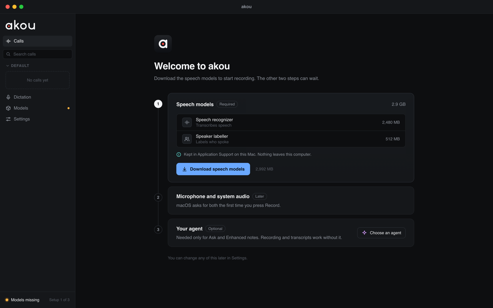
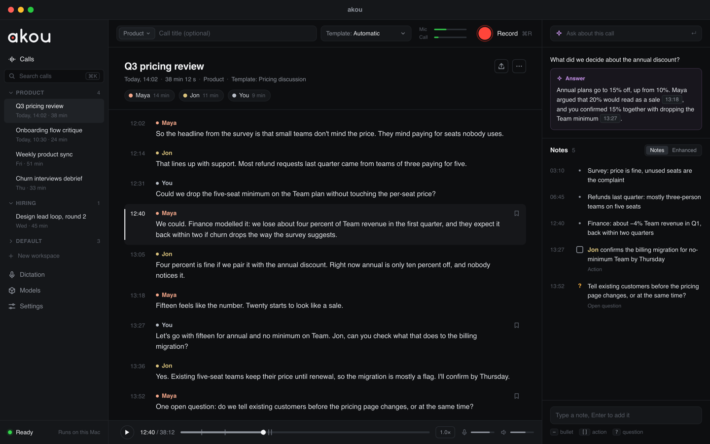
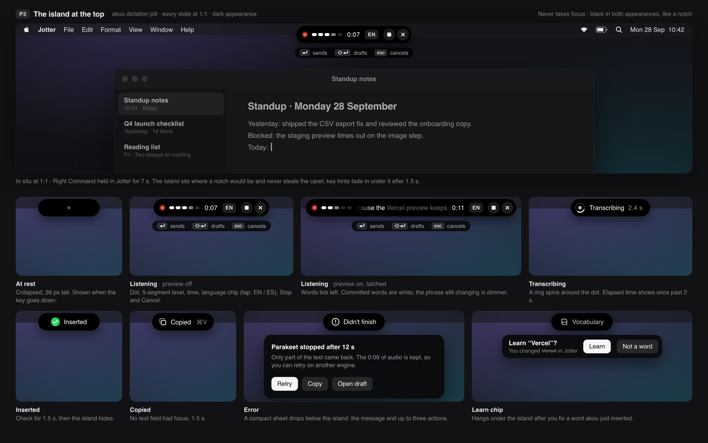
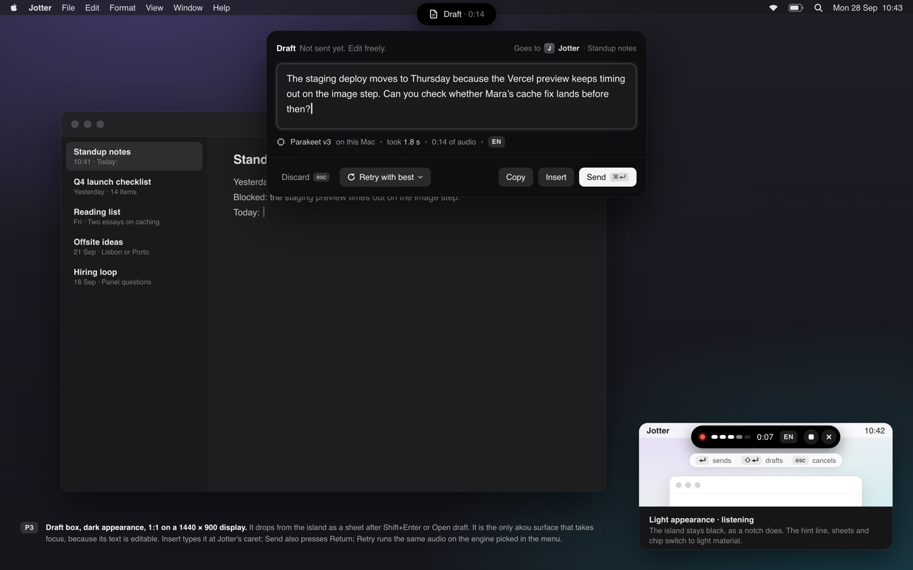

# Design explorations: the first run and the call workspace

akou 0.4.0 opens on a full call workspace even when it cannot record yet. With no speech models on disk the window shows a status dot that says READY, a Record button that is enabled but refuses to start, a clock, debug chips for the provider and the speech engine, an empty calls list, a placeholder that says "Press Record", tabs for Notes, Ask and Enhanced over nothing, and a player with a scrubber and a mic/call balance slider for a recording that does not exist. The one thing the user has to do, download the models, is a banner in the middle. Three controls share the same blue: the active tab, Record and Download. Informational text uses the primary accent too.

This page holds the design we chose, what the apps closest to akou do on the same screens, and the direction for the build. The mockup is a self-contained HTML file beside each image, rendered at 1440 x 900. Two other shapes were drawn and dropped: a standalone welcome window with a list-and-document main window, and a light checklist. The mockups are drawn in dark; the light theme, which already follows the system setting, applies the same rules.

## The rules every mockup follows

- **Readiness drives the shell.** With no models there is no workspace, only the welcome. Record is never enabled with a reason hidden somewhere else.
- **The real brand.** The wordmark and the app icon are the files in `assets/brand`, inlined as they are. Nothing is redrawn.
- **Record looks like recording on a Mac.** A round red button with the word Record beside it and the shortcut in dim text, the same shape QuickTime and Voice Memos use. Never an accent-filled pill.
- **One accent per screen.** The primary action is the only thing in the accent colour. Selected tabs and list rows use a neutral fill. Red means recording. Green means ready or live.
- **Information is a sentence, not a box.** Where the models live and what leaves the computer is one dim line with a small teal glyph, never a boxed callout and never the accent.
- **Notes are the default action**, so the note input is always visible while a call is open. Asking the agent sits next to it, never instead of it.
- **No debug chips.** The version, the provider and the speech engine live under Settings. The header shows one status word.
- **Nothing dead on screen.** The player exists only when the call has a recording. Notes and Ask exist only when a call is selected.
- **Permissions are asked in context**, at the first recording, and the welcome says so instead of asking up front.

## The design: a sidebar shell

A permanent sidebar carries the wordmark, navigation to Calls, Dictation, Models and Settings, search and the workspaces with their calls. Its footer is the readiness row: an amber "Models missing" with "Setup 1 of 3", or a green "Ready". The Models item carries an amber dot while something is missing. First run keeps the sidebar and replaces the main area with three cards: the two models with one line and a size each, the dim sentence on where they are kept, and the one download button; the permissions card marked "Later" with one line; the optional agent card with a quiet button.

Once ready, the main area has a compact composer row above the transcript: the workspace as a chip inside the title field, the template select, two thin live meters for mic and call, and the round red Record with its shortcut. Speakers have warm non-accent colours and time totals as chips under the title. The right column has Ask on top with a cited answer, then Notes with a Notes and Enhanced toggle, then the note input at the bottom with its three hints as chips. The player is a slim bar under the transcript.

## What the nearest apps do

The four apps closest to akou on a Mac handle the same screens like this. None of them shows a full workspace plus a warning banner when something required is missing.

**MacWhisper** (Goodsnooze) is a native split view: a sidebar with Home, Queue, History and People, and a Home grid of eight equal tiles with no primary action. Its model list is the part worth copying: every row shows the engine, the capabilities and the size on one line, with badges and exactly one button, Download or Activate. Meeting recording needs Screen Recording and Microphone, asked when a meeting is detected. The dictation setup is a modal sheet that explains the feature and hands over to its settings. The transcript document has speaker names in colour above each paragraph, a bottom player with a scrubber, time and speed, and a right inspector with tabs for display, AI, translate, info and share. Light by default with the system blue accent, and filler words in red. What to avoid: the eight-tile Home with no primary action, and warning about the multi-minute first model load only in the docs.

**Handy** (open source dictation) is one settings window with a sidebar: General, Models, Advanced, History, Post Process, About. The first run is a full-window gate that hides the app until it is done: a permissions step with two cards, Microphone and Accessibility, each with a Grant button and live Waiting and Granted states, then a model step with two recommended picks, accuracy and speed bars, language and streaming chips and the size on each card. Clicking a card starts the download with real percent and speed and a cancel; when it finishes the model is selected and the app opens by itself. Pink is the brand, selection and primary colour, emerald means success only. What to avoid: "Show all" expands to about sixteen models, many niche, and permissions are asked before the app has shown any value.

**Minutes** (the open source Tauri meeting recorder) replaces the empty meeting list with a first-run card, not a separate screen: "Download the model once, then create one short recording. The moment it saves, this becomes your real meeting list." Three numbered steps, each disabled until the previous one is done: download a model with Tiny, Base as the recommended primary, or Small, each with its size; record a ten-second test; watch it appear. Permissions are deliberately not front-loaded. Each is asked in context with the app's own priming copy before the macOS dialog: mic at the first recording, screen recording at the first call capture, accessibility at the first hotkey. Its footer during recording reports source health per input: "Mic waiting", "Call audio waiting", "Listening". Dark by default, green accent for primary and live, red for recording and delete, serif titles. What to avoid: its download bar animates to 85 percent without real progress.

**Granola** is a sidebar with Search, Home, Shared with me, Chat and Spaces, and a Home with a calendar card, the notes list grouped by day and a "Start now" pill on the live meeting. A note is one document with a serif title, chips for date and people, and a floating bottom bar that holds the live waveform, Stop and an "Ask anything" input. Its permission screen explains each grant as an outcome, "Transcribe my voice" and "Transcribe other people's voices", with the second button greyed until the first is done. The live transcript is hidden by default and opens as chat bubbles, grey on the left for the other people and green on the right for you. Light by default, black pill buttons, a lime brand, low density. What to avoid: mandatory sign-in and calendar access before the first recording, and hiding the live transcript, which is core in akou.

## The direction we want

- **This shell, as drawn.** Sidebar, the in-shell welcome stepper, composer row with the live meters, transcript in the middle, Ask at the top right and the note input at the bottom right: talk to the agent above, add notes below.
- **Real progress with a cancel, then continue by itself**, the way Handy does it. Never an animated bar.
- **A ten-second test recording as step two**, the way Minutes does it, so the first real item in the list is the user's own voice and the permissions arrive with their own priming line, in context.
- **The readiness footer** as the one place that says what is missing, with an amber dot on the page that fixes it.
- **Live source health during a recording**: mic and call as two thin meters, each with a waiting state, instead of level bars parked in the header.
- **Speaker colours that are not the accent**, so the accent stays for the one primary action.

## What has shipped

- **WR-1, the welcome** (#137): with the speech models missing, the main area is the three-step welcome instead of the workspace, Record waits with its reason, and the download's progress rides the status push ([dark](built/wr1-welcome-dark.png), [light](built/wr1-welcome-light.png), [downloading](built/wr1-downloading-dark.png)).
- **WR-2, the sidebar** (#138): the wordmark, Calls with a search over titles and workspaces, the calls grouped by workspace and day, Dictation, Models and Settings, and the readiness row at the foot ([ready](built/wr2-ready-dark.png), [light](built/wr2-ready-light.png), [search](built/wr2-search-dark.png), [welcome](built/wr2-welcome-dark.png), [welcome light](built/wr2-welcome-light.png)).
- **WR-3, the composer row** (#140): the status word, the workspace chip inside the title field, the template, Mic and Call meters and a round red Record; while recording, the elapsed time, a round Stop and icon buttons for Mute and Pause. The call's title, facts and speakers with their talk time head the transcript, and the provider, engine and version moved to Settings ([ready](built/wr3-ready-dark.png), [light](built/wr3-ready-light.png), [recording](built/wr3-recording-dark.png), [recording light](built/wr3-recording-light.png), [settings](built/wr3-settings-dark.png)).
- **H-1, the island** (#142): the pill is the island at the top in every state, and the draft box a sheet dropped from it with its own island, in dark and light ([dark](built/h1-island-dark.png), [light](built/h1-island-light.png)). Coming: the dot between the key going down and the session opening.
- **H-2, the words as you speak** (#145): the listening island widens into the ticker, the words the last partial had too in white and the phrase still changing dimmer, with the language chip beside the time on an engine that takes a forced language (`dictation.language`, or `AUTO` while the engine chooses); a click on the chip moves the session to the next language, and a ring marks a language chosen that way ([dark](built/h2-ticker-dark.png), [light](built/h2-ticker-light.png)).
- **H-3, the sounds** (#148): the island itself does not change. With the island off, a soft cue plays at start, stop, cancel and done, so a dictation is never both silent and invisible.
- **WR-4, the right column** (#144): Ask on top with its presets in a menu and the last question's cited answer as a card, Notes under it with a Notes and Enhanced toggle, and the note input at the foot with its markers as hints under the field ([ready](built/wr4-ready-dark.png), [light](built/wr4-ready-light.png), [presets](built/wr4-presets-dark.png), [enhanced](built/wr4-enhanced-dark.png)).
- **WR-5, one accent** (#146): the player is a slim bar under the transcript and exists only for a saved call with a recording; the accent fill is the welcome's Download alone, other primary buttons are a neutral fill, the line being played and the menus use neutral fills, citation chips and info glyphs are teal, speaker colours stay off the accent and you are a neutral grey, in dark and light ([ready](built/wr5-ready-dark.png), [light](built/wr5-ready-light.png), [welcome](built/wr5-welcome-dark.png), [welcome light](built/wr5-welcome-light.png)).
- **WR-6, the docs** (#149): WINDOW.md, DESKTOP.md section 11 and the DESIGN 7 parity rows describe this shell as shipped, and the composer row says "setup" instead of "ready" while the welcome waits for the models ([welcome](built/wr6-welcome-dark.png), [light](built/wr6-welcome-light.png)).
- **WR-7, renaming a call**: the title in the call header is the rename control, live or saved: a click or Enter opens it, Enter or leaving it saves, Escape keeps the old name. The rename is a `call.renamed` event, and the sidebar row, its search and the window title follow without a reload, whichever door renamed it: `PATCH /calls/{id}`, `akou calls rename` or `akou_rename_call` ([editing](built/wr7-editing-dark.png), [renamed and found](built/wr7-renamed-dark.png), [light](built/wr7-renamed-light.png)).

## The dictation pill: the island at the top

Dictation shows a small floating window while it runs: the pill. The spec (DICTATION.md 5.1) fixes what it must show in each state: listening with a level, the time, the key hints and clickable Stop and Cancel; transcribing with a spinner; inserted or copied for 1.5 s; an error with up to three buttons; and, with the preview on, the words recognised so far. Three shapes were drawn as storyboards of every state at real size; the island was chosen, and a capsule at the bottom of the display and a bubble under the caret were dropped.

A black island at the top centre, where a notch sits, that only changes width. This is the pill at `top`, the default from now on (DC-O1); at another edge the same island sits at that edge, and a drag still moves it. It is hidden until the key goes down; from key-down until the session opens it is a dot. Listening adds a five-segment level, the time, the language chip (EN or ES, a tap switches the session's language; DC-E4's cycle, built with the bilingual-dictation bead akou-5v8) and round Stop and Cancel; the key hints fade in as a thin line under it after 1.5 s. With the preview on it widens into a one-line ticker: committed words white, the phrase still changing dimmer, newest at the right. Transcribing rings the dot; inserted collapses to a check for 1.5 s; copied shows the paste shortcut; the error drops a compact sheet under the island with the message and its buttons; the learn chip hangs under a neutral island once the user fixed a word, with Learn and Not a word only: the ✕ in `p3-states.png` is dropped, since leaving the chip alone for 8 s already answers it. The draft box drops from the island as a sheet too: the editable text, where it goes, the engine and the time, then Discard, Retry with another engine, Copy, Insert and Send as buttons that mirror the keys (Escape, Enter, Cmd+Enter; Shift+Enter stays a newline). The island stays black in both appearances, like a notch; only the surfaces under it change material. Red is the recording dot only, green the inserted check only.
