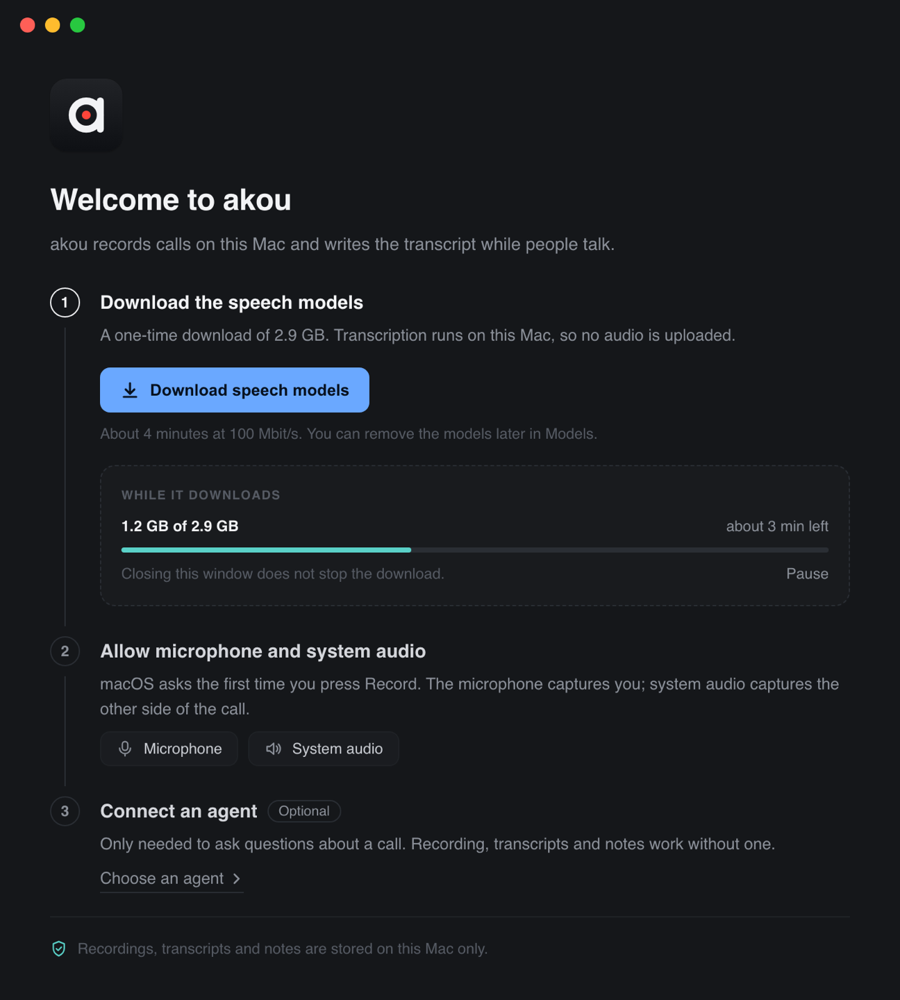
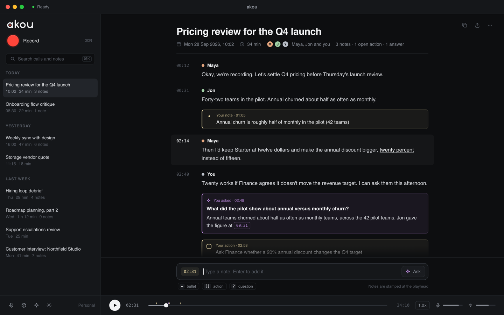

# Design explorations: the first run and the call workspace

akou 0.4.0 opens on a full call workspace even when it cannot record yet. With no speech models on disk the window shows a status dot that says READY, a Record button that works, a clock, debug chips for the provider and the speech engine, an empty calls list, a placeholder that says "Press Record", tabs for Notes, Ask and Enhanced over nothing, and a player with two volume sliders for a recording that does not exist. The one thing the user has to do, download the models, is a banner in the middle. Three controls share the same blue: the active tab, Record and Download. Informational text uses the primary accent too.

This page holds two mockups of a different shape, what the apps closest to akou do on the same screens, and the direction we want. Each mockup is a self-contained HTML file beside its image. The ready frames render at 1440 x 900, the standalone welcome at 720 x 800. A light checklist variant was drawn and dropped: dark stays the only theme.

## The rules every mockup follows

- **Readiness drives the shell.** With no models there is no workspace, only the welcome. Record is never enabled with a reason hidden somewhere else.
- **The real brand.** The wordmark and the app icon are the files in `assets/brand`, inlined as they are. Nothing is redrawn.
- **Record looks like recording on a Mac.** A round red button with the word Record beside it and the shortcut in dim text, the same shape QuickTime and Voice Memos use. Never an accent-filled pill.
- **One accent per screen.** The primary action is the only thing in the accent colour. Selected tabs and list rows use a neutral fill. Red means recording. Green means ready or live.
- **Information is a sentence, not a box.** Where the models live and what leaves the computer is one dim line with a small teal glyph, never a boxed callout and never the accent.
- **Notes are the default action**, so the note input is always visible while a call is open. Asking the agent sits next to it, never instead of it.
- **No debug chips.** The version, the provider and the speech engine live under Settings. The header shows one status word.
- **Nothing dead on screen.** The player exists only when the call has a recording. Notes and Ask exist only when a call is selected.
- **Permissions are asked in context**, at the first recording, and the welcome says so instead of asking up front.

## A. A welcome window, then one document

The welcome is its own compact window, so the main window never shows a workspace it cannot use and the welcome never floats in empty space. The app icon, one line on what akou does, then three steps. Step one is the download, with the only accent button, the size, a time estimate, and a progress inset that says closing the window does not stop it. Step two names the two permissions and says macOS asks at the first Record. Step three is the optional agent, a quiet link. The footer says where recordings, transcripts and notes stay.

The main window is a list and a document. The wordmark and Record sit at the top of the list, then search, then calls grouped by day. Dictation, Models, the agent and Settings are four icons at the foot of the list. The document is the call: title, date, duration, people and counts, then the transcript as timestamped speaker paragraphs, with the user's notes, actions and answers inline as tinted blocks at the moment they were written. The note input is docked under the document with the playhead stamp, the bullet, action and question hints as chips, and Ask as a button at its right end. The player is a slim bar under it, only because this call has a recording.

## B. A sidebar shell

A permanent sidebar carries the wordmark, navigation to Calls, Dictation, Models and Settings, search and the workspaces with their calls. Its footer is the readiness row: an amber "Models missing" with "Setup 1 of 3", or a green "Ready". The Models item carries an amber dot while something is missing. First run keeps the sidebar and replaces the main area with three cards: the two models with one line and a size each, the dim sentence on where they are kept, and the one download button; the permissions card marked "Later" with one line; the optional agent card with a quiet button.

Once ready, the main area has a compact composer row above the transcript: the workspace as a chip inside the title field, the template select, two thin live meters for mic and call, and the round red Record with its shortcut. Speakers have warm non-accent colours and time totals as chips under the title. The right column has Ask on top with a cited answer, then Notes with a Notes and Enhanced toggle, then the note input at the bottom with its three hints as chips. The player is a slim bar under the transcript.

## What the nearest apps do

The four apps closest to akou on a Mac handle the same screens like this. None of them shows a full workspace plus a warning banner when something required is missing.

**MacWhisper** (Goodsnooze) is a native split view: a sidebar with Home, Queue, History and People, and a Home grid of eight equal tiles with no primary action. Its model list is the part worth copying: every row shows the engine, the capabilities and the size on one line, with badges and exactly one button, Download or Activate. Meeting recording needs Screen Recording and Microphone, asked when a meeting is detected. The dictation setup is a modal sheet that explains the feature and hands over to its settings. The transcript document has speaker names in colour above each paragraph, a bottom player with a scrubber, time and speed, and a right inspector with tabs for display, AI, translate, info and share. Light by default with the system blue accent, and filler words in red. What to avoid: the eight-tile Home with no primary action, and warning about the multi-minute first model load only in the docs.

**Handy** (open source dictation) is one settings window with a sidebar: General, Models, Advanced, History, Post Process, About. The first run is a full-window gate that hides the app until it is done: a permissions step with two cards, Microphone and Accessibility, each with a Grant button and live Waiting and Granted states, then a model step with two recommended picks, accuracy and speed bars, language and streaming chips and the size on each card. Clicking a card starts the download with real percent and speed and a cancel; when it finishes the model is selected and the app opens by itself. Pink is the brand, selection and primary colour, emerald means success only. What to avoid: "Show all" expands to about sixteen models, many niche, and permissions are asked before the app has shown any value.

**Minutes** (the open source Tauri meeting recorder) replaces the empty meeting list with a first-run card, not a separate screen: "Download the model once, then create one short recording. The moment it saves, this becomes your real meeting list." Three numbered steps, each disabled until the previous one is done: download a model with Tiny, Base as the recommended primary, or Small, each with its size; record a ten-second test; watch it appear. Permissions are deliberately not front-loaded. Each is asked in context with the app's own priming copy before the macOS dialog: mic at the first recording, screen recording at the first call capture, accessibility at the first hotkey. Its footer during recording reports source health per input: "Mic waiting", "Call audio waiting", "Listening". Dark by default, green accent for primary and live, red for recording and delete, serif titles. What to avoid: its download bar animates to 85 percent without real progress.

**Granola** is a sidebar with Search, Home, Shared with me, Chat and Spaces, and a Home with a calendar card, the notes list grouped by day and a "Start now" pill on the live meeting. A note is one document with a serif title, chips for date and people, and a floating bottom bar that holds the live waveform, Stop and an "Ask anything" input. Its permission screen explains each grant as an outcome, "Transcribe my voice" and "Transcribe other people's voices", with the second button greyed until the first is done. The live transcript is hidden by default and opens as chat bubbles, grey on the left for the other people and green on the right for you. Light by default, black pill buttons, a lime brand, low density. What to avoid: mandatory sign-in and calendar access before the first recording, and hiding the live transcript, which is core in akou.

## The direction we want

- **B's shell for the ready state.** Sidebar, composer row with the live meters, transcript in the middle, Ask at the top right and the note input at the bottom right. That is the layout we like best in use: talk to the agent above, add notes below.
- **Either welcome.** A's standalone window is the cleaner first run because nothing else is on screen; B's in-shell stepper keeps the navigation visible so the user learns the app while waiting. Decide when the download flow is built; both share the same three steps and the same copy rules.
- **Real progress with a cancel, then continue by itself**, the way Handy does it. Never an animated bar.
- **A ten-second test recording as step two**, the way Minutes does it, so the first real item in the list is the user's own voice and the permissions arrive with their own priming line, in context.
- **B's readiness footer** as the one place that says what is missing, with an amber dot on the page that fixes it.
- **Live source health during a recording**: mic and call as two thin meters, each with a waiting state, instead of level bars parked in the header.
- **Speaker colours that are not the accent**, so the accent stays for the one primary action.
